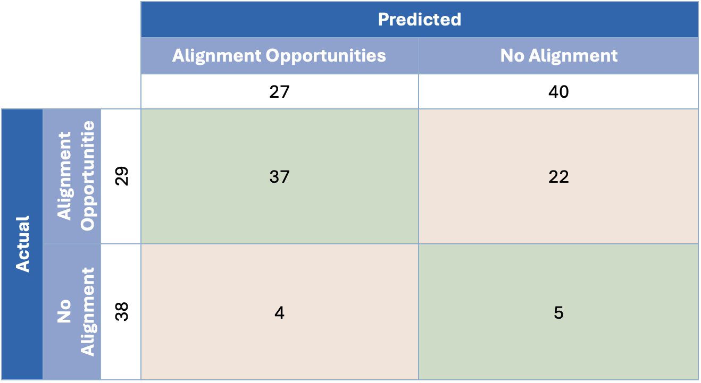

---
params:
  country: Colombia
  date: 26Jun25
  lang: Spanish
output: 
  officedown::rdocx_document:
    reference_docx: template.docx
    plots:
      style: Normal
      align: center
      topcaption: true
header-includes:
  - \usepackage{floatrow}
  - \floatsetup[figure]{capposition=top}
---

```{r setup_packages, include=FALSE}
# moves away from scientific notation (e-17)
options(scipen = 999)

# mounts packages
pacman::p_load("tidyverse", "knitr", "stringr", "readr", "openxlsx", "writexl", "readxl", # for general data uploading, tweaking, saving, ...
               "ggplot2", "ggpattern", "ggnewscale", "ggpubr", "geomtextpath", "ggbeeswarm", "fmsb", "colorBlindness", # for graphs
               "quanteda", "spacyr", "tm", "wordcloud", # for NLP
               "officedown", "officer", "flextable", "kableExtra", # for Word output
               "magrittr", "captioner", "rvest", "countries", "glue", "english", # misc
               "igraph", "grDevices") # for network graphs and saving pngs
 # for extras: pipe, extra captions, scraping/wrangling, translating country name, ...

# changes language
Sys.setlocale(category = "LC_ALL", locale = "Spanish") ### SPANISH ###
```

```{r setup_script, include=FALSE}
### Officedown/Markdown configurations
# ?
opts_chunk$set(echo = FALSE, 
               fig.cap = TRUE, tab.cap = TRUE)

# table formatting configurations
set_flextable_defaults(font.family = "Calibri", hansi.family = "Calibri", font.size = 9)

# ?
bl_template <- function(txt) {
  block_list(
    fpar(values = txt, fp_t = fp_text_lite(color = "#0001a4", bold = TRUE))
  )
}

# formatting configurations: portrait and landscape orientations, and table of contents
sec_port <- prop_section()
sec_land <- prop_section(page_size = page_size(orient = "landscape"), 
    type = "continuous", page_margins = page_mar(top = 0, right = 0, bottom = 0, left = 0))
sec_toc <- prop_section(type = "continuous", 
                        page_margins = page_mar(bottom = 0, left = 0.5, top = 0.5))

# other formatting configurations
links <- fp_text(color = "#0563C1", underlined = TRUE, font.size = 12, font.family = "Calibri")
links_i <- fp_text(color = "#0563C1", underlined = TRUE, font.size = 9, italic = TRUE, font.family = "Calibri")
footnote <- fp_text(italic = TRUE, font.size = 9, font.family = "Calibri")
section <- fp_text(font.size = 16, bold = TRUE, font.family = "Calibri")
subsection <- fp_text(font.size = 14, bold = TRUE, font.family = "Calibri")
#refbold <- fp_text(font.size = 12, bold = TRUE, font.family = "Calibri")
caption1 <- fp_text(font.size = 11, font.family = "Calibri")
caption2 <- fp_text(font.size = 11, font.family = "Calibri", bold = TRUE)
```

\pagenumbering{gobble}

```{r data_import, include = FALSE}
cty <- tolower(gsub(" ", "_", params$country)) # ensures that composite country names are separated by "_"; all are lowercase

# PATHS
path1 <- paste0("./data/countries/", cty)
path2 <- "./data"

# ENCODING:
lang <- c("English", "Spanish", "French", "German", "Russian", "Portuguese")

encod <- if (match(params$lang, lang) == 1) {
  "UTF-8" # most widely used, more modern, perfect for English (ASCII is a subset of UTF-8)
} else if (match(params$lang, lang) == 2 | match(params$lang, lang) == 3) {
  "latin1" # "UTF-8" + (á, à, é, ê, ó, ô, ú, ...), perfect for Latin languages (“ISO-8859-1”, “ISO-8859-15”, “ISO-8859-2”)
} else if (match(params$lang, lang) == 4 | lang == "E. European") {
  "windows-1252" # "latin1" + (ß, ü, ö, ä, …), perfect for German & E. Europe
} else if (lang == "C. European") {
  "windows-1250"
} else if (lang == "Russian") {
  "windows-1251" # Cyrilic, Slavic languages
} else if (lang == "Arabic") {
  "windows-1256" # (“ISO-8859-6”)
} 

# FILES:
# Themes GPT analysis
dta_th <- read.csv(list.files(path = path1, 
                              pattern = "themes.*\\.csv$", full.names = TRUE)) #, encoding = "UTF-8"
# Target-to-Target GPT analysis
dta_tt <- read.csv(list.files(path = path1, 
                              pattern = "targets.*\\.csv$", full.names = TRUE)) 
# Quantitative R analysis
#dta_qt <- read.xlsx(paste0(path1, "/", list.files(path = paste0(path1, "/"), pattern = "quantitative.*\\.xlsx$")), sheet = "Quantitative Terms")
dta_qt <- read_excel(paste0(path1, "/", 
                           list.files(path = paste0(path1, "/"), 
                                      pattern = "quantitative.*\\.xlsx$")), sheet = "Quantitative Terms")
# Cleaned country data ()
#tgts <- read.xlsx(paste0(path1, "/", list.files(path = paste0(path1, "/"), pattern = "data.*\\.xlsx$")), sheet = "targets")
tgts <- read_excel(paste0(path1, "/", 
                         list.files(path = paste0(path1, "/"), pattern = "data.*\\.xlsx$")), 
                  sheet = "targets")
# Themes
dates <- str_replace_all(list.files(path = paste0(path2, "/"), pattern = "^themes_.*\\.xlsx$"), 
                          c("themes_" = "", ".xlsx" = "")) # finds the most up-to-date Themes file
#thms <- read.xlsx(paste0(path2, "/", list.files(path = path2, pattern = dates[which.max(dmy(dates))])), sheet = "Themes")
thms <- read_excel(paste0(path2, "/", 
                         list.files(path = path2, pattern = paste0("_", dates[which.max(dmy(dates))]))), 
                  sheet = "Themes")
thms_tr <- read_excel(paste0(path2, "/", ### SPANISH ###
                         list.files(path = path2, pattern = paste0("_", dates[which.max(dmy(dates))]))), ### SPANISH ###
                  sheet = "Temas") ### SPANISH ###
# Summary GPT analysis (green boxes)
sums <- read.csv(list.files(path = path1, 
                              pattern = "summary.*\\.csv$", full.names = TRUE)) 
```

```{r trims, include = FALSE}
# Eliminates leading and lagging (white) spaces
dta_th <- dta_th %>% 
  mutate(Target.Text = str_trim(Target.Text), Target.Name = str_trim(Target.Name), 
         Themes = str_trim(Themes), Texts = str_trim(Texts))

dta_tt <- dta_tt %>% 
  mutate(Target.1.Name = str_trim(Target.1.Name), Target.2.Name = str_trim(Target.2.Name), 
         Theme = str_trim(Theme),
         Target.1.Text = str_trim(Target.1.Text), Target.2.Text = str_trim(Target.2.Text), 
         GPT.Alignment.Label = str_trim(GPT.Alignment.Label))

tgts <- tgts %>% 
  rename(Target.Name = `Target Name`, 
         Target.Text = `Target Text`) %>% 
  mutate(Target.Text = str_trim(Target.Text), Target.Name = str_trim(Target.Name))

dta_qt <- dta_qt %>% 
  rename(Target.Name = `Target Name`) %>% 
  left_join(select(tgts, Target.Name, Target.Text, Document)) %>% 
  mutate(Target.Text = str_trim(Target.Text), Target.Name = str_trim(Target.Name), 
         dates = strsplit(dates, "; "), 
         quants = strsplit(quants, "; ")) %>% 
  mutate(dates = ifelse(is.na(dates), "", dates), 
         quants = ifelse(is.na(quants), "", quants))

thms <- thms %>% 
  mutate(Themes = str_trim(Themes), Texts = str_trim(Texts)) %>% 
  mutate(Texts = ifelse(grepl("^Forest", Themes), 
                       str_replace(Texts, "reducingdeforestation", "reducing deforestation"), 
                       Texts))
thms_tr <- thms_tr %>% mutate(across(where(is.character), str_trim))
```

```{r odd_spaces, include = FALSE}
# Python's NBSP ('\xa0'); RStudio's NBSP ('\u00A0')
dta_th <- dta_th %>% 
  mutate(Themes = gsub("\u00A0", " ", Themes))

dta_tt <- dta_tt %>% 
  mutate(Theme = gsub("\u00A0", " ", Theme))

thms <- thms %>% 
  mutate(Themes = gsub("\u00A0", " ", Themes))
thms_tr <- thms_tr %>% 
  mutate(Temas = gsub("\u00A0", " ", Temas)) #### SPANISH ####

sums <- sums %>% 
  mutate(Theme = gsub("\u00A0", " ", Theme))
```

```{r trans, include = FALSE}
thms <- cbind(thms, select(thms_tr, Temas, Textos)) #### SPANISH ####
rm(thms_tr)
```

```{r test1_fix, include = FALSE}

```

```{r test1, include = FALSE}
if (length(setdiff(unique(dta_th$generated_sample), c(0, 1))) != 0) {
  View(filter(dta_th, generated_sample == setdiff(unique(dta_th$generated_sample), c(0, 1))))
  menu("OK", title = ">> WARNING <<\nOdd GPT restuls (column 'generated_sample')\nCheck above what's going on and make changes in the 'test1_fix' code chunk (above).")
} else {
  message("[√] GPT's outputs seem in order.")
}
```

```{r test2_fix, include = FALSE}

```

```{r test2, include = FALSE}
if (length(setdiff(unique(dta_tt$GPT.Alignment.Label), c("No alignment", "Alignment opportunities"))) != 0) {
  View(dta_tt)
  menu("OK", title = paste0(">> WARNING <<\nOdd GPT results (column 'GPT.Alignment.Label'): ", setdiff(unique(dta_tt$GPT.Alignment.Label), c("No alignment", "Alignment opportunities")), "\nCheck what's going on and make changes in the 'test2_fix' code chunk (above)."))
} else {
  message("[√] GPT's outputs seem in order.")
}
```

```{r test3, include = FALSE}
# repl <- c("marinas", "ganadera", "^Gestión de agua$", "forestal", "humdales", "pastizales", "conectividad", "fertilidad", "riesgo", "cadena", "carbono", "mitigación", "^Desertificación", "especies", "silvicultura", "^Contaminación$", "género", "fomento", "ODS")
repl <- c("marine", "livestock", "^Water", "^Forest", "wetlands", "^Grassland", 
          "^Ecosystem", "^Soil", "^Risk", "^Value", "^Nature", "^Climate", 
          "^Desertification", "^Species", "AFOLU", "Pollution", "^Gender", 
          "^Capacity", "SDG")
```

```{r test3_fix, include = FALSE}

```

```{r test3_th, include = FALSE}
#setdiff(thms$Themes, unique(dta_th$Themes)) ; setdiff(unique(dta_th$Themes), thms$Themes)
if ((length(setdiff(thms$Themes, unique(dta_th$Themes))) | 
     (length(setdiff(unique(dta_th$Themes), thms$Themes)))) != 0) {
  
  thm_len <- length(thms$Themes) - length(unique(dta_th$Themes))
  
  message("These theme titles from the thms dataframe were missing in the dta_th dataframe:")
  print(setdiff(thms$Themes, unique(dta_th$Themes)))
  message("These theme titles from the dta_th dataframe were missing in the thms dataframe:")
  print(setdiff(unique(dta_th$Themes), thms$Themes))
  
  message("… so the theme titles in the dta_th dataframe were replaced with the accurate corresponding ones from the thms dataframe.")
  for (i in which(thms$Themes %in% setdiff(thms$Themes, unique(dta_th$Themes)))) {
    dta_th <- dta_th %>% 
      mutate(Themes = ifelse(grepl(repl[i], Themes), thms$Themes[i], Themes))
  }
  
  if (max(length(setdiff(thms$Themes, unique(dta_th$Themes))), length(setdiff(unique(dta_th$Themes), thms$Themes))) != 0) {
    print(setdiff(unique(dta_th$Themes), thms$Themes))
    View(thms)
    message(paste0(">> WARNING <<\nSeems like the theme TITLES above are still not properly named in dta_th.\nCheck the correct titles (thms$Themes) in the View pane above and make changes (dta_th$Themes) in the 'tests3_fix' code chunk (above).\nKeep in mind that dta_th$Themes was missing ", thm_len, " theme(s) to begin with."))
  } else {
    message("[√] Seems like 'dta_th' and 'thms' have the same number of themes, now.")
  }
} else {
  message("[√] Seems like 'dta_th' contains all the themes.")
}
```

```{r test3-tt, include = FALSE}
#setdiff(thms$Themes, unique(dta_tt$Theme)) ; setdiff(unique(dta_tt$Theme), thms$Themes)
if ((length(setdiff(thms$Themes, unique(dta_tt$Theme))) | 
     (length(setdiff(unique(dta_tt$Theme), thms$Themes)))) != 0) {
  
  thm_len <- length(thms$Themes) - length(unique(dta_tt$Theme))
  
  message("These theme titles from the thms dataframe were missing in the dta_tt dataframe:")
  print(setdiff(thms$Themes, unique(dta_tt$Theme)))
  message("These theme titles from the dta_tt dataframe were missing in the thms dataframe:")
  print(setdiff(unique(dta_tt$Theme), thms$Themes))
  
  message("… so the theme titles in the dta_tt dataframe were replaced with the accurate corresponding ones from the thms dataframe.")
  for (i in which(thms$Themes %in% setdiff(thms$Themes, unique(dta_tt$Theme)))) {
    dta_tt <- dta_tt %>% 
      mutate(Theme = ifelse(grepl(repl[i], Theme), thms$Themes[i], Theme))
  }
  
  if (max(length(setdiff(thms$Themes, unique(dta_tt$Theme))), length(setdiff(unique(dta_tt$Theme), thms$Themes))) != 0) {
    print(setdiff(unique(dta_tt$Theme), thms$Themes))
    View(thms)
    message(paste0(">> WARNING <<\nSeems like the theme TITLES above are still not properly named in dta_tt.\nCheck the correct titles (thms$Themes) in the View pane above and make changes (dta_tt$Theme) in the 'tests3_fix' code chunk (above).\nKeep in mind that dta_th$Themes was missing ", thm_len, " theme(s) to begin with... so maybe it's okay?"))
  } else {
    message("[√] Seems like 'dta_tt' and 'thms' have the same number of themes, now.")
  }
} else {
  message("[√] Seems like 'dta_tt' contains all the themes.")
}
```

```{r test3-sums, include = FALSE}
#setdiff(thms$Themes, unique(sums$Theme)) ; setdiff(unique(sums$Theme), thms$Themes)
if ((length(setdiff(thms$Themes, unique(sums$Theme))) | 
     (length(setdiff(unique(sums$Theme), thms$Themes)))) != 0) {
  
  thm_len <- length(thms$Themes) - length(unique(sums$Theme))
  
  message("These theme titles from the thms dataframe were missing in the sums dataframe:")
  print(setdiff(thms$Themes, unique(sums$Theme)))
  message("These theme titles from the sums dataframe were missing in the thms dataframe:")
  print(setdiff(unique(sums$Theme), thms$Themes))
  
  message("… so the theme titles in the sums dataframe were replaced with the accurate corresponding ones from the thms dataframe.")
  for (i in which(thms$Themes %in% setdiff(thms$Themes, unique(sums$Theme)))) {
    sums <- sums %>% 
      mutate(Theme = ifelse(grepl(repl[i], Theme), thms$Themes[i], Theme))
  }
  
  if (max(length(setdiff(thms$Themes, unique(sums$Theme))), length(setdiff(unique(sums$Theme), thms$Themes))) != 0) {
    print(setdiff(unique(sums$Theme), thms$Themes))
    View(thms)
    message(paste0(">> WARNING <<\nSeems like the theme TITLES above are still not properly named in sums.\nCheck the correct titles (thms$Themes) in the View pane above and make changes (sums$Theme) in the 'tests3_fix' code chunk (above).\nKeep in mind that dta_th$Themes was missing ", thm_len, " theme(s) to begin with."))
  } else {
    message("[√] Seems like 'sums' and 'thms' have the same number of themes, now.")
  }
} else {
  message("[√] Seems like 'sums' contains all the themes.")
}
```

```{r theme_translations, include = FALSE}
dta_th <- dta_th %>% 
  left_join(select(thms, Themes, Temas, Textos)) %>% ### SPANISH ###
  select(-c(Themes, Texts)) %>% 
  rename(Themes = Temas,  ### SPANISH ###
         Texts = Textos) ### SPANISH ###

dta_tt <- dta_tt %>% 
  left_join(select(thms, Themes, Temas) %>%  ### SPANISH ###
              rename(Theme = Themes)) %>% ### SPANISH ###
  select(-Theme) %>% 
  rename(Theme = Temas)  ### SPANISH ###

sums <- sums %>% 
  left_join(select(thms, Themes, Temas) %>%  ### SPANISH ###
              rename(Theme = Themes)) %>% ### SPANISH ###
  select(-Theme) %>% 
  rename(Theme = Temas)  ### SPANISH ###
```

```{r general, include = FALSE}
if (match(params$lang, lang) == 1) { # English
  # t_nbt <- "\\bNBTs?\\b|\\bNBSAPs?\\b|\\bNational Biodiversity Targets?\\b|\\bNational Biodiversity Strategies and Action Plans\\b|\\bCBD\\b|\\b[Bb]iodiversity\\b"
  # trm_nat <- "National Biodiversity"; acr_nat <- "NBSAP"
  trg_nat <- "NBTs"
  # t_ndc <- "NDCs?|\\bNationally Determined Contributions?\\b"
  # trm_cli <- "[Nn]ationally [Dd]etermined|[Dd]etermined [Cc]ontributions"; acr_cli <- "NDC"
  trg_cli <- "NDC targets"
  trg_oth <- "Other targets"
} else if (match(params$lang, lang) == 2) { # Spanish
  # t_nbt <- "\\bMNBs?\\b|\\bEPANBs?\\b|\\bMetas? National(es)? de Biodiversidad?\\b|\\bEstrategias? (y Plan )?Nacional (para la|de) Biodiversidad\\b|\\bCBD\\b|\\b[Bb]iodiversidad\\b"
  # trm_nat <- "Nacional de Biodiversidad"; acr_nat <- "EPANB"
  trg_nat <- "MNB"
  # t_ndc <- "NDCs?|CDNs?|\\bContribuci[óo]n(es)? Determinadas? a [Nn]ivel Nacional\\b"
  # trm_cli <- "[Cc]ontribución(es)? [Dd]eterminadas?|[Dd]eterminadas? a [Nn]ivel [Nn]acional(es)?"; acr_cli <- "CDN"
  trg_cli <- "Metas de las CDN"
  trg_oth <- "Otras metas"
} else if (match(params$lang, lang) == 3) { # French
  # t_nbt <- ""
  # trm_nat <- "Nationaux pour la Biodiversité"; acr_nat <- "SPANB"
  trg_nat <- "CNBs"
  # t_ndc <- ""
  # trm_cli <- "[Cc]ontributions? [Dd]éterminé(es)?|[Dd]éterminé(es)? au [Nn]iveau [Nn]ational"; acr_cli <- "CDN"
  trg_cli <- "Cibles des CDN"
  trg_oth <- "Autres cibles"
} else if (match(params$lang, lang) == 4) {
  t_nbt <- ""
  t_ndc <- ""
} else if (lang == "E. European") {
  t_nbt <- ""
  t_ndc <- ""
} else if (lang == "C. European") {
  t_nbt <- ""
  t_ndc <- ""
} else if (lang == "Russian") {
  t_nbt <- ""
  t_ndc <- ""
} else if (lang == "Arabic") {
  t_nbt <- ""
  t_ndc <- ""
}

dta_th <- dta_th %>% 
  select(-any_of(c("index", "Country", "index.1", "Textt"))) %>% 
  # ensures Theme and Text column/variables
  rename(Theme = any_of(c("Themes", "Theme")), 
         Text = any_of(c("Texts", "Text"))) %>% 
  # creates "Doc"
  # mutate(Doc = case_when(
  #   (str_detect(Document, t_nbt) | str_detect(Source, "CBD|cbd|NBSAP|nbsap")) ~ acr_nat, 
  #   (str_detect(Document, t_ndc) |  str_detect(Source, "UNFCCC|unfccc|NDC|ndc")) ~ acr_cli, 
  #   TRUE ~ str_replace_all(Document, "[^A-Z]", ""))) %>% 
  # creates "Type"
  # mutate(Type = case_when(
  #   (str_detect(Document, t_nbt) | str_detect(Source, "CBD|cbd|NBSAP|nbsap")) ~ trg_nat, 
  #   (str_detect(Document, t_ndc) |  str_detect(Source, "UNFCCC|unfccc|NDC|ndc")) ~ trg_cli, 
  #   TRUE ~ trg_oth)) %>% 
  mutate(Type = ifelse(Type == "^CDN$", "Metas de las CDN", Type), ### SPANISH ###
         #Type = ifelse(Type == "MNB", "MNBs", Type) ### SPANISH ###
         ) %>%
  mutate(Type = factor(Type, levels = c(trg_nat, trg_cli, trg_oth))) %>% 
  # removes leading/lagging white spaces and 2+ consecutive white spaces
  mutate(across(c(Target.Name, Target.Text, Doc), ~ gsub("\\s+", " ", as.character(.x)))) %>% 
  # formatting: factor, numeric ...
  mutate(Theme = factor(Theme, unique(Theme)), 
         Doc = factor(Doc, unique(Doc)), 
         generated_sample = as.numeric(generated_sample))

dta_tt <- dta_tt %>% 
  # re-creates "Policy" ("Doc") and "Type" for 1
  # left_join(select(tgts, Target.Name, Doc, Document, Source) %>% 
  #             rename(Target.1.Name = Target.Name, 
  #                    Target.1.Policy = Doc), by = c("Target.1.Name", "Target.1.Policy")) %>% 
  # rename(Target.1.Document = Document, 
  #        Target.1.Source = Source) %>% 
  # mutate(Target.1.Policy = case_when(
  #   (str_detect(Target.1.Document, t_nbt) | str_detect(Target.1.Source, "CBD|cbd|NBSAP|nbsap")) ~ acr_nat, 
  #   (str_detect(Target.1.Document, t_ndc) | str_detect(Target.1.Source, "UNFCCC|unfccc|NDC|ndc")) ~ acr_cli, 
  #   TRUE ~ str_replace_all(Target.1.Document, "[^A-Z]", ""))) %>% 
  # mutate(Target.1.Type = case_when(
  #   (str_detect(Target.1.Document, t_nbt) | str_detect(Target.1.Source, "CBD|cbd|NBSAP|nbsap")) ~ trg_nat, 
  #   (str_detect(Target.1.Document, t_ndc) | str_detect(Target.1.Source, "UNFCCC|unfccc|NDC|ndc")) ~ trg_cli, 
  #   TRUE ~ trg_oth)) %>% 
  # select(-c(Target.1.Document, Target.1.Source)) %>% 
  # re-creates "Policy" ("Doc") and "Type" for 2
  # left_join(select(tgts, Target.Name, Doc, Document, Source) %>% 
  #             rename(Target.2.Name = Target.Name, 
  #                    Target.2.Policy = Doc), by = c("Target.2.Name", "Target.2.Policy")) %>% 
  # rename(Target.2.Document = Document, 
  #        Target.2.Source = Source) %>% 
  # mutate(Target.2.Policy = case_when(
  #   (str_detect(Target.2.Document, t_nbt) | str_detect(Target.2.Source, "CBD|cbd|NBSAP|nbsap")) ~ acr_nat, 
  #   (str_detect(Target.2.Document, t_ndc) | str_detect(Target.2.Source, "UNFCCC|unfccc|NDC|ndc")) ~ acr_cli, 
  #   TRUE ~ str_replace_all(Target.2.Document, "[^A-Z]", ""))) %>% 
  # mutate(Target.2.Type = case_when(
  #   (str_detect(Target.2.Document, t_nbt) | str_detect(Target.2.Source, "CBD|cbd|NBSAP|nbsap")) ~ trg_nat, 
  #   (str_detect(Target.2.Document, t_ndc) | str_detect(Target.2.Source, "UNFCCC|unfccc|NDC|ndc")) ~ trg_cli, 
  #   TRUE ~ trg_oth)) %>% 
  # select(-c(Target.2.Document, Target.2.Source)) %>% 
  # ensures Name, Theme and Text column/variables
  rename(Target.1.Name = any_of(c("Target.1.Name", "Target.1.Names")), 
         Target.1.Theme = any_of(c("Target.1.Theme", "Target.1.Themes")), 
         Target.1.Text = any_of(c("Target.1.Text", "Target.1.Texts")), 
         Target.2.Name = any_of(c("Target.2.Name", "Target.2.Names")), 
         Target.2.Theme = any_of(c("Target.2.Theme", "Target.2.Themes")), 
         Target.2.Text = any_of(c("Target.2.Text", "Target.2.Texts")))

# dta_qt <- dta_qt %>% 
  # left_join(select(tgts, Target.Name, Document, Source), 
  #           by = c("Target.Name", "Document")) %>% 
  # creates "Doc"
  # mutate(Doc = case_when(
  #   (str_detect(Document, t_nbt) | str_detect(Source, "CBD|cbd|NBSAP|nbsap")) ~ acr_nat, 
  #   (str_detect(Document, t_ndc) |  str_detect(Source, "UNFCCC|unfccc|NDC|ndc")) ~ acr_cli, 
  #   TRUE ~ str_replace_all(Document, "[^A-Z]", ""))) %>% 
  # creates "Type"
  # mutate(Type = case_when(
  #   (str_detect(Document, t_nbt) | str_detect(Source, "CBD|cbd|NBSAP|nbsap")) ~ trg_nat, 
  #   (str_detect(Document, t_ndc) |  str_detect(Source, "UNFCCC|unfccc|NDC|ndc")) ~ trg_cli, 
  #   TRUE ~ trg_oth), 
  #   Type = factor(Type, levels(dta_th$Type)))

tgts <- tgts %>% 
  # creates "Doc"
  # mutate(Doc = case_when(
  #   (str_detect(Document, t_nbt) | str_detect(Source, "CBD|cbd|NBSAP|nbsap")) ~ acr_nat, 
  #   (str_detect(Document, t_ndc) |  str_detect(Source, "UNFCCC|unfccc|NDC|ndc")) ~ acr_cli, 
  #   TRUE ~ str_replace_all(Document, "[^A-Z]", ""))) %>% 
  # formatting: factor, numeric ...
  mutate(Doc = factor(Doc, levels(dta_th$Doc))) %>% 
  # creates "Type"
  # mutate(Type = case_when(
  #   (str_detect(Document, t_nbt) | str_detect(Source, "CBD|cbd|NBSAP|nbsap")) ~ trg_nat, 
  #   (str_detect(Document, t_ndc) |  str_detect(Source, "UNFCCC|unfccc|NDC|ndc")) ~ trg_cli, 
  #   TRUE ~ trg_oth)) %>% 
  mutate(Type = ifelse(Type == "^CDN$", "Metas de las CDN", Type), ### SPANISH ###
         #Type = ifelse(Type == "MNB", "MNBs", Type) ### SPANISH ###
         ) %>%
  mutate(Type = factor(Type, levels(dta_th$Type)))

thms <- thms %>% 
  # formatting: factor, numeric ...
  mutate(Themes = factor(Themes, unique(Themes))) %>% 
  mutate(Temas = factor(Temas, unique(Temas))) %>% ### SPANISH ###
  # ensures Theme and Text column/variables
  rename(Theme = any_of(c("Themes", "Theme")))

sums <- sums %>% 
  select(-X) %>% 
  mutate(Theme = factor(Theme, levels = levels(thms$Temas))) ### SPANISH ###
```

```{r test4, include = FALSE}
names <- tgts %>% 
  select(Target.Name, Document) %>% 
  mutate(Target_tokens = strsplit(Target.Name, "\\s+"), 
         Document_tokens = strsplit(Document, "\\s+")) %>% 
  mutate(intersection = map2(Target_tokens, Document_tokens, intersect)) %>% 
  mutate(intersection = sapply(intersection, function(x) paste(sort(x), collapse = "_")))

if (length(unique(names$intersection)) != 1) {
  View(names)
  bummer <- 1
  message(">> WARNING <<\nSome Document names are present in the targets' names.\nDo not correct: this will be automatically fixed in 'country_specs2' code chunk (below); just look at the 'intersection' column - especially because maybe the correction is 'do nothing' (in which case, just change 'bummer' back to 0)).")
} else {
  message("[√] Seems like Document names are not contained in the document names.")
  bummer <- 0
}
```

```{r test4_fix, include = FALSE}
if (params$country == "Colombia") {
  bummer <- 0 # the 'intersection' column showed that the only overlapping tokens were "de"
}
```

```{r coutry_specs2, include = FALSE}
# concatenates document name, target name and target text
if (bummer == 1) {
  names <- names %>% 
    select(Target.Name, intersection)
  dta_th <- dta_th %>% 
    left_join(names) %>% 
    mutate(Target.Name = map2_chr(Target.Name, intersection, ~ str_trim(gsub(.y, "", .x)))) %>% 
    select(-intersection)
  dta_qt <- dta_qt %>% 
    left_join(names) %>% 
    mutate(Target.Name = map2_chr(Target.Name, intersection, ~ str_trim(gsub(.y, "", .x)))) %>% 
    select(-intersection)
  tgts <- tgts %>% 
    left_join(names) %>% 
    mutate(Target.Name = map2_chr(Target.Name, intersection, ~ str_trim(gsub(.y, "", .x)))) %>% 
    select(-intersection)
  names <- names %>% 
    mutate(Target.2.Name = Target.Name) %>% 
    rename(Target.1.Name = Target.Name)
  dta_tt <- dta_tt %>% 
    left_join(names %>% select(-Target.2.Name)) %>% 
    mutate(Target.1.Name = map2_chr(Target.1.Name, intersection, ~ str_trim(gsub(.y, "", .x)))) %>% 
    select(-intersection) %>% 
    left_join(names %>% select(-Target.1.Name)) %>% 
    mutate(Target.2.Name = map2_chr(Target.2.Name, intersection, ~ str_trim(gsub(.y, "", .x)))) %>% 
    select(-intersection)
}
```

```{r general_extra, include = FALSE}
dta_th <- dta_th %>% 
  mutate('Target.Full' = paste0("**", Doc, " ", Target.Name, "**: ", Target.Text))
dta_qt <- dta_qt %>% 
  mutate('Target.Full' = paste0("**", Doc, " ", Target.Name, "**: ", Target.Text))
tgts <- tgts %>% 
  mutate('Target.Full' = paste0(Doc, " ", Target.Name, ": ", Target.Text))
```

```{r test5_fix, include = FALSE}
urls <- tgts %>% 
     select(Document, Source) %>% unique()
```

```{r test5, include = FALSE}
if ((nrow(urls) != length(unique(urls$Document))) | (nrow(urls) != length(unique(urls$Source)))) {
  View(urls)
  print(unique(urls$Document))
  print(unique(urls$Source))
  menu(c("Yes", "No"), title = ">> WARNING <<\nThe number of unique documents does not match the number of sources.\nCheck above what's going on and make changes in the 'test5_fix' code chunk (above).\nAble to assess everything?")
} else {
  message("[√] Each document seems to have a single source.")
}
```

```{r country_specs3, include = FALSE}

```


::: {custom-style="intro_topics"}
Sobre el PNUD
:::

::: {custom-style="Text"}
El PNUD es la principal organización de las Naciones Unidas que lucha para poner fin a la injusticia de la pobreza, la desigualdad y el cambio climático. Trabajando con nuestra amplia red de expertos y socios en 170 países, ayudamos a las naciones a construir soluciones integradas y duraderas para las personas y el planeta. Más información en undp.org o síganos en @UNDP.
:::

<br>

::: {custom-style="intro_topics"}
Acerca de la Promesa Climática del PNUD 
:::

::: {custom-style="Text"}
La Promesa Climática del PNUD es la mayor cartera de apoyo a la acción climática del sistema de las Naciones Unidas, trabaja con más de 140 países y territorios y beneficia directamente a 37 millones de personas. Esta cartera ejecuta más de 2.300 millones de dólares en subvenciones y aprovecha la experiencia del PNUD en adaptación, mitigación, mercados de carbono, clima y bosques, y estrategias y políticas climáticas. Visite nuestro sitio web en climatepromise.undp.org y síganos en Twitter en @UNDPClimate.
:::

<br>

::: {custom-style="intro_topics"}
Acerca del Compromiso por la Naturaleza del PNUD
:::

::: {custom-style="Text"}
El Compromiso por la Naturaleza del PNUD representa el compromiso de aumentar el apoyo a más de 140 países para que alcancen sus ambiciosas metas y objetivos dentro del Marco Mundial para la Biodiversidad y los Objetivos de Desarrollo Sostenible. El Compromiso por la Naturaleza se centra en tres cambios del sistema: un cambio de valores, un cambio económico y financiero y un cambio de políticas y prácticas. Estos cambios son esenciales para detener la pérdida de biodiversidad y garantizar una red de seguridad planetaria para la humanidad. Visite nuestro sitio web en undp.org/nature/nature-pledge.
:::

<br>

::: {custom-style="intro_topics"}
Acerca de este informe
:::

::: {custom-style="Text"}
Este informe ha sido elaborado conjuntamente por el Hub de Naturaleza y el Hub Climático del PNUD, en colaboración con otros equipos del PNUD y organizaciones asociadas. Si se difunde este borrador en su versión definitiva, se ruega incluir la mención al Fondo para el Medio Ambiente Mundial (FMAM) como donante principal.
:::

<br>

::: {custom-style="intro_topics"}
Descargo de responsabilidad de la ONU
:::

::: {custom-style="Text"}
Las opiniones expresadas en este informe son las de los autores y no representan necesariamente las de las Naciones Unidas, incluido el Programa de las Naciones Unidas para el Desarrollo, ni las de los Estados miembros de la ONU.
:::

\newpage

::: {custom-style="extra"}
**ÍNDICE**
:::

```{r toc, echo=FALSE}
# inserts Table of Contents
block_toc(level = 6)
```

```{r toc_formating}
# portrait orientation, hitherto (specific margins)
block_section(sec_toc)
```

# Introducción {#sec1}

## Objetivos de la evaluación de alineación {#sec11}

<br>

```{r gen, include=FALSE}
# Gender article of the country
if (params$country == "Ecuador" | params$country == "Paraguay" | params$country == "Uruguay" | params$country == "") { #  also Afghanistan, Brazil, Cameroon, Canada, Congo, Gabon, Japan, Lebanon, Senegal, Sudan, South Sudan, Togo, Yemen (but their NBTs are not in Spanish)
  artgen <- "el "
  posgen <- "del "
} else if (params$country == "Ecuatorial Guinea" | params$country == "Argentina" | 
           params$country == "Dominican Republic") { #  also Czech Republic, China, DRC, Guinea, India, Pakistan, CAR (but their NBTs are not in Spanish)
  artgen <- "la "
  posgen <- paste0("de ", artgen)
# } else if (params$country == "") { # also UAE, US, Netherlands (but their NBTs are not in Spanish)
  # artgen <- " los "
  # posgen <- paste0("de ", artgen)
# } else if (params$country == "") { #  also Bahamas, Comoros, Maldives, Marshall Islands, Solomon Islands, Seychelles (but their NBTs are not in Spanish)
  # artgen <- " las "
  # posgen <- paste0("de ", artgen)
} else { 
  artgen <- ""
  posgen <- "de "
}
```

```{r docs, include = FALSE}
documents <- (select(tgts, Document, Doc, Source) %>% unique())$Document
docs <- (select(tgts, Document, Doc, Source) %>% unique())$Doc
refs <- (select(tgts, Document, Doc, Source) %>% unique() %>% 
           mutate(Source = ifelse(is.na(Source), "", Source)))$Source

prn_m <- c("plan", "informe", "manifesto", "documento") ### SPANISH ### keep updating
prn_f <- c("actualización", "estrategia", "contribución", "ley", "segunda", "política", "hoja") ### SPANISH ### keep updating
fst_wrd <- word(documents, 1) ### SPANISH ###
gnd_prn <- character() ### SPANISH ###
for (i in 1:length(fst_wrd)) { ### SPANISH ###
  gnd_prn <- c(gnd_prn, ifelse(tolower(fst_wrd[i]) %in% prn_m, "del", "de la")) ### SPANISH ###
} ### SPANISH ###

ref_list <- mapply(function(pron, doc, link, acronym) { ### SPANISH ###
  paste0(pron, " [", doc, "](", link, ") (", acronym, ")") ### SPANISH ###
}, gnd_prn, documents, refs, docs) ### SPANISH ###

txt_docdoc <- ""
for (i in 1:length(ref_list)) {
  txt_docdoc <- paste0(txt_docdoc, ref_list[[i]])
  if (i == length(ref_list)-1) {
    txt_docdoc <- paste0(txt_docdoc, " y ") ### SPANISH ###
  } else if (i <= length(ref_list)-2){
    txt_docdoc <- paste0(txt_docdoc, ", ")
  }
}
```

::: {custom-style="Text"}
Esta **Evaluación Piloto de la Alineación Naturaleza-Clima** se desarrolla a través de Inteligencia Artificial (IA) para apoyar `r artgen``r params$country` en la evaluación de la alineación entre sus metas de naturaleza y clima a nivel nacional. Reuniendo la experiencia del Centro de la Naturaleza del PNUD, el Centro del Clima y los países piloto, la metodología busca descubrir similitudes, localizar soluciones basadas en la naturaleza, identificar información cuantitativa y proporcionar un punto de partida para la toma de decisiones hacia la coherencia política. Las metas de muchas políticas nacionales diferentes, compartidas por `r artgen``r params$country`, constituyen la base del análisis (**\@ref(anx1)**).

<br>

La **Evaluación de la Alineación Naturaleza-Clima** ofrece cuatro análisis nacionales personalizados:
:::

::: {custom-style="bullet-point"}
-   **Localizar soluciones basadas en la naturaleza**: Analizar la integración de soluciones basadas en la naturaleza dentro de las metas nacionales en materia de clima y biodiversidad.

-   **Identificar solapamientos temáticos**: Evaluar los temas transversales comunes a todas las metas.

-   **Evaluar similitudes entre objetivos**: Identificar objetivos específicos en las políticas de biodiversidad y clima que muestren oportunidades para una mayor alineación.

-   Evaluar **informaciones cuantitativas**: Proporcionar información cuantitativa y con plazos concretos de las metas, como "proteger el 30% de la biodiversidad" o "alcanzarlo para 2030".
:::

<br>

::: {custom-style="Text"}
Los resultados de la evaluación piloto pretenden proporcionar a las Partes información orientativa para:
:::

::: {custom-style="bullet-point"}
-   **Mejorar la coherencia política**: Proporcionar ideas prácticas para alinear las metas de clima y naturaleza, así como otras metas u objetivos que el país pueda considerar relevantes.

-   **Fomento de la participación de las partes interesadas**: Apoyar los procesos inclusivos y participativos y reforzar la coordinación interinstitucional, aplicando enfoques de todo el gobierno y la sociedad.
:::

<br>

::: {custom-style="Text"}
Dado que esta evaluación se elabora mediante IA, está sujeta a ciertas limitaciones (**Tabla 1.\@ref(tab:tbl1)**). Se recomienda encarecidamente a los países que utilicen estos resultados para iniciar conversaciones y no como un análisis prescriptivo independiente. Se recomienda revisar detenidamente los resultados con las partes interesadas pertinentes y considerarlos junto con otros tipos de análisis validados a nivel nacional y revisiones de documentos Como parte del proceso piloto, y para garantizar un enfoque centrado en el ser humano, se invita `r artgen``r params$country` a proporcionar información sobre la metodología y la presentación de los resultados a través de una  [`r ftext("encuesta abierta", links)`](https://forms.office.com/Pages/ResponsePage.aspx?id=Xtvls0QpN0iZ9XSIrOVDGWNp7QxCnxtBnoa-dEHQqQxUMlIxV0FOSzdWTkFCMUJFTFFFMFc4UFNURy4u). De este modo, se podrá seguir perfeccionando el enfoque para ayudar a todos los países interesados a alinear sus objetivos políticos y explorar una aplicación y presentación de informes coherentes y explorar una aplicación y presentación de informes coherentes.
:::

\newpage

```{r tbl1, echo = FALSE, tab.cap="Ventajas y limitaciones de la evaluación piloto", tab.id="tbl1", tab.cap.pre="Table 1.", tab.lp="sec1"}
# tab.autonum.start_at=1, 
tbl <- data.frame(can = c("Proporcionar un análisis inicial de la alineación de las metas que un país puede validar después utilizando fuentes o aportaciones nacionales.", "Servir como recurso que las Partes pueden elegir para tener en cuenta en sus procesos de participación de las partes interesadas, en función de sus necesidades y capacidades.", "Informar el proceso dirigido por el país para alinear las metas nacionales y apoyar el posterior desarrollo y aplicación de diversos planes.", "Proporcionar una información de referencia que un país pueda comparar con futuras evaluaciones que utilicen la misma metodología.", "Evaluar la concordancia entre las diversas metas de un país en relación con la naturaleza, el clima y la tierra."), 
                  cant = c("Proporcionar puntuaciones definitivas y totalmente validadas sobre la alineación de metasque tengan en cuenta las circunstancias, los puntos de referencia o las capacidades nacionales.", "Emitir juicios definitivos sobre la alineación de un país y determinar qué metas nacionales deben revisarse o actualizarse.", "Sustituir los procesos nacionales de alineación de objetivos y planificación.", "Sustituir o matizar las decisiones de la COP.", "Evaluar documentos completos, indicadores principales, mecanismos financieros u otros temas."))
colnames(tbl) <- c("Qué puede hacer la evaluación", "Lo qué no puede hacer la evaluación")

tbl %>% flextable(cwidth = c(6.5/2, 6.5/2)) %>% 
  bg(part = "header", j = 1:2, bg = "#d3e1f1") %>% 
  color(part = "header", j = 1:2, color = "black") %>%
  bold(part = "header") %>% 
  hline(part = "all") %>% 
  valign(valign = "top") %>% 
  align(align = "justify")
```

\newpage

## Contexto {#sec12}

<br>

::: {custom-style="Text"}
El cambio climático, la pérdida de biodiversidad y la desertificación son crisis interrelacionadas que requieren una acción integrada. La salud de los ecosistemas depende de unas condiciones climáticas estables. Según la [`r ftext("Plataforma intergubernamental científico-normativa sobre diversidad biológica y servicios de los ecosistemas (IPBES)", links)`](https://www.ipbes.net/models-drivers-biodiversity-ecosystem-change), el cambio climático es uno de los principales impulsores de la pérdida de biodiversidad y la degradación de la tierra, y el calentamiento antropogénico inducido por el clima amenaza potencialmente hasta una de cada seis especies de flora y fauna de todo el planeta. La biodiversidad es también una parte fundamental de la solución al cambio climático. Las soluciones basadas en la naturaleza, como la reforestación, la restauración costera y la gestión del suelo, pueden ayudar a contrarrestar las emisiones de gases de efecto invernadero (GEI) causadas por el hombre y aportar más [`r ftext("del 30% de la solición necessária", links)`](https://www.pnas.org/doi/10.1073/pnas.1710465114#supplementary-materials) para garantizar que el calentamiento global no aumente 2 grados centígrados por encima de los niveles preindustriales. Según el [`r ftext("Sexto Informe de Evaluación (IE6)", links)`](https://www.ipcc.ch/assessment-report/ar6/) del Panel Intergubernamental sobre el Cambio Climático (IPCC), el éxito a la hora de limitar el cambio climático depende de una mayor mitigación por parte del sector de la agricultura, la silvicultura y otros usos de la tierra (AFOLU), que representa aproximadamente el 22% de las emisiones mundiales de GEI.

<br> 

La Convención Marco de las Naciones Unidas sobre el Cambio Climático (CMNUCC), el Convenio de las Naciones Unidas sobre la Diversidad Biológica (CDB) y la Convención de las Naciones Unidas de Lucha contra la Desertificación (CNULD) tienen como objetivo hacer frente al cambio climático, conservar la biodiversidad y promover la gestión sostenible de la tierra. Comúnmente se les llama las "Convenciones de Río" porque se establecieron durante la Cumbre de la Tierra celebrada en Río de Janeiro en 1992. Las convenciones y sus marcos reflejan el valor de la acción integrada para la naturaleza, el clima y la tierra. Puede encontrar más información sobre las sinergias entre estas convenciones en el **\@ref(anx2)**.
:::

<br>

::: {custom-style="Text"}
Mediante la planificación y aplicación integradas de instrumentos políticos nacionales como las Estrategias y Planes de Acción Nacionales sobre Biodiversidad (EPANB) del CDB, las Contribuciones Determinadas a Nivel Nacional (CDNs) y  los Planes Nacionales de Adaptación (PAN) de la CMNUCC, y las Metas de Neutralidad de la Degradación de la Tierra (NDT) de la CNULD, los países pueden optimizar recursos y garantizar enfoques coherentes ante las crisis mundiales de la naturaleza, el clima y la tierra. Unas políticas coherentes en todos los sectores también pueden agilizar la presentación de informes y aumentar la transparencia.  

<br>

La convergencia de los plazos de 2024 y 2025 para la planificación nacional de cara a las Convenciones de Río presenta una oportunidad única para alinear las políticas sobre la naturaleza y el clima. Aunque la COP16 del CDB solicitó que las EPANB, actualizadas en consonancia con el Marco Mundial de Biodiversidad de Kunming-Montreal (MMB), se presentaron en 2024, muchos países siguen elaborando estos documentos en 2025. Del mismo modo, aunque se pidió a los países que presentaran las CDN 3.0 a la Secretaría de la CMNUCC en febrero de 2025, algunos países tienen previsto finalizarlas a finales de 2025. La intersección de estos calendarios puede facilitar la armonización de los esfuerzos de planificación entre convenciones. Sin embargo, a pesar de que [`r ftext("153 de las 198 Partes cuentan con puntos focales nacionales para dos o las tres Convenciones de Río dentro del mismo ministerio", links)`](https://unfccc.int/sites/default/files/resource/Infobrief%202_design%20a.pdf), los procesos de planificación a menudo pueden estar aislados y pasar por alto la importancia de las sinergias, lo que resulta en esfuerzos fragmentados y oportunidades perdidas para una acción integrada.  

<br>

Dada la urgencia de una acción rápida, la IA puede proporcionar un punto de partida útil para el debate y la planificación entre los responsables de la toma de decisiones. Cuando se aplica a través de un enfoque centrado en el ser humano, la IA puede democratizar el acceso a análisis de vanguardia y empoderar a una gama más amplia de partes interesadas. En 2024, más de 50 países pusieron a prueba el uso de la IA para realizar evaluaciones de la alineación entre sus objetivos nacionales y mundiales en materia de biodiversidad con el fin de cumplir los compromisos del CDB. Desarrolladas por el PNUD en el marco del Proyecto de Apoyo a la Acción Temprana y financiadas por el Fondo para el Medio Ambiente Mundial, las [`r ftext("Evaluaciones de la Similitud de las Metas de las EPANB", links)`](https://www.undp.org/publications/leveraging-artificial-intelligence-enhance-early-action-towards-kunming-montreal-global-biodiversity-framework) ofrecen información personalizada sobre las sinergias entre las metas nacionales de biodiversidad y las metas del MMB. Estas evaluaciones también proporcionan recomendaciones para mejorar la alineación y lograr una transformación en la relación de nuestras sociedades con la biodiversidad para 2030. El PNUD se basa ahora en esta metodología original para ayudar a los países a desarrollar evaluaciones de la alineación entre sus metas y objetivos políticos nacionales. Esto también se vincula con el trabajo en curso para apoyar a los países en sus procesos de revisión de las CDN y actualización de las EPANB a través del Hub de Naturaleza y del Hub Climátco del PNUD.

<br>

Para esta evaluación, se invitó a los países a compartir sus metas y objetivos políticos nacionales que considerasen más relevantes para el análisis, incluidos los relacionados con las EPANBs, CDNs, PNAs, y las metas de la NDT, además de otros planes nacionales. En este caso, el término "meta" se utiliza como término general para cualquier tipo de meta o fin nacional conciso que se esfuerce por apoyar la consecución de las Convenciones de Río, así como cualquier otra meta que un país considere relevante. A menudo, una meta puede tener un elemento cuantitativo, como "Restaurar el **60%** de los ecosistemas forestales, de humedales y costeros degradados **para 2030** con el fin de mejorar la biodiversidad y el secuestro de carbono". Sin embargo, este no es el caso de todas las metas. Dado que las directrices para la planificación nacional de cara a las Convenciones de Río difieren enormemente, puede haber una gran variabilidad en la forma en que los países deciden definir sus metas para esta evaluación.
:::

\newpage

# Síntesis de los Resultados de la Alineación `r posgen``r params$country` {#sec2}

::: {custom-style="Text"}
Esta sección ofrece una visión general de las principales conclusiones del análisis sobre los las metas `r posgen``r params$country` del `r txt_docdoc`. Estos objetivos fueron identificados por el país y pueden consultarse en el **\@ref(anx1)**, y constituyen la base del análisis. La información clave incluye áreas de alineación, lagunas y oportunidades para la coherencia política.  
:::

```{r themes, include=FALSE}
dta_th <- dta_th %>% 
  select(-c("Target.Textt", "Target.Name", "Document", "Target.Text", "Text"))

tgt_cnt <- tgts %>% 
  select(Type, Target.Name) %>% 
  unique() %>% 
  mutate(Cnt = 1) %>% 
  group_by(Type) %>% 
  summarise(Count = sum(Cnt)) %>% 
  ungroup() %>% 
  arrange(Type)
```

```{r aux0, include=FALSE}
#colours <- c("#F1BF42", "#5DA2ED", "#7E57C2") # "#2A9D8F"
#colours <- PairedColor12Steps[c(2, 6, 11)] 
#"#FFBF7F" "#FF7F00" "#FFFF99" "#FFFF32" "#B2FF8C" "#32FF00" "#A5EDFF" "#19B2FF" "#CCBFFF" "#654CFF" "#FF99BF" X"#E51932"X
#colours <- c("#4059AD", "#6B9AC4", "#97D8C4", "#EFF2F1", "#F4B942")[c(2, 5, 1)]
colours <- c("#5395DC", "#EBBD3F", "#7251B5")
names(colours) <- levels(dta_th$Type)

colours_rad <- adjustcolor(colours, alpha.f = 0.3)

lines <- c(1, 3, 6) # 1 solid 2 dashed 3 dotted 4 dotdashed 5 longdash 6 twodash
```

<br>

## Soluciones baseadas en la naturaleza {#sec21}

::: {custom-style="Text"}
Este análisis se centró en `r if (table(thms$Area)["NbS"] < 10) {as.character(as.english(table(thms$Area)["NbS"]))} else {table(thms$Area)["NbS"]}` categorías de soluciones basadas en la naturaleza que pueden ser pertinentes para su consideración:
:::

```{r nbs, include=FALSE, results='asis'}
txt_nbs <- ""
for (i in 1:table(thms$Area == "NbS")[["TRUE"]]) {
  txt_nbs <- paste0(txt_nbs, "-   ", thms$Temas[i], "\n\n") ### SPANISH ###
}
```

<br>

::: {custom-style="bullet-point"}
`r txt_nbs`
:::

<br>

::: {custom-style="Text"}
Por recomendación de un grupo de trabajo del PNUD, formado por representantes de los Centros de la Naturaleza y el Clima, estas `r table(thms$Area)["NbS"]` categorías de soluciones basadas en la naturaleza se identificaron a partir del [`r ftext("Informe Especial del IPCC sobre Cambio Climático y Tierra", links)`](https://www.ipcc.ch/srccl/chapter/summary-for-policymakers/) and [`r ftext("Soluciones Climáticas Naturales", links)`](https://www.pnas.org/doi/10.1073/pnas.1710465114) by Griscom et al. de Griscom et al. Las descripciones de estas categorías pueden encontrarse en la **Sección \@ref(sec31)** y en el **\@ref(anx3)**.
:::

```{r nbs_themes, include=FALSE, warning=FALSE}
nbs_cnt <- dta_th %>% 
  left_join(thms %>% select(Theme, Area)) %>% 
  filter(Area == "NbS") %>% 
  select(Type, Target.Full, generated_sample) %>% 
  group_by(Type, Target.Full) %>% 
  summarise(Count = sum(generated_sample)) %>% 
  filter(Count != 0) %>% 
  ungroup()

tgt_cnt <- tgt_cnt %>% 
  left_join(nbs_cnt %>% 
              mutate(Theme = 1) %>% 
              select(-c(Target.Full, Count)) %>% 
              group_by(Type) %>% 
              summarise(NbS = sum(Theme)) %>% 
              ungroup()) %>% 
  mutate(across(everything(), ~replace_na(.x, 0)))

txt_nbs_cnt <- ""
for (i in 1:dim(tgt_cnt)[1]){
  txt_nbs_cnt <- paste0(txt_nbs_cnt, "-   **", tgt_cnt$NbS[i], " de ", tgt_cnt$Count[i], " ", tgt_cnt$Type[i], " (",  round(100*tgt_cnt$NbS[i]/tgt_cnt$Count[i], 0), "%)**\n\n") ### SPANISH ###
}
```

<br>

::: {custom-style="Text"}
Para este informe de evaluación, se analizaron las `r if (nrow(tgts) < 10) {as.character(as.english(nrow(tgts)))} else {nrow(tgts)}` metas `r posgen``r params$country` de `r if (length(docs) < 10) {as.character(as.english(length(docs)))} else {length(docs)}` documentos estratégicos comparándolos con estas categorías y sus descripciones. Al compararlas, el modelo de IA identificó que `r if (sum(tgt_cnt$NbS) < 10) {as.character(as.english(sum(tgt_cnt$NbS)))} else {sum(tgt_cnt$NbS)}` de las `r if (nrow(tgts) < 10) {as.character(as.english(nrow(tgts)))} else {nrow(tgts)}` metas `r posgen``r params$country` arecen pertenecer al menos a una categoría de soluciones basadas en la naturaleza:
:::

<br>

::: {custom-style="bullet-point"}
`r txt_nbs_cnt`
:::

```{r aux1, include=FALSE}
fig1 <- dta_th %>% 
  left_join(thms %>% select(Temas, Area) %>% rename(Theme = Temas)) %>% ### SPANISH ###
  filter(Area == "NbS") %>% 
  select(Type, Theme, generated_sample) %>% 
  group_by(Type, Theme) %>% 
  summarise(Count = sum(generated_sample)) %>% 
  ungroup()

fig1$Theme <- str_wrap(fig1$Theme, width = 25) # ensures axis text is not overlapping

aux1 <- fig1 %>% 
  select(-Type) %>% 
  group_by(Theme) %>% 
  summarise(Count = sum(Count)) %>% 
  ungroup() %>% 
  arrange(desc(Count)) %>% 
  mutate(Theme = gsub("\n", " ", Theme))

txt_fig1_max <- "Las categorías más comunes de soluciones basadas en la naturaleza detectadas entre las metas del país parecen ser" ### SPANISH ###
for (j in 1:length(filter(aux1, Count >= nth(aux1$Count, 2))$Count)) {
  txt_fig1_max <- paste0(txt_fig1_max, " ", aux1$Theme[j], " (", ifelse(aux1$Count[j] == 0, "ninguna", if (aux1$Count[j] < 10)  {as.character(as.english(aux1$Count[j]))} else {aux1$Count[j]}), " ", ifelse(aux1$Count[j] == 1, "meta), ", "metas),"),  ifelse(length(filter(aux1, Count >= nth(aux1$Count, 2))$Count)-1 == j, " y", "")) ### SPANISH ###
}
txt_fig1_max <- gsub(",$", "", txt_fig1_max)

aux1 <- aux1 %>% 
  arrange(Count)

txt_fig1_min <- "Las categorías que se detectaron con menor frecuencia fueron" ### SPANISH ###
for (i in 1:length(filter(aux1, Count <= nth(aux1$Count, 2))$Count)) {
  txt_fig1_min <- paste0(txt_fig1_min, " ", aux1$Theme[i], " (", ifelse(aux1$Count[i] == 0, "ninguna", if (aux1$Count[i] < 10) {as.character(as.english(aux1$Count[i]))} else {aux1$Count[i]}), " ", ifelse(aux1$Count[i] == 1, "meta), ", "metas),"), ifelse(length(filter(aux1, Count <= nth(aux1$Count, 2))$Count)-1 == i, " y", "")) ### SPANISH ###
}
txt_fig1_min <- gsub(",$", "", txt_fig1_min)
```

<br>

::: {custom-style="Text"}
`r txt_fig1_max`. `r txt_fig1_min`. Los resultados se describen con más detalle en las **Figuras 2.\@ref(fig:fig1)** y **2.\@ref(fig:fig2)**, y en la **Sección \@ref(sec31)** se puede encontrar más informacion incluidas las oportunidades para una mayor alineación entre metas.
:::

<br>

```{r fig1, echo=FALSE, warning=FALSE, fig.align="center", fig.width=6.5, fig.height = 8, fig.retina=10, fig.cap = "Número de metas nacionales que parecen pertenecer a cada una de las categorías de soluciones basadas en la naturaleza", fig.id="fig1", fig.cap.pre="Figure 2.", fig.lp="sec2"}
ref1 <- max((fig1 %>% 
                 group_by(Theme) %>% summarise(Count = sum(Count)))$Count)
if (ref1 <= 30) {
  reff1 <- 5
} else {
  reff1 <- round(ref1/5, 0)
}

# tab.autonum.start_at=1, 
ggplot(fig1, aes(fill = Type, y = reorder(Theme, Count), x = Count)) + 
  geom_bar(position = position_stack(reverse = TRUE), stat = "identity") + 
  ylab("Categorías de soluciones basadas en la naturaleza") + xlab("Número de metas potencialmente relevantes") + ### SPANISH ###
  scale_fill_manual(values = colours) + 
  scale_x_continuous(breaks = seq(0, ref1, by = reff1)) + 
  labs(fill = "") + 
  theme_minimal() + 
  theme(panel.grid.major.y = element_blank(), panel.grid.minor.y = element_blank(), 
        panel.grid.minor.x = element_blank(), 
        axis.title.x = element_text(face = "bold", size = 8), axis.text.x = element_text(size = 7),
        axis.title.y = element_text(face = "bold", size = 8), axis.text.y = element_text(size = 7),
        legend.title = element_text(face = "bold", size = 8), legend.text = element_text(size = 7), 
        legend.position = "bottom")
```

<br>

```{r aux2, include=FALSE}
fig2 <- fig1 %>% 
  pivot_wider(values_from = Count, names_from = Theme)

fig2_max <- data.frame(t(c("Max", rep(max(fig1$Count), ncol(fig2)-1))), 
                       stringsAsFactors = FALSE)
colnames(fig2_max) <- colnames(fig2)

fig2_min <- data.frame(t(c("Min", rep(0, ncol(fig2)-1))), 
                       stringsAsFactors = FALSE)
colnames(fig2_min) <- colnames(fig2)

fig2 <- rbind(fig2_max, fig2_min, fig2)
fig2[ , 2:ncol(fig2)] <- lapply(fig2[ , 2:ncol(fig2)], function(x) as.numeric(as.character(x)))

rownames(fig2) <- fig2[[1]]
fig2 <- fig2[ , -1]

colnames(fig2) <- str_wrap(colnames(fig2), width = 20) # ensures axis text is not messy
```

::: {custom-style="Text"}
La **Figura 2.\@ref(fig:fig2)** ilustra en qué medida cada tipo de meta cubre las categorías de soluciones basadas en la naturaleza. Un área mayor dentro del gráfico indica una cobertura temática más amplia. Los resultados son los mismos que los de la **Figura 2.\@ref(fig:fig1)**, pero ofrecen una forma adicional de visualizar las relaciones entre políticas.
:::

<br>
 
```{r fig2, echo=FALSE, warning=FALSE, fig.align="center", fig.width=6.5, fig.height = 6, fig.retina=8, fig.cap = "Distribución de las metas nacionales entre las categorías de soluciones basadas en la naturaleza", fig.id="fig2", fig.cap.pre="Figure 2.", fig.lp="sec2"}
op <- par(mar = c(2, 2, 1, 2), # BLTR
          oma = c(0, 0, 0, 0), # BLTR 
          xpd=TRUE)

radarchart(fig2, 
           axistype = 1, # adds numbers to background
           caxislabels = round(quantile(c(0, fig2["Max",1])), 0), # adds numbers to background
           axislabcol = "grey55", # adds numbers to background
           cglty = 1, # Grid line type
           cglcol = "gray", # Grid line color
           pcol = colours, # Color for each line
           plwd = 1, # Width for each line
           plty = lines, # Line type for each line
           pty = 32, #
           pfcol = colours_rad, # Color of the areas
           vlcex = 0.8, # "x-axis" text font size
           calcex = 0.8) # axis labels

legend("bottom", inset = c(0, -0.05), horiz = TRUE,
       legend = levels(fig1$Type)[unique(fig1$Type)], 
       bty = "n", fill = colours,
       text.col = "grey25", pt.cex = 2, 
       cex = 0.8, 
       x.intersp = 0.5, 
       text.width = c(0.85, 0.35, 0.25))

par(op, xpd=NA)
```

<br>

## Temas transversales {#sec22}

::: {custom-style="Text"}
Además, las `r if (nrow(tgts) < 10) {as.character(as.english(nrow(tgts)))} else {nrow(tgts)}` metas `r `posgen``r params$country` se analizaron en relación con `r if (table(thms$Area)["Additional"] < 10) {as.character(as.english(table(thms$Area)["Additional"]))} else {table(thms$Area)["Additional"]}` temas transversales. Estos temas se identificaron a través de un grupo de trabajo con los Centros del PNUD para el Clima y la Naturaleza, así como en conversaciones con los países, y representan elementos comunes entre las políticas que pueden estimular las conversaciones de las partes interesadas hacia una mayor alineación. 
:::

```{r cross, include=FALSE}
txt_cross <- ""
for (i in (table(thms$Area == "NbS")[["TRUE"]]+1):dim(thms)[1]) {
  txt_cross <- paste0(txt_cross, "-   ", thms$Temas[i], "\n\n") ### SPANISH ###
}
```

<br>

::: {custom-style="bullet-point"}
`r txt_cross`
:::

```{r cross_themes, include=FALSE, warning=FALSE}
cross_cnt <- dta_th %>% 
  left_join(thms %>% select(Theme, Area)) %>% 
  filter(Area == "Additional") %>% 
  select(Type, Target.Full, generated_sample) %>% 
  group_by(Type, Target.Full) %>% 
  summarise(Count = sum(generated_sample)) %>% 
  filter(Count != 0) %>% 
  ungroup()

tgt_cnt <- tgt_cnt %>% 
  left_join(cross_cnt %>% 
              mutate(Theme = 1) %>% 
              select(-c(Target.Full, Count)) %>% 
              group_by(Type) %>% 
              summarise(Cross = sum(Theme)) %>% 
              ungroup()) %>% 
  mutate(across(everything(), ~replace_na(.x, 0)))

txt_cross_cnt <- ""
for (i in 1:dim(tgt_cnt)[1]){
  txt_cross_cnt <- paste0(txt_cross_cnt, "-   **", tgt_cnt$Cross[i], " de ", tgt_cnt$Count[i], " ", tgt_cnt$Type[i], " (", round(100*tgt_cnt$Cross[i]/tgt_cnt$Count[i], 0), "%)**\n\n") ### SPANISH ###
}
```

<br>

::: {custom-style="Text"}
_Tenga en cuenta que se anima a los países a proponer temas adicionales que podrían incluirse en la evaluación._

<br>

Al comparar las metas nacionales con estos temas transversales, el modelo de IA identificó que `r sum(tgt_cnt$Cross) ` de las `r nrow(tgts)` metas `r posgen``r params$country` parecen pertenecer al menos a un tema:
:::

<br>

::: {custom-style="bullet-point"}
`r txt_cross_cnt`
:::

```{r aux3, include=FALSE}
fig3 <- dta_th %>% 
  left_join(thms %>% select(Temas, Area) %>% rename(Theme = Temas)) %>% ### SPANISH ###
  filter(Area == "Additional") %>% 
  select(Type, Theme, generated_sample) %>% 
  group_by(Type, Theme) %>% 
  summarise(Count = sum(generated_sample)) %>% 
  ungroup()

fig3$Theme <- str_wrap(fig3$Theme, width = 25) # ensures axis text is not overlapping

aux3 <- fig3 %>% 
  select(-Type) %>% 
  group_by(Theme) %>% 
  summarise(Count = sum(Count)) %>% 
  ungroup() %>% 
  arrange(desc(Count))

txt_fig3_max <- paste0("Entre las metas proporcionadas por ", params$country, ", los temas de") ### SPANISH ###
for (j in 1:length(filter(aux3, Count >= nth(aux3$Count, 2))$Count)) {
  txt_fig3_max <- paste0(txt_fig3_max, " ", aux3$Theme[j], " (", ifelse(aux3$Count[j] == 0, "ninguna", if (aux3$Count[j] < 10) {as.character(as.english(aux3$Count[j]))} else {aux3$Count[j]}), " ", ifelse(aux3$Count[j] == 1, "meta), ", "metas),"), ifelse(length(filter(aux3, Count >= nth(aux3$Count, 2))$Count)-1 == j, " y", "")) ### SPANISH ###
}
txt_fig3_max <- gsub(",$", "", txt_fig3_max)

aux3 <- aux3 %>% 
  arrange(Count)

txt_fig3_min <- "mientras que los temas de" ### SPANISH ###
for (i in 1:length(filter(aux3, Count <= nth(aux3$Count, 2))$Count)) {
  txt_fig3_min <- paste0(txt_fig3_min, " ", aux3$Theme[i], " (", ifelse(aux3$Count[i] == 0, "ninguna", if (aux3$Count[i] < 10) {as.character(as.english(aux3$Count[i]))} else {aux3$Count[i]}), " ", ifelse(aux3$Count[i] == 1, "meta), ", "metas),"), ifelse(length(filter(aux3, Count <= nth(aux3$Count, 2))$Count)-1 == i, " y", "")) ### SPANISH ###
}
txt_fig3_min <- gsub(",$", "", txt_fig3_min)
```

<br>

::: {custom-style="Text"}
`r txt_fig3_max` appear most frequently `r txt_fig3_min` are less frequent. 

<br>

The results are described in **Figures 2.\@ref(fig:fig1)** and **2.\@ref(fig:fig2)**, where the colors indicate whether relevant targets are national biodiversity targets, NDC targets or come from other policy documents. Section **\@ref(sec32)** of this document provides more information on these themes and identifies potential opportunities for further target alignment in planning, implementation, monitoring, and reporting.
:::

```{r fig3, echo=FALSE, warning=FALSE, fig.align="center", fig.width=6.5, fig.height = 5.5, fig.retina=8, fig.cap = "Número de metas nacionales que parecen pertenecer a cada uno de los temas transversales", fig.id="fig3", fig.cap.pre="Figure 2.", fig.lp="sec2"}
# tab.autonum.start_at=1, 
ref2 <- max((fig3 %>% 
                 group_by(Theme) %>% summarise(Count = sum(Count)))$Count)
if (ref2 <= 30) {
  reff1 <- 5
} else {
  reff2 <- round(ref2/5, 0)
}

ggplot(fig3, aes(fill = Type, y = reorder(Theme, Count), x = Count)) + 
  geom_bar(position = position_stack(reverse = TRUE), stat = "identity") + 
  ylab("Temas transversales") + xlab("Número de metas potencialmente relevantes") + ### SPANISH ###
  scale_fill_manual(values = colours) + 
  scale_x_continuous(breaks = seq(0, ref2, by = reff2)) + 
  labs(fill = "") + 
  theme_minimal() + 
  theme(panel.grid.major.y = element_blank(), panel.grid.minor.y = element_blank(), 
        panel.grid.minor.x = element_blank(), 
        axis.title.x = element_text(face = "bold", size = 8), axis.text.x = element_text(size = 7),
        axis.title.y = element_text(face = "bold", size = 8), axis.text.y = element_text(size = 7),
        legend.title = element_text(face = "bold", size = 8), legend.text = element_text(size = 7), 
        legend.position = "bottom")
```

<br>

::: {custom-style="Text"}
La **Figura 2.\@ref(fig:fig4)** ilustra en qué medida cada tipo de objetivo cubre los temas transversales. Un área mayor dentro del gráfico indica una cobertura temática más amplia. Los resultados son los mismos que los de la **Figure 2.\@ref(fig:fig3)**, pero ofrecen una forma adicional de visualizar las relaciones entre las metas.
:::

```{r aux4, include=FALSE}
fig4 <- fig3 %>% 
  pivot_wider(values_from = Count, names_from = Theme)

fig4_max <- data.frame(t(c("Max", rep(max(fig3$Count), ncol(fig4)-1))), 
                       stringsAsFactors = FALSE)
colnames(fig4_max) <- colnames(fig4)

fig4_min <- data.frame(t(c("Min", rep(0, ncol(fig4)-1))), 
                       stringsAsFactors = FALSE)
colnames(fig4_min) <- colnames(fig4)

fig4 <- rbind(fig4_max, fig4_min, fig4)
fig4[ , 2:ncol(fig4)] <- lapply(fig4[ , 2:ncol(fig4)], function(x) as.numeric(as.character(x)))

rownames(fig4) <- fig4[[1]]
fig4 <- fig4[ , -1]

colnames(fig4) <- str_wrap(colnames(fig4), width = 20) # ensures axis text is not messy
```

```{r fig4, echo=FALSE, warning=FALSE, fig.align="center", fig.width=6.5, fig.height = 6, fig.retina=6, fig.cap = "Distribución de las metas nacionales entre los temas transversales", fig.id="fig4", fig.cap.pre="Figure 2.", fig.lp="sec2"}
op <- par(mar = c(0, 2, 0, 2), # BLTR
          oma = c(0, 0, 0, 0), # BLTR 
          xpd=TRUE)

radarchart(fig4, 
           axistype = 1, # adds numbers to background
           caxislabels = round(quantile(c(0, fig4["Max",1])), 0), # adds numbers to background
           axislabcol = "grey55", # adds numbers to background
           cglty = 1, # Grid line type
           cglcol = "gray", # Grid line color
           pcol = colours, # Color for each line
           plwd = 1, # Width for each line
           plty = lines, # Line type for each line
           pty = 32, #
           pfcol = colours_rad, # Color of the areas
           vlcex = 0.8, # "x-axis" text font size
           calcex = 0.8) # axis labels

legend("bottom", horiz = TRUE, 
       legend = levels(fig3$Type)[unique(fig3$Type)], 
       bty = "n", fill = colours,
       text.col = "grey25", pt.cex = 2, 
       cex = 0.8, 
       x.intersp = 0.5, 
       text.width = c(0.85, 0.35, 0.25))

par(op, xpd=NA)
```

<br>

## Oportunidades de alineación{#sec23}

::: {custom-style="Text"}
Además de la alineación entre las metas nacionales y categorías como las soluciones basadas en la naturaleza y los temas transversales, el modelo de IA también identificó oportunidades para una mayor alineación _entre_ las metas. Al comparar las metas nacionales de biodiversidad, las metas de las CDN y todas las otras metas, el modelo encontró **`r sum(dta_th$generated_sample)` oportunidades de alineación** (**Figures 2.\@ref(fig:fig5), 2.\@ref(fig:fig6) and 2.\@ref(fig:fig7)**). Aunque proceden de documentos diferentes, esto significa que estas metas podrían ser candidatas a una mayor alineación en su planificación, implementación, seguimiento y/o presentación de informes. **Seccións \@ref(sec31)** y **\@ref(sec32)** exploran más a fondo estas oportunidades y esbozan áreas en las que una mayor alineación entre estos objetivos podría ser beneficiosa.
:::

<br>

```{r heatmaps, include = FALSE}
# Nature targets
tgts_nat <- tgts %>% 
  filter(Type == levels(Type)[1]) %>% 
  select(Target.Name) %>% 
  as.list()

# Climate targets
tgts_cli <- tgts %>% 
  filter(Type == levels(Type)[2]) %>% 
  select(Target.Name) %>% 
  as.list()

# Other targets
tgts_oth <- tgts %>% 
  filter(Type == levels(Type)[3]) %>% 
  select(Target.Name) %>% 
  as.list()

# Nature-Climate
m_natcli <- expand.grid(unlist(tgts_nat), unlist(tgts_cli)) %>% 
  rename(Target.1.Name = Var1, Target.2.Name = Var2) %>% # HERE!
  left_join(select(dta_tt, Target.1.Name, Target.2.Name, GPT.Alignment.Label) %>% unique(), 
                   by = c("Target.1.Name", "Target.2.Name")) %>% 
  rename(Value = GPT.Alignment.Label) %>% 
  mutate(Value = ifelse(Value == "Alignment opportunities", 1, 0), 
         Value = ifelse(is.na(Value), 0, Value)) %>% 
  # ensures that a same pair does not have two different results (due to being associated with more than one Theme)
  group_by(Target.1.Name, Target.2.Name) %>% 
  mutate(Value = ifelse(any(Value == 1), 1, Value)) %>% 
  ungroup() %>% 
  unique()

# Nature-Other
m_natoth <- expand.grid(unlist(tgts_nat), unlist(tgts_oth)) %>% 
  rename(Target.1.Name = Var1, Target.2.Name = Var2) %>% # HERE!
  left_join(select(dta_tt, Target.1.Name, Target.2.Name, GPT.Alignment.Label) %>% unique(), 
                   by = c("Target.1.Name", "Target.2.Name")) %>% 
  rename(Value = GPT.Alignment.Label) %>% 
  mutate(Value = ifelse(Value == "Alignment opportunities", 1, 0), 
         Value = ifelse(is.na(Value), 0, Value)) %>% 
  # ensures that a same pair does not have two different results (due to being associated with more than one Theme)
  group_by(Target.1.Name, Target.2.Name) %>% 
  mutate(Value = ifelse(any(Value == 1), 1, Value)) %>% 
  ungroup() %>% 
  unique()

# Climate-Other
m_clioth <- expand.grid(unlist(tgts_cli), unlist(tgts_oth)) %>% 
  rename(Target.1.Name = Var1, Target.2.Name = Var2) %>% # HERE!
  left_join(select(dta_tt, Target.1.Name, Target.2.Name, GPT.Alignment.Label) %>% unique(), 
                   by = c("Target.1.Name", "Target.2.Name")) %>% 
  rename(Value = GPT.Alignment.Label) %>% 
  mutate(Value = ifelse(Value == "Alignment opportunities", 1, 0), 
         Value = ifelse(is.na(Value), 0, Value)) %>% 
  # ensures that a same pair does not have two different results (due to being associated with more than one Theme)
  group_by(Target.1.Name, Target.2.Name) %>% 
  mutate(Value = ifelse(any(Value == 1), 1, Value)) %>% 
  ungroup() %>% 
  unique()
```

```{r fig5, echo=FALSE, warning=FALSE, fig.align="center", fig.width=6.5, fig.height = 8.4, fig.retina=6, fig.cap = "Mapa de calor de las oportunidades de alineación entre las metas CDN y las metas nacionales de biodiversidad", fig.id="fig5", fig.cap.pre="Figure 2.", fig.lp="sec2"}
if (length(unique(m_natcli$Target.1.Name)) <= length(unique(m_natcli$Target.2.Name))) {
  m_natcli <- m_natcli %>% 
    mutate(xcol = Target.1.Name, ycol = Target.2.Name)
  xlab <- "Metas de las CDN" # check back on this! ### SPANISH ###
  ylab <- "Metas Nacionales de Biodiversidad" # check back on this! ### SPANISH ###
} else {
  m_natcli <- m_natcli %>% 
    mutate(xcol = Target.2.Name, ycol = Target.1.Name)
  xlab <- "Metas Nacionales de Biodiversidad" ### SPANISH ###
  ylab <- "Metas de las CDN" ### SPANISH ###
}
m_natcli <- m_natcli %>% 
  mutate(xcol = factor(xcol, levels = unique(m_natcli$xcol)), 
         ycol = factor(ycol, levels = rev(unique(m_natcli$ycol)))) %>% 
  select(-c(Target.1.Name, Target.2.Name))

ggplot(m_natcli, aes(x = xcol, y = ycol, fill= factor(Value))) + 
  geom_tile(color = "gray55") + 
  scale_fill_manual(values = c("0" = "white", "1" = "#7BB972"), 
                    name = "", 
                    labels = c("Ninguna alineación detectada", "Oportunidades de alineación detectadas")) + ### SPANISH ###
  labs(x = xlab, y = ylab, fill = "Value") + 
  theme_minimal() + 
  theme(axis.text.x = element_text(angle = 45, hjust = 1, size = 6), axis.text.y = element_text(size = 5), 
        axis.title.x = element_text(size = 8), axis.title.y = element_text(size = 8), 
        legend.position = "bottom", legend.text = element_text(size = 8), legend.key.size = unit(0.4, "cm"))
```

```{r fig6, echo=FALSE, warning=FALSE, fig.align="center", fig.width=6.5, fig.height = 8.4, fig.retina=6, fig.cap = "Mapa de calor de las oportunidades de alineación entre las metas nacionales de biodiversidad y las otras metas", fig.id="fig6", fig.cap.pre="Figure 2.", fig.lp="sec2"}
if (length(unique(m_natoth$Target.1.Name)) <= length(unique(m_natoth$Target.2.Name))) {
  m_natoth <- m_natoth %>% 
    mutate(xcol = Target.1.Name, ycol = Target.2.Name)
  ylab <- "Otras metas" # check back on this! ### SPANISH ###
  xlab <- "Metas Nacionales de Biodiversidad" # check back on this! ### SPANISH ###
} else {
  m_natoth <- m_natoth %>% 
    mutate(xcol = Target.2.Name, ycol = Target.1.Name)
  ylab <- "Metas Nacionales de Biodiversidad" ### SPANISH ###
  xlab <- "Otras metas" ### SPANISH ###
}
m_natoth <- m_natoth %>% 
  mutate(xcol = factor(xcol, levels = unique(m_natoth$xcol)), 
         ycol = factor(ycol, levels = rev(unique(m_natoth$ycol)))) %>% 
  select(-c(Target.1.Name, Target.2.Name))

ggplot(m_natoth, aes(x = xcol, y = ycol, fill= factor(Value))) + 
  geom_tile(color = "gray55") + 
  scale_fill_manual(values = c("0" = "white", "1" = "#7BB972"), 
                    name = "", 
                    labels = c("Ninguna alineación detectada", "Oportunidades de alineación detectadas")) + ### SPANISH ###
  labs(x = xlab, y = ylab, fill = "Value") + 
  theme_minimal() + 
  theme(axis.text.x = element_text(angle = 45, hjust = 1, size = 6), axis.text.y = element_text(size = 6), 
        axis.title.x = element_text(size = 8), axis.title.y = element_text(size = 8), 
        legend.position = "bottom", legend.text = element_text(size = 8), legend.key.size = unit(0.4, "cm"))
```

```{r fig7, echo=FALSE, warning=FALSE, fig.align="center", fig.width=6.5, fig.height = 8.4, fig.retina=6, fig.cap = "Mapa de calor de las oportunidades de alineación entre las metas CDN y las otras metas", fig.id="fig7", fig.cap.pre="Figure 2.", fig.lp="sec2"}
if (length(unique(m_clioth$Target.1.Name)) <= length(unique(m_clioth$Target.2.Name))) {
  m_clioth <- m_clioth %>% 
    mutate(xcol = Target.1.Name, ycol = Target.2.Name)
  ylab <- "Otras metas" # check back on this! ### SPANISH ###
  xlab <- "Metas de las CDN" # check back on this! ### SPANISH ###
} else {
  m_clioth <- m_clioth %>% 
    mutate(xcol = Target.2.Name, ycol = Target.1.Name)
  ylab <- "Metas de las CDN" ### SPANISH ###
  xlab <- "Otras metas" ### SPANISH ###
}
m_clioth <- m_clioth %>% 
  mutate(xcol = factor(xcol, levels = unique(m_clioth$xcol)), 
         ycol = factor(ycol, levels = rev(unique(m_clioth$ycol)))) %>% 
  select(-c(Target.1.Name, Target.2.Name))

ggplot(m_clioth, aes(x = xcol, y = ycol, fill= factor(Value))) + 
  geom_tile(color = "gray55") + 
  scale_fill_manual(values = c("0" = "white", "1" = "#7BB972"), 
                    name = "", 
                    labels = c("Ninguna alineación detectada", "Oportunidades de alineación detectadas")) + ### SPANISH ###
  labs(x = xlab, y = ylab, fill = "Value") + 
  theme_minimal() + 
  theme(axis.text.x = element_text(angle = 45, hjust = 1, size = 6), axis.text.y = element_text(size = 5), 
        axis.title.x = element_text(size = 8), axis.title.y = element_text(size = 8), 
        legend.position = "bottom", legend.text = element_text(size = 8), legend.key.size = unit(0.4, "cm"))
```

## Características cuantitativas{#sec24}

::: {custom-style="Text"}
Defining explicit numerical targets, such as safeguarding a specific percentage or number of terrestrial or marine ecosystems, is pivotal for establishing and monitoring progress toward clear conservation and climate benchmarks. Equally, assigning specific timelines for achieving these targets ensures a structured and time-sensitive approach, fostering a sense of urgency and facilitating systematic progress monitoring.
:::

```{r quant1, echo=FALSE, warnings=FALSE}
count_qt <- dta_qt %>% 
  select(Type, quants, dates) %>% 
  filter(quants != "" | dates != "") %>% 
  mutate(quants = ifelse(quants == "", 0, 1), dates = ifelse(dates == "", 0, 1)) %>% 
  group_by(Type) %>% 
  summarise(quants = sum(quants), 
            dates = sum(dates)) %>% 
  ungroup()

txt_qt <- ""
for (i in 1:(dim(count_qt)[1] -1)) {
  txt_qt <- paste0(txt_qt, if ((count_qt$quants[i]+count_qt$dates[i]) < 10) {as.character(as.english((count_qt$quants[i]+count_qt$dates[i])))} else {(count_qt$quants[i]+count_qt$dates[i])}, " are ", count_qt$Type[i], ", ") 
}
txt_qt <- paste0(txt_qt, "and ", if ((count_qt$quants[dim(count_qt)[1]]+count_qt$dates[dim(count_qt)[1]]) < 10) {as.character(as.english((count_qt$quants[dim(count_qt)[1]]+count_qt$dates[dim(count_qt)[1]])))} else {(count_qt$quants[dim(count_qt)[1]]+count_qt$dates[dim(count_qt)[1]])}, 
                 " come from other policy targets") 

txt_qtq <- ""
for (i in 1:(dim(count_qt)[1] -1)) {
  txt_qtq <- paste0(txt_qtq, if (count_qt$quants[i] < 10) {as.character(as.english(count_qt$quants[i]))} else {count_qt$quants[i]}, " ", count_qt$Type[i], ", ") 
}
txt_qtq <- paste0(txt_qtq, "and ", if (count_qt$quants[dim(count_qt)[1]] < 10) {as.character(as.english(count_qt$quants[dim(count_qt)[1]]))} else {count_qt$quants[dim(count_qt)[1]]}, 
                 " ", count_qt$Type[dim(count_qt)[1]]) 

txt_qtt <- ""
for (i in 1:(dim(count_qt)[1] -1)) {
  txt_qtt <- paste0(txt_qtt, if (count_qt$dates[i] < 10) {as.character(as.english(count_qt$dates[i]))} else {count_qt$dates[i]}, " ", count_qt$Type[i], ", ") 
}
txt_qtt <- paste0(txt_qtt, "and ", if (count_qt$dates[dim(count_qt)[1]] < 10) {as.character(as.english(count_qt$dates[dim(count_qt)[1]]))} else {count_qt$dates[dim(count_qt)[1]]}, 
                 " ", count_qt$Type[dim(count_qt)[1]]) 
```

```{r quant2, include = FALSE}
count_nat_qt <- dta_qt %>% 
  filter(Type == trg_nat) %>% 
  select(quants) %>% filter(quants != "") %>% 
  unnest_longer(quants) %>% 
  mutate(quants = tolower(quants)) %>% 
  table() %>% as.data.frame() %>% 
  arrange(desc(Freq))

count_cli_qt <- dta_qt %>% 
  filter(Type == trg_cli) %>% 
  select(quants) %>% filter(quants != "") %>% 
  unnest_longer(quants) %>% 
  mutate(quants = tolower(quants)) %>% 
  table() %>% as.data.frame() %>% 
  arrange(desc(Freq))

count_oth_qt <- dta_qt %>% 
  filter(Type == trg_oth) %>% 
  select(quants) %>% filter(quants != "") %>% 
  unnest_longer(quants) %>% 
  mutate(quants = tolower(quants)) %>% 
  table() %>% as.data.frame() %>% 
  arrange(desc(Freq))

count_nat_tt <- dta_qt %>% 
  filter(Type == trg_nat) %>% 
  select(dates) %>% filter(dates != "") %>% 
  unnest_longer(dates) %>% 
  mutate(dates = tolower(dates)) %>% 
  table() %>% as.data.frame() %>% 
  arrange(desc(Freq))

count_cli_tt <- dta_qt %>% 
  filter(Type == trg_cli) %>% 
  select(dates) %>% filter(dates != "") %>% 
  unnest_longer(dates) %>% 
  mutate(dates = tolower(dates)) %>% 
  table() %>% as.data.frame() %>% 
  arrange(desc(Freq))

count_oth_tt <- dta_qt %>% 
  filter(Type == trg_oth) %>% 
  select(dates) %>% filter(dates != "") %>% 
  unnest_longer(dates) %>% 
  mutate(dates = tolower(dates)) %>% 
  table() %>% as.data.frame() %>% 
  arrange(desc(Freq))
```

```{r quant3, include = FALSE}
keys <- list(
  "measuring unit" = c("cm", "km", "m", "mile", "miles", "kg", "g", "t", "ton", "tons"),
  "area" = c("ha", "hectare", "hectares", "km2", "acre", "acres"),
  "temperature" = c("ºc", "oc", "ºf"), 
  "ghg" = c("mt", "mtco2e", "mtco₂e", "co2", "co2e", "co2eq", "co2-eq", "ch4"), 
  "energy" = c("mw", "watt", "watts", "w"), 
  "money" = c("dollar", "usd", "euros", "eur", "$", "£", "¥", "€"), 
  "percentage change" = c("%", "percent", "percentage")
)

quant_fills <- function(quant_df) {
  if (nrow(quant_df) == 0) {
    txt_quant_fills <- "do not reference any elements"
  } else {
    quant_df <- quant_df %>% 
      mutate(attr = str_trim(gsub("(?<![A-Za-z])\\b[0-9,.]+\\b(?![A-Za-z])", # "[0-9,.]"
                                  "", quants, perl = TRUE))) %>% 
      mutate(attr = ifelse(attr == "", NA, attr))
    
    if (nrow(quant_df) == 1) {
      if (quant_df$Freq[1] == 1) {
        txt_quant_fills <- paste0("only once references a single element: ", quant_df$quants[1])
      } else {
        txt_quant_fills <- paste0("references a single element multiple times: ", quant_df$quants[1])
      }
    
    } else if (nrow(quant_df) > 1) {
      quant_tbl <- sort(table(quant_df$attr), decreasing = TRUE)
      fill_trms <- names(quant_tbl[quant_tbl >= mean(quant_tbl)]) # (mean(quant_tbl)+sd(quant_tbl))
      keyword_lookup <- sapply(fill_trms, function(k) {
        name <- names(keys)[sapply(keys, function(x) k %in% x)]
        if (length(name) > 0) name else NA})
      keyword_lookup <- keyword_lookup[!is.na(keyword_lookup)]
      if (length(quant_tbl[quant_tbl >= mean(quant_tbl)]) == 1) { # (mean(quant_tbl)+sd(quant_tbl))
        txt_quant_fills <- paste0("are mostly associated with ", keyword_lookup, " ('", fill_trms, "')")
      } else {
        txt_quant_fills <- "are mostly associated with "
        for (r in 1:length(keyword_lookup)) {
          txt_quant_fills <- paste0(txt_quant_fills, keyword_lookup[r], " ('", names(keyword_lookup)[r], "')", 
                                    ifelse(r == length(keyword_lookup)-1, ", and ", ", "))
        }
        txt_quant_fills <- substr(txt_quant_fills, 1, nchar(txt_quant_fills)-2)
      }
    }
  }
}

fill_nat_qt <- quant_fills(count_nat_qt)
fill_cli_qt <- quant_fills(count_cli_qt)
fill_oth_qt <- quant_fills(count_oth_qt)
```

```{r quant4, include = FALSE}
temps_fills <- function(temp_df) {
  if (nrow(temp_df) == 0) {
    txt_temp_fills <- "do not reference any elements"
  } else {
    temp_df <- temp_df %>% 
      mutate(attr = str_extract(dates, "\\d+")) %>% 
      mutate(attr = ifelse(attr == "", NA, attr)) %>% 
      arrange(desc(Freq))
    
    if (nrow(temp_df) == 1) {
      if (temp_df$Freq[1] == 1) {
        txt_temp_fills <- paste0("only once references a single number: ", temp_df$dates[1])
      } else {
        txt_temp_fills <- paste0("references a single number multiple times: ", temp_df$dates[1])
      }
    
    } else if (nrow(temp_df) > 1) {
      temp_tbl <- filter(temp_df, Freq >= mean(temp_df$Freq)) # (mean(temp_df$Freq)+sd(temp_df$Freq))
      if (nrow(temp_tbl) == 1) {
        txt_temp_fills <- paste0("are mostly associated with the number ", temp_tbl$attr[1])
      } else {
        txt_temp_fills <- "are mostly associated with the numbers "
        for (r in 1:nrow(temp_tbl)) {
          txt_temp_fills <- paste0(txt_temp_fills, temp_tbl$attr[r], 
                                   ifelse(r == nrow(temp_tbl)-1, ", and ", ", "))
        }
        txt_temp_fills <- substr(txt_temp_fills, 1, nchar(txt_temp_fills)-2)
      }
    }
  }
}

fill_nat_tt <- temps_fills(count_nat_tt)
fill_cli_tt <- temps_fills(count_cli_tt)
fill_oth_tt <- temps_fills(count_oth_tt)
```


<br>

::: {custom-style="Text"}
For `r params$country`, `r round(100*length(filter(dta_qt, quants != "")$quants)/dim(dta_qt)[1],0)`% of targets were identified as quantitative and `r round(100*length(filter(dta_qt, dates != "")$dates)/dim(dta_qt)[1],0)`% as time-bound. Of these, `r txt_qt`.

<br>

In total, `r round(100*sum(count_qt$quants)/dim(tgts)[1],0)`% of the `r dim(tgts)[1]` targets appear to be quantitative (`r txt_qtq`), meaning that these targets may be more specific and measurable than others. Of the quantitative targets, those that pertain to the National Biodiversity Targets `r fill_nat_qt`. Those that pertain to the targets of the Nationally Determined Contributions `r fill_cli_qt`. Finally, those that pertain to the other targets `r fill_oth_qt`.

<br>

In addition, `r round(100*sum(count_qt$dates)/dim(tgts)[1],0)`% of all `r dim(tgts)[1]` targets appear to be time-bound (`r txt_qtt`). Of the time-bound targets, the ones that pertain to the National Biodiversity Targets `r fill_nat_tt`. Those that pertain to the targets of the Nationally Determined Contributions `r fill_cli_tt`. Finally, those that pertain to the other targets `r fill_oth_tt`.
:::

<br>

::: {custom-style="intro_topics"}
Recommendations on how to use this information
:::

::: {custom-style="Text"}
It is recommended that countries review these results and, if helpful, use them to support stakeholder engagement for policy planning, implementation, or reporting processes. By examining alignment, identifying gaps, and indicating areas for further exploration, the assessment can offer valuable insights for improving alignment and determining how to achieve these targets synergistically. 

<br>

The following guiding questions can be useful to consider when reviewing the results: 
:::

```{r txt_aux1, include=FALSE}
dta_aux1 <- as.data.frame(c("Are there national analyses that could help validate results?", 
"What nature-based solutions are present across the targets? Did the analysis miss anything? Are the targets measurable and inclusive?", 
"Are there additional themes that you would like to cross-check between the targets?", 
"Which national policies appear to be the most aligned with each other and where are there gaps?", 
"How could the country’s policy targets be updated to improve coherence?", 
"Are there ways that the implementation of targets across different conventions could be done simultaneously for enhanced impact and reporting?"))

txt_aux1 <- ""
for (i in 1:dim(dta_aux1)[1]){
  txt_aux1 <- paste0(txt_aux1, "-   ", dta_aux1[i,1], "\n\n")
}
```


::: {custom-style="bullet-point"}
`r txt_aux1`
:::

\newpage

# In-depth policy analysis {#sec3}

::: {custom-style="Text"}
This section provides a detailed analysis of the `r nrow(tgts)` policy targets shared by `r params$country`, found in **\@ref(anx1)**.
:::

<br>

::: {custom-style="Heading 2"}
## Nature-based solutions {#sec31}
:::

::: {custom-style="Text"}
The UNEA defines [`r ftext("nature-based solutions", links)`](https://wedocs.unep.org/bitstream/handle/20.500.11822/39864/NATURE-BASED%20SOLUTIONS%20FOR%20SUPPORTING%20SUSTAINABLE%20DEVELOPMENT.%20English.pdf?sequence=1&isAllowed=y) as actions to protect, conserve, restore, sustainably use and manage natural or modified terrestrial, freshwater, coastal and marine ecosystems, which address social, economic and environmental challenges effectively and adaptively, while simultaneously providing human wellbeing, ecosystem services and resilience and biodiversity benefits.  

<br>

This analysis looked for eleven types of nature-based solutions that pertain to climate change adaptation and mitigation. At the recommendation of a UNDP working group, these nature-based solutions were sourced from the [`r ftext("IPCC Special report on Climate Change and Land", links)`](https://www.ipcc.ch/srccl/chapter/summary-for-policymakers/) and [`r ftext("Natural Climate Solutions", links)`](https://www.pnas.org/doi/10.1073/pnas.1710465114) by Griscom et al. A description of the methodology can be found in **\@ref(anx3)**.

<br>

In total, the following targets appear to pertain to at least one nature-based solution category:
:::

<br>


::: {custom-style="bullet-point"}
`r txt_nbs_cnt`
:::

<br>

::: {custom-style="Text"}
The nature-based solution categories that appear most referenced across the targets are `r aux1$Theme[dim(aux1)[1]]`, and `r aux1$Theme[dim(aux1)[1]-1]`. In addition, the nature-based solution categories that appear least referenced are `r aux1$Theme[1]` and `r aux1$Theme[2]`. Questions for consideration when reviewing the results can be found in the Nature4Climate's [`r ftext("Guide for including nature in Nationally Determined Contributions", links)`](https://nature4climate.org/wp-content/uploads/2024/11/N4C-Guide-Nature-NDCs.pdf)

<br>

*In the feedback [`r ftext("survey", links)`](https://forms.office.com/Pages/ResponsePage.aspx?id=Xtvls0QpN0iZ9XSIrOVDGWNp7QxCnxtBnoa-dEHQqQxUMlIxV0FOSzdWTkFCMUJFTFFFMFc4UFNURy4u), countries are requested to provide information on if the assessment is too generous or restrictive in certain areas.*
:::

\newpage

```{r child_rmds}
theme_chunks <- function(theme, tmp_th, tmp_tt, summ, dir = "chunks", graph_path) {
  dir.create(dir, showWarnings = FALSE)
  file <- file.path(dir, paste0(gsub("[^A-Za-z0-9]+", "_", theme), ".Rmd"))
  
  con <- file(file, "w")
  
  sankey_chunk <- ""
  if (!is.null(graph_path) && file.exists(graph_path)) {
    sankey_chunk <- glue("
    
    <br>
    
    ::: {{custom-style='Text'}}
    Below is a Sankey-style network diagram illustrating alignment opportunities between three distinct types of targets. Connections are only formed between targets belonging to different target types (National Biodiversity Targets, NDC targets, and Other targets) - never within the same type. Green lines indicate where alignment opportunities have been identified between the connected nodes (targets).
    :::
                    
    <br>
    
    ```{{r echo=FALSE, fig.align='center', fig.dim=c(6.5, 6.5), fig.cap='Targets that show opportunities for further alignment', fig.id='{paste0('figS3', tab_cnt)}', fig.cap.pre='Figure 3.', fig.lp='sec3'}}
    knitr::include_graphics('{graph_path}')
    ```"
    )
  }
  
  writeLines(glue("
                  #### {theme}
                  
                  *{filter(thms, Theme == theme)$Texts}*
                  
                  <br>
                  
                  ::: {{custom-style='Text'}}
                  The AI model identified {ifelse(dim(tmp_th)[1] == 0, 'no', if (dim(tmp_th)[1] < 10) {as.character(as.english(dim(tmp_th)[1]))} else {dim(tmp_th)[1]})} targets that could relate to this {rmd_fill}:
                  :::
                  
                  <br>
                  
                  
                  {txt_thm}
                  
                  
                  <br>
                  
                  ::: {{custom-style='Text'}}
                  Of these, {txt_tt1} opportunities for further alignment with each other{txt_tt2}.
                  :::

                  {sankey_chunk}
                  
                  <br>
                  
                  ::: {{custom-style='summ'}}
                  {grnb}
                  :::
                  
                  <br>
                  
                  "), con)
close(con)}
```

```{r child_nbs, include=FALSE, warning=FALSE, error=FALSE, message=FALSE}
child_docs <- c()
tab_cnt <- 0
#tab_list <- list()
rmd_fill <- 'nature-based solution'

#theme <- thms$Theme[1]
for (theme in filter(thms, Area == 'NbS')$Theme) {
  tmp_th <- dta_th %>% 
    mutate(Theme = as.character(Theme)) %>% 
    filter(Theme == theme, 
           generated_sample == 1) %>% 
    select(Type, Target.Full) %>% 
    arrange(Type)

  abs <- setdiff(unique(tgts$Type), unique(tmp_th$Type))
  if (length(abs) != 0) {
    add <- data.frame(Type = abs, 
                    Target.Full = 'There are no targets identified that relate to this theme.')
    tmp_th <- rbind(tmp_th, add)
  }
  tmp_th <- tmp_th %>% arrange(Type)
  
  txt_thm <- ''
  for (i in 1:length(unique(tmp_th$Type))) {
    txt_thm <- paste0(txt_thm, '**', unique(tmp_th$Type)[i], '**:\n\n')
    for (j in 1:length((filter(tmp_th, Type == unique(tmp_th$Type)[i]))$Type)) { 
      txt_thm <- paste0(txt_thm, '-   ', ((filter(tmp_th, Type == unique(tmp_th$Type)[i])))$Target.Full[j], '\n\n') 
    }
    txt_thm <- paste0(txt_thm, '\n\n','\u200B', '\n\n')
  }    
  

  
    ###### Sankey Graph Section ################################################################################# [Update]
    sankey_file <- ""

    filtered_data <- dta_tt %>% filter(Theme == theme) %>% 
      mutate(Target.1.Full = paste(Target.1.Policy, Target.1.Name), 
             Target.2.Full = paste(Target.2.Policy, Target.2.Name)) %>% 
      select(-c(Target.1.Name, Target.2.Name)) %>% 
      rename(Target.1.Name = Target.1.Full, Target.2.Name = Target.2.Full)

    if (nrow(filtered_data) > 0) {

      edge_data <- filtered_data %>%
        filter(GPT.Alignment.Label == "Alignment opportunities") %>%
        select(from = Target.1.Name, to = Target.2.Name)

      all_nodes <- unique(c(filtered_data$Target.1.Name, filtered_data$Target.2.Name))

      if (length(all_nodes) > 0) {
        G <- graph_from_data_frame(edge_data, vertices = data.frame(name = all_nodes), directed = FALSE)

        all_names <- c(filtered_data$Target.1.Name, filtered_data$Target.2.Name)
        all_types <- c(filtered_data$Target.1.Type, filtered_data$Target.2.Type)
        all_labels <- c(
          paste(filtered_data$Target.1.Name, sep = ": "),
          paste(filtered_data$Target.2.Name, sep = ": ")
        )

        policy_map <- setNames(all_types, all_names)
        label_map <- setNames(all_labels, all_names)

        policies <- names(colours)
        sorted_nodes <- unlist(lapply(policies, function(p) {
          nodes <- all_nodes[policy_map[all_nodes] == p]
          nodes[!is.na(nodes)]
        }))

        if (length(sorted_nodes) > 0) {
          angle_step <- 2 * pi / length(sorted_nodes)
          layout_coords <- cbind(
            x = cos(seq(0, 2 * pi - angle_step, length.out = length(sorted_nodes))),
            y = sin(seq(0, 2 * pi - angle_step, length.out = length(sorted_nodes)))
          )
          rownames(layout_coords) <- sorted_nodes
          layout_matrix <- layout_coords[V(G)$name, , drop = FALSE]

          V(G)$label <- label_map[V(G)$name]
          V(G)$color <- colours[policy_map[V(G)$name]]

          sankey_file <- file.path("chunks", paste0(gsub("[^A-Za-z0-9]+", "_", theme), "_sankey.png"))

          png(sankey_file, width = 1200, height = 1200, res = 200)
          par(mar = c(0, 0.5, 0, 0.5), #BLTR
              xpd = TRUE)

          plot(
            G,
            layout = layout_matrix,
            vertex.color = V(G)$color,
            vertex.label = NA,
            vertex.size = 10,
            vertex.frame.color = "black",
            vertex.frame.width = 0.5,
            edge.color = "green",
            edge.width = 0.4,
            rescale = FALSE,
            xlim = c(-1.2, 1.2),
            ylim = c(-1.5, 1.2),
            asp = 1
          )

          label_offset <- 1.15  # adjust for distance
          for (i in seq_len(nrow(layout_matrix))) {
            x <- layout_matrix[i, 1]
            y <- layout_matrix[i, 2]
            label <- V(G)$label[i]
            angle <- atan2(y, x)
            x_text <- label_offset * cos(angle)
            y_text <- label_offset * sin(angle)

            adj_x <- ifelse(cos(angle) >= 0, 0, 1)

            text(
              x = x_text,
              y = y_text,
              labels = label,
              cex = 0.45,         # text size
              col = "black",
              adj = c(adj_x, 0.5)  # horizontal, vertical alignment
            )
          }

          center <- c(0, 0)
          radius <- 1.05

          symbols(
            x = center[1], y = center[2],
            circles = radius,
            inches = FALSE,
            add = TRUE,
            fg = "lightgray",
            lwd = 0.8,
            lty = "dashed"
          )

          present_policies <- unique(policy_map[V(G)$name])
          present_policies <- present_policies[!is.na(present_policies)]

          legend(
            "bottom",
            legend = names(colours[present_policies]),
            fill = colours[present_policies],
            border = "black",
            horiz = TRUE,
            bty = "n",
            xpd = TRUE,
            cex = 0.7,
            text.width = strwidth(names(colours[present_policies]), cex = 0.7),
          )

          dev.off()
        }
      }
    }
    #############################################################################################################
    
    tmp_tt <- dta_tt %>% 
      separate_rows(Theme, sep = ';') %>% 
      mutate(Theme = trimws(Theme)) %>% 
      select(Theme, Target.1.Name, Target.2.Name, GPT.Alignment.Label, GPT.Explanation)

  tmp_tt <- tmp_tt %>% 
    filter(Theme == theme) %>% 
    left_join(select(tgts, Type, Target.Name, Target.Full) %>% 
                rename(Target.1.Name = Target.Name, 
                       Target.1.Full = Target.Full, 
                       Type.1 = Type)) %>% 
    left_join(select(tgts, Type, Target.Name, Target.Full) %>% 
                rename(Target.2.Name = Target.Name, 
                       Target.2.Full = Target.Full, 
                       Type.2 = Type)) 

  tmp_tt <- tmp_tt %>% 
    filter(GPT.Alignment.Label != 'No alignment') %>% 
    select(Target.1.Full, Target.2.Full, GPT.Explanation) %>% 
    rename(`Climate Target` = Target.1.Full, 
           `Nature Target` = Target.2.Full, 
           `AI-generated description` = GPT.Explanation)
    assign(paste0('df', which(thms$Theme == theme)), tmp_tt)
  
  sums <- sums %>% 
    mutate(Theme = as.character(Theme))
  tmp_sums <- sums[which(thms$Theme == theme), ]
  assign(paste0('summ', which(thms$Theme == theme)), tmp_sums)
  
  grnb <- paste0("**AI-generated summary – ", theme, "**\n\n", 
                 filter(sums, Theme == theme)$Summary)

  if (nrow(tmp_tt) != 0) {
    tab_cnt <- tab_cnt + 1
  }  
  
  if (dim(tmp_tt)[1] == 0) {
    txt_tt1 <- paste0('no pair shows')
    txt_tt2 <- '.'
    } else if (dim(tmp_tt)[1] == 1) {
      txt_tt1 <- 'one pair shows'
      txt_tt2 <- glue(" (as shown in **Figure 3.\\@ref(fig:{paste0('figS3', tab_cnt)})**. The country might want to explore these targets in more detail and consider areas for further alignment or aligned implementation)")
  } else {
    txt_tt1 <- paste0(if (dim(tmp_tt)[1] < 10) {as.character(as.english(dim(tmp_tt)[1]))} else {dim(tmp_tt)[1]}, ' pairs show')
    txt_tt2 <- glue(" (as shown in **Figure 3.\\@ref(fig:{paste0('figS3', tab_cnt)})**). The country might want to explore these targets in more detail and consider areas for further alignment or aligned implementation")
  }
  
  if (file.exists(sankey_file)) {
    graph_path <- sankey_file
  } else {
    graph_path <- ""
  }
    
  tab_id <- paste0('tbl', which(thms$Theme == theme)+2)
  theme_chunks(theme, 
               tmp_th, 
               tmp_tt = paste0("df", which(thms$Theme == theme)),
               graph_path = graph_path)
  
  file_name <- file.path("chunks", paste0(gsub("[^A-Za-z0-9]+", "_", theme), ".Rmd"))
  child_docs <- c(child_docs, file_name)
}
```


```{r}
#unlink("chunks/*")
```

```{r child = child_docs, message = TRUE}
```

<br>

## Cross-cutting themes{#sec32}

::: {custom-style="Text"}
This section explores how `r params$country`'s targets align with additional cross-cutting themes. These themes, identified through a working group, represent common elements across policy types that can stimulate stakeholder conversation towards strong policy alignment. *However, countries are encouraged to propose additional themes that could be included for assessment as well, noting that this list is not definitive.*

<br>

In total, the following targets appear to pertain to at least one cross-cutting themes:
:::

<br>

::: {custom-style="bullet-point"}
`r txt_cross_cnt`
:::

<br>

```{r child_cross, include=FALSE, warning=FALSE, error=FALSE, message=FALSE}
child_docs <- c()
rmd_fill <- 'cross-cutting theme'

#theme <- thms$Theme[12]
for (theme in filter(thms, Area == "Additional")$Theme) {
  tmp_th <- dta_th %>% 
    mutate(Theme = as.character(Theme)) %>% 
    filter(Theme == theme, 
           generated_sample == 1) %>% 
    select(Type, Target.Full) %>% 
    arrange(Type)

  abs <- setdiff(unique(tgts$Type), unique(tmp_th$Type))
  if (length(abs) != 0) {
    add <- data.frame(Type = abs, 
                    Target.Full = 'There are no targets identified that relate to this theme.')
    tmp_th <- rbind(tmp_th, add)
  }
  tmp_th <- tmp_th %>% arrange(Type)
  
  txt_thm <- ''
  for (i in 1:length(unique(tmp_th$Type))) {
    txt_thm <- paste0(txt_thm, '**', unique(tmp_th$Type)[i], '**:\n\n')
    for (j in 1:length((filter(tmp_th, Type == unique(tmp_th$Type)[i]))$Type)) { 
      txt_thm <- paste0(txt_thm, '-   ', ((filter(tmp_th, Type == unique(tmp_th$Type)[i])))$Target.Full[j], '\n\n') 
    }
    txt_thm <- paste0(txt_thm, '\n\n','\u200B', '\n\n')
  }    
  
 
  ###### Sankey Graph Section #################################################################################
  sankey_file <- ""
  
  filtered_data <- dta_tt %>% filter(Theme == theme) %>% 
      mutate(Target.1.Full = paste(Target.1.Policy, Target.1.Name), 
             Target.2.Full = paste(Target.2.Policy, Target.2.Name)) %>% 
      select(-c(Target.1.Name, Target.2.Name)) %>% 
      rename(Target.1.Name = Target.1.Full, Target.2.Name = Target.2.Full)
  
  if (nrow(filtered_data) > 0) {
    
    edge_data <- filtered_data %>%
      filter(GPT.Alignment.Label == "Alignment opportunities") %>%
      select(from = Target.1.Name, to = Target.2.Name)
    
    all_nodes <- unique(c(filtered_data$Target.1.Name, filtered_data$Target.2.Name))
    
    if (length(all_nodes) > 0) {
      G <- graph_from_data_frame(edge_data, vertices = data.frame(name = all_nodes), directed = FALSE)
      
      all_names <- c(filtered_data$Target.1.Name, filtered_data$Target.2.Name)
      all_types <- c(filtered_data$Target.1.Type, filtered_data$Target.2.Type)
      all_labels <- c(
        paste(filtered_data$Target.1.Name, sep = ": "),
        paste(filtered_data$Target.2.Name, sep = ": ")
      )
      
      policy_map <- setNames(all_types, all_names)
      label_map <- setNames(all_labels, all_names)
      
      policies <- names(colours)
      sorted_nodes <- unlist(lapply(policies, function(p) {
        nodes <- all_nodes[policy_map[all_nodes] == p]
        nodes[!is.na(nodes)]
      }))
      
      if (length(sorted_nodes) > 0) {
        angle_step <- 2 * pi / length(sorted_nodes)
        layout_coords <- cbind(
          x = cos(seq(0, 2 * pi - angle_step, length.out = length(sorted_nodes))),
          y = sin(seq(0, 2 * pi - angle_step, length.out = length(sorted_nodes)))
        )
        rownames(layout_coords) <- sorted_nodes
        layout_matrix <- layout_coords[V(G)$name, , drop = FALSE]
        
        V(G)$label <- label_map[V(G)$name]
        V(G)$color <- colours[policy_map[V(G)$name]]
        
        sankey_file <- file.path("chunks", paste0(gsub("[^A-Za-z0-9]+", "_", theme), "_sankey.png"))
        
        png(sankey_file, width = 1200, height = 1200, res = 200)
        par(mar = c(0, 0.5, 0, 0.5), #BLTR
            xpd = TRUE)
        
        plot(
          G,
          layout = layout_matrix,
          vertex.color = V(G)$color,
          vertex.label = NA,
          vertex.size = 10,
          vertex.frame.color = "black",
          vertex.frame.width = 0.5,
          edge.color = "green",
          edge.width = 0.4,
          rescale = FALSE,
          xlim = c(-1.2, 1.2),
          ylim = c(-1.5, 1.2),
          asp = 1
        )
        
        label_offset <- 1.15  # adjust for distance
        for (i in seq_len(nrow(layout_matrix))) {
          x <- layout_matrix[i, 1]
          y <- layout_matrix[i, 2]
          label <- V(G)$label[i]
          angle <- atan2(y, x)
          x_text <- label_offset * cos(angle)
          y_text <- label_offset * sin(angle)
          
          adj_x <- ifelse(cos(angle) >= 0, 0, 1)
          
          text(
            x = x_text,
            y = y_text,
            labels = label,
            cex = 0.45,         # text size
            col = "black",
            adj = c(adj_x, 0.5)  # horizontal, vertical alignment
          )
        }
        
        center <- c(0, 0) 
        radius <- 1.05
        
        symbols(
          x = center[1], y = center[2],
          circles = radius,
          inches = FALSE,
          add = TRUE,
          fg = "lightgray",
          lwd = 0.8,
          lty = "dashed"
        )
        
        present_policies <- unique(policy_map[V(G)$name])
        present_policies <- present_policies[!is.na(present_policies)]
        
        legend(
          "bottom",
          legend = names(colours[present_policies]),
          fill = colours[present_policies],
          border = "black",
          horiz = TRUE,
          bty = "n",
          xpd = TRUE,
          cex = 0.7,
          text.width = strwidth(names(colours[present_policies]), cex = 0.7),
        )
        
        dev.off()
      }
    }   
  }   
  #############################################################################################################
  
  tmp_tt <- dta_tt %>% 
    separate_rows(Theme, sep = ";") %>% 
    mutate(Theme = trimws(Theme)) %>% 
    select(Theme, Target.1.Name, Target.2.Name, GPT.Alignment.Label, GPT.Explanation)

  tmp_tt <- tmp_tt %>% 
    filter(Theme == theme) %>% 
    left_join(select(tgts, Type, Target.Name, Target.Full) %>% 
                rename(Target.1.Name = Target.Name, 
                       Target.1.Full = Target.Full, 
                       Type.1 = Type)) %>% 
    left_join(select(tgts, Type, Target.Name, Target.Full) %>% 
                rename(Target.2.Name = Target.Name, 
                       Target.2.Full = Target.Full, 
                       Type.2 = Type)) 
  
  tmp_tt <- tmp_tt %>% 
    filter(GPT.Alignment.Label != "No alignment") %>% 
    select(Target.1.Full, Target.2.Full, GPT.Explanation) %>% 
    rename(`Climate Target` = Target.1.Full, 
           `Nature Target` = Target.2.Full, 
           `AI-generated description` = GPT.Explanation)
  assign(paste0("df", which(thms$Theme == theme)), tmp_tt)
  
  sums <- sums %>% 
    mutate(Theme = as.character(Theme))
  tmp_sums <- sums[which(thms$Theme == theme), ]
  assign(paste0('summ', which(thms$Theme == theme)), tmp_sums)

  grnb <- paste0("**AI-generated summary – ", theme, "**\n\n", 
                 filter(sums, Theme == theme)$Summary)
  
  if (nrow(tmp_tt) != 0) {
    tab_cnt <- tab_cnt + 1
  } 
  
  if (dim(tmp_tt)[1] == 0) {
    txt_tt1 <- paste0("no pair shows")
    txt_tt2 <- ""
    } else if (dim(tmp_tt)[1] == 1) {
      txt_tt1 <- "one pair shows"
      txt_tt2 <- glue(" (as shown in **Figure 3.\\@ref(fig:{paste0('figS3', tab_cnt)})**). The country might want to explore these targets in more detail and consider areas for further alignment or aligned implementation")
  } else {
    txt_tt1 <- paste0(if (dim(tmp_tt)[1] < 10) {as.character(as.english(dim(tmp_tt)[1]))} else {dim(tmp_tt)[1]}, " pairs show")
    txt_tt2 <- glue(" (as shown in **Figure 3.\\@ref(fig:{paste0('figS3', tab_cnt)})**). The country might want to explore these targets in more detail and consider areas for further alignment or aligned implementation")
  }
  
  if (file.exists(sankey_file)) {
    graph_path <- sankey_file
  } else {
    graph_path <- ""
  }
  
  tab_id <- paste0('tbl', which(thms$Theme == theme)+2)
  theme_chunks(theme, 
               tmp_th, 
               tmp_tt = paste0("df", which(thms$Theme == theme)), 
               summ = paste0("summ", which(thms$Theme == theme)),
               dir = "chunks",
               graph_path = graph_path)
  
  file_name <- file.path("chunks", paste0(gsub("[^A-Za-z0-9]+", "_", theme), ".Rmd"))
  child_docs <- c(child_docs, file_name)
}
```

```{r}
#unlink("chunks/*")
```

```{r child = child_docs, message = TRUE}
```

\newpage

# Quantitative information {#sec4}

<br>

::: {custom-style="Text"}
Defining explicit numerical targets, such as safeguarding a specific percentage or number of terrestrial or marine ecosystems, is pivotal for establishing and monitoring progress toward clear conservation and climate benchmarks. Equally, assigning specific timelines for achieving these targets ensures a structured and time-sensitive approach, fostering a sense of urgency and facilitating systematic progress monitoring. Countries are encouraged to ensure that their targets are "S.M.A.R.T.", which stands for Specific, Measurable, Achievable, Relevant, and Time-bound. 
:::

<br>

::: {custom-style="Text"}
In total, `r round(100*sum(count_qt$quants)/dim(tgts)[1],0)`% of the `r dim(tgts)[1]` targets appear to be quantitative (`r txt_qtq`), meaning that these targets may be more specific and measurable than others. Of the quantitative targets, those that pertain to the National Biodiversity Targets `r fill_nat_qt`. Those that pertain to the targets of the Nationally Determined Contributions `r fill_cli_qt`. Finally, those that pertain to the other targets `r fill_oth_qt`.

<br>

In addition, `r round(100*sum(count_qt$dates)/dim(tgts)[1],0)`% of all `r dim(tgts)[1]` targets appear to be time-bound (`r txt_qtt`). Of the time-bound targets, the ones that pertain to the National Biodiversity Targets `r fill_nat_tt`. Those that pertain to the targets of the Nationally Determined Contributions `r fill_cli_tt`. Finally, those that pertain to the other targets `r fill_oth_tt`.
:::

<br>

## Quantitative {#sec41}
```{r quant5, include = FALSE}
dta_qt <- dta_qt %>% mutate(
    quants = map(quants, ~ {
    if (is.null(.x) || (is.character(.x) && length(.x) == 1 && .x == "")) {character(0)} 
      else {as.character(.x)}}), 
    dates = map(dates, ~ {
    if (is.null(.x) || (is.character(.x) && length(.x) == 1 && .x == "")) {character(0)} 
      else {as.character(.x)}})
  )
```

```{r quant6, include = FALSE}
wrap <- function(text, terms) {
  for (term in terms) {
    if (!is.na(term) && term != "") {
      pattern <- fixed(term)
      text <- str_replace_all(text, pattern, paste0("***", term, "***"))
    }
  }
  return(text)
}
```


::: {custom-style="Text"}
The targets identified as quantitative for `r params$country` include:  
:::

<br>

```{r quant_quant, include = FALSE}
dta_qt_qt <- dta_qt %>% 
  filter(quants != "character(0)") %>%  
  rowwise() %>% 
  mutate(Target.Full = wrap(Target.Full, quants)) %>% 
  ungroup() %>% 
  arrange(Type) 

quant_qt <- ""
for (i in 1:length(unique(dta_qt_qt$Type))) { 
  quant_qt <- paste0(quant_qt, "**", unique(dta_qt_qt$Type)[i], "**:\n\n") 
  for (j in 1:length(((filter(dta_qt_qt, Type == unique(dta_qt_qt$Type)[i])))$Type)) { 
    quant_qt <- paste0(quant_qt, "-   ", ((filter(dta_qt_qt, Type == unique(dta_qt_qt$Type)[i])))$Target.Full[j], "\n\n") 
    }
  quant_qt <- paste0(quant_qt, '\n\n','\u200B', '\n\n')
}

abs_qt <- setdiff(unique(dta_qt$Type), unique(dta_qt_qt$Type)) 
txt_abs_qt <- ""
if (length(abs_qt) == 0) {
  invisible(NULL)
  } else {
    for (k in 1:length(abs_qt)) {
      txt_abs_qt <- paste0(txt_abs_qt, "**", abs_qt[k], "**:\n\n-   There are no targets identified as quantitative.\n\n")
      }
    txt_abs_qt <- paste0(txt_abs_qt, '\n\n','\u200B', '\n\n')
    }
```

`r quant_qt`
`r txt_abs_qt`

<br>

## Time-bound {#sec42}

::: {custom-style="Text"}
The targets identified as time-bound for `r params$country` include:  
:::

<br>

```{r quant_time, include = FALSE}
dta_qt_tb <- dta_qt %>% 
  filter(dates != "character(0)") %>%  
  rowwise() %>% 
  mutate(Target.Full = wrap(Target.Full, dates)) %>% 
  ungroup() %>% 
  arrange(Type)

quant_tb <- ""
for (i in 1:length(unique(dta_qt_tb$Type))) { 
  quant_tb <- paste0(quant_tb, "**", unique(dta_qt_tb$Type)[i], "**:\n\n") 
  for (j in 1:length(((filter(dta_qt_tb, Type == unique(dta_qt_tb$Type)[i])))$Type)) { 
    quant_tb <- paste0(quant_tb, "-   ", ((filter(dta_qt_tb, Type == unique(dta_qt_tb$Type)[i])))$Target.Full[j], "\n\n") 
    }
  quant_tb <- paste0(quant_tb, '\n\n','\u200B', '\n\n')
}

abs_tb <- setdiff(unique(dta_qt$Type), unique(dta_qt_tb$Type)) 
txt_abs_tb <- ""
if (length(abs_tb) == 0) {
  invisible(NULL)
  } else {
    for (k in 1:length(abs_tb)) {
      txt_abs_tb <- paste0(txt_abs_tb, "**", abs_tb[k], "**:\n\n-   There are no targets identified as time-bound.\n\n")
      }
    txt_abs_tb <- paste0(txt_abs_tb, '\n\n','\u200B', '\n\n')
    }
```

`r quant_tb`
`r txt_abs_tb`

\newpage

# Considerations for `r params$country` {#sec5}

<br>

In this section, the country is encouraged to provide its own reflection on the results and provide suggestions within the context of the country’s NDC update process. Gaps could be highlighted from the assessment, as well as further considerations. For example, recommendations could focus on aligning measures and targets for easier funding and implementation, avoiding overlap of activities and double funding.

\newpage

### National targets provided {#anx1}

```{r tbl_anx1, echo=FALSE, warning=FALSE, tab.id="tbl_anx1", tab.cap.pre="Annex Table ", tab.lp="tbl_anx", tab.cap="Targets provided by the country"}
select(tgts, Doc, Target.Name, Target.Text) %>% 
  rename(`Target Description` = Target.Text) %>% 
  mutate(`Document Acronym and Target Name` = paste(Doc, Target.Name, sep = " ")) %>% 
  select(c(`Document Acronym and Target Name`, `Target Description`)) %>% 
  flextable(cwidth = c(1.5, 5)) %>% #width(j = 1, width = 1.5) %>% width(j = 2, width = 1.5) %>% 
  bg(part = 'header', j = 1:2, bg = '#d3e1f1') %>% 
  color(part = 'header', j = 1:2, color = 'black') %>% 
  bold(part = 'header') %>% 
  hline(part = 'all') %>% 
  valign(valign = 'top') %>% 
  align(align = 'justify') %>%  
  #set_table_properties(width = 1, layout = 'autofit') %>% 
  set_table_properties(width = 0.95, layout = 'fixed')
```

\newpage

### Background on policy coherence between Rio Conventions {#anx2}

::: {custom-style="Text"}
Policy coherence between the UNFCCC, UNCBD, and UNCCD is widely acknowledged as critical for the achievement of the conventions, given the implicit connections between nature, climate, and land. Countries are encouraged to consider synergies across these conventions and build strategies that can work hand-in-hand to maximize impact, decrease costs, and reduce trade-offs.
:::

::: {custom-style="box"}
```{r fig_anx1, echo=FALSE, fig.dim=c(4.5, 4.5), fig.cap="Diagram of Rio Convention, from the UNCCD Global Land Outlook", fig.id="fig_anx2", fig.cap.pre="Annex Figure ", fig.lp="fig_anx"}
# tab.autonum.start_at=1, 
include_graphics("references/Picture 1.png")
```
:::

<br>

::: {custom-style="Text"}
For example, the KMGBF of the CBD emphasizes climate change mitigation and adaptation as a pathway towards reducing biodiversity loss. In Target 2 of the KMGBF, countries committed to restoring 30% of all degraded ecosystems and in Target 8 countries agreed to minimizing the impacts of climate change and on biodiversity and build resilience by 2030.

<br>

Similarly, the Paris Agreement of the UNFCCC recognizes the importance of biodiversity in climate actions. For example, Article 5 highlights the need to protect and enhance forests as carbon sinks, supporting REDD+ initiatives. Article 7 promotes ecosystem-based adaptation to enhance climate resilience, while Article 4 encourages countries to integrate nature-based solutions into their N NDCs. At the 27th Conference of Parties (COP27), reference to nature-based solutions was included in a COP cover decision, and at COP29, the importance of biodiversity-positive climate finance and ecosystem restoration was emphasized, further strengthening awareness of the value in alignment between climate action and biodiversity conservation.

<br>

Finally, the UNCCD highlights the need to integrate biodiversity conservation into sustainable land management practices (Article 4) while Article 10 focuses on providing financial resources to support land restoration, which directly benefits biodiversity. The UNCCD 2018–2030 Strategic Framework emphasizes Nature-Based Solutions for land restoration, benefiting both ecosystems and biodiversity. The LDN goal underscores the need for restoring biodiversity through land rehabilitation.

<br>

The importance of integrated action towards was emphasized by the Presidents of UNCBD COP15, UNCCD COP15, and UNFCCC COP27 in 2023 in a [`r ftext("joint statement", links)`](https://www.cbd.int/sites/default/files/2023-11/JointStatement-UNCCDCOP15-CBDCOP15-UNFCCC-COP27-Presidents2023.pdf) calling on Parties to collectively work to advance the intertwined objectives of the Rio Conventions in accordance with respective mandates of each Convention to ensure a sustainable future for humanity and the planet. At Sixth Session of the United Nations Environment Assembly (UNEA-6) in 2024, a joint resolution was established on [`r ftext("promoting synergies, cooperation or collaboration for national implementation of multilateral environmental agreements and other relevant environmental instruments", links)`](https://docs.un.org/en/UNEP/EA.6/RES.4). At the CBD COP16 in October 2024, Parties to the CBD also agreed on a [`r ftext("Biodiversity and Climate decision", links)`](https://www.cbd.int/doc/decisions/cop-16/cop-16-dec-22-en.pdf), which recognizes the interlinkages between nature and climate crisis and urges countries to promote synergies in planning processes with the UNFCCC.
:::

<br>

```{r tbl_anx3, echo = FALSE, tab.cap="The Rio Conventions and their planning processes, adopted from the Rio Conventions Joint Capacity-Building Programme’s infobrief 'Integrated planning of strategies and policies under the Rio Conventions'", tab.id="tbl_anx3", tab.cap.pre="Annex Table ", tab.lp="tbl_anx"}
# "https://unfccc.int/sites/default/files/resource/Infobrief%202_design%20a.pdf"
# tab.autonum.start_at=1, 
tbl <- data.frame(conv = c("UNFCCC", "UN Convention on Biological Diversity (CBD)", "UN Convention to Combat Desertification (UNCCD)"), 
                  global = c("Paris Agreement: Adopted in 2015, this landmark agreement unites nations under a common cause to combat climate change and adapt to its impacts. It aims to significantly reduce GHG emissions and limit global temperature rise this century to well below 2 degrees Celsius above pre-industrial levels, striving for 1.5 degrees Celsius.", 
                  "KMGBF: Adopted in 2022, this framework sets 23 targets and four goals for biodiversity conservation, sustainable use, and equitable benefit sharing. It seeks to halt biodiversity loss and ensure that ecosystems are restored, resilient, and adequately protected by the year 2030, emphasizing the integration of biodiversity into all sectors.", 
                  "Land Degradation Neutrality (LDN) Target / Sustainable Development Goal (SDG) 15.3: LDN target aims to combat desertification, restore degraded land and soil, including land affected by desertification, drought, and floods, and achieve a land degradation-neutral world by 2030.  

Achieving LDN may involve counterbalancing losses in land-based natural capital with gains over the same timeframe, to achieve neutrality. The land degradation counterbalancing mechanism is a critical element of the LDN principles and helps track progress by providing a standardized way to measure and quantify the net land degradation within a country, region, or land use type."), 
                  national = c("Nationally Determined Contributions (NDCs): Part of the UNFCCC framework, NDCs are commitments by countries to reduce national emissions and adapt to the impacts of climate change. These are submitted every five years and are central to achieving the goals of the Paris Agreement. 

National Adaption Plans (NAPs): Also under the UNFCCC, NAPs aim to reduce vulnerability to the impacts of climate change by building adaptive capacity and resilience. They integrate adaptation into new and existing policies at all levels. NDC 3.0s were due 10 February 2025.", 
"National Biodiversity Strategies and Action Plans (NBSAPs): Required by the CBD, NBSAPs are the primary instruments used by countries to implement the KMGBF at the national level. NBSAPs contain national targets, which aim to reflect the 23 targets of the KMGBF, while taking into consideration national circumstances. Updated national biodiversity targets and NBSAPs were requested by the 16th CBD Conference of Parties (COP16) in October 2024, although many countries will submit their NBSAPs later.", 
"National Plans to Combat Desertification / National LDN Targets: Under the UNCCD, these plans focus on setting actionable targets to halt and reverse land degradation to achieve a balance where the amount of healthy and productive land resources remains stable or increases. "))
colnames(tbl) <- c("Convention", "Global frameworks or agreements", "National planning instruments")

tbl %>% flextable(cwidth = c(1, 2.5, 2.5)) %>% 
  bg(part = "header", j = 1:3, bg = "#d3e1f1") %>% 
  color(part = "header", j = 1:3, color = "black") %>%
  bold(part = "header") %>% 
  hline(part = "all") %>% 
  valign(valign = "top") %>% 
  align(align = "justify")
```

\newpage

### Methodology {#anx3}

**Overview of the Analytical Approach**

::: {custom-style="Text"}
This assessment leverages Large Language Models (LLMs), specifically GPT-4o mini, in combination with Natural Language Processing (NLP), to identify synergies, overlaps, and gaps across a country’s selected policy targets. The methodology includes four key dimensions of analysis:
:::

<br>

::: {custom-style="bullet-point"}
- Representation of **Nature-based Solutions (NBS)**
- Identification of **Cross-cutting Themes**
- **Target Pair Alignment Analysis**
- Detection of **Quantitative and Time-Bound Metrics**
:::

<br>

::: {custom-style="Text"}
The approach was co-designed with input from a UNDP working group and through introductory consultations with participating countries. Countries are invited to contribute feedback for further refinement of the methodology.
:::

<br>

**Nature-based Solutions**

::: {custom-style="Text"}
The objective of this analysis is to evaluate the extent to which nature-based solutions are integrated across National Biodiversity, NDC, and other targets. This supports the identification of opportunities for policy coherence and the mainstreaming of sustainable practices.

<br>

**Approach**:
:::

::: {custom-style="Text"}
1. A set of nature-based solutions was identified through consultation with a UNDP technical working group. These solutions are based on authoritative sources, including the [`r ftext("IPCC Special Report on Climate Change and Land", links)`](https://www.ipcc.ch/srccl/chapter/summary-for-policymakers/) and [`r ftext("Natural Climate Solutions", links)`](https://www.pnas.org/doi/10.1073/pnas.1710465114) by Griscom et al.
2. Definitions and thematic classifications were developed to guide the assessment. These are presented in the table below. 
:::

<br>

```{r tbl_anx4, echo=FALSE, warning=FALSE, tab.id="tbl_anx4", tab.cap.pre="Annex Table ", tab.lp="tbl_anx", tab.cap="Nature-based Solutions categories"}
# tab.autonum.start_at=1, 
thms %>% 
  filter(Area == "NbS") %>% 
  select(-Area) %>% 
  rename(`Theme Description` = Texts) %>% 
  flextable(cwidth = c(1.5, 5)) %>% #width(j = 1, width = 1.5) %>% width(j = 2, width = 1.5) %>% 
  bg(part = 'header', j = 1:2, bg = '#d3e1f1') %>% 
  color(part = 'header', j = 1:2, color = 'black') %>% 
  bold(part = 'header') %>% 
  hline(part = 'all') %>% 
  valign(valign = 'top') %>% 
  align(align = 'justify') %>%  
  #set_table_properties(width = 1, layout = 'autofit') %>% 
  set_table_properties(width = 0.95, layout = 'fixed')
```

<br>

::: {custom-style="Text"}
3. The dataset was pre-processed to enhance model performance, including the expansion of acronyms to full terms and the removal of country-specific identifiers. 
4. The GPT-4o mini model was deployed within UNDP’s secure Azure environment to evaluate whether each target includes one or more of the defined nature-based solution themes. 
5. Outputs were analyzed to determine patterns of representation and to identify opportunities for enhanced alignment and integration of nature-based strategies. 
:::

<br>

**Cross-cutting themes**

::: {custom-style="Text"}
This component of the analysis focuses on identifying the presence of key cross-cutting themes within policy targets. These themes represent common policy elements that can serve as catalysts for coordination across sectors and alignment among Rio Convention objectives. 

<br>

**Approach**:
:::

<br>

::: {custom-style="Text"}
1. Eight cross-cutting themes were identified in collaboration with a UNDP technical working group and through engagement with country stakeholders. 
2. Descriptions of each theme were developed to ensure consistency in interpretation and application during analysis. These are presented in the table below. 
:::

<br>

```{r tbl_anx5, echo=FALSE, warning=FALSE, tab.id="tbl_anx5", tab.cap.pre="Annex Table ", tab.lp="tbl_anx", tab.cap="Cross-cutting themes"}
#thms$Texts[17] <- sub("(KMGBF Gender Plan of Action)", "[`r ftext('\\1', links)`](https://www.cbd.int/doc/decisions/cop-15/cop-15-dec-11-en.pdf)", thms$Texts[17])
#thms$Texts[17] <- sub("(UNCCD Gender Action Plan)", "[`r ftext('\\1', links)`](https://www.unccd.int/resources/publications/gender-action-plan)", thms$Texts[17])
#thms$Texts[17] <- sub("(Enhanced Lima Work Programme on Gender)", "[`r ftext(\\1, links)`](https://unfccc.int/topics/gender/workstreams/the-enhanced-lima-work-programme-on-gender)", thms$Texts[17])

# add Zana's links to Gender theme
#[`r ftext("KMGBF Gender Plan of Action", links)`](https://www.cbd.int/doc/decisions/cop-15/cop-15-dec-11-en.pdf)
#[`r ftext("UNCCD Gender Action Plan", links)`](https://www.unccd.int/resources/publications/gender-action-plan)
#[`r ftext("Enhanced Lima Work Programme on Gender", links)`](https://unfccc.int/topics/gender/workstreams/the-enhanced-lima-work-programme-on-gender)

# tab.autonum.start_at=1, 
thms %>% 
  filter(Area == "Additional") %>% 
  select(-Area) %>% 
  rename(`Theme Description` = Texts) %>% 
  flextable(cwidth = c(1.5, 5)) %>% #width(j = 1, width = 1.5) %>% width(j = 2, width = 1.5) %>% 
  bg(part = 'header', j = 1:2, bg = '#d3e1f1') %>% 
  color(part = 'header', j = 1:2, color = 'black') %>% 
  bold(part = 'header') %>% 
  hline(part = 'all') %>% 
  valign(valign = 'top') %>% 
  align(align = 'justify') %>%  
  #set_table_properties(width = 1, layout = 'autofit') %>% 
  set_table_properties(width = 0.95, layout = 'fixed')
```

<br>

::: {custom-style="Text"}
3. The dataset underwent standardization procedures, including acronym expansion and the anonymization of country names. 
4. Using the GPT-4o mini model on a secure UNDP Azure instance, each target was analyzed to assess whether it reflects any of the seven cross-cutting themes. 
5. Results were synthesized to highlight thematic overlaps across targets and policies, which served as a foundation for a more in-depth analysis of alignment opportunities between individual target pairs, as detailed in the following section. 
:::

<br>

::: {custom-style="Text"}
**Target Pair Analysis for Alignment Opportunities**

<br>

This analysis identifies potential synergies between individual targets across National Biodiversity, NDC, and other relevant national policy documents. It builds on thematic assessments by evaluating how specific targets relate to one another in structure, intent, and implementation potential. 

<br>

**Approach**:

1. Targets are first grouped by thematic alignment, based on classifications from the cross-cutting themes model developed earlier in the analysis. 
2. Within each theme, target pairs are created across different policy documents, specifically National Biodiversity, NDC, and other targets. 
3. For each target, the model extracts five core elements: 
:::

<br>

::: {custom-style="bullet-point"}
- **Goal/Purpose**: the overarching objective of the target 
- **Action/Intervention**: specific measures or activities proposed 
- **Ecosystem/Area**: the relevant sector, ecosystem, or domain addressed 
- **Target Audience**: key stakeholders or beneficiaries 
- **Expected Impact/Outcome**: anticipated results or changes 
:::

<br>

::: {custom-style="Text"}
4. Each target pair is then compared based on these extracted elements to assess the degree of alignment. 
5. Alignment is classified into two categories: 
:::

<br>

::: {custom-style="bullet-point"}
- **Alignment opportunity**: where meaningful overlap exists between targets, suggesting potential synergies in implementation or impact 
- **No alignment**: where targets are distinct in purpose and implementation, with no clear connection or shared focus 
:::

<br>

::: {custom-style="Text"}
**Quantitative and time-bound analysis**

<br>

This component of the analysis aims to identify policy targets that include measurable indicators or specific timelines for implementation.  The presence of such metrics strengthens planning, implementation, and monitoring by enabling countries to track progress and evaluate outcomes more effectively. 

<br>

**Approach**:
:::

<br>

::: {custom-style="Text"}
1. The dataset was pre-processed by standardizing language and removing country-specific references to ensure consistency. 
2. Natural Language Processing techniques were applied to tokenize the text of each target and identify numerical values and temporal markers. 
3. A combination of lexical and grammatical analysis was used to distinguish substantive quantitative elements (e.g., “reduce emissions by 50% by 2030”) from administrative or contextual references (e.g., “Article 2” or “National Plan 2025”). 
4. The outputs were reviewed to assess the extent to which targets include clear, actionable metrics and timelines that could support robust tracking and evaluation. 
:::

<br>

### Model Validation and Accuracy Assessment {#anx4}

::: {custom-style="Text"}
To ensure reliability and transparency in the use of generative AI, the outputs of the GPT-4o mini model were evaluated against expert-generated benchmarks. This evaluation focused on the model’s ability to accurately classify alignment between pairs of targets. 

<br>

**Approach**:

<br>

1. A representative sample of target pairs was evaluated by three domain experts. 
2. Each expert independently labeled each pair using one of two classifications: alignment opportunity or no alignment. 
3. Final labels were established using a majority vote approach to reduce individual bias and account for the inherent subjectivity in interpreting policy language. 
4. The model’s predicted labels were then compared to the majority-vote labels to calculate performance metrics. 

<br>

**Metrics Used: **

<br>
:::

::: {custom-style="bullet-point"}
-   Accuracy: Proportion of target pair classifications that matched the expert consensus 

-   Confusion Matrix: Summarizes the number of true positives, false positives, true negatives, and false negatives in the model’s predictions 
:::

<br>

::: {custom-style="Text"}
**Results:**
:::

<br>

::: {custom-style="bullet-point"}
-   Accuracy: **84%**

-   Confusion Matrix:  

:::

<br>

::: {custom-style="box"}
```{r conf_matrix, echo=FALSE, fig.dim=c(6, 3)}

```
:::

<br>

### Learn more {#anx5}

::: {custom-style="Text"}
For further reading and deeper insights into the topics covered in this pilot report, explore the following resources:
:::

<br>

::: {custom-style="bullet-point"}
[`r ftext("Kunming-Montreal Global Biodiversity Framework (CBD)", links)`](https://www.cbd.int/gbf/)

[`r ftext("Paris Agreement (UNFCCC)", links)`](https://unfccc.int/process-and-meetings/the-paris-agreement)  

[`r ftext("UNDP Nature Pledge", links)`](https://www.undp.org/nature-pledge)  

[`r ftext("IPCC Special Report on Climate Change and Land", links)`](https://www.ipcc.ch/srccl/)  

[`r ftext("UNEP Nature-Based Solutions for Climate", links)`](https://www.unep.org/resources/report/nature-based-solutions-climate)  

[`r ftext("Checklist for Synergies in NDCs, NAPs, and NBSAPs", links)`](https://wwfint.awsassets.panda.org/downloads/f81c5c73-8757-480d-9fe2-9e9d8316b433.pdf)  

[`r ftext("A Guide for Including Nature in Nationally Determined Contributions (Edition 2)", links)`](https://nature4climate.org/wp-content/uploads/2024/11/N4C-Guide-Nature-NDCs.pdf)  

[`r ftext("Rio Conventions Joint Capacity-building Programme Infobrief: Synergies between Rio conventions: Context and key concepts", links)`](https://unfccc.int/sites/default/files/resource/Infobrief%201_design.pdf)  

[`r ftext("Rio Conventions Joint Capacity-building Programme Infobrief: Integrated planning of strategies and policies", links)`](https://unfccc.int/sites/default/files/resource/Infobrief%201_design.pdf)  

[`r ftext("UNDP Integrated Actions for Accelerated Impact", links)`](https://www.undp.org/publications/integrated-actions-accelerated-impact-putting-gender-equality-and-social-inclusion-heart-nbsaps-and-ndcs)  

[`r ftext("Synergies Between Biodiversity and Climate Policy Frameworks – A Series of Thematic Papers", links)`](https://www.adaptationcommunity.net/publications/synergies-between-biodiversity-and-climate-policy-frameworks-a-series-of-thematic-papers/)  

[`r ftext("Synergies between adaptation, biodiversity and mitigation: How Ecosystem-based Adaptation can build bridges between Nationally Determined Contributions and the new Global Biodiversity Framework", links)`](https://www.giz.de/fachexpertise/downloads/giz2024-en-eba-synergies.pdf)  
:::

<br>

::: {custom-style="Text"}
These resources offer detailed information, case studies, and actionable insights to further support alignment efforts.
:::


\newpage

```{r, message = FALSE}
table_chunk_dir <- file.path("chunks", "tables")
dir.create(table_chunk_dir, recursive = TRUE, showWarnings = FALSE)
```

```{r child_tbl_rmds}
table_chunks <- function(theme, tmp_tt, dir = "chunks/tables") {
  safe_name <- gsub("[^A-Za-z0-9]+", "_", theme)
  file_path <- file.path(dir, paste0(safe_name, "_tab.Rmd"))
  
  con <- file(file_path, "w")
  
  writeLines(glue("
                  ```{{r, echo = FALSE, results='asis', tab.cap='{theme}'}}
                  #tab.id={tab_id}
                  library(flextable)
                  library(dplyr)
                  if (nrow({tmp_tt})  == 0) {{
                      invisible(NULL)
                  }} else {{{tmp_tt} %>% 
                        flextable() %>% 
                        width(j = 1, width = 1.5) %>% 
                        width(j = 2, width = 1.5) %>% 
                        width(j = 3, width = 3) %>% 
                        bg(part = 'header', j = 1:3, bg = '#d3e1f1') %>% 
                        color(part = 'header', j = 1:3, color = 'black') %>% 
                        bold(part = 'header') %>% 
                        hline(part = 'all') %>% 
                        valign(valign = 'top') %>% 
                        align(align = 'justify') %>%  
                        set_table_properties(width = 0.95, layout = 'fixed')
                  }}
                  ```
                  
                  <br>
                  
                  <br>
                  
                  "), con)
close(con)}
```

```{r child_tbls, include=FALSE, warning=FALSE, error=FALSE, message=FALSE}
child_tbls <- c()
#theme = thms$Theme[1]
for (theme in thms$Theme) {
  table_chunks(theme, tmp_tt = paste0("df", which(thms$Theme == theme)))
  
  file_name <- file.path("chunks", "tables", paste0(gsub("[^A-Za-z0-9]+", "_", theme), "_tab.Rmd"))
  child_tbls <- c(child_tbls, file_name)
}
```


```{r}
#unlink("chunks/*")
```

```{r child = child_tbls, message = TRUE}
```
