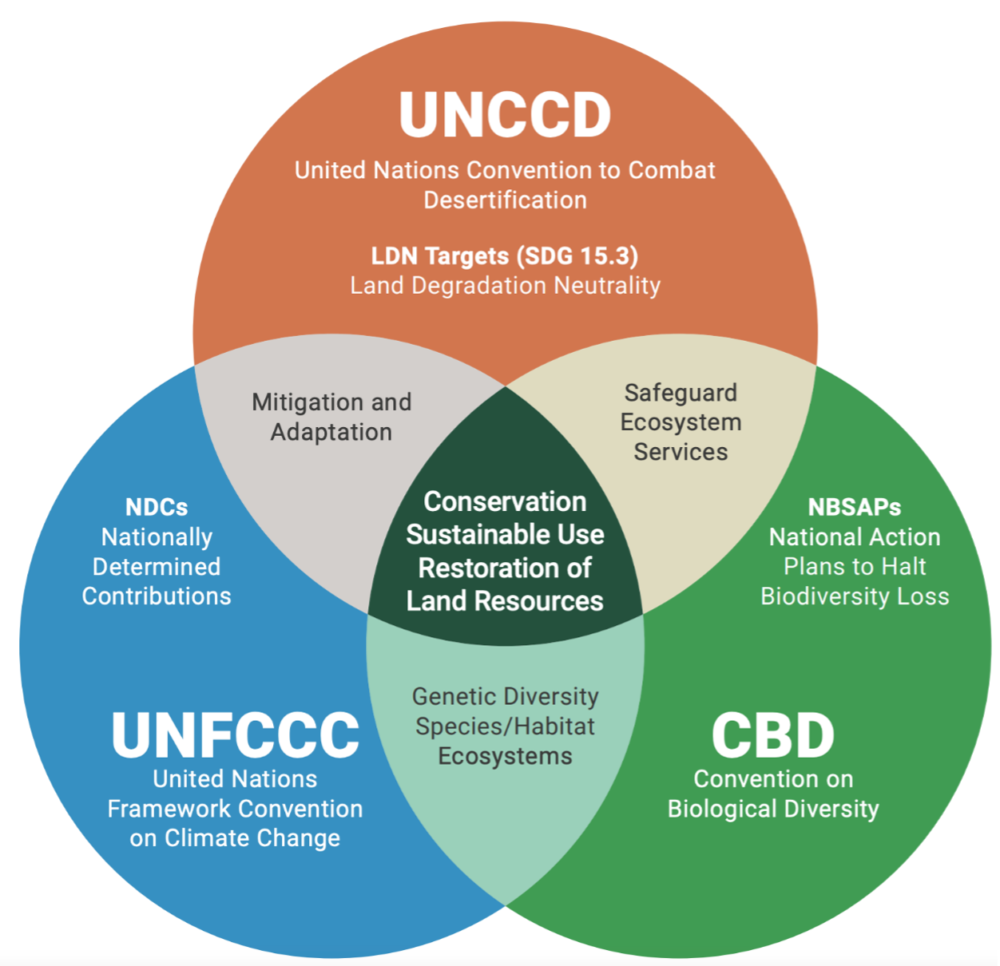

---
params:
  country: Colombia
  date: 26Jun25
  lang: Spanish
output: 
  officedown::rdocx_document:
    reference_docx: template.docx
    plots:
      style: Normal
      align: center
      topcaption: true
header-includes:
  - \usepackage{floatrow}
  - \floatsetup[figure]{capposition=top}
---

```{r setup_packages, include=FALSE}
# moves away from scientific notation (e-17)
options(scipen = 999)

# mounts packages
pacman::p_load("tidyverse", "knitr", "stringr", "readr", "openxlsx", "writexl", "readxl", # for general data uploading, tweaking, saving, ...
               "ggplot2", "ggpattern", "ggnewscale", "ggpubr", "geomtextpath", "ggbeeswarm", "fmsb", "colorBlindness", # for graphs
               "quanteda", "spacyr", "tm", "wordcloud", # for NLP
               "officedown", "officer", "flextable", "kableExtra", # for Word output
               "magrittr", "captioner", "rvest", "countries", "glue", "english", # misc
               "igraph", "grDevices") # for network graphs and saving pngs
 # for extras: pipe, extra captions, scraping/wrangling, translating country name, ...

# changes language
Sys.setlocale(category = "LC_ALL", locale = "Spanish") ### SPANISH ###
```

```{r setup_script, include=FALSE}
### Officedown/Markdown configurations
# ?
opts_chunk$set(echo = FALSE, 
               fig.cap = TRUE, tab.cap = TRUE)

# table formatting configurations
set_flextable_defaults(font.family = "Calibri", hansi.family = "Calibri", font.size = 9)

# ?
bl_template <- function(txt) {
  block_list(
    fpar(values = txt, fp_t = fp_text_lite(color = "#0001a4", bold = TRUE))
  )
}

# formatting configurations: portrait and landscape orientations, and table of contents
sec_port <- prop_section()
sec_land <- prop_section(page_size = page_size(orient = "landscape"), 
    type = "continuous", page_margins = page_mar(top = 0, right = 0, bottom = 0, left = 0))
sec_toc <- prop_section(type = "continuous", 
                        page_margins = page_mar(bottom = 0, left = 0.5, top = 0.5))

# other formatting configurations
links <- fp_text(color = "#0563C1", underlined = TRUE, font.size = 12, font.family = "Calibri")
links_i <- fp_text(color = "#0563C1", underlined = TRUE, font.size = 9, italic = TRUE, font.family = "Calibri")
footnote <- fp_text(italic = TRUE, font.size = 9, font.family = "Calibri")
section <- fp_text(font.size = 16, bold = TRUE, font.family = "Calibri")
subsection <- fp_text(font.size = 14, bold = TRUE, font.family = "Calibri")
#refbold <- fp_text(font.size = 12, bold = TRUE, font.family = "Calibri")
caption1 <- fp_text(font.size = 11, font.family = "Calibri")
caption2 <- fp_text(font.size = 11, font.family = "Calibri", bold = TRUE)
```

\pagenumbering{gobble}

```{r data_import, include = FALSE}
cty <- tolower(gsub(" ", "_", params$country)) # ensures that composite country names are separated by "_"; all are lowercase

# PATHS
path1 <- paste0("./data/countries/", cty)
path2 <- "./data"

# ENCODING:
lang <- c("English", "Spanish", "French", "German", "Russian", "Portuguese")

encod <- if (match(params$lang, lang) == 1) {
  "UTF-8" # most widely used, more modern, perfect for English (ASCII is a subset of UTF-8)
} else if (match(params$lang, lang) == 2 | match(params$lang, lang) == 3) {
  "latin1" # "UTF-8" + (á, à, é, ê, ó, ô, ú, ...), perfect for Latin languages (“ISO-8859-1”, “ISO-8859-15”, “ISO-8859-2”)
} else if (match(params$lang, lang) == 4 | lang == "E. European") {
  "windows-1252" # "latin1" + (ß, ü, ö, ä, …), perfect for German & E. Europe
} else if (lang == "C. European") {
  "windows-1250"
} else if (lang == "Russian") {
  "windows-1251" # Cyrilic, Slavic languages
} else if (lang == "Arabic") {
  "windows-1256" # (“ISO-8859-6”)
} 

# FILES:
# Themes GPT analysis
dta_th <- read.csv(list.files(path = path1, 
                              pattern = "themes.*\\.csv$", full.names = TRUE)) #, encoding = "UTF-8"
# Target-to-Target GPT analysis
dta_tt <- read.csv(list.files(path = path1, 
                              pattern = "targets.*\\.csv$", full.names = TRUE)) 
# Quantitative R analysis
#dta_qt <- read.xlsx(paste0(path1, "/", list.files(path = paste0(path1, "/"), pattern = "quantitative.*\\.xlsx$")), sheet = "Quantitative Terms")
dta_qt <- read_excel(paste0(path1, "/", 
                           list.files(path = paste0(path1, "/"), 
                                      pattern = "quantitative.*\\.xlsx$")), sheet = "Quantitative Terms")
# Cleaned country data ()
#tgts <- read.xlsx(paste0(path1, "/", list.files(path = paste0(path1, "/"), pattern = "data.*\\.xlsx$")), sheet = "targets")
tgts <- read_excel(paste0(path1, "/", 
                         list.files(path = paste0(path1, "/"), pattern = "data.*\\.xlsx$")), 
                  sheet = "targets")
# Themes
dates <- str_replace_all(list.files(path = paste0(path2, "/"), pattern = "^themes_.*\\.xlsx$"), 
                          c("themes_" = "", ".xlsx" = "")) # finds the most up-to-date Themes file
#thms <- read.xlsx(paste0(path2, "/", list.files(path = path2, pattern = dates[which.max(dmy(dates))])), sheet = "Themes")
thms <- read_excel(paste0(path2, "/", 
                         list.files(path = path2, pattern = paste0("_", dates[which.max(dmy(dates))]))), 
                  sheet = "Themes")
thms_tr <- read_excel(paste0(path2, "/", ### SPANISH ###
                         list.files(path = path2, pattern = paste0("_", dates[which.max(dmy(dates))]))), ### SPANISH ###
                  sheet = "Temas") ### SPANISH ###
# Summary GPT analysis (green boxes)
sums <- read.csv(list.files(path = path1, 
                              pattern = "summary.*\\.csv$", full.names = TRUE)) 
```

```{r trims, include = FALSE}
# Eliminates leading and lagging (white) spaces
dta_th <- dta_th %>% 
  mutate(Target.Text = str_trim(Target.Text), Target.Name = str_trim(Target.Name), 
         Themes = str_trim(Themes), Texts = str_trim(Texts))

dta_tt <- dta_tt %>% 
  mutate(Target.1.Name = str_trim(Target.1.Name), Target.2.Name = str_trim(Target.2.Name), 
         Theme = str_trim(Theme),
         Target.1.Text = str_trim(Target.1.Text), Target.2.Text = str_trim(Target.2.Text), 
         GPT.Alignment.Label = str_trim(GPT.Alignment.Label))

tgts <- tgts %>% 
  rename(Target.Name = `Target Name`, 
         Target.Text = `Target Text`) %>% 
  mutate(Target.Text = str_trim(Target.Text), Target.Name = str_trim(Target.Name))

dta_qt <- dta_qt %>% 
  rename(Target.Name = `Target Name`) %>% 
  left_join(select(tgts, Target.Name, Target.Text, Document)) %>% 
  mutate(Target.Text = str_trim(Target.Text), Target.Name = str_trim(Target.Name), 
         dates = strsplit(dates, "; "), 
         quants = strsplit(quants, "; ")) %>% 
  mutate(dates = ifelse(is.na(dates), "", dates), 
         quants = ifelse(is.na(quants), "", quants))

thms <- thms %>% 
  mutate(Themes = str_trim(Themes), Texts = str_trim(Texts)) %>% 
  mutate(Texts = ifelse(grepl("^Forest", Themes), 
                       str_replace(Texts, "reducingdeforestation", "reducing deforestation"), 
                       Texts))
thms_tr <- thms_tr %>% mutate(across(where(is.character), str_trim)) ### SPANISH ###
```

```{r odd_spaces, include = FALSE}
# Python's NBSP ('\xa0'); RStudio's NBSP ('\u00A0')
dta_th <- dta_th %>% 
  mutate(Themes = gsub("\u00A0", " ", Themes))

dta_tt <- dta_tt %>% 
  mutate(Theme = gsub("\u00A0", " ", Theme))

thms <- thms %>% 
  mutate(Themes = gsub("\u00A0", " ", Themes))
thms_tr <- thms_tr %>% 
  mutate(Temas = gsub("\u00A0", " ", Temas)) #### SPANISH ####

sums <- sums %>% 
  mutate(Theme = gsub("\u00A0", " ", Theme))
```

```{r trans, include = FALSE}
thms <- cbind(thms, select(thms_tr, Temas, Textos)) #### SPANISH ####s
rm(thms_tr) #### SPANISH ####

sums <- sums %>% #### SPANISH ####
  rename(Themes = Theme) %>% #### SPANISH ####
  left_join(select(thms, Themes, Temas)) %>% #### SPANISH ####
  select(-c(Themes, Original)) %>% #### SPANISH ####
  rename(Theme = Temas) #### SPANISH ####

dta_th <- dta_th %>% #### SPANISH ####
  left_join(select(thms, Themes, Temas)) %>% #### SPANISH ####
  select(-Themes) %>% #### SPANISH ####
  rename(Themes = Temas) #### SPANISH ####

dta_tt <- dta_tt %>% #### SPANISH ####
  rename(Themes = Theme) %>% #### SPANISH ####
  left_join(select(thms, Themes, Temas)) %>% #### SPANISH ####
  select(-Themes) %>% #### SPANISH ####
  rename(Theme = Temas) #### SPANISH ####

thms <- thms %>% #### SPANISH ####
  select(-c(Themes, Texts)) %>% #### SPANISH ####
  rename(Themes = Temas, Texts = Textos) #### SPANISH ####
```

```{r test1_fix, include = FALSE}

```

```{r test1, include = FALSE}
if (length(setdiff(unique(dta_th$generated_sample), c(0, 1))) != 0) {
  View(filter(dta_th, generated_sample == setdiff(unique(dta_th$generated_sample), c(0, 1))))
  menu("OK", title = ">> WARNING <<\nOdd GPT restuls (column 'generated_sample')\nCheck above what's going on and make changes in the 'test1_fix' code chunk (above).")
} else {
  message("[√] GPT's outputs seem in order.")
}
```

```{r test2_fix, include = FALSE}

```

```{r test2, include = FALSE}
if (length(setdiff(unique(dta_tt$GPT.Alignment.Label), c("No alignment", "Alignment opportunities"))) != 0) {
  View(dta_tt)
  menu("OK", title = paste0(">> WARNING <<\nOdd GPT results (column 'GPT.Alignment.Label'): ", setdiff(unique(dta_tt$GPT.Alignment.Label), c("No alignment", "Alignment opportunities")), "\nCheck what's going on and make changes in the 'test2_fix' code chunk (above)."))
} else {
  message("[√] GPT's outputs seem in order.")
}
```

```{r test3, include = FALSE}
repl <- c("marinas", "ganadera", "^Gestión de agua$", "forestal", "humdales", 
          "pastizales", "conectividad", "fertilidad", "riesgo", "cadena", 
          "carbono", "mitigación", "^Desertificación", "especies", 
          "silvicultura", "^Contaminación$", "género", "fomento", "ODS")
```

```{r test3_fix, include = FALSE}

```

```{r test3_th, include = FALSE}
#setdiff(thms$Themes, unique(dta_th$Themes)) ; setdiff(unique(dta_th$Themes), thms$Themes)
if ((length(setdiff(thms$Themes, unique(dta_th$Themes))) | 
     (length(setdiff(unique(dta_th$Themes), thms$Themes)))) != 0) {
  
  thm_len <- length(thms$Themes) - length(unique(dta_th$Themes))
  
  message("These theme titles from the thms dataframe were missing in the dta_th dataframe:")
  print(setdiff(thms$Themes, unique(dta_th$Themes)))
  
  message("… so the theme titles in the dta_th dataframe were replaced with the accurate corresponding ones from the thms dataframe.")
  for (i in which(thms$Themes %in% setdiff(thms$Themes, unique(dta_th$Themes)))) {
    dta_th <- dta_th %>% 
      mutate(Themes = ifelse(grepl(repl[i], Themes), thms$Themes[i], Themes))
  }
  
  if (max(length(setdiff(thms$Themes, unique(dta_th$Themes))), length(setdiff(unique(dta_th$Themes), thms$Themes))) != 0) {
    print(setdiff(thms$Themes, unique(dta_th$Themes)))
    View(thms)
    message(paste0(">> WARNING <<\nSeems like the theme TITLES above are still not properly named in dta_th.\nCheck the correct titles (thms$Themes) in the View pane above and make changes (dta_th$Themes) in the 'tests3_fix' code chunk (above)... \nif needed! Keep in mind that dta_th$Themes was missing ", thm_len, " theme(s) to begin with."))
  } else {
    message("[√] Seems like 'dta_th' and 'thms' have the same number of themes, now.")
  }
} else {
  message("[√] Seems like 'dta_th' contains all the themes.")
}
```

```{r test3-tt, include = FALSE}
#setdiff(thms$Themes, unique(dta_tt$Theme)) ; setdiff(unique(dta_tt$Theme), thms$Themes)
if ((length(setdiff(thms$Themes, unique(dta_tt$Theme))) | 
     (length(setdiff(unique(dta_tt$Theme), thms$Themes)))) != 0) {
  
  thm_len <- length(thms$Themes) - length(unique(dta_tt$Theme))
  
  message("These theme titles from the thms dataframe were missing in the dta_tt dataframe:")
  print(setdiff(thms$Themes, unique(dta_tt$Theme)))
  
  message("… so the theme titles in the dta_tt dataframe were replaced with the accurate corresponding ones from the thms dataframe.")
  for (i in which(thms$Themes %in% setdiff(thms$Themes, unique(dta_tt$Theme)))) {
    dta_tt <- dta_tt %>% 
      mutate(Theme = ifelse(grepl(repl[i], Theme), thms$Themes[i], Theme))
  }
  
  if (max(length(setdiff(thms$Themes, unique(dta_tt$Theme))), length(setdiff(unique(dta_tt$Theme), thms$Themes))) != 0) {
    print(setdiff(thms$Themes, unique(dta_tt$Theme)))
    View(thms)
    message(paste0(">> WARNING <<\nSeems like the theme TITLES above are still not properly named in dta_tt.\nCheck the correct titles (thms$Themes) in the View pane above and make changes (dta_tt$Theme) in the 'tests3_fix' code chunk (above)...\nif needed! Keep in mind that dta_th$Themes was missing ", thm_len, " theme(s) to begin with... so maybe it's okay?"))
  } else {
    message("[√] Seems like 'dta_tt' and 'thms' have the same number of themes, now.")
  }
} else {
  message("[√] Seems like 'dta_tt' contains all the themes.")
}
```

```{r test3-sums, include = FALSE}
#setdiff(thms$Themes, unique(sums$Theme)) ; setdiff(unique(sums$Theme), thms$Themes)
if ((length(setdiff(thms$Themes, unique(sums$Theme))) | 
     (length(setdiff(unique(sums$Theme), thms$Themes)))) != 0) {
  
  thm_len <- length(thms$Themes) - length(unique(sums$Theme))
  
  message("These theme titles from the thms dataframe were missing in the sums dataframe:")
  print(setdiff(thms$Themes, unique(sums$Theme)))
  
  message("… so the theme titles in the sums dataframe were replaced with the accurate corresponding ones from the thms dataframe.")
  for (i in which(thms$Themes %in% setdiff(thms$Themes, unique(sums$Theme)))) {
    sums <- sums %>% 
      mutate(Theme = ifelse(grepl(repl[i], Theme), thms$Themes[i], Theme))
  }
  
  if (max(length(setdiff(thms$Themes, unique(sums$Theme))), length(setdiff(unique(sums$Theme), thms$Themes))) != 0) {
    print(setdiff(thms$Themes, unique(sums$Theme)))
    View(thms)
    message(paste0(">> WARNING <<\nSeems like the theme TITLES above are still not properly named in sums.\nCheck the correct titles (thms$Themes) in the View pane above and make changes (sums$Theme) in the 'tests3_fix' code chunk (above)...\nif needed! Keep in mind that dta_th$Themes was missing ", thm_len, " theme(s) to begin with."))
  } else {
    message("[√] Seems like 'sums' and 'thms' have the same number of themes, now.")
  }
} else {
  message("[√] Seems like 'sums' contains all the themes.")
}
```

```{r general, include = FALSE}
if (match(params$lang, lang) == 1) { # English
  # t_nbt <- "\\bNBTs?\\b|\\bNBSAPs?\\b|\\bNational Biodiversity Targets?\\b|\\bNational Biodiversity Strategies and Action Plans\\b|\\bCBD\\b|\\b[Bb]iodiversity\\b"
  # trm_nat <- "National Biodiversity"; acr_nat <- "NBSAP"
  trg_nat <- "NBTs"
  # t_ndc <- "NDCs?|\\bNationally Determined Contributions?\\b"
  # trm_cli <- "[Nn]ationally [Dd]etermined|[Dd]etermined [Cc]ontributions"; acr_cli <- "NDC"
  trg_cli <- "NDC targets"
  trg_oth <- "Other targets"
} else if (match(params$lang, lang) == 2) { # Spanish
  # t_nbt <- "\\bMNBs?\\b|\\bEPANBs?\\b|\\bMetas? National(es)? de Biodiversidad?\\b|\\bEstrategias? (y Plan )?Nacional (para la|de) Biodiversidad\\b|\\bCBD\\b|\\b[Bb]iodiversidad\\b"
  # trm_nat <- "Nacional de Biodiversidad"; acr_nat <- "EPANB"
  trg_nat <- "MNB"
  # t_ndc <- "NDCs?|CDNs?|\\bContribuci[óo]n(es)? Determinadas? a [Nn]ivel Nacional\\b"
  # trm_cli <- "[Cc]ontribución(es)? [Dd]eterminadas?|[Dd]eterminadas? a [Nn]ivel [Nn]acional(es)?"; acr_cli <- "CDN"
  trg_cli <- "Metas de las CDN"
  trg_oth <- "Otras metas"
} else if (match(params$lang, lang) == 3) { # French
  # t_nbt <- ""
  # trm_nat <- "Nationaux pour la Biodiversité"; acr_nat <- "SPANB"
  trg_nat <- "CNBs"
  # t_ndc <- ""
  # trm_cli <- "[Cc]ontributions? [Dd]éterminé(es)?|[Dd]éterminé(es)? au [Nn]iveau [Nn]ational"; acr_cli <- "CDN"
  trg_cli <- "Cibles des CDN"
  trg_oth <- "Autres cibles"
} else if (match(params$lang, lang) == 4) {
  t_nbt <- ""
  t_ndc <- ""
} else if (lang == "E. European") {
  t_nbt <- ""
  t_ndc <- ""
} else if (lang == "C. European") {
  t_nbt <- ""
  t_ndc <- ""
} else if (lang == "Russian") {
  t_nbt <- ""
  t_ndc <- ""
} else if (lang == "Arabic") {
  t_nbt <- ""
  t_ndc <- ""
}

dta_th <- dta_th %>% 
  select(-any_of(c("index", "Country", "index.1", "Textt"))) %>% 
  # ensures Theme and Text column/variables
  rename(Theme = any_of(c("Themes", "Theme")), 
         Text = any_of(c("Texts", "Text"))) %>% 
  # creates "Doc"
  # mutate(Doc = case_when(
  #   (str_detect(Document, t_nbt) | str_detect(Source, "CBD|cbd|NBSAP|nbsap")) ~ acr_nat, 
  #   (str_detect(Document, t_ndc) |  str_detect(Source, "UNFCCC|unfccc|NDC|ndc")) ~ acr_cli, 
  #   TRUE ~ str_replace_all(Document, "[^A-Z]", ""))) %>% 
  # creates "Type"
  # mutate(Type = case_when(
  #   (str_detect(Document, t_nbt) | str_detect(Source, "CBD|cbd|NBSAP|nbsap")) ~ trg_nat, 
  #   (str_detect(Document, t_ndc) |  str_detect(Source, "UNFCCC|unfccc|NDC|ndc")) ~ trg_cli, 
  #   TRUE ~ trg_oth)) %>% 
  mutate(Type = ifelse(Type == "^CDN$", "Metas de las CDN", Type), ### SPANISH ###
         #Type = ifelse(Type == "MNB", "MNBs", Type) ### SPANISH ###
         ) %>%
  mutate(Type = factor(Type, levels = c(trg_nat, trg_cli, trg_oth))) %>% 
  # removes leading/lagging white spaces and 2+ consecutive white spaces
  mutate(across(c(Target.Name, Target.Text, Doc), ~ gsub("\\s+", " ", as.character(.x)))) %>% 
  # formatting: factor, numeric ...
  mutate(Theme = factor(Theme, unique(Theme)), 
         Doc = factor(Doc, unique(Doc)), 
         generated_sample = as.numeric(generated_sample))

dta_tt <- dta_tt %>% 
  # re-creates "Policy" ("Doc") and "Type" for 1
  # left_join(select(tgts, Target.Name, Doc, Document, Source) %>% 
  #             rename(Target.1.Name = Target.Name, 
  #                    Target.1.Policy = Doc), by = c("Target.1.Name", "Target.1.Policy")) %>% 
  # rename(Target.1.Document = Document, 
  #        Target.1.Source = Source) %>% 
  # mutate(Target.1.Policy = case_when(
  #   (str_detect(Target.1.Document, t_nbt) | str_detect(Target.1.Source, "CBD|cbd|NBSAP|nbsap")) ~ acr_nat, 
  #   (str_detect(Target.1.Document, t_ndc) | str_detect(Target.1.Source, "UNFCCC|unfccc|NDC|ndc")) ~ acr_cli, 
  #   TRUE ~ str_replace_all(Target.1.Document, "[^A-Z]", ""))) %>% 
  # mutate(Target.1.Type = case_when(
  #   (str_detect(Target.1.Document, t_nbt) | str_detect(Target.1.Source, "CBD|cbd|NBSAP|nbsap")) ~ trg_nat, 
  #   (str_detect(Target.1.Document, t_ndc) | str_detect(Target.1.Source, "UNFCCC|unfccc|NDC|ndc")) ~ trg_cli, 
  #   TRUE ~ trg_oth)) %>% 
  # select(-c(Target.1.Document, Target.1.Source)) %>% 
  # re-creates "Policy" ("Doc") and "Type" for 2
  # left_join(select(tgts, Target.Name, Doc, Document, Source) %>% 
  #             rename(Target.2.Name = Target.Name, 
  #                    Target.2.Policy = Doc), by = c("Target.2.Name", "Target.2.Policy")) %>% 
  # rename(Target.2.Document = Document, 
  #        Target.2.Source = Source) %>% 
  # mutate(Target.2.Policy = case_when(
  #   (str_detect(Target.2.Document, t_nbt) | str_detect(Target.2.Source, "CBD|cbd|NBSAP|nbsap")) ~ acr_nat, 
  #   (str_detect(Target.2.Document, t_ndc) | str_detect(Target.2.Source, "UNFCCC|unfccc|NDC|ndc")) ~ acr_cli, 
  #   TRUE ~ str_replace_all(Target.2.Document, "[^A-Z]", ""))) %>% 
  # mutate(Target.2.Type = case_when(
  #   (str_detect(Target.2.Document, t_nbt) | str_detect(Target.2.Source, "CBD|cbd|NBSAP|nbsap")) ~ trg_nat, 
  #   (str_detect(Target.2.Document, t_ndc) | str_detect(Target.2.Source, "UNFCCC|unfccc|NDC|ndc")) ~ trg_cli, 
  #   TRUE ~ trg_oth)) %>% 
  # select(-c(Target.2.Document, Target.2.Source)) %>% 
  # ensures Name, Theme and Text column/variables
  rename(Target.1.Name = any_of(c("Target.1.Name", "Target.1.Names")), 
         Target.1.Theme = any_of(c("Target.1.Theme", "Target.1.Themes")), 
         Target.1.Text = any_of(c("Target.1.Text", "Target.1.Texts")), 
         Target.2.Name = any_of(c("Target.2.Name", "Target.2.Names")), 
         Target.2.Theme = any_of(c("Target.2.Theme", "Target.2.Themes")), 
         Target.2.Text = any_of(c("Target.2.Text", "Target.2.Texts")))

# dta_qt <- dta_qt %>% 
  # left_join(select(tgts, Target.Name, Document, Source), 
  #           by = c("Target.Name", "Document")) %>% 
  # creates "Doc"
  # mutate(Doc = case_when(
  #   (str_detect(Document, t_nbt) | str_detect(Source, "CBD|cbd|NBSAP|nbsap")) ~ acr_nat, 
  #   (str_detect(Document, t_ndc) |  str_detect(Source, "UNFCCC|unfccc|NDC|ndc")) ~ acr_cli, 
  #   TRUE ~ str_replace_all(Document, "[^A-Z]", ""))) %>% 
  # creates "Type"
  # mutate(Type = case_when(
  #   (str_detect(Document, t_nbt) | str_detect(Source, "CBD|cbd|NBSAP|nbsap")) ~ trg_nat, 
  #   (str_detect(Document, t_ndc) |  str_detect(Source, "UNFCCC|unfccc|NDC|ndc")) ~ trg_cli, 
  #   TRUE ~ trg_oth), 
  #   Type = factor(Type, levels(dta_th$Type)))

tgts <- tgts %>% 
  # creates "Doc"
  # mutate(Doc = case_when(
  #   (str_detect(Document, t_nbt) | str_detect(Source, "CBD|cbd|NBSAP|nbsap")) ~ acr_nat, 
  #   (str_detect(Document, t_ndc) |  str_detect(Source, "UNFCCC|unfccc|NDC|ndc")) ~ acr_cli, 
  #   TRUE ~ str_replace_all(Document, "[^A-Z]", ""))) %>% 
  # formatting: factor, numeric ...
  mutate(Doc = factor(Doc, levels(dta_th$Doc))) %>% 
  # creates "Type"
  # mutate(Type = case_when(
  #   (str_detect(Document, t_nbt) | str_detect(Source, "CBD|cbd|NBSAP|nbsap")) ~ trg_nat, 
  #   (str_detect(Document, t_ndc) |  str_detect(Source, "UNFCCC|unfccc|NDC|ndc")) ~ trg_cli, 
  #   TRUE ~ trg_oth)) %>% 
  mutate(Type = ifelse(Type == "^CDN$", "Metas de las CDN", Type), ### SPANISH ###
         #Type = ifelse(Type == "MNB", "MNBs", Type) ### SPANISH ###
         ) %>%
  mutate(Type = factor(Type, levels(dta_th$Type)))

thms <- thms %>% 
  # formatting: factor, numeric ...
  mutate(Themes = factor(Themes, unique(Themes))) %>% 
  #mutate(Temas = factor(Temas, unique(Temas))) %>% ### SPANISH ###
  # ensures Theme and Text column/variables
  rename(Theme = any_of(c("Themes", "Theme")))

sums <- sums %>% 
  select(-X) %>% 
  mutate(Theme = factor(Theme, levels = levels(thms$Theme))) ### SPANISH ###
```

```{r test4, include = FALSE}
names <- tgts %>% 
  select(Target.Name, Document) %>% 
  mutate(Target_tokens = strsplit(Target.Name, "\\s+"), 
         Document_tokens = strsplit(Document, "\\s+")) %>% 
  mutate(intersection = map2(Target_tokens, Document_tokens, intersect)) %>% 
  mutate(intersection = sapply(intersection, function(x) paste(sort(x), collapse = "_")))

if (length(unique(names$intersection)) != 1) {
  View(names)
  bummer <- 1
  message(">> WARNING <<\nSome Document names are present in the targets' names.\nDo not correct: this will be automatically fixed in 'country_specs2' code chunk (below); just look at the 'intersection' column, because maybe the token that repeats is 'de' (in which case, just change 'bummer' back to 0).")
} else {
  message("[√] Seems like Document names are not contained in the document names.")
  bummer <- 0
}
```

```{r test4_fix, include = FALSE}
if (params$country == "Colombia") {
  bummer <- 0 # the 'intersection' column showed that the only overlapping tokens were "de"
}
```

```{r coutry_specs2, include = FALSE}
# concatenates document name, target name and target text
if (bummer == 1) {
  names <- names %>% 
    select(Target.Name, intersection)
  dta_th <- dta_th %>% 
    left_join(names) %>% 
    mutate(Target.Name = map2_chr(Target.Name, intersection, ~ str_trim(gsub(.y, "", .x)))) %>% 
    select(-intersection)
  dta_qt <- dta_qt %>% 
    left_join(names) %>% 
    mutate(Target.Name = map2_chr(Target.Name, intersection, ~ str_trim(gsub(.y, "", .x)))) %>% 
    select(-intersection)
  tgts <- tgts %>% 
    left_join(names) %>% 
    mutate(Target.Name = map2_chr(Target.Name, intersection, ~ str_trim(gsub(.y, "", .x)))) %>% 
    select(-intersection)
  names <- names %>% 
    mutate(Target.2.Name = Target.Name) %>% 
    rename(Target.1.Name = Target.Name)
  dta_tt <- dta_tt %>% 
    left_join(names %>% select(-Target.2.Name)) %>% 
    mutate(Target.1.Name = map2_chr(Target.1.Name, intersection, ~ str_trim(gsub(.y, "", .x)))) %>% 
    select(-intersection) %>% 
    left_join(names %>% select(-Target.1.Name)) %>% 
    mutate(Target.2.Name = map2_chr(Target.2.Name, intersection, ~ str_trim(gsub(.y, "", .x)))) %>% 
    select(-intersection)
}
```

```{r general_extra, include = FALSE}
dta_th <- dta_th %>% 
  mutate('Target.Full' = paste0("**", Doc, " ", Target.Name, "**: ", Target.Text))
dta_qt <- dta_qt %>% 
  mutate('Target.Full' = paste0("**", Doc, " ", Target.Name, "**: ", Target.Text))
tgts <- tgts %>% 
  mutate('Target.Full' = paste0(Doc, " ", Target.Name, ": ", Target.Text))
```

```{r test5_fix, include = FALSE}
urls <- tgts %>% 
     select(Document, Source) %>% unique()
```

```{r test5, include = FALSE}
if ((nrow(urls) != length(unique(urls$Document))) | (nrow(urls) != length(unique(urls$Source)))) {
  View(urls)
  print(unique(urls$Document))
  print(unique(urls$Source))
  menu(c("Yes", "No"), title = ">> WARNING <<\nThe number of unique documents does not match the number of sources.\nCheck above what's going on and make changes in the 'test5_fix' code chunk (above).\nAble to assess everything?")
} else {
  message("[√] Each document seems to have a single source.")
}
```

```{r country_specs3, include = FALSE}

```


::: {custom-style="intro_topics"}
Sobre el PNUD
:::

::: {custom-style="Text"}
El PNUD es la principal organización de las Naciones Unidas que lucha para poner fin a la injusticia de la pobreza, la desigualdad y el cambio climático. Trabajando con nuestra amplia red de expertos y socios en 170 países, ayudamos a las naciones a construir soluciones integradas y duraderas para las personas y el planeta. Más información en undp.org o síganos en @UNDP.
:::

<br>

::: {custom-style="intro_topics"}
Acerca de la Promesa Climática del PNUD 
:::

::: {custom-style="Text"}
La Promesa Climática del PNUD es la mayor cartera de apoyo a la acción climática del sistema de las Naciones Unidas, trabaja con más de 140 países y territorios y beneficia directamente a 37 millones de personas. Esta cartera ejecuta más de 2.300 millones de dólares en subvenciones y aprovecha la experiencia del PNUD en adaptación, mitigación, mercados de carbono, clima y bosques, y estrategias y políticas climáticas. Visite nuestro sitio web en climatepromise.undp.org y síganos en Twitter en @UNDPClimate.
:::

<br>

::: {custom-style="intro_topics"}
Acerca del Compromiso por la Naturaleza del PNUD
:::

::: {custom-style="Text"}
El Compromiso por la Naturaleza del PNUD representa el compromiso de aumentar el apoyo a más de 140 países para que alcancen sus ambiciosas metas y objetivos dentro del Marco Mundial para la Biodiversidad y los Objetivos de Desarrollo Sostenible. El Compromiso por la Naturaleza se centra en tres cambios del sistema: un cambio de valores, un cambio económico y financiero y un cambio de políticas y prácticas. Estos cambios son esenciales para detener la pérdida de biodiversidad y garantizar una red de seguridad planetaria para la humanidad. Visite nuestro sitio web en undp.org/nature/nature-pledge.
:::

<br>

::: {custom-style="intro_topics"}
Acerca de este informe
:::

::: {custom-style="Text"}
Este informe ha sido elaborado conjuntamente por el Hub de Naturaleza y el Hub Climático del PNUD, en colaboración con otros equipos del PNUD y organizaciones asociadas. Si se difunde este borrador en su versión definitiva, se ruega incluir la mención al Fondo para el Medio Ambiente Mundial (FMAM) como donante principal.
:::

<br>

::: {custom-style="intro_topics"}
Descargo de responsabilidad de la ONU
:::

::: {custom-style="Text"}
Las opiniones expresadas en este informe son las de los autores y no representan necesariamente las de las Naciones Unidas, incluido el Programa de las Naciones Unidas para el Desarrollo, ni las de los Estados miembros de la ONU.
:::

\newpage

::: {custom-style="extra"}
**ÍNDICE**
:::

```{r toc, echo=FALSE}
# inserts Table of Contents
block_toc(level = 6)
```

```{r toc_formating}
# portrait orientation, hitherto (specific margins)
block_section(sec_toc)
```

# Introducción {#sec1}

## Objetivos de la evaluación de alineación {#sec11}

<br>

```{r gen, include=FALSE}
# Gender article of the country
if (params$country == "Ecuador" | params$country == "Paraguay" | params$country == "Uruguay" | params$country == "") { #  also Afghanistan, Brazil, Cameroon, Canada, Congo, Gabon, Japan, Lebanon, Senegal, Sudan, South Sudan, Togo, Yemen (but their NBTs are not in Spanish)
  artgen <- "el "
  posgen <- "del "
} else if (params$country == "Ecuatorial Guinea" | params$country == "Argentina" | 
           params$country == "Dominican Republic") { #  also Czech Republic, China, DRC, Guinea, India, Pakistan, CAR (but their NBTs are not in Spanish)
  artgen <- "la "
  posgen <- paste0("de ", artgen)
# } else if (params$country == "") { # also UAE, US, Netherlands (but their NBTs are not in Spanish)
  # artgen <- " los "
  # posgen <- paste0("de ", artgen)
# } else if (params$country == "") { #  also Bahamas, Comoros, Maldives, Marshall Islands, Solomon Islands, Seychelles (but their NBTs are not in Spanish)
  # artgen <- " las "
  # posgen <- paste0("de ", artgen)
} else { 
  artgen <- ""
  posgen <- "de "
}
```

```{r docs, include = FALSE}
documents <- (select(tgts, Document, Doc, Source) %>% unique())$Document
docs <- (select(tgts, Document, Doc, Source) %>% unique())$Doc
refs <- (select(tgts, Document, Doc, Source) %>% unique() %>% 
           mutate(Source = ifelse(is.na(Source), "", Source)))$Source

prn_m <- c("plan", "informe", "manifesto", "documento") ### SPANISH ### keep updating
prn_f <- c("actualización", "estrategia", "contribución", "ley", "segunda", "política", "hoja") ### SPANISH ### keep updating
fst_wrd <- word(documents, 1) ### SPANISH ###
gnd_prn <- character() ### SPANISH ###
for (i in 1:length(fst_wrd)) { ### SPANISH ###
  gnd_prn <- c(gnd_prn, ifelse(tolower(fst_wrd[i]) %in% prn_m, "del", "de la")) ### SPANISH ###
} ### SPANISH ###

ref_list <- mapply(function(pron, doc, link, acronym) { ### SPANISH ###
  paste0(pron, " [", doc, "](", link, ") (", acronym, ")") ### SPANISH ###
}, gnd_prn, documents, refs, docs) ### SPANISH ###

txt_docdoc <- ""
for (i in 1:length(ref_list)) {
  txt_docdoc <- paste0(txt_docdoc, ref_list[[i]])
  if (i == length(ref_list)-1) {
    txt_docdoc <- paste0(txt_docdoc, " y ") ### SPANISH ###
  } else if (i <= length(ref_list)-2){
    txt_docdoc <- paste0(txt_docdoc, ", ")
  }
}
```

::: {custom-style="Text"}
Esta **Evaluación Piloto de la Alineación Naturaleza-Clima** se desarrolla a través de Inteligencia Artificial (IA) para apoyar `r artgen``r params$country` en la evaluación de la alineación entre sus metas de naturaleza y clima a nivel nacional. Reuniendo la experiencia del Centro de la Naturaleza del PNUD, el Centro del Clima y los países piloto, la metodología busca descubrir similitudes, localizar soluciones basadas en la naturaleza, identificar información cuantitativa y proporcionar un punto de partida para la toma de decisiones hacia la coherencia política. Las metas de muchas políticas nacionales diferentes, compartidas por `r artgen``r params$country`, constituyen la base del análisis (**\@ref(anx1)**).

<br>

La **Evaluación de la Alineación Naturaleza-Clima** ofrece cuatro análisis nacionales personalizados:
:::

::: {custom-style="bullet-point"}
-   **Localizar soluciones basadas en la naturaleza**: Analizar la integración de soluciones basadas en la naturaleza dentro de las metas nacionales en materia de clima y biodiversidad.

-   **Identificar solapamientos temáticos**: Evaluar los temas transversales comunes a todas las metas.

-   **Evaluar similitudes entre objetivos**: Identificar objetivos específicos en las políticas de biodiversidad y clima que muestren oportunidades para una mayor alineación.

-   Evaluar **informaciones cuantitativas**: Proporcionar información cuantitativa y con plazos concretos de las metas, como "proteger el 30% de la biodiversidad" o "alcanzarlo para 2030".
:::

<br>

::: {custom-style="Text"}
Los resultados de la evaluación piloto pretenden proporcionar a las Partes información orientativa para:
:::

::: {custom-style="bullet-point"}
-   **Mejorar la coherencia política**: Proporcionar ideas prácticas para alinear las metas de clima y naturaleza, así como otras metas u objetivos que el país pueda considerar relevantes.

-   **Fomento de la participación de las partes interesadas**: Apoyar los procesos inclusivos y participativos y reforzar la coordinación interinstitucional, aplicando enfoques de todo el gobierno y la sociedad.
:::

<br>

::: {custom-style="Text"}
Dado que esta evaluación se elabora mediante IA, está sujeta a ciertas limitaciones (**Tabla 1.\@ref(tab:tbl1)**). Se recomienda encarecidamente a los países que utilicen estos resultados para iniciar conversaciones y no como un análisis prescriptivo independiente. Se recomienda revisar detenidamente los resultados con las partes interesadas pertinentes y considerarlos junto con otros tipos de análisis validados a nivel nacional y revisiones de documentos Como parte del proceso piloto, y para garantizar un enfoque centrado en el ser humano, se invita `r artgen``r params$country` a proporcionar información sobre la metodología y la presentación de los resultados a través de una  [`r ftext("encuesta abierta", links)`](https://forms.office.com/Pages/ResponsePage.aspx?id=Xtvls0QpN0iZ9XSIrOVDGWNp7QxCnxtBnoa-dEHQqQxUM0szQkVITjhUQUFRWURZNlpHUlFYWFZGVS4u). De este modo, se podrá seguir perfeccionando el enfoque para ayudar a todos los países interesados a alinear sus objetivos políticos y explorar una aplicación y presentación de informes coherentes y explorar una aplicación y presentación de informes coherentes.
:::

\newpage

```{r tbl1, echo = FALSE, tab.cap="Ventajas y limitaciones de la evaluación piloto", tab.id="tbl1", tab.cap.pre="Table 1.", tab.lp="sec1"}
# tab.autonum.start_at=1, 
tbl <- data.frame(can = c("Proporcionar un análisis inicial de la alineación de las metas que un país puede validar después utilizando fuentes o aportaciones nacionales.", "Servir como recurso que las Partes pueden elegir para tener en cuenta en sus procesos de participación de las partes interesadas, en función de sus necesidades y capacidades.", "Informar el proceso dirigido por el país para alinear las metas nacionales y apoyar el posterior desarrollo y aplicación de diversos planes.", "Proporcionar una información de referencia que un país pueda comparar con futuras evaluaciones que utilicen la misma metodología.", "Evaluar la concordancia entre las diversas metas de un país en relación con la naturaleza, el clima y la tierra."), 
                  cant = c("Proporcionar puntuaciones definitivas y totalmente validadas sobre la alineación de metas que tengan en cuenta las circunstancias, los puntos de referencia o las capacidades nacionales.", "Emitir juicios definitivos sobre la alineación de un país y determinar qué metas nacionales deben revisarse o actualizarse.", "Sustituir los procesos nacionales de alineación de objetivos y planificación.", "Sustituir o matizar las decisiones de la COP.", "Evaluar documentos completos, indicadores principales, mecanismos financieros u otros temas."))
colnames(tbl) <- c("Qué puede hacer la evaluación", "Lo qué no puede hacer la evaluación")

tbl %>% flextable(cwidth = c(6.5/2, 6.5/2)) %>% 
  bg(part = "header", j = 1:2, bg = "#d3e1f1") %>% 
  color(part = "header", j = 1:2, color = "black") %>%
  bold(part = "header") %>% 
  hline(part = "all") %>% 
  valign(valign = "top") %>% 
  align(align = "justify")
```

\newpage

## Contexto {#sec12}

<br>

::: {custom-style="Text"}
El cambio climático, la pérdida de biodiversidad y la desertificación son crisis interrelacionadas que requieren una acción integrada. La salud de los ecosistemas depende de unas condiciones climáticas estables. Según la [`r ftext("Plataforma intergubernamental científico-normativa sobre diversidad biológica y servicios de los ecosistemas (IPBES)", links)`](https://www.ipbes.net/models-drivers-biodiversity-ecosystem-change), el cambio climático es uno de los principales impulsores de la pérdida de biodiversidad y la degradación de la tierra, y el calentamiento antropogénico inducido por el clima amenaza potencialmente hasta una de cada seis especies de flora y fauna de todo el planeta. La biodiversidad es también una parte fundamental de la solución al cambio climático. Las soluciones basadas en la naturaleza, como la reforestación, la restauración costera y la gestión del suelo, pueden ayudar a contrarrestar las emisiones de gases de efecto invernadero (GEI) causadas por el hombre y aportar más [`r ftext("del 30% de la solución necesaria", links)`](https://www.pnas.org/doi/10.1073/pnas.1710465114#supplementary-materials) para garantizar que el calentamiento global no aumente 2 grados centígrados por encima de los niveles preindustriales. Según el [`r ftext("Sexto Informe de Evaluación (IE6)", links)`](https://www.ipcc.ch/assessment-report/ar6/) del Panel Intergubernamental sobre el Cambio Climático (IPCC), el éxito a la hora de limitar el cambio climático depende de una mayor mitigación por parte del sector de la agricultura, la silvicultura y otros usos de la tierra (AFOLU), que representa aproximadamente el 22% de las emisiones mundiales de GEI.

<br> 

La Convención Marco de las Naciones Unidas sobre el Cambio Climático (CMNUCC), el Convenio de las Naciones Unidas sobre la Diversidad Biológica (CDB) y la Convención de las Naciones Unidas de Lucha contra la Desertificación (CNULD) tienen como objetivo hacer frente al cambio climático, conservar la biodiversidad y promover la gestión sostenible de la tierra. Comúnmente se les llama las "Convenciones de Río" porque se establecieron durante la Cumbre de la Tierra celebrada en Río de Janeiro en 1992. Las convenciones y sus marcos reflejan el valor de la acción integrada para la naturaleza, el clima y la tierra. Puede encontrar más información sobre las sinergias entre estas convenciones en el **\@ref(anx2)**.
:::

<br>

::: {custom-style="Text"}
Mediante la planificación y aplicación integradas de instrumentos políticos nacionales como las Estrategias y Planes de Acción Nacionales sobre Biodiversidad (EPANB) del CDB, las Contribuciones Determinadas a Nivel Nacional (CDNs) y  los Planes Nacionales de Adaptación (PAN) de la CMNUCC, y las Metas de Neutralidad de la Degradación de la Tierra (NDT) de la CNULD, los países pueden optimizar recursos y garantizar enfoques coherentes ante las crisis mundiales de la naturaleza, el clima y la tierra. Unas políticas coherentes en todos los sectores también pueden agilizar la presentación de informes y aumentar la transparencia.  

<br>

La convergencia de los plazos de 2024 y 2025 para la planificación nacional de cara a las Convenciones de Río presenta una oportunidad única para alinear las políticas sobre la naturaleza y el clima. Aunque la COP16 del CDB solicitó que las EPANB, actualizadas en consonancia con el Marco Mundial de Biodiversidad de Kunming-Montreal (MMB), se presentaron en 2024, muchos países siguen elaborando estos documentos en 2025. Del mismo modo, aunque se pidió a los países que presentaran las CDN 3.0 a la Secretaría de la CMNUCC en febrero de 2025, algunos países tienen previsto finalizarlas a finales de 2025. La intersección de estos calendarios puede facilitar la armonización de los esfuerzos de planificación entre convenciones. Sin embargo, a pesar de que [`r ftext("153 de las 198 Partes cuentan con puntos focales nacionales para dos o las tres Convenciones de Río dentro del mismo ministerio", links)`](https://unfccc.int/sites/default/files/resource/Infobrief%202_design%20a.pdf), los procesos de planificación a menudo pueden estar aislados y pasar por alto la importancia de las sinergias, lo que resulta en esfuerzos fragmentados y oportunidades perdidas para una acción integrada.  

<br>

Dada la urgencia de una acción rápida, la IA puede proporcionar un punto de partida útil para el debate y la planificación entre los responsables de la toma de decisiones. Cuando se aplica a través de un enfoque centrado en el ser humano, la IA puede democratizar el acceso a análisis de vanguardia y empoderar a una gama más amplia de partes interesadas. En 2024, más de 50 países pusieron a prueba el uso de la IA para realizar evaluaciones de la alineación entre sus objetivos nacionales y mundiales en materia de biodiversidad con el fin de cumplir los compromisos del CDB. Desarrolladas por el PNUD en el marco del Proyecto de Apoyo a la Acción Temprana y financiadas por el Fondo para el Medio Ambiente Mundial, las [`r ftext("Evaluaciones de la Similitud de las Metas de las EPANB", links)`](https://www.undp.org/publications/leveraging-artificial-intelligence-enhance-early-action-towards-kunming-montreal-global-biodiversity-framework) ofrecen información personalizada sobre las sinergias entre las metas nacionales de biodiversidad y las metas del MMB. Estas evaluaciones también proporcionan recomendaciones para mejorar la alineación y lograr una transformación en la relación de nuestras sociedades con la biodiversidad para 2030. El PNUD se basa ahora en esta metodología original para ayudar a los países a desarrollar evaluaciones de la alineación entre sus metas y objetivos políticos nacionales. Esto también se vincula con el trabajo en curso para apoyar a los países en sus procesos de revisión de las CDN y actualización de las EPANB a través del Hub de Naturaleza y del Hub Climático del PNUD.

<br>

Para esta evaluación, se invitó a los países a compartir sus metas y objetivos políticos nacionales que considerasen más relevantes para el análisis, incluidos los relacionados con las EPANBs, CDNs, PNAs, y las metas de la NDT, además de otros planes nacionales. En este caso, el término "meta" se utiliza como término general para cualquier tipo de meta o fin nacional conciso que se esfuerce por apoyar la consecución de las Convenciones de Río, así como cualquier otra meta que un país considere relevante. A menudo, una meta puede tener un elemento cuantitativo, como "Restaurar el **60%** de los ecosistemas forestales, de humedales y costeros degradados **para 2030** con el fin de mejorar la biodiversidad y el secuestro de carbono". Sin embargo, este no es el caso de todas las metas. Dado que las directrices para la planificación nacional de cara a las Convenciones de Río difieren enormemente, puede haber una gran variabilidad en la forma en que los países deciden definir sus metas para esta evaluación.
:::

\newpage

# Síntesis de los Resultados de la Alineación `r posgen``r params$country` {#sec2}

::: {custom-style="Text"}
Esta sección ofrece una visión general de las principales conclusiones del análisis sobre los las metas `r posgen``r params$country` del `r txt_docdoc`. Estos objetivos fueron identificados por el país y pueden consultarse en el **\@ref(anx1)**, y constituyen la base del análisis. La información clave incluye áreas de alineación, lagunas y oportunidades para la coherencia política.  
:::

```{r themes, include=FALSE}
dta_th <- dta_th %>% 
  select(-c("Target.Textt", "Target.Name", "Document", "Target.Text", "Text"))

tgt_cnt <- tgts %>% 
  select(Type, Target.Name) %>% 
  unique() %>% 
  mutate(Cnt = 1) %>% 
  group_by(Type) %>% 
  summarise(Count = sum(Cnt)) %>% 
  ungroup() %>% 
  arrange(Type)
```

```{r aux0, include=FALSE}
#colours <- c("#F1BF42", "#5DA2ED", "#7E57C2") # "#2A9D8F"
#colours <- PairedColor12Steps[c(2, 6, 11)] 
#"#FFBF7F" "#FF7F00" "#FFFF99" "#FFFF32" "#B2FF8C" "#32FF00" "#A5EDFF" "#19B2FF" "#CCBFFF" "#654CFF" "#FF99BF" X"#E51932"X
#colours <- c("#4059AD", "#6B9AC4", "#97D8C4", "#EFF2F1", "#F4B942")[c(2, 5, 1)]
colours <- c("#5395DC", "#EBBD3F", "#7251B5")
names(colours) <- levels(dta_th$Type)

colours_rad <- adjustcolor(colours, alpha.f = 0.3)

lines <- c(1, 3, 6) # 1 solid 2 dashed 3 dotted 4 dotdashed 5 longdash 6 twodash
```

<br>

## Soluciones basadas en la naturaleza {#sec21}

::: {custom-style="Text"}
Este análisis se centró en `r if (table(thms$Area)["NbS"] < 10) {as.character(as.english(table(thms$Area)["NbS"]))} else {table(thms$Area)["NbS"]}` categorías de soluciones basadas en la naturaleza que pueden ser pertinentes para su consideración:
:::

```{r nbs, include=FALSE, results='asis'}
txt_nbs <- ""
for (i in 1:table(thms$Area == "NbS")[["TRUE"]]) {
  txt_nbs <- paste0(txt_nbs, "-   ", thms$Theme[i], "\n\n")
}
```

<br>

::: {custom-style="bullet-point"}
`r txt_nbs`
:::

<br>

::: {custom-style="Text"}
Por recomendación de un grupo de trabajo del PNUD, formado por representantes de los Centros de la Naturaleza y el Clima, estas `r table(thms$Area)["NbS"]` categorías de soluciones basadas en la naturaleza se identificaron a partir del [`r ftext("Informe Especial del IPCC sobre Cambio Climático y Tierra", links)`](https://www.ipcc.ch/srccl/chapter/summary-for-policymakers/) and [`r ftext("Soluciones Climáticas Naturales", links)`](https://www.pnas.org/doi/10.1073/pnas.1710465114) de Griscom et al. Las descripciones de estas categorías pueden encontrarse en la **Sección \@ref(sec31)** y en el **\@ref(anx3)**.
:::

```{r nbs_themes, include=FALSE, warning=FALSE}
nbs_cnt <- dta_th %>% 
  left_join(select(thms, Theme, Area)) %>% 
  filter(Area == "NbS") %>% 
  select(Type, Target.Full, generated_sample) %>% 
  group_by(Type, Target.Full) %>% 
  summarise(Count = sum(generated_sample)) %>% 
  filter(Count != 0) %>% 
  ungroup()

tgt_cnt <- tgt_cnt %>% 
  left_join(nbs_cnt %>% 
              mutate(Theme = 1) %>% 
              select(-c(Target.Full, Count)) %>% 
              group_by(Type) %>% 
              summarise(NbS = sum(Theme)) %>% 
              ungroup()) %>% 
  mutate(across(everything(), ~replace_na(.x, 0)))

txt_nbs_cnt <- ""
for (i in 1:dim(tgt_cnt)[1]){
  txt_nbs_cnt <- paste0(txt_nbs_cnt, "-   **", tgt_cnt$NbS[i], " de ", tgt_cnt$Count[i], " ", tgt_cnt$Type[i], " (",  round(100*tgt_cnt$NbS[i]/tgt_cnt$Count[i], 0), "%)**\n\n") ### SPANISH ###
}
```

<br>

::: {custom-style="Text"}
Para este informe de evaluación, se analizaron las `r if (nrow(tgts) < 10) {as.character(as.english(nrow(tgts)))} else {nrow(tgts)}` metas `r posgen``r params$country` de `r if (length(docs) < 10) {as.character(as.english(length(docs)))} else {length(docs)}` documentos estratégicos comparándolos con estas categorías y sus descripciones. Al compararlas, el modelo de IA identificó que `r if (sum(tgt_cnt$NbS) < 10) {as.character(as.english(sum(tgt_cnt$NbS)))} else {sum(tgt_cnt$NbS)}` de las `r if (nrow(tgts) < 10) {as.character(as.english(nrow(tgts)))} else {nrow(tgts)}` metas `r posgen``r params$country` arecen pertenecer al menos a una categoría de soluciones basadas en la naturaleza:
:::

<br>

::: {custom-style="bullet-point"}
`r txt_nbs_cnt`
:::

```{r aux1, include=FALSE}
fig1 <- dta_th %>% 
  left_join(select(thms, Theme, Area)) %>% 
  filter(Area == "NbS") %>% 
  select(Type, Theme, generated_sample) %>% 
  group_by(Type, Theme) %>% 
  summarise(Count = sum(generated_sample)) %>% 
  ungroup()

fig1$Theme <- str_wrap(fig1$Theme, width = 25) # ensures axis text is not overlapping

aux1 <- fig1 %>% 
  select(-Type) %>% 
  group_by(Theme) %>% 
  summarise(Count = sum(Count)) %>% 
  ungroup() %>% 
  arrange(desc(Count)) %>% 
  mutate(Theme = gsub("\n", " ", Theme))

txt_fig1_max <- "Las categorías más comunes de soluciones basadas en la naturaleza detectadas entre las metas del país parecen ser" ### SPANISH ###
for (j in 1:length(filter(aux1, Count >= nth(aux1$Count, 2))$Count)) {
  txt_fig1_max <- paste0(txt_fig1_max, " ", aux1$Theme[j], " (", ifelse(aux1$Count[j] == 0, "ninguna", if (aux1$Count[j] < 10)  {as.character(as.english(aux1$Count[j]))} else {aux1$Count[j]}), " ", ifelse(aux1$Count[j] == 1, "meta), ", "metas),"),  ifelse(length(filter(aux1, Count >= nth(aux1$Count, 2))$Count)-1 == j, " y", "")) ### SPANISH ###
}
txt_fig1_max <- gsub(",$", "", txt_fig1_max)

aux1 <- aux1 %>% 
  arrange(Count)

txt_fig1_min <- "Las categorías que se detectaron con menor frecuencia fueron" ### SPANISH ###
for (i in 1:length(filter(aux1, Count <= nth(aux1$Count, 2))$Count)) {
  txt_fig1_min <- paste0(txt_fig1_min, " ", aux1$Theme[i], " (", ifelse(aux1$Count[i] == 0, "ninguna", if (aux1$Count[i] < 10) {as.character(as.english(aux1$Count[i]))} else {aux1$Count[i]}), " ", ifelse(aux1$Count[i] == 1, "meta), ", "metas),"), ifelse(length(filter(aux1, Count <= nth(aux1$Count, 2))$Count)-1 == i, " y", "")) ### SPANISH ###
}
txt_fig1_min <- gsub(",$", "", txt_fig1_min)
```

<br>

::: {custom-style="Text"}
`r txt_fig1_max`. `r txt_fig1_min`. Los resultados se describen con más detalle en las **Figuras 2.\@ref(fig:fig1)** y **2.\@ref(fig:fig2)**, y en la **Sección \@ref(sec31)** se puede encontrar más información incluidas las oportunidades para una mayor alineación entre metas.
:::

<br>

```{r fig1, echo=FALSE, warning=FALSE, fig.align="center", fig.width=6.5, fig.height = 8, fig.retina=10, fig.cap = "Número de metas nacionales que parecen pertenecer a cada una de las categorías de soluciones basadas en la naturaleza", fig.id="fig1", fig.cap.pre="Figure 2.", fig.lp="sec2"}
ref1 <- max((fig1 %>% 
                 group_by(Theme) %>% summarise(Count = sum(Count)))$Count)
if (ref1 <= 30) {
  reff1 <- 5
} else {
  reff1 <- round(ref1/5, 0)
}

# tab.autonum.start_at=1, 
ggplot(fig1, aes(fill = Type, y = reorder(Theme, Count), x = Count)) + 
  geom_bar(position = position_stack(reverse = TRUE), stat = "identity") + 
  ylab("Categorías de soluciones basadas en la naturaleza") + xlab("Número de metas potencialmente relevantes") + ### SPANISH ###
  scale_fill_manual(values = colours) + 
  scale_x_continuous(breaks = seq(0, ref1, by = reff1)) + 
  labs(fill = "") + 
  theme_minimal() + 
  theme(panel.grid.major.y = element_blank(), panel.grid.minor.y = element_blank(), 
        panel.grid.minor.x = element_blank(), 
        axis.title.x = element_text(face = "bold", size = 8), axis.text.x = element_text(size = 7),
        axis.title.y = element_text(face = "bold", size = 8), axis.text.y = element_text(size = 7),
        legend.title = element_text(face = "bold", size = 8), legend.text = element_text(size = 7), 
        legend.position = "bottom")
```

<br>

```{r aux2, include=FALSE}
fig2 <- fig1 %>% 
  pivot_wider(values_from = Count, names_from = Theme)

fig2_max <- data.frame(t(c("Max", rep(max(fig1$Count), ncol(fig2)-1))), 
                       stringsAsFactors = FALSE)
colnames(fig2_max) <- colnames(fig2)

fig2_min <- data.frame(t(c("Min", rep(0, ncol(fig2)-1))), 
                       stringsAsFactors = FALSE)
colnames(fig2_min) <- colnames(fig2)

fig2 <- rbind(fig2_max, fig2_min, fig2)
fig2[ , 2:ncol(fig2)] <- lapply(fig2[ , 2:ncol(fig2)], function(x) as.numeric(as.character(x)))

rownames(fig2) <- fig2[[1]]
fig2 <- fig2[ , -1]

colnames(fig2) <- str_wrap(colnames(fig2), width = 20) # ensures axis text is not messy
```

::: {custom-style="Text"}
La **Figura 2.\@ref(fig:fig2)** ilustra en qué medida cada tipo de meta cubre las categorías de soluciones basadas en la naturaleza. Un área mayor dentro del gráfico indica una cobertura temática más amplia. Los resultados son los mismos que los de la **Figura 2.\@ref(fig:fig1)**, pero ofrecen una forma adicional de visualizar las relaciones entre políticas.
:::

<br>
 
```{r fig2, echo=FALSE, warning=FALSE, fig.align="center", fig.width=6.5, fig.height = 6, fig.retina=8, fig.cap = "Distribución de las metas nacionales entre las categorías de soluciones basadas en la naturaleza", fig.id="fig2", fig.cap.pre="Figure 2.", fig.lp="sec2"}
op <- par(mar = c(2, 2, 1, 2), # BLTR
          oma = c(0, 0, 0, 0), # BLTR 
          xpd=TRUE)

radarchart(fig2, 
           axistype = 1, # adds numbers to background
           caxislabels = round(quantile(c(0, fig2["Max",1])), 0), # adds numbers to background
           axislabcol = "grey55", # adds numbers to background
           cglty = 1, # Grid line type
           cglcol = "gray", # Grid line color
           pcol = colours, # Color for each line
           plwd = 1, # Width for each line
           plty = lines, # Line type for each line
           pty = 32, #
           pfcol = colours_rad, # Color of the areas
           vlcex = 0.8, # "x-axis" text font size
           calcex = 0.8) # axis labels

legend("bottom", inset = c(0, -0.05), horiz = TRUE,
       legend = levels(fig1$Type)[unique(fig1$Type)], 
       bty = "n", fill = colours,
       text.col = "grey25", pt.cex = 2, 
       cex = 0.8, 
       x.intersp = 0.5, 
       text.width = c(0.85, 0.35, 0.25))

par(op, xpd=NA)
```

<br>

## Temas transversales {#sec22}

::: {custom-style="Text"}
Además, las `r if (nrow(tgts) < 10) {as.character(as.english(nrow(tgts)))} else {nrow(tgts)}` metas `r posgen``r params$country` se analizaron en relación con `r if (table(thms$Area)["Additional"] < 10) {as.character(as.english(table(thms$Area)["Additional"]))} else {table(thms$Area)["Additional"]}` temas transversales. Estos temas se identificaron a través de un grupo de trabajo con los Centros del PNUD para el Clima y la Naturaleza, así como en conversaciones con los países, y representan elementos comunes entre las políticas que pueden estimular las conversaciones de las partes interesadas hacia una mayor alineación. 
:::

```{r cross, include=FALSE}
txt_cross <- ""
for (i in (table(thms$Area == "NbS")[["TRUE"]]+1):dim(thms)[1]) {
  txt_cross <- paste0(txt_cross, "-   ", thms$Theme[i], "\n\n")
}
```

<br>

::: {custom-style="bullet-point"}
`r txt_cross`
:::

```{r cross_themes, include=FALSE, warning=FALSE}
cross_cnt <- dta_th %>% 
  left_join(select(thms, Theme, Area)) %>% 
  filter(Area == "Additional") %>% 
  select(Type, Target.Full, generated_sample) %>% 
  group_by(Type, Target.Full) %>% 
  summarise(Count = sum(generated_sample)) %>% 
  filter(Count != 0) %>% 
  ungroup()

tgt_cnt <- tgt_cnt %>% 
  left_join(cross_cnt %>% 
              mutate(Theme = 1) %>% 
              select(-c(Target.Full, Count)) %>% 
              group_by(Type) %>% 
              summarise(Cross = sum(Theme)) %>% 
              ungroup()) %>% 
  mutate(across(everything(), ~replace_na(.x, 0)))

txt_cross_cnt <- ""
for (i in 1:dim(tgt_cnt)[1]){
  txt_cross_cnt <- paste0(txt_cross_cnt, "-   **", tgt_cnt$Cross[i], " de ", tgt_cnt$Count[i], " ", tgt_cnt$Type[i], " (", round(100*tgt_cnt$Cross[i]/tgt_cnt$Count[i], 0), "%)**\n\n") ### SPANISH ###
}
```

<br>

::: {custom-style="Text"}
_Tenga en cuenta que se anima a los países a proponer temas adicionales que podrían incluirse en la evaluación._

<br>

Al comparar las metas nacionales con estos temas transversales, el modelo de IA identificó que `r sum(tgt_cnt$Cross) ` de las `r nrow(tgts)` metas `r posgen``r params$country` parecen pertenecer al menos a un tema:
:::

<br>

::: {custom-style="bullet-point"}
`r txt_cross_cnt`
:::

```{r aux3, include=FALSE}
fig3 <- dta_th %>% 
  left_join(select(thms, Theme, Area)) %>% 
  filter(Area == "Additional") %>% 
  select(Type, Theme, generated_sample) %>% 
  group_by(Type, Theme) %>% 
  summarise(Count = sum(generated_sample)) %>% 
  ungroup()

fig3$Theme <- str_wrap(fig3$Theme, width = 25) # ensures axis text is not overlapping

aux3 <- fig3 %>% 
  select(-Type) %>% 
  group_by(Theme) %>% 
  summarise(Count = sum(Count)) %>% 
  ungroup() %>% 
  arrange(desc(Count)) %>% 
  mutate(Theme = gsub("\n", " ", Theme))

txt_fig3_max <- paste0("Entre las metas proporcionadas por ", params$country, ", los temas de") ### SPANISH ###
for (j in 1:length(filter(aux3, Count >= nth(aux3$Count, 2))$Count)) {
  txt_fig3_max <- paste0(txt_fig3_max, " ", aux3$Theme[j], " (", ifelse(aux3$Count[j] == 0, "ninguna", if (aux3$Count[j] < 10) {as.character(as.english(aux3$Count[j]))} else {aux3$Count[j]}), " ", ifelse(aux3$Count[j] == 1, "meta), ", "metas),"), ifelse(length(filter(aux3, Count >= nth(aux3$Count, 2))$Count)-1 == j, " y", "")) ### SPANISH ###
}
txt_fig3_max <- gsub(",$", "", txt_fig3_max)

aux3 <- aux3 %>% 
  arrange(Count)

txt_fig3_min <- "mientras que los temas de" ### SPANISH ###
for (i in 1:length(filter(aux3, Count <= nth(aux3$Count, 2))$Count)) {
  txt_fig3_min <- paste0(txt_fig3_min, " ", aux3$Theme[i], " (", ifelse(aux3$Count[i] == 0, "ninguna", if (aux3$Count[i] < 10) {as.character(as.english(aux3$Count[i]))} else {aux3$Count[i]}), " ", ifelse(aux3$Count[i] == 1, "meta), ", "metas),"), ifelse(length(filter(aux3, Count <= nth(aux3$Count, 2))$Count)-1 == i, " y", "")) ### SPANISH ###
}
txt_fig3_min <- gsub(",$", "", txt_fig3_min)
```

<br>

::: {custom-style="Text"}
`r txt_fig3_max` aparecen con mayor frecuencia, `r txt_fig3_min` son los menos frecuentes. 

<br>

Los resultados se describen en las **Figuras 2.\@ref(fig:fig1)** y **2.\@ref(fig:fig2)**, donde los colores indican si las metas relevantes son metas nacionales de biodiversidad, metas de las CDN u otras metas. La sección **\@ref(sec32)** de este documento proporciona más información sobre estos temas e identifica oportunidades potenciales para una mayor alineación de objetivos en la planificación, implementación, seguimiento y presentación de informes.
:::

```{r fig3, echo=FALSE, warning=FALSE, fig.align="center", fig.width=6.5, fig.height = 5.5, fig.retina=8, fig.cap = "Número de metas nacionales que parecen pertenecer a cada uno de los temas transversales", fig.id="fig3", fig.cap.pre="Figure 2.", fig.lp="sec2"}
# tab.autonum.start_at=1, 
ref2 <- max((fig3 %>% 
                 group_by(Theme) %>% summarise(Count = sum(Count)))$Count)
if (ref2 <= 30) {
  reff1 <- 5
} else {
  reff2 <- round(ref2/5, 0)
}

ggplot(fig3, aes(fill = Type, y = reorder(Theme, Count), x = Count)) + 
  geom_bar(position = position_stack(reverse = TRUE), stat = "identity") + 
  ylab("Temas transversales") + xlab("Número de metas potencialmente relevantes") + ### SPANISH ###
  scale_fill_manual(values = colours) + 
  scale_x_continuous(breaks = seq(0, ref2, by = reff2)) + 
  labs(fill = "") + 
  theme_minimal() + 
  theme(panel.grid.major.y = element_blank(), panel.grid.minor.y = element_blank(), 
        panel.grid.minor.x = element_blank(), 
        axis.title.x = element_text(face = "bold", size = 8), axis.text.x = element_text(size = 7),
        axis.title.y = element_text(face = "bold", size = 8), axis.text.y = element_text(size = 7),
        legend.title = element_text(face = "bold", size = 8), legend.text = element_text(size = 7), 
        legend.position = "bottom")
```

<br>

::: {custom-style="Text"}
La **Figura 2.\@ref(fig:fig4)** ilustra en qué medida cada tipo de objetivo cubre los temas transversales. Un área mayor dentro del gráfico indica una cobertura temática más amplia. Los resultados son los mismos que los de la **Figure 2.\@ref(fig:fig3)**, pero ofrecen una forma adicional de visualizar las relaciones entre las metas.
:::

```{r aux4, include=FALSE}
fig4 <- fig3 %>% 
  pivot_wider(values_from = Count, names_from = Theme)

fig4_max <- data.frame(t(c("Max", rep(max(fig3$Count), ncol(fig4)-1))), 
                       stringsAsFactors = FALSE)
colnames(fig4_max) <- colnames(fig4)

fig4_min <- data.frame(t(c("Min", rep(0, ncol(fig4)-1))), 
                       stringsAsFactors = FALSE)
colnames(fig4_min) <- colnames(fig4)

fig4 <- rbind(fig4_max, fig4_min, fig4)
fig4[ , 2:ncol(fig4)] <- lapply(fig4[ , 2:ncol(fig4)], function(x) as.numeric(as.character(x)))

rownames(fig4) <- fig4[[1]]
fig4 <- fig4[ , -1]

colnames(fig4) <- str_wrap(colnames(fig4), width = 20) # ensures axis text is not messy
```

```{r fig4, echo=FALSE, warning=FALSE, fig.align="center", fig.width=6.5, fig.height = 6, fig.retina=6, fig.cap = "Distribución de las metas nacionales entre los temas transversales", fig.id="fig4", fig.cap.pre="Figure 2.", fig.lp="sec2"}
op <- par(mar = c(0, 2, 0, 2), # BLTR
          oma = c(0, 0, 0, 0), # BLTR 
          xpd=TRUE)

radarchart(fig4, 
           axistype = 1, # adds numbers to background
           caxislabels = round(quantile(c(0, fig4["Max",1])), 0), # adds numbers to background
           axislabcol = "grey55", # adds numbers to background
           cglty = 1, # Grid line type
           cglcol = "gray", # Grid line color
           pcol = colours, # Color for each line
           plwd = 1, # Width for each line
           plty = lines, # Line type for each line
           pty = 32, #
           pfcol = colours_rad, # Color of the areas
           vlcex = 0.8, # "x-axis" text font size
           calcex = 0.8) # axis labels

legend("bottom", horiz = TRUE, 
       legend = levels(fig3$Type)[unique(fig3$Type)], 
       bty = "n", fill = colours,
       text.col = "grey25", pt.cex = 2, 
       cex = 0.8, 
       x.intersp = 0.5, 
       text.width = c(0.85, 0.35, 0.25))

par(op, xpd=NA)
```

<br>

## Oportunidades de alineación{#sec23}

::: {custom-style="Text"}
Además de la alineación entre las metas nacionales y categorías como las soluciones basadas en la naturaleza y los temas transversales, el modelo de IA también identificó oportunidades para una mayor alineación _entre_ las metas. Al comparar las metas nacionales de biodiversidad, las metas de las CDN y todas las otras metas, el modelo encontró **`r sum(dta_th$generated_sample)` oportunidades de alineación** (**Figures 2.\@ref(fig:fig5), 2.\@ref(fig:fig6) and 2.\@ref(fig:fig7)**). Aunque proceden de documentos diferentes, esto significa que estas metas podrían ser candidatas a una mayor alineación en su planificación, implementación, seguimiento y/o presentación de informes. **Secciones \@ref(sec31)** y **\@ref(sec32)** exploran más a fondo estas oportunidades y esbozan áreas en las que una mayor alineación entre estos objetivos podría ser beneficiosa.
:::

<br>

```{r heatmaps, include = FALSE}
# Nature targets
tgts_nat <- tgts %>% 
  filter(Type == levels(Type)[1]) %>% 
  select(Target.Name) %>% 
  as.list()

# Climate targets
tgts_cli <- tgts %>% 
  filter(Type == levels(Type)[2]) %>% 
  select(Target.Name) %>% 
  as.list()

# Other targets
tgts_oth <- tgts %>% 
  filter(Type == levels(Type)[3]) %>% 
  select(Target.Name) %>% 
  as.list()

# Nature-Climate
m_natcli <- expand.grid(unlist(tgts_nat), unlist(tgts_cli)) %>% 
  rename(Target.1.Name = Var1, Target.2.Name = Var2) %>% # HERE!
  left_join(select(dta_tt, Target.1.Name, Target.2.Name, GPT.Alignment.Label) %>% unique(), 
                   by = c("Target.1.Name", "Target.2.Name")) %>% 
  rename(Value = GPT.Alignment.Label) %>% 
  mutate(Value = ifelse(Value == "Alignment opportunities", 1, 0), 
         Value = ifelse(is.na(Value), 0, Value)) %>% 
  # ensures that a same pair does not have two different results (due to being associated with more than one Theme)
  group_by(Target.1.Name, Target.2.Name) %>% 
  mutate(Value = ifelse(any(Value == 1), 1, Value)) %>% 
  ungroup() %>% 
  unique()

# Nature-Other
m_natoth <- expand.grid(unlist(tgts_nat), unlist(tgts_oth)) %>% 
  rename(Target.1.Name = Var1, Target.2.Name = Var2) %>% # HERE!
  left_join(select(dta_tt, Target.1.Name, Target.2.Name, GPT.Alignment.Label) %>% unique(), 
                   by = c("Target.1.Name", "Target.2.Name")) %>% 
  rename(Value = GPT.Alignment.Label) %>% 
  mutate(Value = ifelse(Value == "Alignment opportunities", 1, 0), 
         Value = ifelse(is.na(Value), 0, Value)) %>% 
  # ensures that a same pair does not have two different results (due to being associated with more than one Theme)
  group_by(Target.1.Name, Target.2.Name) %>% 
  mutate(Value = ifelse(any(Value == 1), 1, Value)) %>% 
  ungroup() %>% 
  unique()

# Climate-Other
m_clioth <- expand.grid(unlist(tgts_cli), unlist(tgts_oth)) %>% 
  rename(Target.1.Name = Var1, Target.2.Name = Var2) %>% # HERE!
  left_join(select(dta_tt, Target.1.Name, Target.2.Name, GPT.Alignment.Label) %>% unique(), 
                   by = c("Target.1.Name", "Target.2.Name")) %>% 
  rename(Value = GPT.Alignment.Label) %>% 
  mutate(Value = ifelse(Value == "Alignment opportunities", 1, 0), 
         Value = ifelse(is.na(Value), 0, Value)) %>% 
  # ensures that a same pair does not have two different results (due to being associated with more than one Theme)
  group_by(Target.1.Name, Target.2.Name) %>% 
  mutate(Value = ifelse(any(Value == 1), 1, Value)) %>% 
  ungroup() %>% 
  unique()
```

```{r fig5, echo=FALSE, warning=FALSE, fig.align="center", fig.width=6.5, fig.height = 8.4, fig.retina=6, fig.cap = "Mapa de calor de las oportunidades de alineación entre las metas CDN y las metas nacionales de biodiversidad", fig.id="fig5", fig.cap.pre="Figure 2.", fig.lp="sec2"}
if (length(unique(m_natcli$Target.1.Name)) <= length(unique(m_natcli$Target.2.Name))) {
  m_natcli <- m_natcli %>% 
    mutate(xcol = Target.1.Name, ycol = Target.2.Name)
  xlab <- "Metas de las CDN" # check back on this! ### SPANISH ###
  ylab <- "Metas Nacionales de Biodiversidad" # check back on this! ### SPANISH ###
} else {
  m_natcli <- m_natcli %>% 
    mutate(xcol = Target.2.Name, ycol = Target.1.Name)
  xlab <- "Metas Nacionales de Biodiversidad" ### SPANISH ###
  ylab <- "Metas de las CDN" ### SPANISH ###
}
m_natcli <- m_natcli %>% 
  mutate(xcol = factor(xcol, levels = unique(m_natcli$xcol)), 
         ycol = factor(ycol, levels = rev(unique(m_natcli$ycol)))) %>% 
  select(-c(Target.1.Name, Target.2.Name))

ggplot(m_natcli, aes(x = xcol, y = ycol, fill= factor(Value))) + 
  geom_tile(color = "gray55") + 
  scale_fill_manual(values = c("0" = "white", "1" = "#7BB972"), 
                    name = "", 
                    labels = c("Ninguna alineación detectada", "Oportunidades de alineación detectadas")) + ### SPANISH ###
  labs(x = xlab, y = ylab, fill = "Value") + 
  theme_minimal() + 
  theme(axis.text.x = element_text(angle = 45, hjust = 1, size = 6), axis.text.y = element_text(size = 5), 
        axis.title.x = element_text(size = 8), axis.title.y = element_text(size = 8), 
        legend.position = "bottom", legend.text = element_text(size = 8), legend.key.size = unit(0.4, "cm"))
```

```{r fig6, echo=FALSE, warning=FALSE, fig.align="center", fig.width=6.5, fig.height = 8.4, fig.retina=6, fig.cap = "Mapa de calor de las oportunidades de alineación entre las metas nacionales de biodiversidad y las otras metas", fig.id="fig6", fig.cap.pre="Figure 2.", fig.lp="sec2"}
if (length(unique(m_natoth$Target.1.Name)) <= length(unique(m_natoth$Target.2.Name))) {
  m_natoth <- m_natoth %>% 
    mutate(xcol = Target.1.Name, ycol = Target.2.Name)
  ylab <- "Otras metas" # check back on this! ### SPANISH ###
  xlab <- "Metas Nacionales de Biodiversidad" # check back on this! ### SPANISH ###
} else {
  m_natoth <- m_natoth %>% 
    mutate(xcol = Target.2.Name, ycol = Target.1.Name)
  ylab <- "Metas Nacionales de Biodiversidad" ### SPANISH ###
  xlab <- "Otras metas" ### SPANISH ###
}
m_natoth <- m_natoth %>% 
  mutate(xcol = factor(xcol, levels = unique(m_natoth$xcol)), 
         ycol = factor(ycol, levels = rev(unique(m_natoth$ycol)))) %>% 
  select(-c(Target.1.Name, Target.2.Name))

ggplot(m_natoth, aes(x = xcol, y = ycol, fill= factor(Value))) + 
  geom_tile(color = "gray55") + 
  scale_fill_manual(values = c("0" = "white", "1" = "#7BB972"), 
                    name = "", 
                    labels = c("Ninguna alineación detectada", "Oportunidades de alineación detectadas")) + ### SPANISH ###
  labs(x = xlab, y = ylab, fill = "Value") + 
  theme_minimal() + 
  theme(axis.text.x = element_text(angle = 45, hjust = 1, size = 6), axis.text.y = element_text(size = 6), 
        axis.title.x = element_text(size = 8), axis.title.y = element_text(size = 8), 
        legend.position = "bottom", legend.text = element_text(size = 8), legend.key.size = unit(0.4, "cm"))
```

```{r fig7, echo=FALSE, warning=FALSE, fig.align="center", fig.width=6.5, fig.height = 8.4, fig.retina=6, fig.cap = "Mapa de calor de las oportunidades de alineación entre las metas CDN y las otras metas", fig.id="fig7", fig.cap.pre="Figure 2.", fig.lp="sec2"}
if (length(unique(m_clioth$Target.1.Name)) <= length(unique(m_clioth$Target.2.Name))) {
  m_clioth <- m_clioth %>% 
    mutate(xcol = Target.1.Name, ycol = Target.2.Name)
  ylab <- "Otras metas" # check back on this! ### SPANISH ###
  xlab <- "Metas de las CDN" # check back on this! ### SPANISH ###
} else {
  m_clioth <- m_clioth %>% 
    mutate(xcol = Target.2.Name, ycol = Target.1.Name)
  ylab <- "Metas de las CDN" ### SPANISH ###
  xlab <- "Otras metas" ### SPANISH ###
}
m_clioth <- m_clioth %>% 
  mutate(xcol = factor(xcol, levels = unique(m_clioth$xcol)), 
         ycol = factor(ycol, levels = rev(unique(m_clioth$ycol)))) %>% 
  select(-c(Target.1.Name, Target.2.Name))

ggplot(m_clioth, aes(x = xcol, y = ycol, fill= factor(Value))) + 
  geom_tile(color = "gray55") + 
  scale_fill_manual(values = c("0" = "white", "1" = "#7BB972"), 
                    name = "", 
                    labels = c("Ninguna alineación detectada", "Oportunidades de alineación detectadas")) + ### SPANISH ###
  labs(x = xlab, y = ylab, fill = "Value") + 
  theme_minimal() + 
  theme(axis.text.x = element_text(angle = 45, hjust = 1, size = 6), axis.text.y = element_text(size = 5), 
        axis.title.x = element_text(size = 8), axis.title.y = element_text(size = 8), 
        legend.position = "bottom", legend.text = element_text(size = 8), legend.key.size = unit(0.4, "cm"))
```

## Características cuantitativas{#sec24}

::: {custom-style="Text"}
Definir objetivos numéricos explícitos, como salvaguardar un porcentaje o un número específico de ecosistemas terrestres o marinos, es fundamental para establecer y supervisar los avances hacia unos puntos de referencia claros en materia de conservación y clima. Del mismo modo, la asignación de plazos concretos para alcanzar estos objetivos garantiza un enfoque estructurado y sensible al tiempo, fomentando un sentido de urgencia y facilitando el seguimiento sistemático de los avances.
:::

```{r quant1, echo=FALSE, warnings=FALSE}
count_qt <- dta_qt %>% 
  select(Type, quants, dates) %>% 
  filter(quants != "" | dates != "") %>% 
  mutate(quants = ifelse(quants == "", 0, 1), dates = ifelse(dates == "", 0, 1)) %>% 
  group_by(Type) %>% 
  summarise(quants = sum(quants), 
            dates = sum(dates)) %>% 
  ungroup()

txt_qt <- ""
for (i in 1:(dim(count_qt)[1] -1)) {
  txt_qt <- paste0(txt_qt, if ((count_qt$quants[i]+count_qt$dates[i]) < 10) {as.character(as.english((count_qt$quants[i]+count_qt$dates[i])))} else {(count_qt$quants[i]+count_qt$dates[i])}, " son ", count_qt$Type[i], ", ") ### SPANISH ###
}
txt_qt <- paste0(txt_qt, "y ", if ((count_qt$quants[dim(count_qt)[1]]+count_qt$dates[dim(count_qt)[1]]) < 10) {as.character(as.english((count_qt$quants[dim(count_qt)[1]]+count_qt$dates[dim(count_qt)[1]])))} else {(count_qt$quants[dim(count_qt)[1]]+count_qt$dates[dim(count_qt)[1]])}, 
                 " vienen de otras metas") ### SPANISH ###

txt_qtq <- ""
for (i in 1:(dim(count_qt)[1] -1)) {
  txt_qtq <- paste0(txt_qtq, if (count_qt$quants[i] < 10) {as.character(as.english(count_qt$quants[i]))} else {count_qt$quants[i]}, " ", count_qt$Type[i], ", ") 
}
txt_qtq <- paste0(txt_qtq, "y ", if (count_qt$quants[dim(count_qt)[1]] < 10) {as.character(as.english(count_qt$quants[dim(count_qt)[1]]))} else {count_qt$quants[dim(count_qt)[1]]}, 
                 " ", count_qt$Type[dim(count_qt)[1]]) ### SPANISH ###

txt_qtt <- ""
for (i in 1:(dim(count_qt)[1] -1)) {
  txt_qtt <- paste0(txt_qtt, if (count_qt$dates[i] < 10) {as.character(as.english(count_qt$dates[i]))} else {count_qt$dates[i]}, " ", count_qt$Type[i], ", ") 
}
txt_qtt <- paste0(txt_qtt, "y ", if (count_qt$dates[dim(count_qt)[1]] < 10) {as.character(as.english(count_qt$dates[dim(count_qt)[1]]))} else {count_qt$dates[dim(count_qt)[1]]}, 
                 " ", count_qt$Type[dim(count_qt)[1]]) ### SPANISH ###
```

```{r quant2, include = FALSE}
arts <- "\\b(el|la|los|en|hasta|a)\\b" ### SPANISH ###

count_nat_qt <- dta_qt %>% 
  filter(Type == trg_nat) %>% 
  select(quants) %>% filter(quants != "") %>% 
  unnest_longer(quants) %>% 
  mutate(quants = tolower(quants)) %>% 
  mutate(quants = str_remove_all(quants, arts), ### SPANISH ###
         quants = str_squish(quants)) %>% ### SPANISH ###
  table() %>% as.data.frame() %>% 
  arrange(desc(Freq))

count_cli_qt <- dta_qt %>% 
  filter(Type == trg_cli) %>% 
  select(quants) %>% filter(quants != "") %>% 
  unnest_longer(quants) %>% 
  mutate(quants = tolower(quants)) %>% 
  mutate(quants = str_remove_all(quants, arts), ### SPANISH ###
         quants = str_squish(quants)) %>% ### SPANISH ###
  table() %>% as.data.frame() %>% 
  arrange(desc(Freq))

count_oth_qt <- dta_qt %>% 
  filter(Type == trg_oth) %>% 
  select(quants) %>% filter(quants != "") %>% 
  unnest_longer(quants) %>% 
  mutate(quants = tolower(quants)) %>% 
  mutate(quants = str_remove_all(quants, arts), ### SPANISH ###
         quants = str_squish(quants)) %>% ### SPANISH ###
  table() %>% as.data.frame() %>% 
  arrange(desc(Freq))

count_nat_tt <- dta_qt %>% 
  filter(Type == trg_nat) %>% 
  select(dates) %>% filter(dates != "") %>% 
  unnest_longer(dates) %>% 
  mutate(dates = tolower(dates)) %>% 
  mutate(dates = str_remove_all(dates, arts), ### SPANISH ###
         dates = str_squish(dates)) %>% ### SPANISH ###
  table() %>% as.data.frame() %>% 
  arrange(desc(Freq))

count_cli_tt <- dta_qt %>% 
  filter(Type == trg_cli) %>% 
  select(dates) %>% filter(dates != "") %>% 
  unnest_longer(dates) %>% 
  mutate(dates = tolower(dates)) %>% 
  mutate(dates = str_remove_all(dates, arts), ### SPANISH ###
         dates = str_squish(dates)) %>% ### SPANISH ###
  table() %>% as.data.frame() %>% 
  arrange(desc(Freq))

count_oth_tt <- dta_qt %>% 
  filter(Type == trg_oth) %>% 
  select(dates) %>% filter(dates != "") %>% 
  unnest_longer(dates) %>% 
  mutate(dates = tolower(dates)) %>% 
  mutate(dates = str_remove_all(dates, arts), ### SPANISH ###
         dates = str_squish(dates)) %>% ### SPANISH ###
  table() %>% as.data.frame() %>% 
  arrange(desc(Freq))
```

```{r quant3, include = FALSE}
keys <- list(
  "unidad de medida" = c("cm", "km", "m", "milla", "millas", "kg", "g", "t", "tonelada", "toneladas"), ### SPANISH ###
  "área" = c("ha", "hectárea", "hectáreas", "km2", "acre", "acres"), ### SPANISH ###
  "temperaturea" = c("ºc", "oc", "ºf"), 
  "gases de efecto invernadero" = c("mt", "mtco2e", "mtco₂e", "co2", "co2e", "co2eq", "co2-eq", "ch4"),
  "energía" = c("mw", "watt", "watts", "w", "vatio", "vatios"), ### SPANISH ###
  "dinero" = c("dólar", "dólares", "usd", "euro", "euros", "eur", "$", "£", "¥", "€"), ### SPANISH ###
  "cambio porcentual" = c("%", "porciento", "porcentaje") ### SPANISH ###
)

quant_fills <- function(quant_df) {
  if (nrow(quant_df) == 0) {
    txt_quant_fills <- "no se refieren a ningún elemento" ### SPANISH ###
  } else {
    quant_df <- quant_df %>% 
      mutate(attr = str_trim(gsub("(?<![A-Za-z])\\b[0-9,.]+\\b(?![A-Za-z])", # "[0-9,.]"
                                  "", quants, perl = TRUE))) %>% 
      mutate(attr = ifelse(attr == "", NA, attr))
    
    if (nrow(quant_df) == 1) {
      if (quant_df$Freq[1] == 1) {
        txt_quant_fills <- paste0("solo hacen referencia a un único elemento una vez: ", quant_df$quants[1]) ### SPANISH ###
      } else {
        txt_quant_fills <- paste0("hacen referencia a un único elemento varias veces: ", quant_df$quants[1]) ### SPANISH ###
      }
    
    } else if (nrow(quant_df) > 1) {
      quant_tbl <- sort(table(quant_df$attr), decreasing = TRUE)
      fill_trms <- names(quant_tbl[quant_tbl >= mean(quant_tbl)]) # (mean(quant_tbl)+sd(quant_tbl))
      keyword_lookup <- sapply(fill_trms, function(k) {
        name <- names(keys)[sapply(keys, function(x) k %in% x)]
        if (length(name) > 0) name else NA})
      keyword_lookup <- keyword_lookup[!is.na(keyword_lookup)]
      if (length(quant_tbl[quant_tbl >= mean(quant_tbl)]) == 1) { # (mean(quant_tbl)+sd(quant_tbl))
        txt_quant_fills <- paste0("se asocian principalmente con el número ", keyword_lookup, " ('", fill_trms, "')") ### SPANISH ###
      } else {
        txt_quant_fills <- "se asocian principalmente con los números " ### SPANISH ###
        for (r in 1:length(keyword_lookup)) {
          txt_quant_fills <- paste0(txt_quant_fills, keyword_lookup[r], " ('", names(keyword_lookup)[r], "')", 
                                    ifelse(r == length(keyword_lookup)-1, ", y ", ", ")) ### SPANISH ###
        }
        txt_quant_fills <- substr(txt_quant_fills, 1, nchar(txt_quant_fills)-2)
      }
    }
  }
}

fill_nat_qt <- quant_fills(count_nat_qt)
fill_cli_qt <- quant_fills(count_cli_qt)
fill_oth_qt <- quant_fills(count_oth_qt)
```

```{r quant4, include = FALSE}
temps_fills <- function(temp_df) {
  if (nrow(temp_df) == 0) {
    txt_temp_fills <- "no se refieren a ningún elemento" ### SPANISH ###
  } else {
    temp_df <- temp_df %>% 
      mutate(attr = str_extract(dates, "\\d+")) %>% 
      mutate(attr = ifelse(attr == "", NA, attr)) %>% 
      arrange(desc(Freq))
    
    if (nrow(temp_df) == 1) {
      if (temp_df$Freq[1] == 1) {
        txt_temp_fills <- paste0("solo hacen referencia a un único elemento una vez: ", temp_df$dates[1]) ### SPANISH ###
      } else {
        txt_temp_fills <- paste0("hacen referencia a un único elemento varias veces: ", temp_df$dates[1]) ### SPANISH ###
      }
    
    } else if (nrow(temp_df) > 1) {
      temp_tbl <- filter(temp_df, Freq >= mean(temp_df$Freq)) # (mean(temp_df$Freq)+sd(temp_df$Freq))
      if (nrow(temp_tbl) == 1) {
        txt_temp_fills <- paste0("se asocian principalmente con el número ", temp_tbl$attr[1]) ### SPANISH ###
      } else {
        txt_temp_fills <- "se asocian principalmente con los números " ### SPANISH ###
        for (r in 1:nrow(temp_tbl)) {
          txt_temp_fills <- paste0(txt_temp_fills, temp_tbl$attr[r], 
                                   ifelse(r == nrow(temp_tbl)-1, ", y ", ", ")) ### SPANISH ###
        }
        txt_temp_fills <- substr(txt_temp_fills, 1, nchar(txt_temp_fills)-2)
      }
    }
  }
}

fill_nat_tt <- temps_fills(count_nat_tt)
fill_cli_tt <- temps_fills(count_cli_tt)
fill_oth_tt <- temps_fills(count_oth_tt)
```


<br>

::: {custom-style="Text"}
En el caso `r posgen``r params$country`, el `r round(100*length(filter(dta_qt, quants != "")$quants)/dim(dta_qt)[1],0)`% de las metas se identificaron como cuantitativas y el `r round(100*length(filter(dta_qt, dates != "")$dates)/dim(dta_qt)[1],0)`% como de duración determinada. De ellas, `r txt_qt`.

<br>

En total, el `r round(100*sum(count_qt$quants)/dim(tgts)[1],0)`% de las `r dim(tgts)[1]` metas parecen ser cuantitativas (`r txt_qtq`), lo que significa que estas metas pueden ser más específicas y medibles que otras. De las metas cuantitativas, las Metas Nacionales de Biodiversidad `r fill_nat_qt`. Las metas de las CDN `r fill_cli_qt`. Por último, las que pertenecen a las otros metas `r fill_oth_qt`.

<br>

Además, el `r round(100*sum(count_qt$dates)/dim(tgts)[1],0)`% de las `r dim(tgts)[1]` parecen estar sujetas a plazos (`r txt_qtt`). De las metas sujetas a plazos, las Metas Nacionales de Biodiversidad `r fill_nat_tt`, mientras que las metas de las CDN `r fill_cli_tt`. Por último, las otras metas `r fill_oth_tt`.
:::

<br>

::: {custom-style="intro_topics"}
Recomendaciones sobre cómo utilizar esta información 
:::

::: {custom-style="Text"}
Se recomienda que los países revisen estos resultados y, si les resultan útiles, los utilicen para apoyar la participación de las partes interesadas en los procesos de planificación de políticas, implementación o elaboración de informes. Al examinar la alineación, identificar las lagunas e indicar las áreas que deben explorarse más a fondo, la evaluación puede ofrecer información valiosa para mejorar la alineación y determinar cómo alcanzar estas metas de forma sinérgica. 

<br>

Las siguientes preguntas orientativas pueden ser útiles a la hora de revisar los resultados: 
:::

```{r txt_aux1, include=FALSE}
dta_aux1 <- as.data.frame(c("¿Existen análisis nacionales que puedan ayudar a validar los resultados?", 
"¿Qué soluciones basadas en la naturaleza están presentes en las metas? ¿Se ha pasado algo por alto en el análisis? ¿Son las metas medibles e inclusivos?", 
"¿Hay temas adicionales que le gustaría incluir entre las metas?", 
"¿Qué políticas nacionales parecen estar más alineadas entre sí y dónde hay lagunas?", 
"¿Cómo podrían actualizarse las metas y objetivos políticos del país para mejorar la coherencia?", 
"¿Existen formas de que la aplicación de las metas a través de diferentes convenios pueda hacerse simultáneamente para mejorar el impacto y la presentación de informes?"))

txt_aux1 <- ""
for (i in 1:dim(dta_aux1)[1]){
  txt_aux1 <- paste0(txt_aux1, "-   ", dta_aux1[i,1], "\n\n")
}
```


::: {custom-style="bullet-point"}
`r txt_aux1`
:::

\newpage

# Análisis político en profundidad {#sec3}

::: {custom-style="Text"}
Esta sección ofrece un análisis detallado de las `r nrow(tgts)` metas políticos compartidas por `r artgen``r params$country`, que se encuentran en el **\@ref(anx1)**.
:::

<br>

::: {custom-style="Heading 2"}
## Soluciones basadas en la naturaleza {#sec31}
:::

::: {custom-style="Text"}
La UNEA define las [`r ftext("soluciones basadas en la naturaleza", links)`](https://wedocs.unep.org/bitstream/handle/20.500.11822/39864/NATURE-BASED%20SOLUTIONS%20FOR%20SUPPORTING%20SUSTAINABLE%20DEVELOPMENT.%20English.pdf?sequence=1&isAllowed=y) como acciones para proteger, conservar, restaurar, utilizar de forma sostenible y gestionar los ecosistemas naturales o modificados terrestres, de agua dulce, costeros y marinos, que abordan los retos sociales, económicos y medioambientales de forma eficaz y adaptativa, al tiempo que proporcionan bienestar humano, servicios ecosistémicos y resiliencia y beneficios para la biodiversidad.  

<br>

En este análisis se buscaron once tipos de soluciones basadas en la naturaleza relacionadas con la adaptación al cambio climático y su mitigación. Por recomendación de un grupo de trabajo del PNUD, estas soluciones basadas en la naturaleza se extrajeron del [`r ftext("informe especial del IPCC sobre el cambio climático y la tierra", links)`](https://www.ipcc.ch/srccl/chapter/summary-for-policymakers/) y las [`r ftext("soluciones climáticas naturales", links)`](https://www.pnas.org/doi/10.1073/pnas.1710465114) de Griscom et al. En el **\@ref(anx3)** figura una descripción de la metodología.

<br>

En total, las siguientes metas parecen pertenecer al menos a una categoría de soluciones basadas en la naturaleza:
:::

<br>


::: {custom-style="bullet-point"}
`r txt_nbs_cnt`
:::

<br>

::: {custom-style="Text"}
Las categorías de soluciones basadas en la naturaleza que aparecen más referenciadas en las metas son `r aux1$Theme[dim(aux1)[1]]` y `r aux1$Theme[dim(aux1)[1]-1]`. Por otro lado, las categorías de soluciones basadas en la naturaleza que aparecen menos referenciadas son `r aux1$Theme[1]` y `r aux1$Theme[2]`. En la [`r ftext("Guía para la inclusión de la naturaleza en las Contribuciones Determinadas a Nivel Nacional", links)`](https://nature4climate.org/wp-content/uploads/2024/11/N4C-Guide-Nature-NDCs.pdf) de Nature4Climate pueden encontrar preguntas para tener en cuenta a la hora de revisar los resultados.

<br>

*En la [`r ftext("encuesta", links)`](https://forms.office.com/Pages/ResponsePage.aspx?id=Xtvls0QpN0iZ9XSIrOVDGWNp7QxCnxtBnoa-dEHQqQxUM0szQkVITjhUQUFRWURZNlpHUlFYWFZGVS4u), se pide a los países que informen sobre si la evaluación es demasiada generosa o restrictiva en determinados ámbitos.*
:::

\newpage

```{r child_rmds}
theme_chunks <- function(theme, tmp_th, tmp_tt, summ, dir = "chunks", graph_path) {
  dir.create(dir, showWarnings = FALSE)
  file <- file.path(dir, paste0(gsub("[^A-Za-z0-9]+", "_", theme), ".Rmd"))
  
  con <- file(file, "w")
  
  sankey_chunk <- ""
  if (!is.null(graph_path) && file.exists(graph_path)) {
    sankey_chunk <- glue("
    
    <br>
    
    ::: {{custom-style='Text'}}
    A continuación, se muestra un diagrama de red tipo Sankey que ilustra las oportunidades de alineación entre tres tipos distintos de metas. Las conexiones sólo se forman entre metas pertenecientes a diferentes tipos de metas (metas nacionales de biodiversidad, metas de los CND y otras metas), nunca dentro del mismo tipo. Las líneas verdes indican dónde se han identificado oportunidades de alineación entre las metas.
    :::
                    
    <br>
    
    ```{{r echo=FALSE, fig.align='center', fig.dim=c(6.5, 6.5), fig.cap='Metas que muestran oportunidades para una mayor alineación', fig.id='{paste0('figS3', tab_cnt)}', fig.cap.pre='Figure 3.', fig.lp='sec3'}}
    knitr::include_graphics('{graph_path}')
    ```"
    )
  }
  
  writeLines(glue("
                  #### {theme}
                  
                  *{filter(thms, Theme == theme)$Texts}*
                  
                  <br>
                  
                  ::: {{custom-style='Text'}}
                  El modelo de IA identificó {ifelse(dim(tmp_th)[1] == 0, 'ninguna', if (dim(tmp_th)[1] < 10) {as.character(as.english(dim(tmp_th)[1]))} else {dim(tmp_th)[1]})} metas que podrían relacionarse con este tema de {rmd_fill}:
                  :::
                  
                  <br>
                  
                  
                  {txt_thm}
                  
                  
                  <br>
                  
                  ::: {{custom-style='Text'}}
                  De éstos, {txt_tt1} oportunidades para una mayor alineación entre sí{txt_tt2}.
                  :::

                  {sankey_chunk}
                  
                  <br>
                  
                  ::: {{custom-style='summ'}}
                  {grnb}
                  :::
                  
                  <br>
                  
                  "), con)
close(con)}
```

```{r child_nbs, include=FALSE, warning=FALSE, error=FALSE, message=FALSE}
child_docs <- c()
tab_cnt <- 0
#tab_list <- list()
rmd_fill <- 'solución basada en la naturaleza' ### SPANISH ###

#theme <- thms$Theme[1]
for (theme in filter(thms, Area == 'NbS')$Theme) {
  tmp_th <- dta_th %>% 
    mutate(Theme = as.character(Theme)) %>% 
    filter(Theme == theme, 
           generated_sample == 1) %>% 
    select(Type, Target.Full) %>% 
    arrange(Type)

  abs <- setdiff(unique(tgts$Type), unique(tmp_th$Type))
  if (length(abs) != 0) {
    add <- data.frame(Type = abs, 
                    Target.Full = 'No se han identificado metas relacionadas con este tema.') ### SPANISH ###
    tmp_th <- rbind(tmp_th, add)
  }
  tmp_th <- tmp_th %>% arrange(Type)
  
  txt_thm <- ''
  for (i in 1:length(unique(tmp_th$Type))) {
    txt_thm <- paste0(txt_thm, '**', unique(tmp_th$Type)[i], '**:\n\n')
    for (j in 1:length((filter(tmp_th, Type == unique(tmp_th$Type)[i]))$Type)) { 
      txt_thm <- paste0(txt_thm, '-   ', ((filter(tmp_th, Type == unique(tmp_th$Type)[i])))$Target.Full[j], '\n\n') 
    }
    txt_thm <- paste0(txt_thm, '\n\n','\u200B', '\n\n')
  }    
  

  
    ###### Sankey Graph Section ################################################################################# [Update]
    sankey_file <- ""

    filtered_data <- dta_tt %>% filter(Theme == theme) %>% 
      mutate(Target.1.Full = paste(Target.1.Policy, Target.1.Name), 
             Target.2.Full = paste(Target.2.Policy, Target.2.Name)) %>% 
      select(-c(Target.1.Name, Target.2.Name)) %>% 
      rename(Target.1.Name = Target.1.Full, Target.2.Name = Target.2.Full)

    if (nrow(filtered_data) > 0) {

      edge_data <- filtered_data %>%
        filter(GPT.Alignment.Label == "Alignment opportunities") %>%
        select(from = Target.1.Name, to = Target.2.Name)

      all_nodes <- unique(c(filtered_data$Target.1.Name, filtered_data$Target.2.Name))

      if (length(all_nodes) > 0) {
        G <- graph_from_data_frame(edge_data, vertices = data.frame(name = all_nodes), directed = FALSE)

        all_names <- c(filtered_data$Target.1.Name, filtered_data$Target.2.Name)
        all_types <- c(filtered_data$Target.1.Type, filtered_data$Target.2.Type)
        all_labels <- c(
          paste(filtered_data$Target.1.Name, sep = ": "),
          paste(filtered_data$Target.2.Name, sep = ": ")
        )

        policy_map <- setNames(all_types, all_names)
        label_map <- setNames(all_labels, all_names)

        policies <- names(colours)
        sorted_nodes <- unlist(lapply(policies, function(p) {
          nodes <- all_nodes[policy_map[all_nodes] == p]
          nodes[!is.na(nodes)]
        }))

        if (length(sorted_nodes) > 0) {
          angle_step <- 2 * pi / length(sorted_nodes)
          layout_coords <- cbind(
            x = cos(seq(0, 2 * pi - angle_step, length.out = length(sorted_nodes))),
            y = sin(seq(0, 2 * pi - angle_step, length.out = length(sorted_nodes)))
          )
          rownames(layout_coords) <- sorted_nodes
          layout_matrix <- layout_coords[V(G)$name, , drop = FALSE]

          V(G)$label <- label_map[V(G)$name]
          V(G)$color <- colours[policy_map[V(G)$name]]

          sankey_file <- file.path("chunks", paste0(gsub("[^A-Za-z0-9]+", "_", theme), "_sankey.png"))

          png(sankey_file, width = 1200, height = 1200, res = 200)
          par(mar = c(0, 0.5, 0, 0.5), #BLTR
              xpd = TRUE)

          plot(
            G,
            layout = layout_matrix,
            vertex.color = V(G)$color,
            vertex.label = NA,
            vertex.size = 10,
            vertex.frame.color = "black",
            vertex.frame.width = 0.5,
            edge.color = "green",
            edge.width = 0.4,
            rescale = FALSE,
            xlim = c(-1.2, 1.2),
            ylim = c(-1.5, 1.2),
            asp = 1
          )

          label_offset <- 1.15  # adjust for distance
          for (i in seq_len(nrow(layout_matrix))) {
            x <- layout_matrix[i, 1]
            y <- layout_matrix[i, 2]
            label <- V(G)$label[i]
            angle <- atan2(y, x)
            x_text <- label_offset * cos(angle)
            y_text <- label_offset * sin(angle)

            adj_x <- ifelse(cos(angle) >= 0, 0, 1)

            text(
              x = x_text,
              y = y_text,
              labels = label,
              cex = 0.45,         # text size
              col = "black",
              adj = c(adj_x, 0.5)  # horizontal, vertical alignment
            )
          }

          center <- c(0, 0)
          radius <- 1.05

          symbols(
            x = center[1], y = center[2],
            circles = radius,
            inches = FALSE,
            add = TRUE,
            fg = "lightgray",
            lwd = 0.8,
            lty = "dashed"
          )

          present_policies <- unique(policy_map[V(G)$name])
          present_policies <- present_policies[!is.na(present_policies)]

          legend(
            "bottom",
            legend = names(colours[present_policies]),
            fill = colours[present_policies],
            border = "black",
            horiz = TRUE,
            bty = "n",
            xpd = TRUE,
            cex = 0.7,
            text.width = strwidth(names(colours[present_policies]), cex = 0.7),
          )

          dev.off()
        }
      }
    }
    #############################################################################################################
    
    tmp_tt <- dta_tt %>% 
      separate_rows(Theme, sep = ';') %>% 
      mutate(Theme = trimws(Theme)) %>% 
      select(Theme, Target.1.Name, Target.2.Name, GPT.Alignment.Label, GPT.Explanation)

  tmp_tt <- tmp_tt %>% 
    filter(Theme == theme) %>% 
    left_join(select(tgts, Type, Target.Name, Target.Full) %>% 
                rename(Target.1.Name = Target.Name, 
                       Target.1.Full = Target.Full, 
                       Type.1 = Type)) %>% 
    left_join(select(tgts, Type, Target.Name, Target.Full) %>% 
                rename(Target.2.Name = Target.Name, 
                       Target.2.Full = Target.Full, 
                       Type.2 = Type)) 

  tmp_tt <- tmp_tt %>% 
    filter(GPT.Alignment.Label != 'No alignment') %>% 
    select(Target.1.Full, Target.2.Full, GPT.Explanation) %>% 
    rename(`Meta del Clima` = Target.1.Full, ### SPANISH ###
           `Meta de la Naturaleza` = Target.2.Full, ### SPANISH ###
           `Descripción generada por IA` = GPT.Explanation) ### SPANISH ###
  assign(paste0('df', which(thms$Theme == theme)), tmp_tt)
  
  sums <- sums %>% 
    mutate(Theme = as.character(Theme))
  tmp_sums <- sums[which(thms$Theme == theme), ]
  assign(paste0('summ', which(thms$Theme == theme)), tmp_sums)
  
  grnb <- paste0("**Resumen generado por IA – ", theme, "**\n\n", ### SPANISH ###
                 filter(sums, Theme == theme)$Summary)

  if (nrow(tmp_tt) != 0) {
    tab_cnt <- tab_cnt + 1
  }  
  
  if (dim(tmp_tt)[1] == 0) {
    txt_tt1 <- paste0('ningún par muestra') ### SPANISH ###
    txt_tt2 <- ''
    } else if (dim(tmp_tt)[1] == 1) {
      txt_tt1 <- 'un par muestra' ### SPANISH ###
      txt_tt2 <- glue(" (como se puede observar en la **Figura 3.\\@ref(fig:{paste0('figS3', tab_cnt)})**. El país podría explorar estas metas con más detalle y considerar áreas para una mayor alineación o una implementación alineada") ### SPANISH ###
  } else {
    txt_tt1 <- paste0(if (dim(tmp_tt)[1] < 10) {as.character(as.english(dim(tmp_tt)[1]))} else {dim(tmp_tt)[1]}, ' pares muestran') ### SPANISH ###
    txt_tt2 <- glue(" (como se puede observar en la **Figura 3.\\@ref(fig:{paste0('figS3', tab_cnt)})**). El país podría explorar estas metas con más detalle y considerar áreas para una mayor alineación o una implementación alineada") ### SPANISH ###
  }
  
  if (file.exists(sankey_file)) {
    graph_path <- sankey_file
  } else {
    graph_path <- ""
  }
    
  tab_id <- paste0('tbl', which(thms$Theme == theme)+2)
  theme_chunks(theme, 
               tmp_th, 
               tmp_tt = paste0("df", which(thms$Theme == theme)),
               graph_path = graph_path)
  
  file_name <- file.path("chunks", paste0(gsub("[^A-Za-z0-9]+", "_", theme), ".Rmd"))
  child_docs <- c(child_docs, file_name)
}
```


```{r}
#unlink("chunks/*")
```

```{r child = child_docs, message = TRUE}
```

<br>

## Temas transversales{#sec32}

::: {custom-style="Text"}
Esta sección explora cómo las metas `r posgen``r params$country` se alinean con temas transversales adicionales. Estos temas, identificados a través de un grupo de trabajo, representan elementos comunes a todos los tipos de políticas que pueden estimular el diálogo entre las partes interesadas para lograr una sólida alineación de las políticas. *No obstante, se anima a los países a proponer temas adicionales que también podrían incluirse en la evaluación, teniendo en cuenta que esta lista no es definitiva*.

<br>

En total, los siguientes objetivos parecen estar relacionados con al menos uno de estos temas transversales:
:::

<br>

::: {custom-style="bullet-point"}
`r txt_cross_cnt`
:::

<br>

```{r child_cross, include=FALSE, warning=FALSE, error=FALSE, message=FALSE}
child_docs <- c()
rmd_fill <- 'tema transversal' ### SPANISH ###

#theme <- thms$Theme[12]
for (theme in filter(thms, Area == "Additional")$Theme) {
  tmp_th <- dta_th %>% 
    mutate(Theme = as.character(Theme)) %>% 
    filter(Theme == theme, 
           generated_sample == 1) %>% 
    select(Type, Target.Full) %>% 
    arrange(Type)

  abs <- setdiff(unique(tgts$Type), unique(tmp_th$Type))
  if (length(abs) != 0) {
    add <- data.frame(Type = abs, 
                    Target.Full = 'No se han identificado metas relacionadas con este tema.') ### SPANISH ###
    tmp_th <- rbind(tmp_th, add)
  }
  tmp_th <- tmp_th %>% arrange(Type)
  
  txt_thm <- ''
  for (i in 1:length(unique(tmp_th$Type))) {
    txt_thm <- paste0(txt_thm, '**', unique(tmp_th$Type)[i], '**:\n\n')
    for (j in 1:length((filter(tmp_th, Type == unique(tmp_th$Type)[i]))$Type)) { 
      txt_thm <- paste0(txt_thm, '-   ', ((filter(tmp_th, Type == unique(tmp_th$Type)[i])))$Target.Full[j], '\n\n') 
    }
    txt_thm <- paste0(txt_thm, '\n\n','\u200B', '\n\n')
  }    
  
 
  ###### Sankey Graph Section #################################################################################
  sankey_file <- ""
  
  filtered_data <- dta_tt %>% filter(Theme == theme) %>% 
      mutate(Target.1.Full = paste(Target.1.Policy, Target.1.Name), 
             Target.2.Full = paste(Target.2.Policy, Target.2.Name)) %>% 
      select(-c(Target.1.Name, Target.2.Name)) %>% 
      rename(Target.1.Name = Target.1.Full, Target.2.Name = Target.2.Full)
  
  if (nrow(filtered_data) > 0) {
    
    edge_data <- filtered_data %>%
      filter(GPT.Alignment.Label == "Alignment opportunities") %>%
      select(from = Target.1.Name, to = Target.2.Name)
    
    all_nodes <- unique(c(filtered_data$Target.1.Name, filtered_data$Target.2.Name))
    
    if (length(all_nodes) > 0) {
      G <- graph_from_data_frame(edge_data, vertices = data.frame(name = all_nodes), directed = FALSE)
      
      all_names <- c(filtered_data$Target.1.Name, filtered_data$Target.2.Name)
      all_types <- c(filtered_data$Target.1.Type, filtered_data$Target.2.Type)
      all_labels <- c(
        paste(filtered_data$Target.1.Name, sep = ": "),
        paste(filtered_data$Target.2.Name, sep = ": ")
      )
      
      policy_map <- setNames(all_types, all_names)
      label_map <- setNames(all_labels, all_names)
      
      policies <- names(colours)
      sorted_nodes <- unlist(lapply(policies, function(p) {
        nodes <- all_nodes[policy_map[all_nodes] == p]
        nodes[!is.na(nodes)]
      }))
      
      if (length(sorted_nodes) > 0) {
        angle_step <- 2 * pi / length(sorted_nodes)
        layout_coords <- cbind(
          x = cos(seq(0, 2 * pi - angle_step, length.out = length(sorted_nodes))),
          y = sin(seq(0, 2 * pi - angle_step, length.out = length(sorted_nodes)))
        )
        rownames(layout_coords) <- sorted_nodes
        layout_matrix <- layout_coords[V(G)$name, , drop = FALSE]
        
        V(G)$label <- label_map[V(G)$name]
        V(G)$color <- colours[policy_map[V(G)$name]]
        
        sankey_file <- file.path("chunks", paste0(gsub("[^A-Za-z0-9]+", "_", theme), "_sankey.png"))
        
        png(sankey_file, width = 1200, height = 1200, res = 200)
        par(mar = c(0, 0.5, 0, 0.5), #BLTR
            xpd = TRUE)
        
        plot(
          G,
          layout = layout_matrix,
          vertex.color = V(G)$color,
          vertex.label = NA,
          vertex.size = 10,
          vertex.frame.color = "black",
          vertex.frame.width = 0.5,
          edge.color = "green",
          edge.width = 0.4,
          rescale = FALSE,
          xlim = c(-1.2, 1.2),
          ylim = c(-1.5, 1.2),
          asp = 1
        )
        
        label_offset <- 1.15  # adjust for distance
        for (i in seq_len(nrow(layout_matrix))) {
          x <- layout_matrix[i, 1]
          y <- layout_matrix[i, 2]
          label <- V(G)$label[i]
          angle <- atan2(y, x)
          x_text <- label_offset * cos(angle)
          y_text <- label_offset * sin(angle)
          
          adj_x <- ifelse(cos(angle) >= 0, 0, 1)
          
          text(
            x = x_text,
            y = y_text,
            labels = label,
            cex = 0.45,         # text size
            col = "black",
            adj = c(adj_x, 0.5)  # horizontal, vertical alignment
          )
        }
        
        center <- c(0, 0) 
        radius <- 1.05
        
        symbols(
          x = center[1], y = center[2],
          circles = radius,
          inches = FALSE,
          add = TRUE,
          fg = "lightgray",
          lwd = 0.8,
          lty = "dashed"
        )
        
        present_policies <- unique(policy_map[V(G)$name])
        present_policies <- present_policies[!is.na(present_policies)]
        
        legend(
          "bottom",
          legend = names(colours[present_policies]),
          fill = colours[present_policies],
          border = "black",
          horiz = TRUE,
          bty = "n",
          xpd = TRUE,
          cex = 0.7,
          text.width = strwidth(names(colours[present_policies]), cex = 0.7),
        )
        
        dev.off()
      }
    }   
  }   
  #############################################################################################################
  
  tmp_tt <- dta_tt %>% 
    separate_rows(Theme, sep = ";") %>% 
    mutate(Theme = trimws(Theme)) %>% 
    select(Theme, Target.1.Name, Target.2.Name, GPT.Alignment.Label, GPT.Explanation)

  tmp_tt <- tmp_tt %>% 
    filter(Theme == theme) %>% 
    left_join(select(tgts, Type, Target.Name, Target.Full) %>% 
                rename(Target.1.Name = Target.Name, 
                       Target.1.Full = Target.Full, 
                       Type.1 = Type)) %>% 
    left_join(select(tgts, Type, Target.Name, Target.Full) %>% 
                rename(Target.2.Name = Target.Name, 
                       Target.2.Full = Target.Full, 
                       Type.2 = Type)) 
  
  tmp_tt <- tmp_tt %>% 
    filter(GPT.Alignment.Label != "No alignment") %>% 
    select(Target.1.Full, Target.2.Full, GPT.Explanation) %>% 
    rename(`Meta del Clima` = Target.1.Full, ### SPANISH ###
           `Meta de la Naturaleza` = Target.2.Full, ### SPANISH ###
           `Descripción generada por IA` = GPT.Explanation) ### SPANISH ###
  assign(paste0("df", which(thms$Theme == theme)), tmp_tt)
  
  sums <- sums %>% 
    mutate(Theme = as.character(Theme))
  tmp_sums <- sums[which(thms$Theme == theme), ]
  assign(paste0('summ', which(thms$Theme == theme)), tmp_sums)

  grnb <- paste0("**Resumen generado por IA – ", theme, "**\n\n", ### SPANISH ###
                 filter(sums, Theme == theme)$Summary)
  
  if (nrow(tmp_tt) != 0) {
    tab_cnt <- tab_cnt + 1
  } 
  
  if (dim(tmp_tt)[1] == 0) {
    txt_tt1 <- paste0("ningún par muestra") ### SPANISH ###
    txt_tt2 <- ""
    } else if (dim(tmp_tt)[1] == 1) {
      txt_tt1 <- "un par muestra" ### SPANISH ###
      txt_tt2 <- glue(" (como se puede observar en la **Figura 3.\\@ref(fig:{paste0('figS3', tab_cnt)})**). El país podría explorar estas metas con más detalle y considerar áreas para una mayor alineación o una implementación alineada") ### SPANISH ###
  } else {
    txt_tt1 <- paste0(if (dim(tmp_tt)[1] < 10) {as.character(as.english(dim(tmp_tt)[1]))} else {dim(tmp_tt)[1]}, " pares muestran") ### SPANISH ###
    txt_tt2 <- glue(" (como se puede observar en ala **Figura 3.\\@ref(fig:{paste0('figS3', tab_cnt)})**). El país podría explorar estas metas con más detalle y considerar áreas para una mayor alineación o una implementación alineada") ### SPANISH ###
  }
  
  if (file.exists(sankey_file)) {
    graph_path <- sankey_file
  } else {
    graph_path <- ""
  }
  
  tab_id <- paste0('tbl', which(thms$Theme == theme)+2)
  theme_chunks(theme, 
               tmp_th, 
               tmp_tt = paste0("df", which(thms$Theme == theme)), 
               summ = paste0("summ", which(thms$Theme == theme)),
               dir = "chunks",
               graph_path = graph_path)
  
  file_name <- file.path("chunks", paste0(gsub("[^A-Za-z0-9]+", "_", theme), ".Rmd"))
  child_docs <- c(child_docs, file_name)
}
```

```{r}
#unlink("chunks/*")
```

```{r child = child_docs, message = TRUE}
```

\newpage

# Información cuantitativa {#sec4}

<br>

::: {custom-style="Text"}
Definir objetivos numéricos explícitos, como salvaguardar un porcentaje o un número específico de ecosistemas terrestres o marinos, es fundamental para establecer y supervisar los avances hacia unos puntos de referencia claros en materia de conservación y clima. Del mismo modo, la asignación de plazos específicos para la consecución de estos objetivos garantiza un enfoque estructurado y sensible al tiempo, fomentando un sentido de urgencia y facilitando el seguimiento sistemático de los progresos. Se anima a los países a que se aseguren de que sus objetivos son "S.M.A.R.T.", que significa *Specific* (específico), *Measurable* (medible), *Achievable* (alcanzable), *Relevant* (relevante) y *Time-bound* (limitado en el tiempo). 
:::

<br>

::: {custom-style="Text"}
En total, el `r round(100*sum(count_qt$quants)/dim(tgts)[1],0)`% de las `r dim(tgts)[1]` metas parecen ser cuantitativas (`r txt_qtq`), lo que significa que estas metas pueden ser más específicas y medibles que otras. De las  metas cuantitativos, los que pertenecen a las Metas Nacionales de Biodiversidad `r fill_nat_qt`. Las que pertenecen a las metas de las Contribuciones Determinadas a Nivel Nacional `r fill_cli_qt`. Por último, los demás objetivos están relacionados con las otras metas `r fill_oth_qt`.

<br>

Además, el `r round(100*sum(count_qt$dates)/dim(tgts)[1],0)`% de las `r dim(tgts)[1]` metas parecen estar sujetas a plazos (`r txt_qtt`). De las metas de duración determinada, las que pertenecen a las Metas Nacionales de Biodiversidad `r fill_nat_tt`. Las que pertenecen a las metas de las Contribuciones Determinadas a Nivel Nacional `r fill_cli_tt`. Por último, los demás objetivos `r fill_oth_tt`.
:::

<br>

## Cuantitativo  {#sec41}
```{r quant5, include = FALSE}
dta_qt <- dta_qt %>% mutate(
    quants = map(quants, ~ {
    if (is.null(.x) || (is.character(.x) && length(.x) == 1 && .x == "")) {character(0)} 
      else {as.character(.x)}}), 
    dates = map(dates, ~ {
    if (is.null(.x) || (is.character(.x) && length(.x) == 1 && .x == "")) {character(0)} 
      else {as.character(.x)}})
  )
```

```{r quant6, include = FALSE}
wrap <- function(text, terms) {
  for (term in terms) {
    if (!is.na(term) && term != "") {
      pattern <- fixed(term)
      text <- str_replace_all(text, pattern, paste0("***", term, "***"))
    }
  }
  return(text)
}
```


::: {custom-style="Text"}
Las metas identificadas como cuantitativos para `r artgen``r params$country` incluyen:  
:::

<br>

```{r quant_quant, include = FALSE}
dta_qt_qt <- dta_qt %>% 
  filter(quants != "character(0)") %>%  
  rowwise() %>% 
  mutate(Target.Full = wrap(Target.Full, quants)) %>% 
  ungroup() %>% 
  arrange(Type) 

quant_qt <- ""
for (i in 1:length(unique(dta_qt_qt$Type))) { 
  quant_qt <- paste0(quant_qt, "**", unique(dta_qt_qt$Type)[i], "**:\n\n") 
  for (j in 1:length(((filter(dta_qt_qt, Type == unique(dta_qt_qt$Type)[i])))$Type)) { 
    quant_qt <- paste0(quant_qt, "-   ", ((filter(dta_qt_qt, Type == unique(dta_qt_qt$Type)[i])))$Target.Full[j], "\n\n") 
    }
  quant_qt <- paste0(quant_qt, '\n\n','\u200B', '\n\n')
}

abs_qt <- setdiff(unique(dta_qt$Type), unique(dta_qt_qt$Type)) 
txt_abs_qt <- ""
if (length(abs_qt) == 0) {
  invisible(NULL)
  } else {
    for (k in 1:length(abs_qt)) {
      txt_abs_qt <- paste0(txt_abs_qt, "**", abs_qt[k], "**:\n\n-   No se han identificado metas cuantitativas.\n\n")
      }
    txt_abs_qt <- paste0(txt_abs_qt, '\n\n','\u200B', '\n\n')
    }
```

`r quant_qt`
`r txt_abs_qt`

<br>

## Con límite de tiempo {#sec42}

::: {custom-style="Text"}
Las metas identificadas como sujetos a plazo para `r artgen``r params$country` incluyen:  
:::

<br>

```{r quant_time, include = FALSE}
dta_qt_tb <- dta_qt %>% 
  filter(dates != "character(0)") %>%  
  rowwise() %>% 
  mutate(Target.Full = wrap(Target.Full, dates)) %>% 
  ungroup() %>% 
  arrange(Type)

quant_tb <- ""
for (i in 1:length(unique(dta_qt_tb$Type))) { 
  quant_tb <- paste0(quant_tb, "**", unique(dta_qt_tb$Type)[i], "**:\n\n") 
  for (j in 1:length(((filter(dta_qt_tb, Type == unique(dta_qt_tb$Type)[i])))$Type)) { 
    quant_tb <- paste0(quant_tb, "-   ", ((filter(dta_qt_tb, Type == unique(dta_qt_tb$Type)[i])))$Target.Full[j], "\n\n") 
    }
  quant_tb <- paste0(quant_tb, '\n\n','\u200B', '\n\n')
}

abs_tb <- setdiff(unique(dta_qt$Type), unique(dta_qt_tb$Type)) 
txt_abs_tb <- ""
if (length(abs_tb) == 0) {
  invisible(NULL)
  } else {
    for (k in 1:length(abs_tb)) {
      txt_abs_tb <- paste0(txt_abs_tb, "**", abs_tb[k], "**:\n\n-   No se han identificado metas cuantitativas.\n\n")
      }
    txt_abs_tb <- paste0(txt_abs_tb, '\n\n','\u200B', '\n\n')
    }
```

`r quant_tb`
`r txt_abs_tb`

\newpage

# Consideraciones para `r artgen``r params$country` {#sec5}

<br>

En esta sección, se anima al país a que reflexione sobre los resultados y aporte sugerencias en el contexto del proceso de actualización de la CDN/EPANB del país. Podrían destacarse las lagunas de la evaluación, así como otras consideraciones. Por ejemplo, las recomendaciones podrían centrarse en alinear las medidas y las metas para facilitar la financiación y la aplicación, evitando el solapamiento de actividades y la doble financiación.

\newpage

### Metas nacionales proporcionadas {#anx1}

```{r tbl_anx1, echo=FALSE, warning=FALSE, tab.id="tbl_anx1", tab.cap.pre="Annex Table ", tab.lp="tbl_anx", tab.cap="Metas proporcionadas por el país"}
select(tgts, Doc, Target.Name, Target.Text) %>% 
  rename(`Descripción de la meta` = Target.Text) %>% ### SPANISH ###
  mutate(`Abreviatura del documento y nombre de la meta` = paste(Doc, Target.Name, sep = " ")) %>% ### SPANISH ###
  select(c(`Abreviatura del documento y nombre de la meta`, `Descripción de la meta`)) %>% ### SPANISH ###
  flextable(cwidth = c(1.5, 5)) %>% #width(j = 1, width = 1.5) %>% width(j = 2, width = 1.5) %>% 
  bg(part = 'header', j = 1:2, bg = '#d3e1f1') %>% 
  color(part = 'header', j = 1:2, color = 'black') %>% 
  bold(part = 'header') %>% 
  hline(part = 'all') %>% 
  valign(valign = 'top') %>% 
  align(align = 'justify') %>%  
  #set_table_properties(width = 1, layout = 'autofit') %>% 
  set_table_properties(width = 0.95, layout = 'fixed')
```

\newpage

### Antecedentes de la coherencia política entre las Convenciones de Río {#anx2}

::: {custom-style="Text"}
La coherencia política entre la CMNUCC, la CNUDB y la CNULD es ampliamente reconocida como fundamental para la consecución de las convenciones, dadas las conexiones implícitas entre naturaleza, clima y tierra. Se anima a los países a tener en cuenta las sinergias entre estas convenciones y a elaborar estrategias que puedan ir de la mano para maximizar el impacto, disminuir los costes y reducir las compensaciones.
:::

<br>

::: {custom-style="box"}
```{r fig_anx1, echo=FALSE, fig.dim=c(4.5, 4.5), fig.cap="Diagrama de la Convención de Río, extraído de la Perspectiva Mundial de la Tierra de la CNULD", fig.id="fig_anx2", fig.cap.pre="Annex Figure ", fig.lp="fig_anx"}
# tab.autonum.start_at=1, 

```
:::

<br>

::: {custom-style="Text"}
Por ejemplo, el MMB-KM del CDB hace hincapié en la mitigación del cambio climático y la adaptación al mismo como vía para reducir la pérdida de biodiversidad. En la Meta 2 del MMB-KM, los países se comprometieron a restaurar el 30% de todos los ecosistemas degradados y en la Meta 8 los países acordaron minimizar los impactos del cambio climático y sobre la biodiversidad y aumentar la resiliencia para 2030.

<br>

Del mismo modo, el Acuerdo de París de la CMNUCC reconoce la importancia de la biodiversidad en las acciones climáticas. Por ejemplo, el artículo 5 destaca la necesidad de proteger y mejorar los bosques como sumideros de carbono, apoyando las iniciativas REDD+. El artículo 7 promueve la adaptación basada en los ecosistemas para mejorar la resiliencia climática, mientras que el artículo 4 anima a los países a integrar soluciones basadas en la naturaleza en sus CDN. En la 27ª Conferencia de las Partes (COP27), se incluyó una referencia a las soluciones basadas en la naturaleza en una decisión de cobertura de la COP, y en la COP29, se hizo hincapié en la importancia de la financiación climática positiva para la biodiversidad y la restauración de los ecosistemas, reforzando aún más la concienciación sobre el valor de la alineación entre la acción climática y la conservación de la biodiversidad.

<br>

Por último, la CNULD destaca la necesidad de integrar la conservación de la biodiversidad en las prácticas de gestión sostenible de la tierra (artículo 4), mientras que el artículo 10 se centra en proporcionar recursos financieros para apoyar la restauración de la tierra, que beneficia directamente a la biodiversidad. El Marco Estratégico 2018-2030 de la CNULD hace hincapié en las soluciones basadas en la naturaleza para la restauración de la tierra, que benefician tanto a los ecosistemas como a la biodiversidad. El objetivo de las metas NDT subraya la necesidad de restaurar la biodiversidad mediante la rehabilitación de la tierra.

<br>

Los Presidentes de la COP15 de la CNULD, la COP15 de la CNULD y la COP27 de la CMNUCC, en 2023, destacaron la importancia de una acción integrada en una [`r ftext("declaración conjunta ", links)`](https://www.cbd.int/sites/default/files/2023-11/JointStatement-UNCCDCOP15-CBDCOP15-UNFCCC-COP27-Presidents2023.pdf) en la que instaban a las Partes a trabajar colectivamente para avanzar en las metas interrelacionados de las Convenciones de Río, de conformidad con los respectivos mandatos de cada Convención, con el fin de garantizar un futuro sostenible para la humanidad y el planeta. En la Sexta Sesión de la Asamblea de las Naciones Unidas para el Medio Ambiente (UNEA-6) en 2024, se estableció una resolución conjunta sobre la [`r ftext("promoción de sinergias, cooperación o colaboración para la implementación nacional de acuerdos ambientales multilaterales y otros instrumentos ambientales relevantes", links)`](https://docs.un.org/en/UNEP/EA.6/RES.4). En la COP16 del CDB en octubre de 2024, las Partes del CDB también acordaron una [`r ftext("decisión sobre Biodiversidad y Clima", links)`](https://www.cbd.int/doc/decisions/cop-16/cop-16-dec-22-en.pdf), que reconoce las interrelaciones entre la naturaleza y la crisis climática e insta a los países a promover sinergias en los procesos de planificación con la CMNUCC.
:::

<br>

```{r tbl_anx3, echo = FALSE, tab.cap="Las Convenciones de Río y sus procesos de planificación, extraído del infobrief del Programa Conjunto de Desarrollo de Capacidades de las Convenciones de Río 'Planificación integrada de estrategias y políticas en el marco de las Convenciones de Río'", tab.id="tbl_anx3", tab.cap.pre="Annex Table ", tab.lp="tbl_anx"}
# "https://unfccc.int/sites/default/files/resource/Infobrief%202_design%20a.pdf"
# tab.autonum.start_at=1, 
tbl <- data.frame(conv = c("CMNUCC", "Convenio de las Naciones Unidas sobre la Diversidad Biológica (CDB)", "Convención de las Naciones Unidas de Lucha contra la Desertificación (CNULD)"), 
                  global = c("Acuerdo de París: Adoptado en 2015, este acuerdo histórico une a las naciones bajo una causa común para combatir el cambio climático y adaptarse a sus efectos. Su objetivo es reducir significativamente las emisiones de gases de efecto invernadero y limitar el aumento de la temperatura global este siglo muy por debajo de 2 grados centígrados por encima de los niveles preindustriales, esforzándose por alcanzar 1,5 grados centígrados.", 
                  "MMB-KM: Adoptado en 2022, este marco establece 23 objetivos y cuatro metas para la conservación de la biodiversidad, el uso sostenible y el reparto equitativo de los beneficios. Pretende detener la pérdida de biodiversidad y garantizar que los ecosistemas se restauren, sean resilientes y estén adecuadamente protegidos para el año 2030, haciendo hincapié en la integración de la biodiversidad en todos los sectores.", 
                  "Meta de Neutralidad de la Degradación de las Tierras (NDT) / Objetivo de Desarrollo Sostenible (ODS) 15.3: La meta de la NDT se propone luchar contra la desertificación, restaurar las tierras y los suelos degradados, incluidas las tierras afectadas por la desertificación, la sequía y las inundaciones, y lograr un mundo neutro en cuanto a la degradación de la tierra para 2030.   
 
Alcanzar la NDT puede implicar contrarrestar las pérdidas de capital natural basado en la tierra con ganancias en el mismo plazo, para lograr la neutralidad. El mecanismo de contrapeso de la degradación de la tierra es un elemento crítico de los principios de la NDT y ayuda a realizar un seguimiento de los progresos al proporcionar una forma estandarizada de medir y cuantificar la degradación neta de la tierra dentro de un país, región o tipo de uso de la tierra."), 
                  national = c("Contribuciones Determinadas a Nivel Nacional (CDN): Las CDN, que forman parte del marco de la CMNUCC, son compromisos de los países para reducir las emisiones nacionales y adaptarse a los efectos del cambio climático. Se presentan cada cinco años y son fundamentales para alcanzar las metas del Acuerdo de París.  
 
Planes Nacionales de Adaptación (PNA): También en el marco de la CMNUCC, los PNA tienen como objetivo reducir la vulnerabilidad a los impactos del cambio climático mediante la creación de capacidad de adaptación y resiliencia. Integran la adaptación en las políticas nuevas y existentes a todos los niveles. Los PNA 3.0 debían presentarse el 10 de febrero de 2025.", 
"Estrategias y Planes de Acción Nacionales sobre Biodiversidad (EPANB): Exigidas por el CDB, las EPANB son los principales instrumentos utilizados por los países para aplicar el MMB-KM a escala nacional. Las EPANB contienen objetivos nacionales que pretenden reflejar los 23 objetivos del MMB-KM, teniendo en cuenta las circunstancias nacionales. La 16ª Conferencia de las Partes del CDB (COP16) solicitó la actualización de las metas nacionales de biodiversidad y las EPANB en octubre de 2024, aunque muchos países presentarán sus EPANB más adelante.", 
"Planes Nacionales de Lucha contra la Desertificación / Objetivos Nacionales LDN: En el marco de la CNULD, estos planes se centran en el establecimiento de objetivos procesables para detener e invertir la degradación de la tierra con el fin de alcanzar un equilibrio en el que la cantidad de recursos terrestres sanos y productivos permanezca estable o aumente."))
colnames(tbl) <- c("Convención", "Marcos o acuerdos globales", "Instrumentos nacionales de planificación")

tbl %>% flextable(cwidth = c(1, 2.5, 2.5)) %>% 
  bg(part = "header", j = 1:3, bg = "#d3e1f1") %>% 
  color(part = "header", j = 1:3, color = "black") %>%
  bold(part = "header") %>% 
  hline(part = "all") %>% 
  valign(valign = "top") %>% 
  align(align = "justify")
```

\newpage

### Metodología {#anx3}

**Visión general del enfoque analítico**

::: {custom-style="Text"}
Esta evaluación utiliza grandes modelos lingüísticos (LLM), en concreto GPT-4o mini, en combinación con el procesamiento del lenguaje natural (PLN), para identificar sinergias, solapamientos y lagunas en las metas políticas seleccionadas de un país. La metodología incluye cuatro dimensiones clave de análisis:
:::

<br>

::: {custom-style="bullet-point"}
- Representación de **Soluciones basadas en la naturaleza**
- Identificación de **temas transversales**
- **Análisis de alineación de pares objetivo**
- Detección de **métricas cuantitativas y temporales**
:::

<br>

::: {custom-style="Text"}
El enfoque se diseñó conjuntamente con las aportaciones de un grupo de trabajo del PNUD y mediante consultas introductorias con los países participantes. Se invita a los países a aportar sus comentarios para mejorar la metodología.
:::

<br>

**Soluciones basadas en la naturaleza **

::: {custom-style="Text"}
El objetivo de este análisis es evaluar en qué medida las soluciones basadas en la naturaleza están integradas en las metas nacionales de biodiversidad, las metas de las CDN y otras metas. De este modo se facilita la identificación de oportunidades para la coherencia política y la integración de prácticas sostenibles.

<br>

**Enfoque**:
:::

::: {custom-style="Text"}
1. Se identificó un conjunto de soluciones basadas en la naturaleza mediante consultas con un grupo de trabajo técnico del PNUD. Estas soluciones se basan en fuentes autorizadas, como el [`r ftext("Informe Especial del IPCC sobre Cambio Climático y Tierra", links)`](https://www.ipcc.ch/srccl/chapter/summary-for-policymakers/) y [`r ftext("Soluciones Climáticas Naturales", links)`](https://www.pnas.org/doi/10.1073/pnas.1710465114) de Griscom et al.
2. Se elaboraron definiciones y clasificaciones temáticas para orientar la evaluación. Éstas se presentan en el siguiente cuadro. 
:::

<br>

```{r tbl_anx4, echo=FALSE, warning=FALSE, tab.id="tbl_anx4", tab.cap.pre="Annex Table ", tab.lp="tbl_anx", tab.cap="Categorías de soluciones basadas en la naturaleza"}
# tab.autonum.start_at=1, 
thms %>% 
  filter(Area == "NbS") %>% 
  select(-Area) %>% 
  select(Theme, Texts) %>% ### SPANISH ###
  rename(`Descripción del Tema` = Texts, ### SPANISH ###
         `Tema` = Theme) %>% ### SPANISH ###
  flextable(cwidth = c(1.5, 5)) %>% #width(j = 1, width = 1.5) %>% width(j = 2, width = 1.5) %>% 
  bg(part = 'header', j = 1:2, bg = '#d3e1f1') %>% 
  color(part = 'header', j = 1:2, color = 'black') %>% 
  bold(part = 'header') %>% 
  hline(part = 'all') %>% 
  valign(valign = 'top') %>% 
  align(align = 'justify') %>%  
  #set_table_properties(width = 1, layout = 'autofit') %>% 
  set_table_properties(width = 0.95, layout = 'fixed')
```

<br>

::: {custom-style="Text"}
3. El conjunto de datos se preprocesó para mejorar el rendimiento del modelo, incluida la ampliación de los acrónimos a términos completos y la eliminación de los identificadores específicos de cada país. 
4. El modelo GPT-4o se desplegó en el entorno seguro Azure del PNUD para evaluar si cada objetivo incluye uno o más de los temas de soluciones basadas en la naturaleza definidos. 
5. Los resultados se analizaron para determinar patrones de representación e identificar oportunidades para mejorar la alineación y la integración de estrategias basadas en la naturaleza. 
:::

<br>

**Temas transversales**

::: {custom-style="Text"}
Este componente del análisis se centra en identificar la presencia de temas transversales clave dentro de las metas políticas. Estos temas representan elementos políticos comunes que pueden servir de catalizadores para la coordinación entre sectores y la alineación entre las metas de la Convención de Río. 

<br>

**Enfoque**:
:::

<br>

::: {custom-style="Text"}
1. Se identificaron ocho temas transversales en colaboración con un grupo de trabajo técnico del PNUD y a través del compromiso con las partes interesadas del país. 
2. Se elaboraron descripciones de cada tema para garantizar la coherencia en la interpretación y aplicación durante el análisis. Estas descripciones se presentan en el cuadro siguiente. 
:::

<br>

```{r tbl_anx5, echo=FALSE, warning=FALSE, tab.id="tbl_anx5", tab.cap.pre="Annex Table ", tab.lp="tbl_anx", tab.cap="Temas transversales"}
#thms$Texts[17] <- sub("(KMGBF Gender Plan of Action)", "[`r ftext('\\1', links)`](https://www.cbd.int/doc/decisions/cop-15/cop-15-dec-11-en.pdf)", thms$Texts[17])
#thms$Texts[17] <- sub("(UNCCD Gender Action Plan)", "[`r ftext('\\1', links)`](https://www.unccd.int/resources/publications/gender-action-plan)", thms$Texts[17])
#thms$Texts[17] <- sub("(Enhanced Lima Work Programme on Gender)", "[`r ftext(\\1, links)`](https://unfccc.int/topics/gender/workstreams/the-enhanced-lima-work-programme-on-gender)", thms$Texts[17])

# add Zana's links to Gender theme
#[`r ftext("KMGBF Gender Plan of Action", links)`](https://www.cbd.int/doc/decisions/cop-15/cop-15-dec-11-en.pdf)
#[`r ftext("UNCCD Gender Action Plan", links)`](https://www.unccd.int/resources/publications/gender-action-plan)
#[`r ftext("Enhanced Lima Work Programme on Gender", links)`](https://unfccc.int/topics/gender/workstreams/the-enhanced-lima-work-programme-on-gender)

# tab.autonum.start_at=1, 
thms %>% 
  filter(Area == "Additional") %>% 
  select(-Area) %>% 
  select(Theme, Texts) %>% ### SPANISH ###
  rename(`Descripción del Tema` = Texts,  ### SPANISH ###
         `Tema` = Theme) %>% ### SPANISH ###
  flextable(cwidth = c(1.5, 5)) %>% #width(j = 1, width = 1.5) %>% width(j = 2, width = 1.5) %>% 
  bg(part = 'header', j = 1:2, bg = '#d3e1f1') %>% 
  color(part = 'header', j = 1:2, color = 'black') %>% 
  bold(part = 'header') %>% 
  hline(part = 'all') %>% 
  valign(valign = 'top') %>% 
  align(align = 'justify') %>%  
  #set_table_properties(width = 1, layout = 'autofit') %>% 
  set_table_properties(width = 0.95, layout = 'fixed')
```

<br>

::: {custom-style="Text"}
3. El conjunto de datos se sometió a procedimientos de normalización, incluida la ampliación de las siglas y la anonimización de los nombres de los países. 
4. Utilizando el mini modelo GPT-4o en una instancia segura de Azure del PNUD, se analizó cada objetivo para evaluar si reflejaba alguno de los siete temas transversales. 
5. Los resultados se sintetizaron para destacar los solapamientos temáticos entre objetivos y políticas, que sirvieron de base para un análisis más profundo de las oportunidades de alineación entre pares de objetivos individuales, como se detalla en la siguiente sección. 
:::

<br>

::: {custom-style="Text"}
**Análisis de pares objetivo para detectar oportunidades de alineación**

<br>

Este análisis identifica sinergias potenciales entre metas individuales a través de las metas nacionales de biodiversidad, las metas de las CDN y otros documentos políticos nacionales relevantes. Se basa en las evaluaciones temáticas, evaluando cómo se relacionan las metas específicas entre sí en cuanto a estructura, intención y potencial de aplicación. 

<br>

**Enfoque**:

1. Los objetivos se agrupan primero por alineación temática, basándose en las clasificaciones del modelo de temas transversales desarrollado anteriormente en el análisis. 
2. Dentro de cada tema, se crean pares de objetivos a través de diferentes documentos políticos, en concreto la Biodiversidad Nacional, las metas de las CDN y otras metas. 
3. Para cada meta, el modelo extrae cinco elementos básicos: 
:::

<br>

::: {custom-style="bullet-point"}
- **Meta/Propósito**: el objetivo general de la meta 
- **Acción/Intervención**: medidas o actividades específicas propuestas 
- **Ecosistema/Ámbito**: el sector, ecosistema o ámbito pertinente abordado 
- **Público destinatario**: principales interesados o beneficiarios 
- **Impacto/resultado esperado**: resultados o cambios previstos 
:::

<br>

::: {custom-style="Text"}
4. A continuación, cada par objetivo se compara en función de estos elementos extraídos para evaluar el grado de alineación. 
5. La alineación se clasifica en dos categorías: 
:::

<br>

::: {custom-style="bullet-point"}
- **Oportunidad de alineación**: cuando existe un solapamiento significativo entre las metas, lo que sugiere posibles sinergias en la aplicación o el impacto 
- **Sin alineación**: cuando las metas son distintos en cuanto a su propósito y aplicación, sin una conexión clara o un enfoque compartido 
:::

<br>

::: {custom-style="Text"}
**Análisis cuantitativa y temporal**

<br>

Este componente del análisis pretende identificar objetivos políticos que incluyan indicadores mensurables o calendarios específicos de aplicación. La presencia de estos parámetros refuerza la planificación, la aplicación y la supervisión, ya que permite a los países seguir los avances y evaluar los resultados con mayor eficacia. 

<br>

**Enfoque**:
:::

<br>

::: {custom-style="Text"}
1. El conjunto de datos se preprocesó normalizando el lenguaje y eliminando las referencias específicas de cada país para garantizar la coherencia. 
2. Se aplicaron técnicas de Procesamiento del Lenguaje Natural para tokenizar el texto de cada objetivo e identificar valores numéricos y marcadores temporales. 
3. Se utilizó una combinación de análisis léxico y gramatical para distinguir los elementos cuantitativos sustantivos (por ejemplo, "reducir las emisiones en un 50% para 2030") de las referencias administrativas o contextuales (por ejemplo, "Artículo 2" o "Plan Nacional 2025"). 
4. Se revisaron los resultados para evaluar en qué medida las metas incluían parámetros y calendarios claros y viables que permitieran un seguimiento y una evaluación sólidos. 
:::

<br>

### Validación del modelo y evaluación de la precisión {#anx4}

::: {custom-style="Text"}
Para garantizar la fiabilidad y la transparencia en el uso de la IA generativa, los resultados del minimodelo GPT-4o se evaluaron comparándolos con parámetros de referencia generados por expertos. Esta evaluación se centró en la capacidad del modelo para clasificar con precisión la alineación entre pares de objetivos. 

<br>

**Enfoque**:

<br>

1. Tres expertos evaluaron una muestra representativa de pares de metas. 
2. Cada experto etiquetó independientemente cada par utilizando una de dos clasificaciones: oportunidad de alineación o ausencia de alineación. 
3. Las etiquetas finales se establecieron por mayoría de votos para reducir el sesgo individual y tener en cuenta la subjetividad inherente a la interpretación del lenguaje político. 
4. A continuación, se compararon las etiquetas predichas por el modelo con las etiquetas votadas por la mayoría para calcular las métricas de rendimiento. 

<br>

**Métricas utilizadas: **

<br>
:::

::: {custom-style="bullet-point"}
-   Precisión: Proporción de clasificaciones de pares de metas que coinciden con el consenso de expertos 

-   Matriz de confusión: Resume el número de verdaderos positivos, falsos positivos, verdaderos negativos y falsos negativos en las predicciones del modelo 
:::

<br>

::: {custom-style="Text"}
**Resultados:**
:::

<br>

::: {custom-style="bullet-point"}
-   Precisión: **84%**

-   Matriz de Confusión:  

:::

<br>

::: {custom-style="box"}
```{r conf_matrix, echo=FALSE, fig.dim=c(6, 3)}
include_graphics("references/confusion_matrix/confusion_matrix.png")
```
:::

<br>

### Información adicional {#anx5}

::: {custom-style="Text"}
Si desea leer más y profundizar en los temas tratados en este informe piloto, consulte los siguientes recursos:
:::

<br>

::: {custom-style="bullet-point"}
[`r ftext("Marco Global de Biodiversidad Kunming-Montreal (CBD)", links)`](https://www.cbd.int/gbf/)

[`r ftext("Acuerdo de París (CMNUCC)", links)`](https://unfccc.int/process-and-meetings/the-paris-agreement)  

[`r ftext("Compromiso con la Naturaleza del PNUD", links)`](https://www.undp.org/nature-pledge)  

[`r ftext("Informe especial del IPCC sobre el cambio climático y el suelo", links)`](https://www.ipcc.ch/srccl/)  

[`r ftext("PNUMA Soluciones climáticas basadas en la naturaleza", links)`](https://www.unep.org/resources/report/nature-based-solutions-climate)  

[`r ftext("Lista de comprobación de las sinergias entre las CDN, los PNA y las EPANB", links)`](https://wwfint.awsassets.panda.org/downloads/f81c5c73-8757-480d-9fe2-9e9d8316b433.pdf)  

[`r ftext("Guía para incluir la naturaleza en las contribuciones determinadas a nivel nacional (Edición 2)", links)`](https://nature4climate.org/wp-content/uploads/2024/11/N4C-Guide-Nature-NDCs.pdf)  

[`r ftext("Infobrief del Programa Conjunto de Creación de Capacidades de las Convenciones de Río: Sinergias entre las convenciones de Río: Contexto y conceptos clave", links)`](https://unfccc.int/sites/default/files/resource/Infobrief%201_design.pdf)  

[`r ftext("Programa Conjunto de las Convenciones de Río para el Fortalecimiento de Capacidades Infobrief: Planificación integrada de estrategias y políticas", links)`](https://unfccc.int/sites/default/files/resource/Infobrief%201_design.pdf)  

[`r ftext("Acciones integradas del PNUD para acelerar el impacto", links)`](https://www.undp.org/publications/integrated-actions-accelerated-impact-putting-gender-equality-and-social-inclusion-heart-nbsaps-and-ndcs)  

[`r ftext("Sinergias entre la biodiversidad y la política climática - Serie de documentos temáticos", links)`](https://www.adaptationcommunity.net/publications/synergies-between-biodiversity-and-climate-policy-frameworks-a-series-of-thematic-papers/)  

[`r ftext("Sinergias entre adaptación, biodiversidad y mitigación: Cómo la adaptación basada en los ecosistemas puede tender puentes entre las Contribuciones Determinadas a Nivel Nacional y el nuevo Marco Mundial para la Biodiversidad", links)`](https://www.giz.de/fachexpertise/downloads/giz2024-en-eba-synergies.pdf)  
:::

<br>

::: {custom-style="Text"}
Estos recursos ofrecen información detallada, estudios de casos e ideas prácticas para apoyar aún más los esfuerzos de alineación.
:::


\newpage

```{r, message = FALSE}
table_chunk_dir <- file.path("chunks", "tables")
dir.create(table_chunk_dir, recursive = TRUE, showWarnings = FALSE)
```

```{r child_tbl_rmds}
table_chunks <- function(theme, tmp_tt, dir = "chunks/tables") {
  safe_name <- gsub("[^A-Za-z0-9]+", "_", theme)
  file_path <- file.path(dir, paste0(safe_name, "_tab.Rmd"))
  
  con <- file(file_path, "w")
  
  writeLines(glue("
                  ```{{r, echo = FALSE, results='asis', tab.cap='{theme}'}}
                  #tab.id={tab_id}
                  library(flextable)
                  library(dplyr)
                  if (nrow({tmp_tt})  == 0) {{
                      invisible(NULL)
                  }} else {{{tmp_tt} %>% 
                        flextable() %>% 
                        width(j = 1, width = 1.5) %>% 
                        width(j = 2, width = 1.5) %>% 
                        width(j = 3, width = 3) %>% 
                        bg(part = 'header', j = 1:3, bg = '#d3e1f1') %>% 
                        color(part = 'header', j = 1:3, color = 'black') %>% 
                        bold(part = 'header') %>% 
                        hline(part = 'all') %>% 
                        valign(valign = 'top') %>% 
                        align(align = 'justify') %>%  
                        set_table_properties(width = 0.95, layout = 'fixed')
                  }}
                  ```
                  
                  <br>
                  
                  <br>
                  
                  "), con)
close(con)}
```

```{r child_tbls, include=FALSE, warning=FALSE, error=FALSE, message=FALSE}
child_tbls <- c()
#theme = thms$Theme[1]
for (theme in thms$Theme) {
  table_chunks(theme, tmp_tt = paste0("df", which(thms$Theme == theme)))
  
  file_name <- file.path("chunks", "tables", paste0(gsub("[^A-Za-z0-9]+", "_", theme), "_tab.Rmd"))
  child_tbls <- c(child_tbls, file_name)
}
```


```{r}
#unlink("chunks/*")
```

```{r child = child_tbls, message = TRUE}
```
