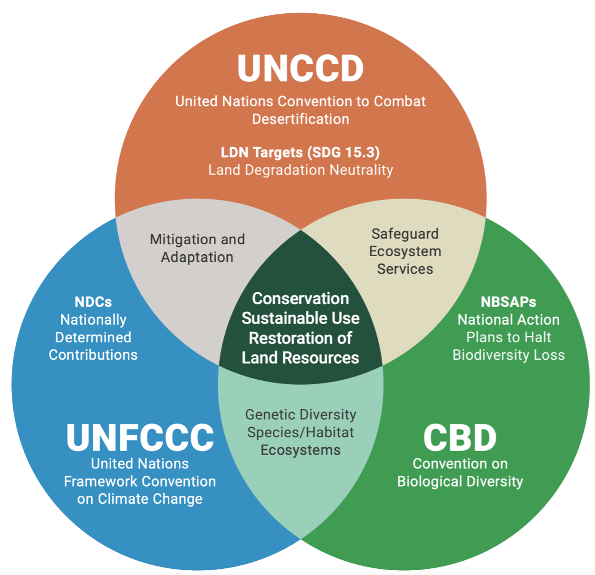
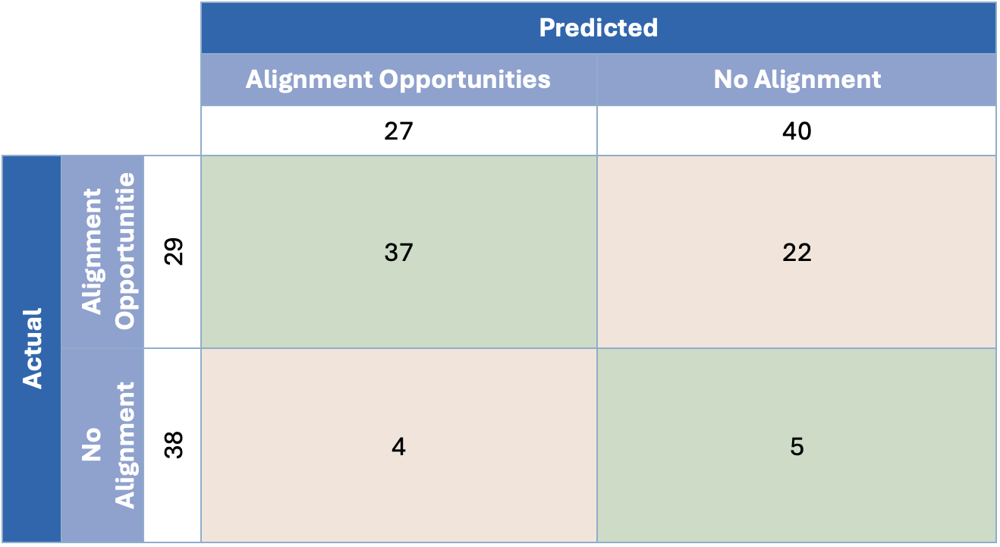

---
params:
  country: Uzbekistan
  date: 23May25
output: 
  officedown::rdocx_document:
    reference_docx: template.docx
    plots:
      style: Normal
      align: center
      topcaption: true
header-includes:
  - \usepackage{floatrow}
  - \floatsetup[figure]{capposition=top}
---

```{r setup_packages, include=FALSE}
# moves away from scientific notation (e-17)
options(scipen = 999)

# mounts packages
pacman::p_load("tidyverse", "knitr", "stringr", "readr", "openxlsx", "writexl", "readxl", # for general data uploading, tweaking, saving, ...
               "ggplot2", "ggpattern", "ggnewscale", "ggpubr", "geomtextpath", "ggbeeswarm", "fmsb", "colorBlindness", # for graphs
               "quanteda", "spacyr", # for NLP
               "officedown", "officer", "flextable", "kableExtra", # for Word output
               "magrittr", "captioner", "rvest", "countries", "glue", "english", # misc
               "igraph", "grDevices") # for network graphs and saving pngs
 # for extras: pipe, extra captions, scraping/wrangling, translating country name, ...
```

```{r setup_script, include=FALSE}
### Officedown/Markdown configurations
# ?
opts_chunk$set(echo = FALSE, 
               fig.cap = TRUE, tab.cap = TRUE)

# table formatting configurations
set_flextable_defaults(font.family = "Calibri", hansi.family = "Calibri", font.size = 9)

# ?
bl_template <- function(txt) {
  block_list(
    fpar(values = txt, fp_t = fp_text_lite(color = "#0001a4", bold = TRUE))
  )
}

# formatting configurations: portrait and landscape orientations, and table of contents
sec_port <- prop_section()
sec_land <- prop_section(page_size = page_size(orient = "landscape"), 
    type = "continuous", page_margins = page_mar(top = 0, right = 0, bottom = 0, left = 0))
sec_toc <- prop_section(type = "continuous", page_margins = page_mar(bottom = 0))

# other formatting configurations
links <- fp_text(color = "#0563C1", underlined = TRUE, font.size = 12, font.family = "Calibri")
links_i <- fp_text(color = "#0563C1", underlined = TRUE, font.size = 9, italic = TRUE, font.family = "Calibri")
footnote <- fp_text(italic = TRUE, font.size = 9, font.family = "Calibri")
section <- fp_text(font.size = 16, bold = TRUE, font.family = "Calibri")
subsection <- fp_text(font.size = 14, bold = TRUE, font.family = "Calibri")
caption1 <- fp_text(font.size = 11, font.family = "Calibri")
caption2 <- fp_text(font.size = 11, font.family = "Calibri", bold = TRUE)
```

\pagenumbering{gobble}

```{r data_import, include = FALSE}
cty <- tolower(gsub(" ", "_", params$country)) # ensures that composite country names are separated by "_"; all are lowercase

# PATHS
path1 <- paste0("./data/countries/", cty)
path2 <- "./data"

# FILES:
# Themes GPT analysis
dta_th <- read.csv(list.files(path = path1, 
                              pattern = "themes.*\\.csv$", full.names = TRUE)) #, encoding = "UTF-8"
# Target-to-Target GPT analysis
dta_tt <- read.csv(list.files(path = path1, 
                              pattern = "targets.*\\.csv$", full.names = TRUE)) 
# Quantitative R analysis
dta_qt <- read.xlsx(paste0(path1, "/", 
                           list.files(path = paste0(path1, "/"), 
                                      pattern = "quantitative.*\\.xlsx$")), sheet = "Quantitative Terms")
# Cleaned country data ()
tgts <- read.xlsx(paste0(path1, "/", 
                         list.files(path = paste0(path1, "/"), pattern = "data.*\\.xlsx$")), 
                  sheet = "targets")
# Themes
dates <- str_replace_all(list.files(path = paste0(path2, "/"), pattern = "themes.*\\.xlsx$"), 
                          c("themes_" = "", ".xlsx" = "")) # finds the most up-to-date Themes file
thms <- read.xlsx(paste0(path2, "/", 
                         list.files(path = path2, pattern = dates[which.max(dmy(dates))])), 
                  sheet = "Themes")
# Summary GPT analysis (green boxes)
sums <- read.csv(list.files(path = path1, 
                              pattern = "summary.*\\.csv$", full.names = TRUE)) 
```

```{r trims, include = FALSE}
# Eliminates leading and lagging (white) spaces
dta_th <- dta_th %>% 
  mutate(Target.Text = str_trim(Target.Text), Target.Name = str_trim(Target.Name), 
         Themes = str_trim(Themes), Texts = str_trim(Texts))

dta_tt <- dta_tt %>% 
  mutate(Target.1.Name = str_trim(Target.1.Name), Target.2.Name = str_trim(Target.2.Name), 
         Theme = str_trim(Theme),
         #Target.1.Theme = str_trim(Target.1.Theme), Target.2.Theme = str_trim(Target.2.Theme), 
         Target.1.Text = str_trim(Target.1.Text), Target.2.Text = str_trim(Target.2.Text), 
         GPT.Alignment.Label = str_trim(GPT.Alignment.Label))

dta_qt <- dta_qt %>% 
  left_join(select(tgts, Target.Name, Target.Text, Document)) %>% 
  mutate(Target.Text = str_trim(Target.Text), Target.Name = str_trim(Target.Name), 
         dates = strsplit(dates, "; "), 
         quants = strsplit(quants, "; ")) %>% 
  mutate(dates = ifelse(is.na(dates), "", dates), 
         quants = ifelse(is.na(quants), "", quants))

tgts <- tgts %>% 
  mutate(Target.Text = str_trim(Target.Text), Target.Name = str_trim(Target.Name))

thms <- thms %>% 
  mutate(Themes = str_trim(Themes), Texts = str_trim(Texts))
```

```{r test1_fix, include = FALSE}
if (params$country == "Uzbekistan" | params$country == "Sri Lanka") {
  dta_th <- dta_th %>% 
    mutate(generated_sample = ifelse(generated_sample == "NAN5", 0, generated_sample))
}
```

```{r test1, include = FALSE}
if (length(setdiff(unique(dta_th$generated_sample), c(0, 1))) != 0) {
  View(filter(dta_th, generated_sample == setdiff(unique(dta_th$generated_sample), c(0, 1))))
  menu(c("Yes", "No"), title = ">> WARNING <<\nOdd GPT restuls (column 'generated_sample')\nCheck above what's going on and make changes in the 'test1_fix' code chunk (above).\nAble to assess everything?")
  #menu(c("Yes", "No"), title = "Have you taken note of this?")
} else {
  message("[√] GPT's outputs seem in order.")
}
```

```{r test2_fix, include = FALSE}
# so far, so good!
```

```{r test2, include = FALSE}
if (length(setdiff(unique(dta_tt$GPT.Alignment.Label), c("No alignment", "Alignment opportunities"))) != 0) {
  View(dta_tt)
  menu(c("Yes", "No"), title = paste0(">> WARNING <<\nOdd GPT results (column 'GPT.Alignment.Label'): ", setdiff(unique(dta_tt$GPT.Alignment.Label), c("No alignment", "Alignment opportunities")), "\nCheck what's going on and make changes in the 'test2_fix' code chunk (above).\nAble to asses everything?"))
  #menu(c("Yes", "No"), title = "Have you taken note of this?")
} else {
  message("[√] GPT's outputs seem in order.")
}
```

```{r coutry_specs1, include = FALSE}
if (params$country == "Uzbekistan") {
  dta_qt <- dta_qt %>% 
    mutate(Document = ifelse(str_detect(Document, ">"), 
                             str_trim(substr(Document, str_locate(Document, ">")+1, nchar(Document))), 
                             Document))
  tgts <- tgts %>% 
    mutate(Document = ifelse(str_detect(Document, ">"), 
                             str_trim(substr(Document, str_locate(Document, ">")+1, nchar(Document))), 
                             Document))
  
  
  dta_th <- dta_th %>% 
    mutate(Themes = ifelse(grepl("^Forest", as.character(Themes)), as.character(thms$Themes[4]), Themes))
  sums <- sums %>% 
    mutate(Theme = ifelse(grepl("^Forest", as.character(Theme)), as.character(thms$Theme[4]), Theme))
  dta_th <- dta_th %>% 
    mutate(Themes = ifelse(grepl("wetlands", as.character(Themes)), as.character(thms$Themes[5]), Themes))
  sums <- sums %>% 
    mutate(Theme = ifelse(grepl("wetlands", as.character(Theme)), as.character(thms$Theme[5]), Theme))
  dta_th <- dta_th %>% 
    mutate(Themes = ifelse(grepl("^Grassland", as.character(Themes)), as.character(thms$Themes[6]), Themes))
  sums <- sums %>% 
    mutate(Theme = ifelse(grepl("^Grassland", as.character(Theme)), as.character(thms$Theme[6]), Theme))
  dta_th <- dta_th %>% 
    mutate(Themes = ifelse(grepl("^Capacity", as.character(Themes)), as.character(thms$Themes[18]), Themes))
  sums <- sums %>% 
    mutate(Theme = ifelse(grepl("^Capacity", as.character(Theme)), as.character(thms$Theme[18]), Theme))
}

if (params$country == "Sri Lanka") {
  dta_th <- dta_th %>% 
    mutate(Themes = ifelse(grepl("^Capacity", as.character(Themes)), as.character(thms$Themes[18]), Themes))
  sums <- sums %>% 
    mutate(Theme = ifelse(grepl("^Capacity", as.character(Theme)), as.character(thms$Theme[18]), Theme))
} else if (params$country == "Namibia") {
  dta_th <- dta_th %>% 
    mutate(Theme = ifelse(grepl("^Soil", as.character(Theme)), as.character(thms$Theme[8]), Theme), 
           Theme = ifelse(grepl("^Capacity", as.character(Theme)), as.character(thms$Theme[18]), Theme))
  sums <- sums %>% 
    mutate(theme = ifelse(grepl("^Soil", as.character(theme)), as.character(thms$Theme[8]), theme), 
           theme = ifelse(grepl("^Capacity", as.character(theme)), as.character(thms$Theme[18]), theme))
} else if (params$country == "Tanzania") {
  sums$Theme[3] <- thms$Theme[18]; #sums$Theme[7] <- thms$Theme[4]; sums$Theme[9] <- thms$Theme[6]; sums$Theme[13] <- thms$Theme[5]
  dta_th <- dta_th %>% 
    mutate(Themes = ifelse(grepl("wetlands", as.character(Themes)), as.character(thms$Theme[5]), Themes), 
           Themes = ifelse(grepl("^Capacity", as.character(Themes)), as.character(thms$Themes[18]), Themes), 
           Target.Name = ifelse(Target.Name == tgts$Target.Name[31] & Target.Text == tgts$Target.Text[31], "Forestry A1", Target.Name), 
           Target.Name = ifelse(Target.Name == tgts$Target.Name[32] & Target.Text == tgts$Target.Text[32], "Forestry A2", Target.Name), 
           Target.Name = ifelse(Target.Name == tgts$Target.Name[33] & Target.Text == tgts$Target.Text[33], "Forestry A3", Target.Name), 
           Target.Name = ifelse(Target.Name == tgts$Target.Name[34] & Target.Text == tgts$Target.Text[34], "Energy A1", Target.Name), 
           Target.Name = ifelse(Target.Name == tgts$Target.Name[35] & Target.Text == tgts$Target.Text[35], "Energy A2", Target.Name), 
           Target.Name = ifelse(Target.Name == tgts$Target.Name[59] & Target.Text == tgts$Target.Text[59], "Energy M1", Target.Name), 
           Target.Name = ifelse(Target.Name == tgts$Target.Name[60] & Target.Text == tgts$Target.Text[60], "Energy M2", Target.Name), 
           Target.Name = ifelse(Target.Name == tgts$Target.Name[61] & Target.Text == tgts$Target.Text[61], "Energy M3", Target.Name), 
           Target.Name = ifelse(Target.Name == tgts$Target.Name[64] & Target.Text == tgts$Target.Text[64], "Forestry M1", Target.Name), 
           Target.Name = ifelse(Target.Name == tgts$Target.Name[65] & Target.Text == tgts$Target.Text[65], "Forestry M2", Target.Name), 
           Target.Name = ifelse(Target.Name == tgts$Target.Name[66] & Target.Text == tgts$Target.Text[66], "Forestry M3", Target.Name), 
           Target.Name = ifelse(Doc == "CCS", paste0(Target.Name, " (CCS)"), Target.Name))
  dta_tt <- dta_tt %>% 
    mutate(Target.1.Name = str_trim(gsub("\\s\\(\\d{1,2}\\)", "", dta_tt$Target.1.Name)), 
           Target.2.Name = str_trim(gsub("\\s\\(\\d{1,2}\\)", "", dta_tt$Target.2.Name)), 
           Theme = ifelse(grepl("wetlands", as.character(Theme)), as.character(thms$Theme[5]), Theme), 
           Theme = ifelse(grepl("^Capacity", as.character(Theme)), as.character(thms$Theme[18]), Theme), 
           #Target.1.Theme = ifelse(grepl("wetlands", as.character(Target.1.Theme)), as.character(thms$Theme[5]), Target.1.Theme), 
           #Target.2.Theme = ifelse(grepl("wetlands", as.character(Target.2.Theme)), as.character(thms$Theme[5]), Target.2.Theme), 
           Target.1.Text = str_trim(str_replace(Target.1.Text, "Â", "")), 
           Target.2.Text = str_trim(str_replace(Target.2.Text, "Â", "")))
  dta_tt <- dta_tt %>% 
    mutate(Target.1.Name = ifelse(Target.1.Name == tgts$Target.Name[31] & Target.1.Text == tgts$Target.Text[31], "Forestry A1", Target.1.Name), 
           Target.1.Name = ifelse(Target.1.Name == tgts$Target.Name[32] & Target.1.Text == tgts$Target.Text[32], "Forestry A2", Target.1.Name), 
           Target.1.Name = ifelse(Target.1.Name == tgts$Target.Name[33] & Target.1.Text == tgts$Target.Text[33], "Forestry A3", Target.1.Name), 
           Target.1.Name = ifelse(Target.1.Name == tgts$Target.Name[34] & Target.1.Text == tgts$Target.Text[34], "Energy A1", Target.1.Name), 
           Target.1.Name = ifelse(Target.1.Name == tgts$Target.Name[35] & Target.1.Text == tgts$Target.Text[35], "Energy A2", Target.1.Name), 
           Target.1.Name = ifelse(Target.1.Name == tgts$Target.Name[59] & Target.1.Text == tgts$Target.Text[59], "Energy M1", Target.1.Name), 
           Target.1.Name = ifelse(Target.1.Name == tgts$Target.Name[60] & Target.1.Text == tgts$Target.Text[60], "Energy M2", Target.1.Name), 
           Target.1.Name = ifelse(Target.1.Name == tgts$Target.Name[61] & Target.1.Text == tgts$Target.Text[61], "Energy M3", Target.1.Name), 
           Target.1.Name = ifelse(Target.1.Name == tgts$Target.Name[64] & Target.1.Text == tgts$Target.Text[64], "Forestry M1", Target.1.Name), 
           Target.1.Name = ifelse(Target.1.Name == tgts$Target.Name[65] & Target.1.Text == tgts$Target.Text[65], "Forestry M2", Target.1.Name), 
           Target.1.Name = ifelse(Target.1.Name == tgts$Target.Name[66] & Target.1.Text == tgts$Target.Text[66], "Forestry M3", Target.1.Name), 
           Target.2.Name = ifelse(Target.2.Name == tgts$Target.Name[31] & Target.2.Text == tgts$Target.Text[31], "Forestry A1", Target.2.Name), 
           Target.2.Name = ifelse(Target.2.Name == tgts$Target.Name[32] & Target.2.Text == tgts$Target.Text[32], "Forestry A2", Target.2.Name), 
           Target.2.Name = ifelse(Target.2.Name == tgts$Target.Name[33] & Target.2.Text == tgts$Target.Text[33], "Forestry A3", Target.2.Name), 
           Target.2.Name = ifelse(Target.2.Name == tgts$Target.Name[34] & Target.2.Text == tgts$Target.Text[34], "Energy A1", Target.2.Name), 
           Target.2.Name = ifelse(Target.2.Name == tgts$Target.Name[35] & Target.2.Text == tgts$Target.Text[35], "Energy A2", Target.2.Name), 
           Target.2.Name = ifelse(Target.2.Name == tgts$Target.Name[59] & Target.2.Text == tgts$Target.Text[59], "Energy M1", Target.2.Name), 
           Target.2.Name = ifelse(Target.2.Name == tgts$Target.Name[60] & Target.2.Text == tgts$Target.Text[60], "Energy M2", Target.2.Name), 
           Target.2.Name = ifelse(Target.2.Name == tgts$Target.Name[61] & Target.2.Text == tgts$Target.Text[61], "Energy M3", Target.2.Name), 
           Target.2.Name = ifelse(Target.2.Name == tgts$Target.Name[64] & Target.2.Text == tgts$Target.Text[64], "Forestry M1", Target.2.Name), 
           Target.2.Name = ifelse(Target.2.Name == tgts$Target.Name[65] & Target.2.Text == tgts$Target.Text[65], "Forestry M2", Target.2.Name), 
           Target.2.Name = ifelse(Target.2.Name == tgts$Target.Name[66] & Target.2.Text == tgts$Target.Text[66], "Forestry M3", Target.2.Name), 
           Target.2.Name = ifelse(Target.2.Policy == "CCS", paste0(Target.2.Name, " (CCS)"), Target.2.Name)) 
  dta_qt <- dta_qt %>% 
    mutate(Target.Name = ifelse(Target.Name == tgts$Target.Name[31] & Target.Text == tgts$Target.Text[31], "Forestry A1", Target.Name), 
           Target.Name = ifelse(Target.Name == tgts$Target.Name[32] & Target.Text == tgts$Target.Text[32], "Forestry A2", Target.Name), 
           Target.Name = ifelse(Target.Name == tgts$Target.Name[33] & Target.Text == tgts$Target.Text[33], "Forestry A3", Target.Name), 
           Target.Name = ifelse(Target.Name == tgts$Target.Name[34] & Target.Text == tgts$Target.Text[34], "Energy A1", Target.Name), 
           Target.Name = ifelse(Target.Name == tgts$Target.Name[35] & Target.Text == tgts$Target.Text[35], "Energy A2", Target.Name), 
           Target.Name = ifelse(Target.Name == tgts$Target.Name[59] & Target.Text == tgts$Target.Text[59], "Energy M1", Target.Name), 
           Target.Name = ifelse(Target.Name == tgts$Target.Name[60] & Target.Text == tgts$Target.Text[60], "Energy M2", Target.Name), 
           Target.Name = ifelse(Target.Name == tgts$Target.Name[61] & Target.Text == tgts$Target.Text[61], "Energy M3", Target.Name), 
           Target.Name = ifelse(Target.Name == tgts$Target.Name[64] & Target.Text == tgts$Target.Text[64], "Forestry M1", Target.Name), 
           Target.Name = ifelse(Target.Name == tgts$Target.Name[65] & Target.Text == tgts$Target.Text[65], "Forestry M2", Target.Name), 
           Target.Name = ifelse(Target.Name == tgts$Target.Name[66] & Target.Text == tgts$Target.Text[66], "Forestry M3", Target.Name), 
           Target.Name = ifelse(Document == "Zanzibar Climate Change Strategy (2012-2030)", paste0(Target.Name, " (CCS)"), Target.Name))
  sums <- sums %>% 
    mutate(Theme = ifelse(grepl("wetlands", as.character(Theme)), as.character(thms$Theme[5]), Theme))
  tgts$Target.Name[31] <- "Forestry A1"; tgts$Target.Name[32] <- "Forestry A2"; tgts$Target.Name[33] <- "Forestry A3"
  tgts$Target.Name[34] <- "Energy A1"; tgts$Target.Name[35] <- "Energy A2"
  tgts$Target.Name[59] <- "Energy M1"; tgts$Target.Name[60] <- "Energy M2"; tgts$Target.Name[61] <- "Energy M3"
  tgts$Target.Name[64] <- "Forestry M1"; tgts$Target.Name[65] <- "Forestry M2"; tgts$Target.Name[66] <- "Forestry M3"
  tgts$Target.Name = ifelse(tgts$Doc == "CCS", paste0(tgts$Target.Name, " (CCS)"), tgts$Target.Name)
}
```

```{r general, include = FALSE}
t_nbt <- "\\bNBTs?\\b|\\bNBSAPs?\\b|\\bNational Biodiversity Targets?\\b|\\bNational Biodiversity Strategies and Action Plans\\b|\\bCBD\\b"
t_ndc <- "NDCs?|\\bNationally Determined Contributions?\\b"

dta_th <- dta_th %>% 
  select(-any_of(c("index", "Country", "index.1", "Textt"))) %>% 
  # ensures Theme and Text column/variables
  rename(Theme = any_of(c("Themes", "Theme")), 
         Text = any_of(c("Texts", "Text"))) %>% 
  # creates "Doc"
  mutate(Doc = case_when(
    str_detect(Document, t_nbt) ~ "NBSAP", 
    str_detect(Document, t_ndc) ~ "NDC", 
    str_detect(Document, "\\bLDNs?\\b|\\bLand Degradation\\b") ~ "LDN", 
    TRUE ~ str_replace_all(Document, "[^A-Z]", ""))) %>% 
  # creates "Type"
  mutate(Type = case_when(
    str_detect(Document, t_nbt) ~ "National Biodiversity Targets", 
    str_detect(Document, t_ndc) ~ "NDC targets", 
    TRUE ~ "Other targets")) %>% 
  mutate(Type = factor(Type, levels = c("National Biodiversity Targets", "NDC targets", "Other targets"))) %>% 
  # removes leading/lagging white spaces and 2+ consecutive white spaces
  mutate(across(c(Target.Name, Target.Text, Doc), ~ gsub("\\s+", " ", as.character(.x)))) %>% 
  # formatting: factor, numeric ...
  mutate(Theme = factor(Theme, unique(Theme)), 
         Doc = factor(Doc, unique(Doc)), 
         generated_sample = as.numeric(generated_sample))

dta_tt <- dta_tt %>% 
  # ensures Name, Theme and Text column/variables
  rename(Target.1.Name = any_of(c("Target.1.Name", "Target.1.Names")), 
         Target.1.Theme = any_of(c("Target.1.Theme", "Target.1.Themes")), 
         Target.1.Text = any_of(c("Target.1.Text", "Target.1.Texts")), 
         Target.2.Name = any_of(c("Target.2.Name", "Target.2.Names")), 
         Target.2.Theme = any_of(c("Target.2.Theme", "Target.2.Themes")), 
         Target.2.Text = any_of(c("Target.2.Text", "Target.2.Texts")))

dta_qt <- dta_qt %>% 
  mutate(Type = case_when(
    str_detect(Document, t_nbt) ~ "National Biodiversity Targets", 
    str_detect(Document, t_ndc) ~ "NDC targets", 
    TRUE ~ "Other targets"), 
    Type = factor(Type, levels(dta_th$Type)))

tgts <- tgts %>% 
  # formatting: factor, numeric ...
  mutate(Doc = factor(Doc, unique(tgts$Doc))) %>% 
  # creates "Type"
  mutate(Type = case_when(
    str_detect(Document, t_nbt) ~ "National Biodiversity Targets", 
    str_detect(Document, t_ndc) ~ "NDC targets", 
    TRUE ~ "Other targets")) %>% 
  mutate(Type = factor(Type, levels(dta_th$Type)))

thms <- thms %>% 
  # formatting: factor, numeric ...
  mutate(Themes = factor(Themes, unique(Themes))) %>% 
  # ensures Theme and Text column/variables
  rename(Theme = any_of(c("Themes", "Theme")))

sums <- sums %>% 
  select(-X) %>% 
  mutate(Theme = factor(Theme, levels = levels(thms$Theme)))
```

```{r test3_fix, include = FALSE}
# so far, so good!
```

```{r test3, include = FALSE}
names <- tgts %>% 
  select(Target.Name, Document) %>% 
  mutate(Target_tokens = strsplit(Target.Name, "\\s+"), 
         Document_tokens = strsplit(Document, "\\s+")) %>% 
  mutate(intersection = map2(Target_tokens, Document_tokens, intersect)) %>% 
  mutate(intersection = sapply(intersection, function(x) paste(sort(x), collapse = "_")))

if (length(unique(names$intersection)) != 0) {
  View(names)
  bummer <- 1
  message(">> WARNING <<\nSome Document names are present in the targets' names.\nDo not correct: this will be automatically fixed in 'country_specs2' code chunk (below); just look at the 'intersection' column.")
  #menu(c("Yes", "No"), title = "Have you taken note of this?")
} else {
  message("[√] Seems like Document names are not contained in the document names.")
  bummer <- 0
}
```

```{r coutry_specs2, include = FALSE}
# concatenates document name, target name and target text
#if (params$country == "Sri Lanka") { # any country that includes the Document name in Target.Name
if (bummer == 1) {
  dta_th <- dta_th %>% 
    mutate('Target.Full' = paste0("**", Target.Name, "**: ", Target.Text))
  dta_qt <- dta_qt %>% 
    mutate('Target.Full' = paste0("**", Target.Name, "**: ", Target.Text))
  tgts <- tgts %>% 
    mutate('Target.Full' = paste0(Target.Name, ": ", Target.Text))
} else { # any country that separates the Document name from the target name
  dta_th <- dta_th %>% 
    mutate('Target.Full' = paste0("**", Doc, " ", Target.Name, "**: ", Target.Text))
  dta_qt <- dta_qt %>% 
    mutate('Target.Full' = paste0("**", Doc, " ", Target.Name, "**: ", Target.Text))
  tgts <- tgts %>% 
    mutate('Target.Full' = paste0(Doc, " ", Target.Name, ": ", Target.Text))
}
```

```{r test5, include = FALSE}
urls <- tgts %>% 
     select(Document, Source) %>% unique()
```

```{r country_specs3, include = FALSE}
if (params$country == "Uzbekistan") {
  tgts <- tgts %>% 
    mutate(Source = ifelse(Document == "BTR1 of", urls$Source[32], Source), 
           Source = ifelse(Document == "CBD Online Reporting Tool", urls$Source[1], Source))
  dta_th <- dta_th %>% 
    mutate(Source = ifelse(Document == "BTR1 of", urls$Source[32], Source), 
           Source = ifelse(Document == "CBD Online Reporting Tool", urls$Source[1], Source))
 }
```


::: {custom-style="intro_topics"}
About UNDP
:::

::: {custom-style="Text"}
UNDP is the leading United Nations organization fighting to end the injustice of poverty, inequality, and climate change. Working with our broad network of experts and partners in 170 countries, we help nations to build integrated, lasting solutions for people and planet. Learn more at undp.org or follow at @UNDP.
:::

<br>

::: {custom-style="intro_topics"}
About UNDP's Climate Promise
:::

::: {custom-style="Text"}
UNDP’s Climate Promise is the UN system’s largest portfolio of support on climate action, working with more than 140 countries and territories and directly benefiting 37 million people. This portfolio implements over US$2.3 billion in grant financing and draws on UNDP’s expertise in adaptation, mitigation, carbon markets, climate and forests, and climate strategies and policy. Visit our website at climatepromise.undp.org and follow us on Twitter at @UNDPClimate.
:::

<br>

::: {custom-style="intro_topics"}
About UNDP's Nature Pledge
:::

::: {custom-style="Text"}
The UNDP’s Nature Pledge represents a commitment to upscale support to over 140 countries to reach their ambitious targets and goals under the Global Biodiversity Framework and the Sustainable Development Goals. The Nature Pledge focuses on three system shifts: a Value Shift; an Economic and Finance Shift; and a Policy and Practice Shift. These shifts are essential to halt biodiversity loss and to secure a planetary safety net for humanity. Visit our website at undp.org/nature/nature-pledge.
:::

<br>

::: {custom-style="intro_topics"}
About this report
:::

::: {custom-style="Text"}
This report was co-developed by UNDP’s Nature Hub and Climate Hub in collaboration with other UNDP teams and partner organizations. If this draft report is shared in a final form, please include credit to the Global Environment Facility (GEF), as a key donor.
:::

<br>

::: {custom-style="intro_topics"}
UN disclaimer
:::

::: {custom-style="Text"}
The views expressed in this report are those of the authors and do not necessarily represent those of the United Nations, including the UN Development Programme, or UN Member States.
:::

\newpage

::: {custom-style="extra"}
**TABLE OF CONTENTS**
:::

```{r toc, echo=FALSE}
# inserts Table of Contents
block_toc(level = 6)
```

```{r toc_formating}
# portrait orientation, hitherto (specific margins)
block_section(sec_toc)
```

# Introduction {#sec1}

## Goals of the Alignment Assessment {#sec11}

<br>

```{r docs, include = FALSE}
documents <- (select(tgts, Document, Doc, Source) %>% unique())$Document
docs <- (select(tgts, Document, Doc, Source) %>% unique())$Doc
refs <- (select(tgts, Document, Doc, Source) %>% unique() %>% 
           mutate(Source = ifelse(is.na(Source), "", Source)))$Source

txt_documents <- ""
for (i in 1:length(documents)) {
  txt_documents <- paste0(txt_documents, documents[i], ifelse(i == length(documents)-1, ", and ", ", "))
}
txt_documents <- substr(txt_documents, 1, nchar(txt_documents)-2)

txt_docs <- ""
for (i in 1:length(docs)) {
  txt_docs <- paste0(txt_docs, docs[i], ifelse(i == length(docs)-1, ", and ", ", "))
}
txt_docs <- substr(txt_docs, 1, nchar(txt_docs)-2)

txt_docss <- ""
for (i in 1:length(docs)) {
  txt_docss <- paste0(txt_docss, docs[i], ifelse(i == length(docs)-1, ", or ", ", "))
}
txt_docss <- substr(txt_docss, 1, nchar(txt_docss)-2)

txt_docdoc <- ""
for (i in 1:length(documents)) {
  txt_docdoc <- paste0(txt_docdoc, ifelse(refs[i] == '', '"', '[`r ftext("'), documents[i], ifelse(refs[i] == "", '"', '", links)`]('), refs[i], ifelse(refs[i] == "", ' (', ') ('), docs[i], ifelse(i == length(docs)-1, '), and ', '), '))
}
txt_docdoc <- substr(txt_docdoc, 1, nchar(txt_docdoc)-2)
```


::: {custom-style="Text"}
This **Pilot Nature-Climate Alignment Assessment** is developed through Artificial Intelligence (AI) to support `r params$country` in evaluating the alignment between nature and climate targets at the national level. Bringing together expertise across the UNDP Nature Hub, Climate Hub, and pilot countries, the methodology seeks to uncover similarities, locate nature-based solutions, identify quantitative information, and provide a starting point for decision-making towards policy coherence. Targets from many different country policies, shared by `r params$country` form the basis for the analysis (**\@ref(anx1)**).

<br>

The **Nature-Climate Alignment Assessment** offers four custom national analysis:
:::

::: {custom-style="bullet-point"}
-   **Locate Nature-Based Solutions**: Analyze the integration of nature-based solutions within national climate and biodiversity targets.

-   **Identify Thematic Overlaps**: Assess common cross-cutting themes across targets.

-   **Evaluate Target-Level Similarities**: Pinpoint specific targets across biodiversity and climate policies show opportunities for greater alignment.

-   Assess **Quantitative Information**: Provide information quantitative and time-bound elements of targets, such as “protect 30% of biodiversity” or “achieve by 2030”.
:::

<br>

::: {custom-style="Text"}
The pilot results are intended to provide Parties with guiding information towards:
:::

::: {custom-style="bullet-point"}
-   **Enhancing Policy Coherence**: Providing actionable insights for aligning nature and climate targets, as well as other targets a country may find relevant.

-   **Fostering Stakeholder Engagement**: Supporting inclusive and participatory processes and strengthening inter-institutional coordination, pursuing whole-of-government and society approaches.
:::

<br>

::: {custom-style="Text"}
Given that this assessment is produced, through AI, it is bound by certain limitations (**Table 1.\@ref(tab:tbl1)**). Countries are strongly encouraged to use these results as a conversation starter rather than prescriptive stand-alone analysis. It is recommended to carefully review results with relevant stakeholders and consider them alongside other types of nationally validated analysis and desk reviews. As part of the pilot process, and to ensure a human-centered approach, `r params$country` is invited to provide feedback on the methodology and the presentation of the results through an [`r ftext("open survey", links)`](https://forms.office.com/Pages/ResponsePage.aspx?id=Xtvls0QpN0iZ9XSIrOVDGWNp7QxCnxtBnoa-dEHQqQxUMlIxV0FOSzdWTkFCMUJFTFFFMFc4UFNURy4u). This will support further refinements to scale up the approach to support all interested countries to align their policy targets.
:::

\newpage

```{r tbl1, echo = FALSE, tab.dim = c(6, 6), tab.cap="Benefits and limitations of the pilot assessment", tab.id="tbl1", tab.cap.pre="Table 1.", tab.lp="sec1"}
# tab.autonum.start_at=1, 
tbl <- data.frame(can = c("Provide an initial analysis of target alignment that a country can then validate using national sources or input", "Serve as resource that Parties can elect to consider in their stakeholder engagement processes, based on need and capacity", "Inform country-led process to align national targets and support subsequent development and implementation of various plans", "Provide a baseline information that a country can then compare with future assessments using the same methodology", "Assess alignment between diverse targets of a country’s choosing pertaining to nature, climate, and land"), 
                  cant = c("Provide fully validated, definitive scores on target alignment that consider national circumstances, baselines, or capabilities", "Make definitive judgments on a country's alignment and determine which national targets should be revised or updated", "Replace national target alignment and planning processes", "Replace or qualify COP Decisions", "Assess entire documents, headline indicators, financial mechanisms, or other topics"))
colnames(tbl) <- c("What the assessment can do", "What the assessment cannot do")

tbl %>% flextable(cwidth = c(3, 3)) %>% 
  bg(part = "header", j = 1:2, bg = "#d3e1f1") %>% 
  color(part = "header", j = 1:2, color = "black") %>%
  bold(part = "header") %>% 
  hline(part = "all") %>% 
  valign(valign = "top") %>% 
  align(align = "justify")
```

\newpage

## Background {#sec12}

<br>

::: {custom-style="Text"}
Climate change, biodiversity loss, and desertification are interlinked crises that require integrated action. Ecosystem health depends on stable climate conditions. Climate change is one of the major drivers of biodiversity loss and land degradation, with anthropogenic climate-induced warming potentially threatening as many as one in six species of flora and fauna around the globe, according to [`r ftext("Intergovernmental Science-Policy Platform on Biodiversity and Ecosystem Services (IPEBS)", links)`](https://www.ipbes.net/models-drivers-biodiversity-ecosystem-change). Biodiversity is also a critical part of the solution to climate change. Nature-based solutions, such as reforestation, coastal restoration, and soil management, can help counteract human-caused greenhouse gas (GHG) emissions and provide over [`r ftext("30% of the solution needed", links)`](https://www.pnas.org/doi/10.1073/pnas.1710465114#supplementary-materials) to ensure global warming does not increase 2 degree Celsius above pre-industrial levels. According to the [`r ftext("Sixth Assessment Report (AR6)", links)`](https://www.ipcc.ch/assessment-report/ar6/) of the Intergovernmental Panel on Climate Change (IPCC), our success in limiting climate change is dependent on enhanced mitigation from the Agriculture, Forestry, and Other Land Use (AFOLU) sector, which accounts for roughly 22% of global GHG emissions.

<br> 

The UN Framework Convention on Climate Change (UNFCCC), the UN Convention on Biological Diversity (CBD), and the UN Convention to Combat Desertification (UNCCD) aim to address climate change, conserve biodiversity, and promote sustainable land management. These are often called the ‘Rio Conventions’ because they were established during the Earth Summit in Rio de Janeiro in 1992. The conventions and their frameworks reflect the value of integrated action for nature, climate, and land. More information on the synergies between these conventions can be found in **\@ref(anx2)**.
:::

<br>

::: {custom-style="Text"}
Through integrated planning and implementation of national policy instruments such as National Biodiversity Strategies and Action Plans (NBSAPs) for the CBD, Nationally Determined Contributions (NDCs) and National Adaptation Plans (NAPs) for the UNFCCC, and Land Degradation Neutrality (LDN) targets for the UNCCD, countries can optimize resources and ensure coherent approaches to global nature, climate, and land crises. Cohesive policies across sectors can also streamline reporting and enhance transparency.  

<br>

Converging timelines in 2024 and 2025 for national planning towards the Rio Conventions present a unique window to align nature and climate policies. Although NBSAPs, updated in line with the KMGBF, were requested by the CBD COP16 in 2024, many countries are still developing these documents into 2025. Similarly, while countries were requested to submit NDCs 3.0 to the Secretariat of the UNFCCC by February 2025, some countries plan to finalize by the end of 2025. These intersecting timeframes can facilitate harmonized efforts towards planning across conventions. However, despite the fact that [`r ftext("153 out of 198 Parties have national focal points for two or all three Rio Conventions within the same ministry", links)`](https://unfccc.int/sites/default/files/resource/Infobrief%202_design%20a.pdf), planning processes can often be siloed and overlook the importance of synergies, resulting in fragmented efforts and missed opportunities for integrated action.  

<br>

Given the urgency for rapid action, AI can provide a helpful starting point for discussion and planning among decision-makers. When applied through a human-centered approach, AI can democratize access to cutting-edge analytics and empower a broader range of stakeholders. In 2024, over 50 countries piloted the use of AI to conduct assessments of alignment between their national and global biodiversity targets to achieve CBD commitments. Developed by UNDP under the Early Action Support Project and funded by the Global Environment Facility, [`r ftext("NBSAP Target Similarity Assessments", links)`](https://www.undp.org/publications/leveraging-artificial-intelligence-enhance-early-action-towards-kunming-montreal-global-biodiversity-framework) offer customized insights on synergies between national biodiversity targets and the KM-GBF targets. These assessments also provide recommendations for enhanced alignment to bring about a transformation in our societies’ relationship with biodiversity by 2030. UNDP is now building on this original methodology to support countries in developing assessments of alignment between their national policy targets. This also links with ongoing work to support countries with their NDC revision and NBSAP update processes through UNDP's Nature Hub and Climate Hub.

<br>

For this assessment, countries were invited to share the national policy targets that they consider most relevant for analysis, including those related to NBSAPs, NDC, NAPs, and LDN targets, in addition to other national plans. In this case, the term “target” is used as an umbrella term for any type of concise national objective or aim that strives to support achievement of the Rio Conventions, as well as any other goals that a country deems relevant. Often a target may have a quantitative element, such as “Restore ***60%*** of degraded forest, wetland, and coastal ecosystems ***by 2030*** to enhance biodiversity and carbon sequestration.” However, this is not the case for all targets. Given that the guidelines for national planning towards the Rio Conventions differ greatly, there may be great variability in how countries choose to define their targets for this assessment.
:::

\newpage

# Snapshot of Alignment Results for `r params$country` {#sec2}

::: {custom-style="Text"}
This section provides an overview of the primary findings from the analysis on targets from `r params$country`'s `r txt_docdoc`. These targets were identified by the UNDP Country Office and can be found in **\@ref(anx1)**, form the bases for the analysis. Key insights include areas of alignment, gaps, and opportunities for policy coherence.  
:::

```{r themes, include=FALSE}
dta_th <- dta_th %>% 
  select(-c("Target.Textt", "Target.Name", "Document", "Target.Text", "Text"))

tgt_cnt <- tgts %>% 
  select(Type, Target.Name) %>% # Doc>Type
  unique() %>% 
  mutate(Cnt = 1) %>% 
  group_by(Type) %>% # Doc>Type
  summarise(Count = sum(Cnt)) %>% 
  ungroup() %>% 
  arrange(Type)
```

```{r aux0, include=FALSE}
#colours <- c("#F1BF42", "#5DA2ED", "#7E57C2") # "#2A9D8F"
#colours <- PairedColor12Steps[c(2, 6, 11)] 
#"#FFBF7F" "#FF7F00" "#FFFF99" "#FFFF32" "#B2FF8C" "#32FF00" "#A5EDFF" "#19B2FF" "#CCBFFF" "#654CFF" "#FF99BF" X"#E51932"X
#colours <- c("#4059AD", "#6B9AC4", "#97D8C4", "#EFF2F1", "#F4B942")[c(2, 5, 1)]
colours <- c("#5395DC", "#EBBD3F", "#7251B5")
names(colours) <- levels(dta_th$Type)

colours_rad <- adjustcolor(colours, alpha.f = 0.3)

lines <- c(1, 3, 6) # 1. solid 2 dashed 3 dotted 4 dotdashed 5 longdash 6 twodash
```

<br>

## Nature-based solutions {#sec21}

::: {custom-style="Text"}
This analysis focused on `r if (table(thms$Area)["NbS"] < 10) {as.character(as.english(table(thms$Area)["NbS"]))} else {table(thms$Area)["NbS"]}` categories of nature-based solutions that may be pertinent for consideration:
:::

```{r nbs, include=FALSE, results='asis'}
txt_nbs <- ""
for (i in 1:table(thms$Area == "NbS")[["TRUE"]]) {
  txt_nbs <- paste0(txt_nbs, "-   ", thms$Theme[i], "\n\n")
}
rm(i)
```

<br>

::: {custom-style="bullet-point"}
`r txt_nbs`
:::

<br>

::: {custom-style="Text"}
At the recommendation of a UNDP working group, consisting of representatives from the Nature and Climate Hubs, these `r table(thms$Area)["NbS"]` nature-based solutions categories were identified from the [`r ftext("IPCC Special Report on Climate Change and Land", links)`](https://www.ipcc.ch/srccl/chapter/summary-for-policymakers/) and [`r ftext("Natural Climate Solutions", links)`](https://www.pnas.org/doi/10.1073/pnas.1710465114) by Griscom et al. Descriptions of these categories can be found in **Section \@ref(sec31)** and **\@ref(anx3)**.
:::

```{r nbs_themes, include=FALSE, warning=FALSE}
nbs_cnt <- dta_th %>% 
  left_join(thms %>% select(Theme, Area)) %>% 
  filter(Area == "NbS") %>% 
  select(Type, Target.Full, generated_sample) %>% # Doc>Type
  group_by(Type, Target.Full) %>% # Doc>Type
  summarise(Count = sum(generated_sample)) %>% 
  filter(Count != 0) %>% 
  ungroup()

tgt_cnt <- tgt_cnt %>% 
  left_join(nbs_cnt %>% 
              mutate(Theme = 1) %>% 
              select(-c(Target.Full, Count)) %>% 
              group_by(Type) %>% # Doc>Type
              summarise(NbS = sum(Theme)) %>% 
              ungroup()) %>% 
  mutate(across(everything(), ~replace_na(.x, 0)))

txt_nbs_cnt <- ""
for (i in 1:dim(tgt_cnt)[1]){
  txt_nbs_cnt <- paste0(txt_nbs_cnt, "-   **", tgt_cnt$NbS[i], " of ", tgt_cnt$Count[i], " ", tgt_cnt$Type[i], " (", round(100*tgt_cnt$NbS[i]/tgt_cnt$Count[i], 0), "%)**\n\n") # Doc>Type
}
rm(i)
```

<br>

::: {custom-style="Text"}
For this assessment report, `r params$country`'s `r if (nrow(tgts) < 10) {as.character(as.english(nrow(tgts)))} else {nrow(tgts)}` targets from `r if (length(docs) < 10) {as.character(as.english(length(docs)))} else {length(docs)}` strategic documents were analyzed against these categories and their descriptions. Through comparing these, the AI model identified that `r if (sum(tgt_cnt$NbS) < 10) {as.character(as.english(sum(tgt_cnt$NbS)))} else {sum(tgt_cnt$NbS)}` of `r params$country`'s `r if (nrow(tgts) < 10) {as.character(as.english(nrow(tgts)))} else {nrow(tgts)}` targets appear to pertain to at least one nature-based solution category:
:::

<br>

::: {custom-style="bullet-point"}
`r txt_nbs_cnt`
:::

```{r aux1, include=FALSE}
fig1 <- dta_th %>% 
  left_join(thms %>% select(Theme, Area)) %>% 
  filter(Area == "NbS") %>% 
  select(Type, Theme, generated_sample) %>% # Doc>Type
  group_by(Type, Theme) %>% # Doc>Type
  summarise(Count = sum(generated_sample)) %>% 
  ungroup()

#fig1$Type <- fct_rev(fig1$Type) # Doc>Type
fig1$Theme <- str_wrap(fig1$Theme, width = 20) # ensures axis text is not messy

aux1 <- fig1 %>% 
  select(-Type) %>% # Doc>Type
  group_by(Theme) %>% 
  summarise(Count = sum(Count)) %>% 
  ungroup() %>% 
  arrange(desc(Count)) %>% 
  mutate(Theme = gsub("\n", " ", Theme))

txt_fig1_max <- "The most common categories of nature-based solutions detected among the country's targets appear to be"
for (j in 1:length(filter(aux1, Count >= nth(aux1$Count, 2))$Count)) {
  txt_fig1_max <- paste0(txt_fig1_max, " ", aux1$Theme[j], " (", ifelse(aux1$Count[j] == 0, "no", if (aux1$Count[j] < 10) {as.character(as.english(aux1$Count[j]))} else {aux1$Count[j]}), " ", ifelse(aux1$Count[j] == 1, "target), ", "targets),"), ifelse(length(filter(aux1, Count >= nth(aux1$Count, 2))$Count)-1 == j, " and", ""))
}
txt_fig1_max <- gsub(",$", "", txt_fig1_max)

aux1 <- aux1 %>% 
  arrange(Count)

txt_fig1_min <- "The categories that were the least frequently detected were"
for (i in 1:length(filter(aux1, Count <= nth(aux1$Count, 2))$Count)) {
  txt_fig1_min <- paste0(txt_fig1_min, " ", aux1$Theme[i], " (", ifelse(aux1$Count[i] == 0, "no", if (aux1$Count[i] < 10) {as.character(as.english(aux1$Count[i]))} else {aux1$Count[i]}), " ", ifelse(aux1$Count[i] == 1, "target), ", "targets),"), ifelse(length(filter(aux1, Count <= nth(aux1$Count, 2))$Count)-1 == i, " and", ""))
}
txt_fig1_min <- gsub(",$", "", txt_fig1_min)
```

<br>

::: {custom-style="Text"}
`r txt_fig1_max`. `r txt_fig1_min`. The results are described further in **Figures 2.\@ref(fig:fig1)** and **2.\@ref(fig:fig2)**, and more information, including opportunities for further alignment between targets, can be found in **Section \@ref(sec31)**.
:::

<br>

```{r fig1, echo=FALSE, warning=FALSE, fig.align="center", fig.width=6, fig.height = 8, fig.retina=10, fig.cap = "Number of national targets that appear to pertain to each of the nature-based solution categories", fig.id="fig1", fig.cap.pre="Figure 2.", fig.lp="sec2"}
# tab.autonum.start_at=1, 
ggplot(fig1, aes(fill = Type, y = reorder(Theme, Count), x = Count)) + # Doc>Type
  geom_bar(position = position_stack(reverse = TRUE), stat = "identity") + 
  ylab("Nature-based solution categories") + xlab("Number of potentially relevant targets") + 
  scale_fill_manual(values = colours) + 
  scale_x_continuous(breaks = seq(0, max((select(fig1, -Type) %>% # Doc>Type
                                                       group_by(Theme) %>% 
                                                       summarise(Count = sum(Count)))$Count), 
                                             by = 2)) + 
  labs(fill = "") + 
  theme_minimal() + 
  theme(panel.grid.major.y = element_blank(), panel.grid.minor.y = element_blank(), 
        panel.grid.minor.x = element_blank(), 
        axis.title.x = element_text(face = "bold", size = 8), axis.text.x = element_text(size = 7),
        axis.title.y = element_text(face = "bold", size = 8), axis.text.y = element_text(size = 7),
        legend.title = element_text(face = "bold", size = 8), legend.text = element_text(size = 7), 
        legend.position = "bottom")
```

<br>

```{r aux2, include=FALSE}
fig2 <- fig1 %>% 
  pivot_wider(values_from = Count, names_from = Theme)

fig2_max <- data.frame(t(c("Max", rep(max(fig1$Count), ncol(fig2)-1))), 
                       stringsAsFactors = FALSE)
colnames(fig2_max) <- colnames(fig2)

fig2_min <- data.frame(t(c("Min", rep(0, ncol(fig2)-1))), 
                       stringsAsFactors = FALSE)
colnames(fig2_min) <- colnames(fig2)

fig2 <- rbind(fig2_max, fig2_min, fig2)
fig2[ , 2:ncol(fig2)] <- lapply(fig2[ , 2:ncol(fig2)], function(x) as.numeric(as.character(x)))

rownames(fig2) <- fig2[[1]]
fig2 <- fig2[ , -1]

colnames(fig2) <- str_wrap(colnames(fig2), width = 20) # ensures axis text is not messy
```

::: {custom-style="Text"}
**Figure 2.\@ref(fig:fig2)** illustrates how well each type of target covers the key themes. A larger area within the chart indicates broader thematic coverage. The findings are the same as **Figure 2.\@ref(fig:fig1)** but provide an additional way to visualize the relationships between targets.
:::

<br>
 
```{r fig2, echo=FALSE, warning=FALSE, fig.align="center", fig.width=6, fig.height = 6, fig.retina=8, fig.cap = "Distribution of national targets across the nature-based solution categories", fig.id="fig2", fig.cap.pre="Figure 2.", fig.lp="sec2"}
# tab.autonum.start_at=1, 
op <- par(mar = c(2, 2, 1, 2), # BLTR
          oma = c(0, 0, 0, 0), # BLTR 
          xpd=TRUE)

radarchart(fig2, 
           axistype = 1, # adds numbers to background
           caxislabels = round(quantile(c(0, fig2["Max",1])), 0), # adds numbers to background
           axislabcol = "grey55", # adds numbers to background
           cglty = 1, # Grid line type
           cglcol = "gray", # Grid line color
           pcol = colours, # Color for each line
           plwd = 1, # Width for each line
           plty = lines, # Line type for each line
           pty = 32, #
           pfcol = colours_rad, # Color of the areas
           vlcex = 0.7) # "x-axis" text font size

legend("bottom", inset = c(0, -0.05), horiz = TRUE,
       legend = levels(fig1$Type), # Doc>Type
       bty = "n", fill = colours,
       text.col = "grey25", pt.cex = 2, 
       cex = 0.8, 
       x.intersp = 0.5, 
       text.width = c(0.85, 0.35, 0.25))

par(op, xpd=NA)
```

<br>

## Cross-cutting themes {#sec22}

::: {custom-style="Text"}
In addition, `r params$country`'s `r if (nrow(tgts) < 10) {as.character(as.english(nrow(tgts)))} else {nrow(tgts)}` targets were analyzed against `r if (table(thms$Area)["Additional"] < 10) {as.character(as.english(table(thms$Area)["Additional"]))} else {table(thms$Area)["Additional"]}` cross-cutting themes. These themes were identified through a working group with the UNDP Climate and Nature Hubs, as well as conversations with countries and represent common elements across policies that can stimulate stakeholder conversations towards stronger alignment. 
:::

```{r cross, include=FALSE}
txt_cross <- ""
for (i in (table(thms$Area == "NbS")[["TRUE"]]+1):dim(thms)[1]) {
  txt_cross <- paste0(txt_cross, "-   ", thms$Theme[i], "\n\n")
}
rm(i)
```

<br>

::: {custom-style="bullet-point"}
`r txt_cross`
:::

```{r cross_themes, include=FALSE, warning=FALSE}
cross_cnt <- dta_th %>% 
  left_join(thms %>% select(Theme, Area)) %>% 
  filter(Area == "Additional") %>% 
  select(Type, Target.Full, generated_sample) %>% # Doc>Type
  group_by(Type, Target.Full) %>% # Doc>Type
  summarise(Count = sum(generated_sample)) %>% 
  filter(Count != 0) %>% 
  ungroup()

tgt_cnt <- tgt_cnt %>% 
  left_join(cross_cnt %>% 
              mutate(Theme = 1) %>% 
              select(-c(Target.Full, Count)) %>% 
              group_by(Type) %>% # Doc>Type
              summarise(Cross = sum(Theme)) %>% 
              ungroup()) %>% 
  mutate(across(everything(), ~replace_na(.x, 0)))

txt_cross_cnt <- ""
for (i in 1:dim(tgt_cnt)[1]){
  txt_cross_cnt <- paste0(txt_cross_cnt, "-   **", tgt_cnt$Cross[i], " of ", tgt_cnt$Count[i], " ", tgt_cnt$Type[i], " (", round(100*tgt_cnt$Cross[i]/tgt_cnt$Count[i], 0), "%)**\n\n") # Doc>Type
}
rm(i)
```

<br>

::: {custom-style="Text"}
_Note that countries are encouraged to propose additional themes that could be included for assessment._

<br>

By comparing the national targets with these cross-cutting themes, the AI model identified that `r sum(tgt_cnt$Cross) ` of `r params$country`'s `r nrow(tgts)` appear to pertain to at least one theme:
:::

<br>

::: {custom-style="bullet-point"}
`r txt_cross_cnt`
:::

```{r aux3, include=FALSE}
fig3 <- dta_th %>% 
  left_join(thms %>% select(Theme, Area)) %>% 
  filter(Area == "Additional") %>% 
  select(Type, Theme, generated_sample) %>% # Doc>Type
  group_by(Type, Theme) %>% # Doc>Type
  summarise(Count = sum(generated_sample)) %>% 
  ungroup()

#fig3$Type <- fct_rev(fig3$Type) # # Doc>Type
fig3$Theme <- str_wrap(fig3$Theme, width = 20) # ensures axis text is not messy

aux3 <- fig3 %>% 
  select(-Type) %>% # Doc>Type
  group_by(Theme) %>% 
  summarise(Count = sum(Count)) %>% 
  ungroup() %>% 
  arrange(desc(Count)) #%>% 
  #mutate(Theme = gsub("\n", " ", Theme))

txt_fig3_max <- paste0("Across the targets provided by ", params$country, ", the themes of ")
for (j in 1:length(filter(aux3, Count >= nth(aux3$Count, 2))$Count)) {
  txt_fig3_max <- paste0(txt_fig3_max, " ", aux3$Theme[j], " (", ifelse(aux3$Count[j] == 0, "no", if (aux3$Count[j] < 10) {as.character(as.english(aux3$Count[j]))} else {aux3$Count[j]}), " ", ifelse(aux3$Count[j] == 1, "target), ", "targets),"), ifelse(length(filter(aux3, Count >= nth(aux3$Count, 2))$Count)-1 == j, " and", ""))
}
txt_fig3_max <- gsub(",$", "", txt_fig3_max)

aux3 <- aux3 %>% 
  arrange(Count)

txt_fig3_min <- "while the themes of"
for (i in 1:length(filter(aux3, Count <= nth(aux3$Count, 2))$Count)) {
  txt_fig3_min <- paste0(txt_fig3_min, " ", aux3$Theme[i], " (", ifelse(aux3$Count[i] == 0, "no", if (aux3$Count[i] < 10) {as.character(as.english(aux3$Count[i]))} else {aux3$Count[i]}), " ", ifelse(aux3$Count[i] == 1, "target), ", "targets),"), ifelse(length(filter(aux3, Count <= nth(aux3$Count, 2))$Count)-1 == i, " and", ""))
}
txt_fig3_min <- gsub(",$", "", txt_fig3_min)
```

<br>

::: {custom-style="Text"}
`r txt_fig3_max` appear most frequently `r txt_fig3_min` are less frequent. 

<br>

The results are described in **Figures 2.\@ref(fig:fig1)** and **2.\@ref(fig:fig2)**, where the colors indicate whether relevant targets are national biodiversity targets, NDC targets or come from other policy documents. Section **\@ref(sec32)** of this document provides more information on these themes and identifies potential opportunities for further target alignment.
:::

```{r fig3, echo=FALSE, warning=FALSE, fig.align="center", fig.width=6, fig.height = 4.75, fig.retina=8, fig.cap = "Number of national targets that appear to pertain to each of the cross-cutting themes", fig.id="fig3", fig.cap.pre="Figure 2.", fig.lp="sec2"}
# tab.autonum.start_at=1, 
ggplot(fig3, aes(fill = Type, y = reorder(Theme, Count), x = Count)) + # Doc>Type
  geom_bar(position = position_stack(reverse = TRUE), stat = "identity") + 
  ylab("Cross-cutting themes") + xlab("Number of potentially relevant targets") + 
  scale_fill_manual(values = colours) + 
  scale_x_continuous(breaks = seq(0, max((select(fig3, -Type) %>% # Doc>Type
                                                       group_by(Theme) %>% 
                                                       summarise(Count = sum(Count)))$Count), 
                                             by = 2)) + 
  labs(fill = "") + 
  theme_minimal() + 
  theme(panel.grid.major.y = element_blank(), panel.grid.minor.y = element_blank(), 
        panel.grid.minor.x = element_blank(), 
        axis.title.x = element_text(face = "bold", size = 8), axis.text.x = element_text(size = 7),
        axis.title.y = element_text(face = "bold", size = 8), axis.text.y = element_text(size = 7),
        legend.title = element_text(face = "bold", size = 8), legend.text = element_text(size = 7), 
        legend.position = "bottom")
```

<br>

::: {custom-style="Text"}
**Figure 2.\@ref(fig:fig4)** illustrates how well each type of target covers the cross-cutting themes. A larger area within the chart indicates broader thematic coverage. The findings are the same as **Figure 2.\@ref(fig:fig3)** but provide an additional way to visualize the relationships between targets.
:::

```{r aux4, include=FALSE}
fig4 <- fig3 %>% 
  pivot_wider(values_from = Count, names_from = Theme)

fig4_max <- data.frame(t(c("Max", rep(max(fig3$Count), ncol(fig4)-1))), 
                       stringsAsFactors = FALSE)
colnames(fig4_max) <- colnames(fig4)

fig4_min <- data.frame(t(c("Min", rep(0, ncol(fig4)-1))), 
                       stringsAsFactors = FALSE)
colnames(fig4_min) <- colnames(fig4)

fig4 <- rbind(fig4_max, fig4_min, fig4)
fig4[ , 2:ncol(fig4)] <- lapply(fig4[ , 2:ncol(fig4)], function(x) as.numeric(as.character(x)))

rownames(fig4) <- fig4[[1]]
fig4 <- fig4[ , -1]

colnames(fig4) <- str_wrap(colnames(fig4), width = 20) # ensures axis text is not messy
```

```{r fig4, echo=FALSE, warning=FALSE, fig.align="center", fig.width=6, fig.height = 6, fig.retina=6, fig.cap = "Distribution of national targets across the cross-cutting themes", fig.id="fig4", fig.cap.pre="Figure 2.", fig.lp="sec2"}
# tab.autonum.start_at=1, 
op <- par(mar = c(0, 2, 0, 2), # BLTR
          oma = c(0, 0, 0, 0), # BLTR 
          xpd=TRUE)

radarchart(fig4, 
           axistype = 1, # adds numbers to background
           caxislabels = round(quantile(c(0, fig4["Max",1])), 0), # adds numbers to background
           axislabcol = "grey55", # adds numbers to background
           cglty = 1, # Grid line type
           cglcol = "gray", # Grid line color
           pcol = colours, # Color for each line
           plwd = 1, # Width for each line
           plty = lines, # Line type for each line
           pty = 32, #
           pfcol = colours_rad, # Color of the areas
           vlcex = 0.7) # "x-axis" text font size

legend("bottom", horiz = TRUE, 
       legend = levels(fig3$Type), # Doc>Type
       bty = "n", fill = colours,
       text.col = "grey25", pt.cex = 2, 
       cex = 0.8, 
       x.intersp = 0.5, 
       text.width = c(0.85, 0.35, 0.25))

par(op, xpd=NA)
```

<br>

## Opportunities for alignment{#sec23}

```{r aux5, include = FALSE}
conv_docs <- dta_th %>% 
  select(Convention, Doc) %>% 
  unique()

txts_conv <- list()
for (i in 1:length(unique(conv_docs$Convention))) {
  tmp <- unique(conv_docs$Convention)[i]
  tmpp <- " ("
  for (j in 1:nrow(filter(conv_docs, Convention == unique(conv_docs$Convention)[i]))) {
    tmpp <- paste0(tmpp, filter(conv_docs, Convention == unique(conv_docs$Convention)[i])$Doc[j], 
                   ifelse(j == nrow(filter(conv_docs, Convention == unique(conv_docs$Convention)[i]))-1, " and ", ", "))
    if (j == nrow(filter(conv_docs, Convention == unique(conv_docs$Convention)[i]))) {
      tmpp <- paste0(substr(tmpp, 1, nchar(tmpp)-2), ")")
    }
  }
  txts_conv[[i]] <- paste0("all targets that pertain to ", tmp, tmpp)
}
txts_conv <- unlist(txts_conv)
if (length(txts_conv) == 1) {
  txt_conv <- txts_conv
} else if (length(txts_conv) == 2) {
  txt_conv <- paste(txts_conv, collapse = " and ")
} else {
  txt_conv <- paste(
    paste(txts_conv[-length(txts_conv)], collapse = ", "), 
    txts_conv[length(txts_conv)], 
    sep = ", and "
  )
}

nat_docs <- ""
for (m in 1:nrow(filter(conv_docs, Convention == "Nature"))) {
  nat_docs <- paste0(nat_docs, filter(conv_docs, Convention == "Nature")$Doc[m], 
                     ifelse(m == nrow(filter(conv_docs, Convention == "Nature"))-1, " and ", ", "))
}
nat_docs <- substr(nat_docs, 1, nchar(nat_docs)-2)

cli_docs <- ""
for (n in 1:nrow(filter(conv_docs, Convention != "Nature"))) {
  cli_docs <- paste0(cli_docs, filter(conv_docs, Convention != "Nature")$Doc[n], 
                     ifelse(n == nrow(filter(conv_docs, Convention != "Nature"))-1, " and ", ", "))
}
cli_docs <- substr(cli_docs, 1, nchar(cli_docs)-2)
```

::: {custom-style="Text"}
In addition to alignment between national targets and categories such as the nature-based solutions and cross-cutting themes, the AI model also identified opportunities for more alignment _between_ targets. When comparing the national biodiversity targets, the NDC targets and all other targets, the model found **`r sum(dta_th$generated_sample)` opportunities for alignment** (**Figures 2.\@ref(fig:fig5), 2.\@ref(fig:fig6) and 2.\@ref(fig:fig7)**). Although they come from different documents, this means that these targets could be candidates for further alignment in their development, implementation, and/or reporting. **Sections \@ref(sec31)** and **\@ref(sec32)** explore these opportunities further and outline areas where more alignment between these targets could be beneficial.
:::

<br>

```{r heatmaps, include = FALSE}
# Nature targets
tgts_nat <- tgts %>% 
  filter(Type == levels(Type)[1]) %>% 
  select(Target.Name) %>% 
  as.list()

# Climate targets
tgts_cli <- tgts %>% 
  filter(Type == levels(Type)[2]) %>% 
  select(Target.Name) %>% 
  as.list()

# Other targets
tgts_oth <- tgts %>% 
  filter(Type == levels(Type)[3]) %>% 
  select(Target.Name) %>% 
  as.list()

# Nature-Climate
m_natcli <- expand.grid(unlist(tgts_nat), unlist(tgts_cli)) %>% 
  rename(Target.1.Name = Var2, Target.2.Name = Var1) %>% # HERE!
  left_join(select(dta_tt, Target.1.Name, Target.2.Name, GPT.Alignment.Label) %>% unique(), 
                   by = c("Target.1.Name", "Target.2.Name")) %>% 
  rename(Value = GPT.Alignment.Label) %>% 
  mutate(Value = ifelse(Value == "Alignment opportunities", 1, 0), 
         Value = ifelse(is.na(Value), 0, Value)) %>% 
  # ensures that a same pair does not have two different results (due to being associated with more than one Theme)
  group_by(Target.1.Name, Target.2.Name) %>% 
  mutate(Value = ifelse(any(Value == 1), 1, Value)) %>% 
  ungroup() %>% 
  unique()

# Nature-Other
m_natoth <- expand.grid(unlist(tgts_nat), unlist(tgts_oth)) %>% 
  rename(Target.1.Name = Var1, Target.2.Name = Var2) %>% # HERE!
  left_join(select(dta_tt, Target.1.Name, Target.2.Name, GPT.Alignment.Label) %>% unique(), 
                   by = c("Target.1.Name", "Target.2.Name")) %>% 
  rename(Value = GPT.Alignment.Label) %>% 
  mutate(Value = ifelse(Value == "Alignment opportunities", 1, 0), 
         Value = ifelse(is.na(Value), 0, Value)) %>% 
  # ensures that a same pair does not have two different results (due to being associated with more than one Theme)
  group_by(Target.1.Name, Target.2.Name) %>% 
  mutate(Value = ifelse(any(Value == 1), 1, Value)) %>% 
  ungroup() %>% 
  unique()

# Climate-Other
m_clioth <- expand.grid(unlist(tgts_cli), unlist(tgts_oth)) %>% 
  rename(Target.1.Name = Var1, Target.2.Name = Var2) %>% # HERE!
  left_join(select(dta_tt, Target.1.Name, Target.2.Name, GPT.Alignment.Label) %>% unique(), 
                   by = c("Target.1.Name", "Target.2.Name")) %>% 
  rename(Value = GPT.Alignment.Label) %>% 
  mutate(Value = ifelse(Value == "Alignment opportunities", 1, 0), 
         Value = ifelse(is.na(Value), 0, Value)) %>% 
  # ensures that a same pair does not have two different results (due to being associated with more than one Theme)
  group_by(Target.1.Name, Target.2.Name) %>% 
  mutate(Value = ifelse(any(Value == 1), 1, Value)) %>% 
  ungroup() %>% 
  unique()
```

```{r fig5, echo=FALSE, warning=FALSE, fig.align="center", fig.width=6.5, fig.height = 8.4, fig.retina=6, fig.cap = "Heatmap of the intersection opportunities between the NDC and national biodiversity targets", fig.id="fig5", fig.cap.pre="Figure 2.", fig.lp="sec2"}
if (length(unique(m_natcli$Target.1.Name)) <= length(unique(m_natcli$Target.2.Name))) {
  m_natcli <- m_natcli %>% 
    mutate(xcol = Target.1.Name, ycol = Target.2.Name)
  xlab <- "NDC targets" # check back on this!
  ylab <- "National Biodiversity Targets" # check back on this!
} else {
  m_natcli <- m_natcli %>% 
    mutate(xcol = Target.2.Name, ycol = Target.1.Name)
  xlab <- "National Biodiversity Targets"
  ylab <- "NDC targets"
}
m_natcli <- m_natcli %>% 
  mutate(xcol = factor(xcol, levels = unique(m_natcli$xcol)), 
         ycol = factor(ycol, levels = rev(unique(m_natcli$ycol)))) %>% 
  select(-c(Target.1.Name, Target.2.Name))

ggplot(m_natcli, aes(x = xcol, y = ycol, fill= factor(Value))) + 
  geom_tile(color = "gray55") + 
  scale_fill_manual(values = c("0" = "white", "1" = "#7BB972"), 
                    name = "", 
                    labels = c("No alignment detected", "Alignment opportunities detected")) + 
  labs(x = xlab, y = ylab, fill = "Value") + 
  theme_minimal() + 
  theme(axis.text.x = element_text(angle = 45, hjust = 1, size = 6), axis.text.y = element_text(size = 6), 
        axis.title.x = element_text(size = 8), axis.title.y = element_text(size = 8), 
        legend.position = "bottom", legend.text = element_text(size = 8), legend.key.size = unit(0.4, "cm"))
```

```{r fig6, echo=FALSE, warning=FALSE, fig.align="center", fig.width=6.5, fig.height = 8.4, fig.retina=6, fig.cap = "Heatmap of the intersection opportunities between the Climate targets and other targets", fig.id="fig6", fig.cap.pre="Figure 2.", fig.lp="sec2"}
if (length(unique(m_natoth$Target.1.Name)) <= length(unique(m_natoth$Target.2.Name))) {
  m_natoth <- m_natoth %>% 
    mutate(xcol = Target.1.Name, ycol = Target.2.Name)
  ylab <- "Other targets" # check back on this!
  xlab <- "National Biodiversity Targets" # check back on this!
} else {
  m_natoth <- m_natoth %>% 
    mutate(xcol = Target.2.Name, ycol = Target.1.Name)
  ylab <- "National Biodiversity Targets"
  xlab <- "Other targets"
}
m_natoth <- m_natoth %>% 
  mutate(xcol = factor(xcol, levels = unique(m_natoth$xcol)), 
         ycol = factor(ycol, levels = rev(unique(m_natoth$ycol)))) %>% 
  select(-c(Target.1.Name, Target.2.Name))

ggplot(m_natoth, aes(x = xcol, y = ycol, fill= factor(Value))) + 
  geom_tile(color = "gray55") + 
  scale_fill_manual(values = c("0" = "white", "1" = "#7BB972"), 
                    name = "", 
                    labels = c("No alignment detected", "Alignment opportunities detected")) + 
  labs(x = xlab, y = ylab, fill = "Value") + 
  theme_minimal() + 
  theme(axis.text.x = element_text(angle = 45, hjust = 1, size = 6), axis.text.y = element_text(size = 6), 
        axis.title.x = element_text(size = 8), axis.title.y = element_text(size = 8), 
        legend.position = "bottom", legend.text = element_text(size = 8), legend.key.size = unit(0.4, "cm"))
```

```{r fig7, echo=FALSE, warning=FALSE, fig.align="center", fig.width=6.5, fig.height = 8.4, fig.retina=6, fig.cap = "Heatmap of the intersection opportunities between the Nature targets and other targets", fig.id="fig7", fig.cap.pre="Figure 2.", fig.lp="sec2"}
if (length(unique(m_clioth$Target.1.Name)) <= length(unique(m_clioth$Target.2.Name))) {
  m_clioth <- m_clioth %>% 
    mutate(xcol = Target.1.Name, ycol = Target.2.Name)
  ylab <- "Other targets" # check back on this!
  xlab <- "NDC targets" # check back on this!
} else {
  m_clioth <- m_clioth %>% 
    mutate(xcol = Target.2.Name, ycol = Target.1.Name)
  ylab <- "NDC targets"
  xlab <- "Other targets"
}
m_clioth <- m_clioth %>% 
  mutate(xcol = factor(xcol, levels = unique(m_clioth$xcol)), 
         ycol = factor(ycol, levels = rev(unique(m_clioth$ycol)))) %>% 
  select(-c(Target.1.Name, Target.2.Name))

ggplot(m_clioth, aes(x = xcol, y = ycol, fill= factor(Value))) + 
  geom_tile(color = "gray55") + 
  scale_fill_manual(values = c("0" = "white", "1" = "#7BB972"), 
                    name = "", 
                    labels = c("No alignment detected", "Alignment opportunities detected")) + 
  labs(x = xlab, y = ylab, fill = "Value") + 
  theme_minimal() + 
  theme(axis.text.x = element_text(angle = 45, hjust = 1, size = 6), axis.text.y = element_text(size = 6), 
        axis.title.x = element_text(size = 8), axis.title.y = element_text(size = 8), 
        legend.position = "bottom", legend.text = element_text(size = 8), legend.key.size = unit(0.4, "cm"))
```

## Quantitative features{#sec24}

::: {custom-style="Text"}
Defining explicit numerical targets, such as safeguarding a specific percentage or number of terrestrial or marine ecosystems, is pivotal for establishing and monitoring progress toward clear conservation and climate benchmarks. Equally, assigning specific timelines for achieving these targets ensures a structured and time-sensitive approach, fostering a sense of urgency and facilitating systematic progress monitoring.
:::

```{r quant, echo=FALSE, warnings=FALSE}
count_qt <- dta_qt %>% 
  select(Type, quants, dates) %>% # Doc>Type
  #filter(!(is.na(quants) & is.na(dates))) %>% 
  filter(quants != "" | dates != "") %>% 
  #mutate(quants = ifelse(is.na(quants), 0, 1), dates = ifelse(is.na(dates), 0, 1)) %>% 
  mutate(quants = ifelse(quants == "", 0, 1), dates = ifelse(dates == "", 0, 1)) %>% 
  group_by(Type) %>% # Doc>Type
  summarise(quants = sum(quants), 
            dates = sum(dates)) %>% 
  ungroup()

txt_qt <- ""
for (i in 1:(dim(count_qt)[1] -1)) {
  txt_qt <- paste0(txt_qt, if ((count_qt$quants[i]+count_qt$dates[i]) < 10) {as.character(as.english((count_qt$quants[i]+count_qt$dates[i])))} else {(count_qt$quants[i]+count_qt$dates[i])}, " are ", count_qt$Type[i], ", ") # Doc>Type
}
txt_qt <- paste0(txt_qt, "and ", if ((count_qt$quants[dim(count_qt)[1]]+count_qt$dates[dim(count_qt)[1]]) < 10) {as.character(as.english((count_qt$quants[dim(count_qt)[1]]+count_qt$dates[dim(count_qt)[1]])))} else {(count_qt$quants[dim(count_qt)[1]]+count_qt$dates[dim(count_qt)[1]])}, 
                 " come from other policy targets") # Doc>Type

txt_qtq <- ""
for (i in 1:(dim(count_qt)[1] -1)) {
  txt_qtq <- paste0(txt_qtq, if (count_qt$quants[i] < 10) {as.character(as.english(count_qt$quants[i]))} else {count_qt$quants[i]}, " ", count_qt$Type[i], ", ") # Doc>Type
}
txt_qtq <- paste0(txt_qtq, "and ", if (count_qt$quants[dim(count_qt)[1]] < 10) {as.character(as.english(count_qt$quants[dim(count_qt)[1]]))} else {count_qt$quants[dim(count_qt)[1]]}, 
                 " ", count_qt$Type[dim(count_qt)[1]]) # Doc>Type

txt_qtt <- ""
for (i in 1:(dim(count_qt)[1] -1)) {
  txt_qtt <- paste0(txt_qtt, if (count_qt$dates[i] < 10) {as.character(as.english(count_qt$dates[i]))} else {count_qt$dates[i]}, " ", count_qt$Type[i], ", ") # Doc>Type
}
txt_qtt <- paste0(txt_qtt, "and ", if (count_qt$dates[dim(count_qt)[1]] < 10) {as.character(as.english(count_qt$dates[dim(count_qt)[1]]))} else {count_qt$dates[dim(count_qt)[1]]}, 
                 " ", count_qt$Type[dim(count_qt)[1]]) # Doc>Type
```

<br>

::: {custom-style="Text"}
For `r params$country`, `r round(100*length(filter(dta_qt, quants != "")$quants)/dim(dta_qt)[1],0)`% of targets were identified as quantitative and `r round(100*length(filter(dta_qt, dates != "")$dates)/dim(dta_qt)[1],0)`% as time-bound. Of these, `r txt_qt`.

<br>

In total, `r round(100*sum(count_qt$quants)/dim(tgts)[1],0)`% of the `r dim(tgts)[1]` targets appear to be quantitative (`r txt_qtq`), meaning that these targets may be more specific and measurable than others. Of the quantitative targets, those that pertain to the National Biodiversity Targets are mostly associated with `r "{{fill}}"`. Those that pertain to the targets of the Nationally Determined Contributions are mostly associated with `r "{{fill}}"`. Finally, those that pertain to the other targets are connected to `r "{{fill}}"`.

<br>

In addition, `r round(100*sum(count_qt$dates)/dim(tgts)[1],0)`% of all `r dim(tgts)[1]` targets appear to be time-bound (`r txt_qtt`). Of the time-bound targets, the ones that pertain to the National Biodiversity Targets are mostly associated with `r "{{fill}}"`. Those that pertain to the targets of the Nationally Determined Contributions are mostly associated with `r "{{fill}}"`. Finally, those that pertain to the other targets are connected to `r "{{fill}}"`.
:::

<br>

::: {custom-style="intro_topics"}
Recommendations on how to use this information
:::

::: {custom-style="Text"}
It is recommended that countries review these results and, if helpful, use them to support stakeholder engagement for policy planning, implementation, or reporting processes. By examining alignment, identifying gaps, and indicating areas for further exploration, the assessment can offer valuable insights for improving alignment and determining how to achieve these targets synergistically. 

<br>

The following guiding questions can be useful to consider when reviewing the results: 
:::

```{r txt_aux1, include=FALSE}
dta_aux1 <- as.data.frame(c("Are there national analyses that could help validate results?", 
"What nature-based solutions are present across the targets? Did the analysis miss anything? Are the targets measurable and inclusive?", 
"Are there additional themes that you would like to cross-check between the targets?", 
"Which national policies appear to be the most aligned with each other and where are there gaps?", 
"How could the country’s policy targets be updated to improve coherence?", 
"Are there ways that the implementation of targets across different conventions could be done simultaneously for enhanced impact and reporting?"))

txt_aux1 <- ""
for (i in 1:dim(dta_aux1)[1]){
  txt_aux1 <- paste0(txt_aux1, "-   ", dta_aux1[i,1], "\n\n")
}
```


::: {custom-style="bullet-point"}
`r txt_aux1`
:::

\newpage

# In-depth policy analysis {#sec3}

::: {custom-style="Text"}
This section provides a detailed analysis of the `r nrow(tgts)` policy targets shared by `r params$country`, found in **\@ref(anx1)**.
:::

<br>

::: {custom-style="Heading 2"}
## Nature-based solutions {#sec31}
:::

::: {custom-style="Text"}
The UNEA defines [`r ftext("nature-based solutions", links)`](https://wedocs.unep.org/bitstream/handle/20.500.11822/39864/NATURE-BASED%20SOLUTIONS%20FOR%20SUPPORTING%20SUSTAINABLE%20DEVELOPMENT.%20English.pdf?sequence=1&isAllowed=y) as actions to protect, conserve, restore, sustainably use and manage natural or modified terrestrial, freshwater, coastal and marine ecosystems, which address social, economic and environmental challenges effectively and adaptively, while simultaneously providing human wellbeing, ecosystem services and resilience and biodiversity benefits.  

<br>

This analysis looked for eleven types of nature-based solutions that pertain to climate change adaptation and mitigation. At the recommendation of a UNDP working group, these nature-based solutions were sourced from the [`r ftext("IPCC Special report on Climate Change and Land", links)`](https://www.ipcc.ch/srccl/chapter/summary-for-policymakers/) and [`r ftext("Natural Climate Solutions", links)`](https://www.pnas.org/doi/10.1073/pnas.1710465114) by Griscom et al. A description of the methodology can be found in **\@ref(anx3)**. The Nature4Climate's [`r ftext("Guide for including nature in Nationally Determined Contributions", links)`](https://nature4climate.org/wp-content/uploads/2024/11/N4C-Guide-Nature-NDCs.pdf) includes suggestions for the review of NDC targets that might be useful to consider alongside this analysis.

<br>

In total, the following targets appear to pertain to at least one nature-based solution category:
:::

<br>


::: {custom-style="bullet-point"}
`r txt_nbs_cnt`
:::

<br>

::: {custom-style="Text"}
The nature-based solution categories that appear most referenced across the targets are `r aux1$Theme[dim(aux1)[1]]`, and `r aux1$Theme[dim(aux1)[1]-1]`. In addition, the nature-based solution categories that appear least referenced are `r aux1$Theme[1]` and `r aux1$Theme[2]`. Questions for consideration when reviewing the results can be found in the Nature4Climate's [`r ftext("Guide for including nature in Nationally Determined Contributions", links)`](https://nature4climate.org/wp-content/uploads/2024/11/N4C-Guide-Nature-NDCs.pdf)

<br>

*In the feedback [`r ftext("survey", links)`](https://forms.office.com/Pages/ResponsePage.aspx?id=Xtvls0QpN0iZ9XSIrOVDGWNp7QxCnxtBnoa-dEHQqQxUMlIxV0FOSzdWTkFCMUJFTFFFMFc4UFNURy4u), countries are requested to provide information on if the assessment is too generous or restrictive in certain areas.*
:::

\newpage

```{r child_rmds}
theme_chunks <- function(theme, tmp_th, tmp_tt, summ, dir = "chunks", graph_path = NULL) {
  dir.create(dir, showWarnings = FALSE)
  file <- file.path(dir, paste0(gsub("[^A-Za-z0-9]", "_", theme), ".Rmd"))
  
  con <- file(file, "w")

  writeLines(glue("
                  #### {theme}
                  
                  ::: {{custom-style='Citation'}}
                  {filter(thms, Theme == theme)$Texts}
                  :::
                  
                  <br>
                  
                  ::: {{custom-style='Text'}}
                  The AI model identified {ifelse(dim(tmp_th)[1] == 0, 'no', if (dim(tmp_th)[1] < 10) {as.character(as.english(dim(tmp_th)[1]))} else {dim(tmp_th)[1]})} targets that could relate to this nature-based solution theme:
                  :::
                  
                  <br>
                  
                  
                  {txt_thm}
                  
                  {txt_abs}
                  
                  
                  <br>
                  
                  ::: {{custom-style='Text'}}
                  Of these, {txt_tt1} opportunities for further alignment with each other {txt_tt2}.
                  :::
                  
                  <br>
                  
                  ::: {{custom-style='Text'}}
                  Below is a Sankey-style network diagram illustrating alignment opportunities between three distinct types of targets. Connections are only formed between targets belonging to different categories—never within the same type. Green lines indicate where alignment opportunities have been identified between the connected nodes (targets).
                  :::
                  
                  <br>

                  ```{{r echo=FALSE, fig.align='center', fig.dim=c(6, 6)}}
                  knitr::include_graphics('{graph_path}')
                  ```
                  <br>
                  
                  ```{{r, echo = FALSE, results='asis', tab.dim = c(6, 6), tab.cap='Targets that show opportunities for further alignment', tab.id='{paste0('tbl', tab_cnt)}', tab.cap.pre='Table 3.', tab.lp='sec3'}}
                  #tab.id={tab_id}
                  library(flextable)
                  library(dplyr)
                  if (nrow({tmp_tt})  == 0) {{
                      invisible(NULL)
                  }} else {{{tmp_tt} %>% 
                      flextable() %>% 
                      width(j = 1, width = 1.5) %>% 
                      width(j = 2, width = 1.5) %>% 
                      width(j = 3, width = 3) %>% 
                      bg(part = 'header', j = 1:3, bg = '#d3e1f1') %>% 
                      color(part = 'header', j = 1:3, color = 'black') %>% 
                      bold(part = 'header') %>% 
                      hline(part = 'all') %>% 
                      valign(valign = 'top') %>% 
                      align(align = 'justify') %>%  
                      set_table_properties(width = 0.95, layout = 'fixed')
                  }}
                  ```
                  
                  <br>
                  
                  ::: {{custom-style='summ'}}
                  {grnb}
                  :::
                  
                  <br>
                  
                  "), con)
close(con)
}
```

```{r child_nbs, include=FALSE, warning=FALSE, error=FALSE, message=TRUE}
child_docs <- c()
tab_cnt <- 0

theme <- thms$Theme[6]
#for (theme in filter(thms, Area == 'NbS')$Theme) {
  tmp_th <- dta_th %>% 
    mutate(Theme = as.character(Theme)) %>% 
    filter(Theme == theme, 
           generated_sample == 1) %>% 
    select(Type, Target.Full) %>% # Doc>Type
    arrange(Type)

  txt_thm <- ''
  pres <- length(unique(tmp_th$Type)) # Doc>Type
  if (pres == 0) {
    invisible(NULL)
  } else {
      for (i in 1:length(unique(tmp_th$Type))) { # Dov>Type
    txt_thm <- paste0(txt_thm, '**', unique(tmp_th$Type)[i], '**:\n\n') # Doc>Type
    for (j in 1:length(((filter(tmp_th, Type == unique(tmp_th$Type)[i])))$Type)) { # Doc>Type
      txt_thm <- paste0(txt_thm, '-   ', ((filter(tmp_th, Type == unique(tmp_th$Type)[i])))$Target.Full[j], '\n\n') # Doc>Type
    }
    txt_thm <- paste0(txt_thm, '\n\n','\u200B', '\n\n')
  }
  }

  abs <- setdiff(unique(tgts$Type), unique(tmp_th$Type)) # Doc>Type
  txt_abs <- ''
  if (length(abs) == 0) {
    invisible(NULL)
  } else {
    for (k in 1:length(abs)) {
      txt_abs <- paste0(txt_abs, '**', abs[k], '**:\n\n-   There are no targets identified that relate to this theme.\n\n')
      txt_abs <- paste0(txt_abs, '\n\n','\u200B', '\n\n')
    }
  }
  
  
    ###### Sankey Graph Section #################################################################################
    sankey_file <- NULL
    
    filtered_data <- dta_tt %>% filter(Theme == theme)
    
    if (nrow(filtered_data) > 0) {

      edge_data <- filtered_data %>%
        filter(GPT.Alignment.Label == "Alignment opportunities") %>%
        select(from = Target.1.Name, to = Target.2.Name)
    
      all_nodes <- unique(c(filtered_data$Target.1.Name, filtered_data$Target.2.Name))
    
      if (length(all_nodes) > 0) {
        G <- graph_from_data_frame(edge_data, vertices = data.frame(name = all_nodes), directed = FALSE)
    
        all_names <- c(filtered_data$Target.1.Name, filtered_data$Target.2.Name)
        all_types <- c(filtered_data$Target.1.Type, filtered_data$Target.2.Type)
        all_labels <- c(
          paste(filtered_data$Target.1.Policy, filtered_data$Target.1.Name, sep = ": "),
          paste(filtered_data$Target.2.Policy, filtered_data$Target.2.Name, sep = ": ")
        )
    
        policy_map <- setNames(all_types, all_names)
        label_map <- setNames(all_labels, all_names)
    
        policies <- names(colours)
        sorted_nodes <- unlist(lapply(policies, function(p) {
          nodes <- all_nodes[policy_map[all_nodes] == p]
          nodes[!is.na(nodes)]
        }))
    
        if (length(sorted_nodes) > 0) {
          angle_step <- 2 * pi / length(sorted_nodes)
          layout_coords <- cbind(
            x = cos(seq(0, 2 * pi - angle_step, length.out = length(sorted_nodes))),
            y = sin(seq(0, 2 * pi - angle_step, length.out = length(sorted_nodes)))
          )
          rownames(layout_coords) <- sorted_nodes
          layout_matrix <- layout_coords[V(G)$name, , drop = FALSE]
    
          V(G)$label <- label_map[V(G)$name]
          V(G)$color <- colours[policy_map[V(G)$name]]
    
          sankey_file <- file.path("chunks", paste0(gsub("[^A-Za-z0-9]+", "_", theme), "_sankey.png"))

          png(sankey_file, width = 1200, height = 1200, res = 200)
          par(mar = c(2, 1, 1, 1),
              xpd = TRUE)
    
          plot(
            G,
            layout = layout_matrix,
            vertex.color = V(G)$color,
            vertex.label = NA,
            vertex.size = 10,
            vertex.frame.color = "black",
            vertex.frame.width = 0.5,
            edge.color = "green",
            edge.width = 0.4,
            rescale = FALSE,
            xlim = c(-1.2, 1.2),
            ylim = c(-1.5, 1.2),
            asp = 1
          )
          
          label_offset <- 1.15  # adjust for distance
          for (i in seq_len(nrow(layout_matrix))) {
            x <- layout_matrix[i, 1]
            y <- layout_matrix[i, 2]
            label <- V(G)$label[i]
            angle <- atan2(y, x)
            x_text <- label_offset * cos(angle)
            y_text <- label_offset * sin(angle)
            
            adj_x <- ifelse(cos(angle) >= 0, 0, 1)
          
            text(
              x = x_text,
              y = y_text,
              labels = label,
              cex = 0.45,         # text size
              col = "black",
              adj = c(adj_x, 0.5)  # horizontal, vertical alignment
            )
          }
          
          center <- c(0, 0) 
          radius <- 1.05
          
          symbols(
            x = center[1], y = center[2],
            circles = radius,
            inches = FALSE,
            add = TRUE,
            fg = "lightgray",
            lwd = 0.8,
            lty = "dashed"
          )
    
          present_policies <- unique(policy_map[V(G)$name])
          present_policies <- present_policies[!is.na(present_policies)]
    
          legend(
            "bottom",
            legend = names(colours[present_policies]),
            fill = colours[present_policies],
            border = "black",
            horiz = TRUE,
            bty = "n",
            xpd = TRUE,
            cex = 0.7,
            text.width = strwidth(names(colours[present_policies]), cex = 0.7),
          )
    
          dev.off()
        }
      }   
    }   
    #############################################################################################################
    
  tmp_tt <- dta_tt %>% 
    #separate_rows(Target.1.Theme, sep = ';') %>% 
    separate_rows(Theme, sep = ';') %>% 
    #mutate(Target.1.Theme = trimws(Target.1.Theme)) %>% 
    mutate(Theme = trimws(Theme)) %>% 
    #separate_rows(Target.2.Theme, sep = ';') %>% 
    #mutate(Target.2.Theme = trimws(Target.2.Theme)) %>% 
    #mutate(cutoff = ifelse(Target.1.Theme == Target.2.Theme, 1, 0)) %>% 
    #filter(cutoff == 1) %>% 
    #select(-Target.2.Theme) %>% 
    #rename(Theme = Target.1.Theme) %>% 
    select(Theme, Target.1.Name, Target.2.Name, GPT.Alignment.Label, GPT.Explanation)

  tmp_tt <- tmp_tt %>% 
    filter(Theme == theme) %>% 
    left_join(select(tgts, Type, Target.Name, Target.Full) %>% # Doc>Type
                rename(Target.1.Name = Target.Name, 
                       Target.1.Full = Target.Full, 
                       Type.1 = Type)) %>% # Doc>Type
    left_join(select(tgts, Type, Target.Name, Target.Full) %>% # Doc>Type
                rename(Target.2.Name = Target.Name, 
                       Target.2.Full = Target.Full, 
                       Type.2 = Type)) # Doc>Type

  tmp_tt <- tmp_tt %>% 
    filter(GPT.Alignment.Label != 'No alignment') %>% 
    select(Target.1.Full, Target.2.Full, GPT.Explanation) %>% 
    rename(`Climate Target` = Target.1.Full, 
           `Nature Target` = Target.2.Full, 
           `AI-generated description` = GPT.Explanation)
    assign(paste0('df', which(thms$Theme == theme)), tmp_tt)
  
  sums <- sums %>% 
    mutate(Theme = as.character(Theme))
  tmp_sums <- sums[which(thms$Theme == theme), ]
  assign(paste0('summ', which(thms$Theme == theme)), tmp_sums)
  
  grnb <- paste0("**AI-generated summary – ", theme, "**\n\n", 
                 filter(sums, Theme == theme)$Summary)

  if (nrow(tmp_tt) != 0) {
    tab_cnt <- tab_cnt + 1
  }  
  
  if (dim(tmp_tt)[1] == 0) {
    txt_tt1 <- paste0('no pair shows')
    txt_tt2 <- '.'
    } else if (dim(tmp_tt)[1] == 1) {
      txt_tt1 <- 'one pair shows'
      txt_tt2 <- glue("(as shown in **Tabela 3.\\@ref(tab:{paste0('tbl', tab_cnt)})**. The country might want to explore these targets in more detail and consider areas for further alignment or aligned implementation)")
  } else {
    txt_tt1 <- paste0(if (dim(tmp_tt)[1] < 10) {as.character(as.english(dim(tmp_tt)[1]))} else {dim(tmp_tt)[1]}, ' pairs show')
    txt_tt2 <- glue("(as shown in **Table 3.\\@ref(tab:{paste0('tbl', tab_cnt)})**). The country might want to explore these targets in more detail and consider areas for further alignment or aligned implementation.")
  }
    
  #df <- tmp_tt
  tab_id <- paste0('tbl', which(thms$Theme == theme)+2)
  theme_chunks(theme, 
             tmp_th, 
             tmp_tt = paste0("df", which(thms$Theme == theme)),
             summ = paste0("summ", which(thms$Theme == theme)),
             dir = "chunks",
             graph_path = sankey_file)
  
  file_name <- file.path("chunks", paste0(gsub("[^A-Za-z0-9]+", "_", theme), ".Rmd"))
  child_docs <- c(child_docs, file_name)
#}
```


```{r}
#unlink("chunks/*")
```

```{r child = child_docs, message = TRUE}
```

<br>

## Cross-cutting themes{#sec32}

::: {custom-style="Text"}
This section explores how `r params$country`'s targets align with additional cross-cutting themes. These themes, identified through a working group, represent common elements across policy types that can stimulate stakeholder conversation towards strong policy alignment. *However, countries are encouraged to propose additional themes that could be included for assessment as well, noting that this list is not definitive.*
:::

<br>

::: {custom-style="bullet-point"}
`r txt_cross_cnt`
:::

<br>

```{r child_cross, include=FALSE, warning=FALSE, error=FALSE, message=TRUE}
child_docs <- c()

#theme <- thms$Theme[18]
for (theme in filter(thms, Area == "Additional")$Theme) {
  tmp_th <- dta_th %>% 
    mutate(Theme = as.character(Theme)) %>% 
    filter(Theme == theme, 
           generated_sample == 1) %>% 
    select(Type, Target.Full) %>% # Doc>Type
    arrange(Type)
  
  txt_thm <- ""
  pres <- length(unique(tmp_th$Type)) # Doc>Type
  if (pres == 0) {
    invisible(NULL)
  } else {
      for (i in 1:length(unique(tmp_th$Type))) { # Doc>Type
    txt_thm <- paste0(txt_thm, "**", unique(tmp_th$Type[i]), "**:\n\n") # Doc>Type
    for (j in 1:length(((filter(tmp_th, Type == unique(tmp_th$Type)[i])))$Type)) { # Doc>Type
      txt_thm <- paste0(txt_thm, "-   ", ((filter(tmp_th, Type == unique(tmp_th$Type)[i])))$Target.Full[j], "\n\n") # Doc>Type
    }
    txt_thm <- paste0(txt_thm, '\n\n','\u200B', '\n\n')
  }
  }

  abs <- setdiff(unique(tgts$Type), unique(tmp_th$Type)) # Doc>Type
  txt_abs <- ""
  if (length(abs) == 0) {
    invisible(NULL)
  } else {
    for (k in 1:length(abs)) {
      txt_abs <- paste0(txt_abs, "**", abs[k], "**:\n\n-   There are no targets identified that relate to this theme.\n\n")
      txt_abs <- paste0(txt_abs, '\n\n','\u200B', '\n\n')
    }
  }
     
  tmp_tt <- dta_tt %>% 
    #separate_rows(Target.1.Theme, sep = ";") %>% 
    separate_rows(Theme, sep = ";") %>% 
    #mutate(Target.1.Theme = trimws(Target.1.Theme)) %>% 
    mutate(Theme = trimws(Theme)) %>% 
    #separate_rows(Target.2.Theme, sep = ";") %>% 
    #mutate(Target.2.Theme = trimws(Target.2.Theme)) %>% 
    #mutate(cutoff = ifelse(Target.1.Theme == Target.2.Theme, 1, 0)) %>% 
    #filter(cutoff == 1) %>% 
    #select(-Target.2.Theme) %>% 
    #rename(Theme = Target.1.Theme) %>% 
    select(Theme, Target.1.Name, Target.2.Name, GPT.Alignment.Label, GPT.Explanation)

  tmp_tt <- tmp_tt %>% 
    filter(Theme == theme) %>% 
    left_join(select(tgts, Type, Target.Name, Target.Full) %>% # Doc>Type
                rename(Target.1.Name = Target.Name, 
                       Target.1.Full = Target.Full, 
                       Type.1 = Type)) %>% # Doc>Type
    left_join(select(tgts, Type, Target.Name, Target.Full) %>% # Doc>Type
                rename(Target.2.Name = Target.Name, 
                       Target.2.Full = Target.Full, 
                       Type.2 = Type)) # Doc>Type
  
  tmp_tt <- tmp_tt %>% 
    filter(GPT.Alignment.Label != "No alignment") %>% 
    select(Target.1.Full, Target.2.Full, GPT.Explanation) %>% 
    rename(`Climate Target` = Target.1.Full, 
           `Nature Target` = Target.2.Full, 
           `AI-generated description` = GPT.Explanation)
  assign(paste0("df", which(thms$Theme == theme)), tmp_tt)
  
  grnb <- paste0("**AI-generated summary – ", theme, "**\n\n", 
                 filter(sums, Theme == theme)$Summary)
  
  if (nrow(tmp_tt) != 0) {
    tab_cnt <- tab_cnt + 1
  } 
  
  if (dim(tmp_tt)[1] == 0) {
    txt_tt1 <- paste0("no pair shows")
    txt_tt2 <- "."
    } else if (dim(tmp_tt)[1] == 1) {
      txt_tt1 <- "one pair shows"
      txt_tt2 <- glue("(, as shown in **Table 3.\\@ref(tab:{paste0('tbl', tab_cnt)})**. The country might want to explore these targets in more detail and consider areas for further alignment or aligned implementation)")
  } else {
    txt_tt1 <- paste0(if (dim(tmp_tt)[1] < 10) {as.character(as.english(dim(tmp_tt)[1]))} else {dim(tmp_tt)[1]}, " pairs show")
    txt_tt2 <- glue("(, as shown in **Table 3.\\@ref(tab:{paste0('tbl', tab_cnt)})**. The country might want to explore these targets in more detail and consider areas for further alignment or aligned implementation)")
  }
  
  #df <- tmp_tt
  tab_id <- paste0('tbl', which(thms$Theme == theme)+2)
  theme_chunks(theme, tmp_th, tmp_tt =paste0("df", which(thms$Theme == theme)))
  
  file_name <- file.path("chunks", paste0(gsub("[^A-Za-z0-9]+", "_", theme), ".Rmd"))
  child_docs <- c(child_docs, file_name)
}
```

```{r}
#unlink("chunks/*")
```

```{r child = child_docs}
```

\newpage

# Quantitative information {#sec4}

<br>

::: {custom-style="Text"}
Defining explicit numerical targets, such as safeguarding a specific percentage or number of terrestrial or marine ecosystems, is pivotal for establishing and monitoring progress toward clear conservation and climate benchmarks. Equally, assigning specific timelines for achieving these targets ensures a structured and time-sensitive approach, fostering a sense of urgency and facilitating systematic progress monitoring. Countries are encouraged to ensure that their targets are "S.M.A.R.T.", which stands for Specific, Measurable, Achievable, Relevant, and Time-bound. 
:::

<br>

::: {custom-style="Text"}
In total, `r round(100*sum(count_qt$quants)/dim(tgts)[1],0)`% of the `r dim(tgts)[1]` targets appear to be quantitative (`r txt_qtq`), meaning that these targets may be more specific and measurable than others. Of the quantitative targets, those that pertain to the National Biodiversity Targets are mostly associated with `r "{{fill}}"`. Those that pertain to the targets of the Nationally Determined Contributions are mostly associated with `r "{{fill}}"`. Finally, those that pertain to the other targets are connected to `r "{{fill}}"`.

<br>

In addition, `r round(100*sum(count_qt$dates)/dim(tgts)[1],0)`% of all `r dim(tgts)[1]` targets appear to be time-bound (`r txt_qtt`). Of the time-bound targets, the ones that pertain to the National Biodiversity Targets are mostly associated with `r "{{fill}}"`. Those that pertain to the targets of the Nationally Determined Contributions are mostly associated with `r "{{fill}}"`. Finally, those that pertain to the other targets are connected to `r "{{fill}}"`.
:::

<br>

## Quantitative {#sec41}
```{r quant1, include = FALSE}
dta_qt <- dta_qt %>% 
  mutate(
    quants = map(quants, ~ {
    if (is.null(.x) || (is.character(.x) && length(.x) == 1 && .x == "")) {character(0)} 
      else {as.character(.x)}}), 
  dates = map(dates, ~ {
    if (is.null(.x) || (is.character(.x) && length(.x) == 1 && .x == "")) {character(0)} 
      else {as.character(.x)}})
  )
```

```{r quant2, include = FALSE}
wrap <- function(text, terms) {
  for (term in terms) {
    if (!is.na(term) && term != "") {
      pattern <- fixed(term)
      text <- str_replace_all(text, pattern, paste0("**", term, "**"))
    }
  }
  return(text)
}

dta_qt <- dta_qt %>% 
  rowwise() %>% 
  mutate(Target.Text = wrap(wrap(Target.Text, quants), dates)) %>% 
  ungroup()
```


::: {custom-style="Text"}
The targets identified as quantitative for `r params$country` include:  
:::

<br>

```{r quant_quant, include = FALSE}
dta_qt_qt <- dta_qt %>% 
  filter(quants != "character(0)") %>%  
  arrange(Type) # Doc>Type

quant_qt <- ""
for (i in 1:length(unique(dta_qt_qt$Type))) { # Doc>Type
  quant_qt <- paste0(quant_qt, "**", unique(dta_qt_qt$Type)[i], "**:\n\n") # Doc>Type
  for (j in 1:length(((filter(dta_qt_qt, Type == unique(dta_qt_qt$Type)[i])))$Type)) { # Doc>Type
    quant_qt <- paste0(quant_qt, "-   ", ((filter(dta_qt_qt, Type == unique(dta_qt_qt$Type)[i])))$Target.Full[j], "\n\n") # Doc>Type
    }
  quant_qt <- paste0(quant_qt, '\n\n','\u200B', '\n\n')
}

abs_qt <- setdiff(unique(dta_qt$Type), unique(dta_qt_qt$Type)) # Doc>Type
txt_abs_qt <- ""
if (length(abs_qt) == 0) {
  invisible(NULL)
  } else {
    for (k in 1:length(abs_qt)) {
      txt_abs_qt <- paste0(txt_abs_qt, "**", abs_qt[k], " targets**:\n\n-   There are no targets identified as quantitative.\n\n")
      }
    txt_abs_qt <- paste0(txt_abs_qt, '\n\n','\u200B', '\n\n')
    }
```

`r quant_qt`
`r txt_abs_qt`

<br>

## Time-bound {#sec42}

::: {custom-style="Text"}
The targets identified as time-bound for `r params$country` include:  
:::

<br>

```{r quant_time, include = FALSE}
dta_qt_tb <- dta_qt %>% 
  filter(dates != "character(0)") %>%  
  arrange(Type) # Doc>Type

quant_tb <- ""
for (i in 1:length(unique(dta_qt_tb$Type))) { # Doc>Type
  quant_tb <- paste0(quant_tb, "**", unique(dta_qt_tb$Type)[i], "**:\n\n") # Doc>Type
  for (j in 1:length(((filter(dta_qt_tb, Type == unique(dta_qt_tb$Type)[i])))$Type)) { # Doc>Type
    quant_tb <- paste0(quant_tb, "-   ", ((filter(dta_qt_tb, Type == unique(dta_qt_tb$Type)[i])))$Target.Full[j], "\n\n") # Doc>Type
    }
  quant_tb <- paste0(quant_tb, '\n\n','\u200B', '\n\n')
}

abs_tb <- setdiff(unique(dta_qt$Type), unique(dta_qt_tb$Type)) # Doc>Type
txt_abs_tb <- ""
if (length(abs_tb) == 0) {
  invisible(NULL)
  } else {
    for (k in 1:length(abs_tb)) {
      txt_abs_tb <- paste0(txt_abs_tb, "**", abs_tb[k], " targets**:\n\n-   There are no targets identified as time-bound.\n\n")
      }
    txt_abs_tb <- paste0(txt_abs_tb, '\n\n','\u200B', '\n\n')
    }
```

`r quant_tb`
`r txt_abs_tb`

\newpage

Considerations for `r params$country`

In this section, the country is encouraged to provide its own reflection on the results and provide suggestions within the context of the country’s NDC update process. Gaps could be highlighted from the assessment, as well as further considerations. For example, recommendations could focus on aligning measures and targets for easier funding and implementation, avoiding overlap of activities and double funding.

\newpage

### National targets provided {-#anx1}

```{r tbl_anx1, echo=FALSE, warning=FALSE, tab.id="tbl_anx1", tab.cap.pre="Annex Table ", tab.lp="tbl_anx", tab.cap="Targets provided by the country"}
select(tgts, Doc, Target.Name, Target.Text) %>% 
  rename(`Target Description` = Target.Text) %>% 
  mutate(`Document Acronym and Target Name` = paste(Doc, Target.Name, sep = " ")) %>% 
  select(c(`Document Acronym and Target Name`, `Target Description`)) %>% 
  flextable(cwidth = c(1, 5)) %>% 
  #width(j = 1, width = 1.5) %>% 
  #width(j = 2, width = 1.5) %>% 
  bg(part = 'header', j = 1:2, bg = '#d3e1f1') %>% 
  color(part = 'header', j = 1:2, color = 'black') %>% 
  bold(part = 'header') %>% 
  hline(part = 'all') %>% 
  valign(valign = 'top') %>% 
  align(align = 'justify') %>%  
  #set_table_properties(width = 1, layout = 'autofit') %>% 
  set_table_properties(width = 0.95, layout = 'fixed')
```

\newpage

### Background on policy coherence between Rio Conventions {-#anx2}

::: {custom-style="Text"}
Policy coherence between the UNFCCC, UNCBD, and UNCCD is widely acknowledged as critical for the achievement of the conventions, given the implicit connections between nature, climate, and land. Countries are encouraged to consider synergies across these conventions and build strategies that can work hand-in-hand to maximize impact, decrease costs, and reduce trade-offs.
:::

::: {custom-style="box"}
```{r fig_anx1, echo=FALSE, fig.dim=c(4.5, 4.5), fig.cap="Diagram of Rio Convention, from the UNCCD Global Land Outlook", fig.id="fig_anx2", fig.cap.pre="Annex Figure ", fig.lp="fig_anx"}
# tab.autonum.start_at=1, 

```
:::

<br>

::: {custom-style="Text"}
For example, the KMGBF of the CBD emphasizes climate change mitigation and adaptation as a pathway towards reducing biodiversity loss. In Target 2 of the KMGBF, countries committed to restoring 30% of all degraded ecosystems and in Target 8 countries agreed to minimizing the impacts of climate change and on biodiversity and build resilience by 2030.

<br>

Similarly, the Paris Agreement of the UNFCCC recognizes the importance of biodiversity in climate actions. For example, Article 5 highlights the need to protect and enhance forests as carbon sinks, supporting REDD+ initiatives. Article 7 promotes ecosystem-based adaptation to enhance climate resilience, while Article 4 encourages countries to integrate nature-based solutions into their N NDCs. At the 27th Conference of Parties (COP27), reference to nature-based solutions was included in a COP cover decision, and at COP29, the importance of biodiversity-positive climate finance and ecosystem restoration was emphasized, further strengthening awareness of the value in alignment between climate action and biodiversity conservation.

<br>

Finally, the UNCCD highlights the need to integrate biodiversity conservation into sustainable land management practices (Article 4) while Article 10 focuses on providing financial resources to support land restoration, which directly benefits biodiversity. The UNCCD 2018–2030 Strategic Framework emphasizes Nature-Based Solutions for land restoration, benefiting both ecosystems and biodiversity. The LDN goal underscores the need for restoring biodiversity through land rehabilitation.

<br>

The importance of integrated action towards was emphasized by the Presidents of UNCBD COP15, UNCCD COP15, and UNFCCC COP27 in 2023 in a [`r ftext("joint statement", links)`](https://www.cbd.int/sites/default/files/2023-11/JointStatement-UNCCDCOP15-CBDCOP15-UNFCCC-COP27-Presidents2023.pdf) calling on Parties to collectively work to advance the intertwined objectives of the Rio Conventions in accordance with respective mandates of each Convention to ensure a sustainable future for humanity and the planet. At Sixth Session of the United Nations Environment Assembly (UNEA-6) in 2024, a joint resolution was established on [`r ftext("promoting synergies, cooperation or collaboration for national implementation of multilateral environmental agreements and other relevant environmental instruments", links)`](https://docs.un.org/en/UNEP/EA.6/RES.4). At the CBD COP16 in October 2024, Parties to the CBD also agreed on a [`r ftext("Biodiversity and Climate decision", links)`](https://www.cbd.int/doc/decisions/cop-16/cop-16-dec-22-en.pdf), which recognizes the interlinkages between nature and climate crisis and urges countries to promote synergies in planning processes with the UNFCCC.
:::

<br>

```{r tbl_anx3, echo = FALSE, tab.dim = c(6, 6), tab.cap="The Rio Conventions and their planning processes, adopted from the Rio Conventions Joint Capacity-Building Programme’s infobrief 'Integrated planning of strategies and policies under the Rio Conventions'", tab.id="tbl_anx3", tab.cap.pre="Annex Table ", tab.lp="tbl_anx"}
# "https://unfccc.int/sites/default/files/resource/Infobrief%202_design%20a.pdf"
# tab.autonum.start_at=1, 
tbl <- data.frame(conv = c("UNFCCC", "UN Convention on Biological Diversity (CBD)", "UN Convention to Combat Desertification (UNCCD)"), 
                  global = c("Paris Agreement: Adopted in 2015, this landmark agreement unites nations under a common cause to combat climate change and adapt to its impacts. It aims to significantly reduce GHG emissions and limit global temperature rise this century to well below 2 degrees Celsius above pre-industrial levels, striving for 1.5 degrees Celsius.", 
                  "KMGBF: Adopted in 2022, this framework sets 23 targets and four goals for biodiversity conservation, sustainable use, and equitable benefit sharing. It seeks to halt biodiversity loss and ensure that ecosystems are restored, resilient, and adequately protected by the year 2030, emphasizing the integration of biodiversity into all sectors.", 
                  "Land Degradation Neutrality (LDN) Target / Sustainable Development Goal (SDG) 15.3: LDN target aims to combat desertification, restore degraded land and soil, including land affected by desertification, drought, and floods, and achieve a land degradation-neutral world by 2030.  

Achieving LDN may involve counterbalancing losses in land-based natural capital with gains over the same timeframe, to achieve neutrality. The land degradation counterbalancing mechanism is a critical element of the LDN principles and helps track progress by providing a standardized way to measure and quantify the net land degradation within a country, region, or land use type."), 
                  national = c("Nationally Determined Contributions (NDCs): Part of the UNFCCC framework, NDCs are commitments by countries to reduce national emissions and adapt to the impacts of climate change. These are submitted every five years and are central to achieving the goals of the Paris Agreement. 

National Adaption Plans (NAPs): Also under the UNFCCC, NAPs aim to reduce vulnerability to the impacts of climate change by building adaptive capacity and resilience. They integrate adaptation into new and existing policies at all levels. NDC 3.0s were due 10 February 2025.", 
"National Biodiversity Strategies and Action Plans (NBSAPs): Required by the CBD, NBSAPs are the primary instruments used by countries to implement the KMGBF at the national level. NBSAPs contain national targets, which aim to reflect the 23 targets of the KMGBF, while taking into consideration national circumstances. Updated national biodiversity targets and NBSAPs were requested by the 16th CBD Conference of Parties (COP16) in October 2024, although many countries will submit their NBSAPs later.", 
"National Plans to Combat Desertification / National LDN Targets: Under the UNCCD, these plans focus on setting actionable targets to halt and reverse land degradation to achieve a balance where the amount of healthy and productive land resources remains stable or increases. "))
colnames(tbl) <- c("Convention", "Global frameworks or agreements", "National planning instruments")

tbl %>% flextable(cwidth = c(1, 2.25, 2.25)) %>% 
  bg(part = "header", j = 1:3, bg = "#d3e1f1") %>% 
  color(part = "header", j = 1:3, color = "black") %>%
  bold(part = "header") %>% 
  hline(part = "all") %>% 
  valign(valign = "top") %>% 
  align(align = "justify")
```

\newpage

### Methodology {-#anx3}

**Overview of the Analytical Approach**

::: {custom-style="Text"}
This assessment leverages Large Language Models (LLMs), specifically GPT-4o mini, in combination with Natural Language Processing (NLP), to identify synergies, overlaps, and gaps across a country’s selected policy targets. The methodology includes four key dimensions of analysis:
:::

<br>

::: {custom-style="bullet-point"}
- Representation of **Nature-based Solutions (NBS)**
- Identification of **Cross-cutting Themes**
- **Target Pair Alignment Analysis**
- Detection of **Quantitative and Time-Bound Metrics**
:::

<br>

::: {custom-style="Text"}
The approach was co-designed with input from a UNDP working group and through introductory consultations with participating countries. Countries are invited to contribute feedback for further refinement of the methodology.
:::

<br>

**Nature-based Solutions**

::: {custom-style="Text"}
The objective of this analysis is to evaluate the extent to which nature-based solutions are integrated across National Biodiversity, NDC, and other targets. This supports the identification of opportunities for policy coherence and the mainstreaming of sustainable practices.

<br>

**Approach**:
:::

::: {custom-style="Text"}
1. A set of nature-based solutions was identified through consultation with a UNDP technical working group. These solutions are based on authoritative sources, including the [`r ftext("IPCC Special Report on Climate Change and Land", links)`](https://www.ipcc.ch/srccl/chapter/summary-for-policymakers/) and [`r ftext("Natural Climate Solutions", links)`](https://www.pnas.org/doi/10.1073/pnas.1710465114) by Griscom et al.
2. Definitions and thematic classifications were developed to guide the assessment. These are presented in the table below. 
:::

<br>

```{r tbl_anx4, echo=FALSE, warning=FALSE, tab.id="tbl_anx4", tab.cap.pre="Annex Table ", tab.lp="tbl_anx", tab.cap="Nature-based Solutions categories"}
# tab.autonum.start_at=1, 
thms %>% 
  filter(Area == "NbS") %>% 
  select(-Area) %>% 
  rename(`Theme Description` = Texts) %>% 
  flextable(cwidth = c(1, 5)) %>% 
  #width(j = 1, width = 1.5) %>% 
  #width(j = 2, width = 1.5) %>% 
  bg(part = 'header', j = 1:2, bg = '#d3e1f1') %>% 
  color(part = 'header', j = 1:2, color = 'black') %>% 
  bold(part = 'header') %>% 
  hline(part = 'all') %>% 
  valign(valign = 'top') %>% 
  align(align = 'justify') %>%  
  #set_table_properties(width = 1, layout = 'autofit') %>% 
  set_table_properties(width = 0.95, layout = 'fixed')
```

<br>

::: {custom-style="Text"}
3. The dataset was pre-processed to enhance model performance, including the expansion of acronyms to full terms and the removal of country-specific identifiers. 
4. The GPT-4o mini model was deployed within UNDP’s secure Azure environment to evaluate whether each target includes one or more of the defined nature-based solution themes. 
5. Outputs were analyzed to determine patterns of representation and to identify opportunities for enhanced alignment and integration of nature-based strategies. 
:::

<br>

**Cross-cutting themes**

::: {custom-style="Text"}
This component of the analysis focuses on identifying the presence of key cross-cutting themes within policy targets. These themes represent common policy elements that can serve as catalysts for coordination across sectors and alignment among Rio Convention objectives. 

<br>

**Approach**:
:::

<br>

::: {custom-style="Text"}
1. Eight cross-cutting themes were identified in collaboration with a UNDP technical working group and through engagement with country stakeholders. 
2. Descriptions of each theme were developed to ensure consistency in interpretation and application during analysis. These are presented in the table below. 
:::

<br>

```{r tbl_anx5, echo=FALSE, warning=FALSE, tab.id="tbl_anx5", tab.cap.pre="Annex Table ", tab.lp="tbl_anx", tab.cap="Cross-cutting themes"}
#thms$Texts[17] <- sub("(KMGBF Gender Plan of Action)", "[`r ftext('\\1', links)`](https://www.cbd.int/doc/decisions/cop-15/cop-15-dec-11-en.pdf)", thms$Texts[17])
#thms$Texts[17] <- sub("(UNCCD Gender Action Plan)", "[`r ftext('\\1', links)`](https://www.unccd.int/resources/publications/gender-action-plan)", thms$Texts[17])
#thms$Texts[17] <- sub("(Enhanced Lima Work Programme on Gender)", "[`r ftext(\\1, links)`](https://unfccc.int/topics/gender/workstreams/the-enhanced-lima-work-programme-on-gender)", thms$Texts[17])

# add Zana's links to Gender theme
#[`r ftext("KMGBF Gender Plan of Action", links)`](https://www.cbd.int/doc/decisions/cop-15/cop-15-dec-11-en.pdf)
#[`r ftext("UNCCD Gender Action Plan", links)`](https://www.unccd.int/resources/publications/gender-action-plan)
#[`r ftext("Enhanced Lima Work Programme on Gender", links)`](https://unfccc.int/topics/gender/workstreams/the-enhanced-lima-work-programme-on-gender)

# tab.autonum.start_at=1, 
thms %>% 
  filter(Area == "Additional") %>% 
  select(-Area) %>% 
  rename(`Theme Description` = Texts) %>% 
  flextable(cwidth = c(1, 5)) %>% 
  #width(j = 1, width = 1.5) %>% 
  #width(j = 2, width = 1.5) %>% 
  bg(part = 'header', j = 1:2, bg = '#d3e1f1') %>% 
  color(part = 'header', j = 1:2, color = 'black') %>% 
  bold(part = 'header') %>% 
  hline(part = 'all') %>% 
  valign(valign = 'top') %>% 
  align(align = 'justify') %>%  
  #set_table_properties(width = 1, layout = 'autofit') %>% 
  set_table_properties(width = 0.95, layout = 'fixed')
```

<br>

::: {custom-style="Text"}
3. The dataset underwent standardization procedures, including acronym expansion and the anonymization of country names. 
4. Using the GPT-4o mini model on a secure UNDP Azure instance, each target was analyzed to assess whether it reflects any of the seven cross-cutting themes. 
5. Results were synthesized to highlight thematic overlaps across targets and policies, which served as a foundation for a more in-depth analysis of alignment opportunities between individual target pairs, as detailed in the following section. 
:::

<br>

::: {custom-style="Text"}
**Target Pair Analysis for Alignment Opportunities**

<br>

This analysis identifies potential synergies between individual targets across National Biodiversity, NDC, and other relevant national policy documents. It builds on thematic assessments by evaluating how specific targets relate to one another in structure, intent, and implementation potential. 

<br>

**Approach**:

1. Targets are first grouped by thematic alignment, based on classifications from the cross-cutting themes model developed earlier in the analysis. 
2. Within each theme, target pairs are created across different policy documents, specifically National Biodiversity, NDC, and other targets. 
3. For each target, the model extracts five core elements: 
:::

<br>

::: {custom-style="bullet-point"}
- **Goal/Purpose**: the overarching objective of the target 
- **Action/Intervention**: specific measures or activities proposed 
- **Ecosystem/Area**: the relevant sector, ecosystem, or domain addressed 
- **Target Audience**: key stakeholders or beneficiaries 
- **Expected Impact/Outcome**: anticipated results or changes 
:::

<br>

::: {custom-style="Text"}
4. Each target pair is then compared based on these extracted elements to assess the degree of alignment. 
5. Alignment is classified into two categories: 
:::

<br>

::: {custom-style="bullet-point"}
- **Alignment opportunity**: where meaningful overlap exists between targets, suggesting potential synergies in implementation or impact 
- **No alignment**: where targets are distinct in purpose and implementation, with no clear connection or shared focus 
:::

<br>

::: {custom-style="Text"}
**Quantitative and time-bound analysis**

<br>

This component of the analysis aims to identify policy targets that include measurable indicators or specific timelines for implementation.  The presence of such metrics strengthens planning, implementation, and monitoring by enabling countries to track progress and evaluate outcomes more effectively. 

<br>

**Approach**:
:::

<br>

::: {custom-style="Text"}
1. The dataset was pre-processed by standardizing language and removing country-specific references to ensure consistency. 
2. Natural Language Processing techniques were applied to tokenize the text of each target and identify numerical values and temporal markers. 
3. A combination of lexical and grammatical analysis was used to distinguish substantive quantitative elements (e.g., “reduce emissions by 50% by 2030”) from administrative or contextual references (e.g., “Article 2” or “National Plan 2025”). 
4. The outputs were reviewed to assess the extent to which targets include clear, actionable metrics and timelines that could support robust tracking and evaluation. 
:::

<br>

### Model Validation and Accuracy Assessment {-#anx4}

::: {custom-style="Text"}
To ensure reliability and transparency in the use of generative AI, the outputs of the GPT-4o mini model were evaluated against expert-generated benchmarks. This evaluation focused on the model’s ability to accurately classify alignment between pairs of targets. 

<br>

**Approach**:

<br>

1. A representative sample of target pairs was evaluated by three domain experts. 
2. Each expert independently labeled each pair using one of two classifications: alignment opportunity or no alignment. 
3. Final labels were established using a majority vote approach to reduce individual bias and account for the inherent subjectivity in interpreting policy language. 
4. The model’s predicted labels were then compared to the majority-vote labels to calculate performance metrics. 

<br>

**Metrics Used: **

<br>
:::

::: {custom-style="bullet-point"}
-   Accuracy: Proportion of target pair classifications that matched the expert consensus 

-   Confusion Matrix: Summarizes the number of true positives, false positives, true negatives, and false negatives in the model’s predictions 
:::

<br>

::: {custom-style="Text"}
**Results:**
:::

<br>

::: {custom-style="bullet-point"}
-   Accuracy: **84%**

-   Confusion Matrix:  

:::

<br>

::: {custom-style="box"}
```{r conf_matrix, echo=FALSE, fig.dim=c(6, 3)}

```
:::

<br>

### Learn more {-#anx5}

::: {custom-style="Text"}
For further reading and deeper insights into the topics covered in this pilot report, explore the following resources:
:::

<br>

::: {custom-style="bullet-point"}
[`r ftext("Kunming-Montreal Global Biodiversity Framework (CBD)", links)`](https://www.cbd.int/gbf/)

[`r ftext("Paris Agreement (UNFCCC)", links)`](https://unfccc.int/process-and-meetings/the-paris-agreement)  

[`r ftext("UNDP Nature Pledge", links)`](https://www.undp.org/nature-pledge)  

[`r ftext("IPCC Special Report on Climate Change and Land", links)`](https://www.ipcc.ch/srccl/)  

[`r ftext("UNEP Nature-Based Solutions for Climate", links)`](https://www.unep.org/resources/report/nature-based-solutions-climate)  

[`r ftext("Checklist for Synergies in NDCs, NAPs, and NBSAPs", links)`](https://wwfint.awsassets.panda.org/downloads/f81c5c73-8757-480d-9fe2-9e9d8316b433.pdf)  

[`r ftext("A Guide for Including Nature in Nationally Determined Contributions (Edition 2)", links)`](https://nature4climate.org/wp-content/uploads/2024/11/N4C-Guide-Nature-NDCs.pdf)  

[`r ftext("Rio Conventions Joint Capacity-building Programme Infobrief: Synergies between Rio conventions: Context and key concepts", links)`](https://unfccc.int/sites/default/files/resource/Infobrief%201_design.pdf)  

[`r ftext("Rio Conventions Joint Capacity-building Programme Infobrief: Integrated planning of strategies and policies", links)`](https://unfccc.int/sites/default/files/resource/Infobrief%201_design.pdf)  

[`r ftext("UNDP Integrated Actions for Accelerated Impact", links)`](https://www.undp.org/publications/integrated-actions-accelerated-impact-putting-gender-equality-and-social-inclusion-heart-nbsaps-and-ndcs)  

[`r ftext("Synergies Between Biodiversity and Climate Policy Frameworks – A Series of Thematic Papers", links)`](https://www.adaptationcommunity.net/publications/synergies-between-biodiversity-and-climate-policy-frameworks-a-series-of-thematic-papers/)  

[`r ftext("Synergies between adaptation, biodiversity and mitigation: How Ecosystem-based Adaptation can build bridges between Nationally Determined Contributions and the new Global Biodiversity Framework", links)`](https://www.giz.de/fachexpertise/downloads/giz2024-en-eba-synergies.pdf)  
:::

<br>

::: {custom-style="Text"}
These resources offer detailed information, case studies, and actionable insights to further support alignment efforts.
:::
